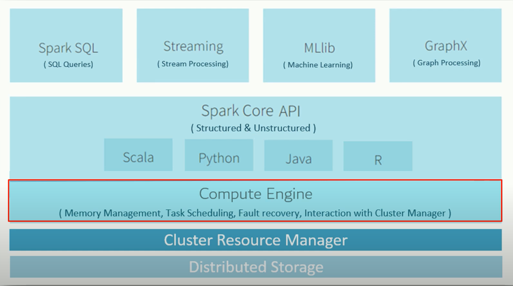
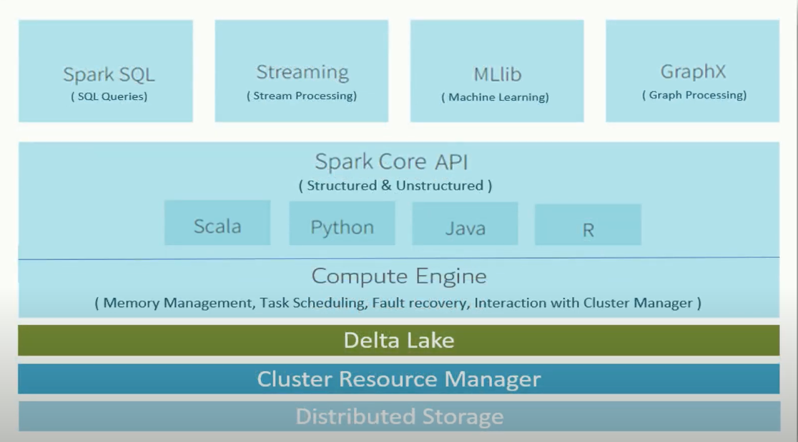
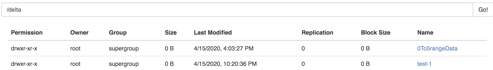
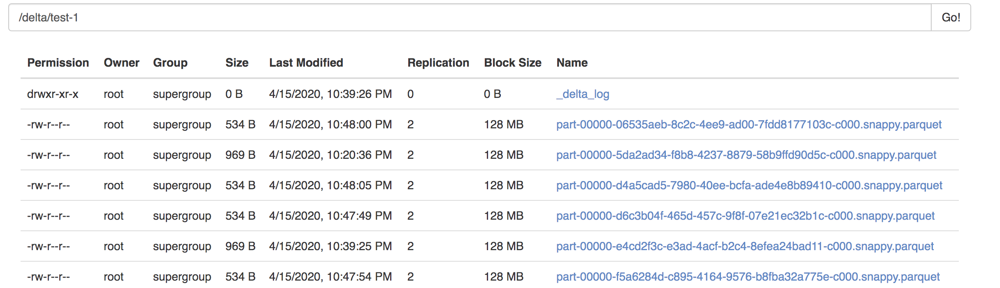
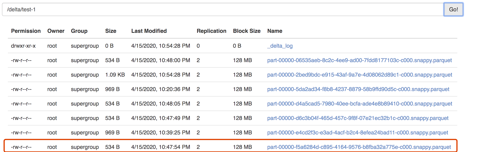
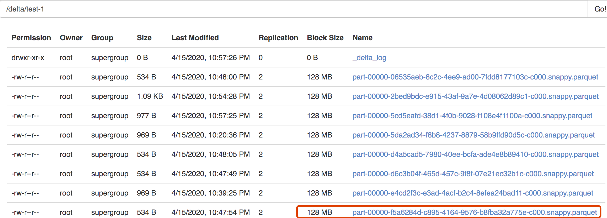
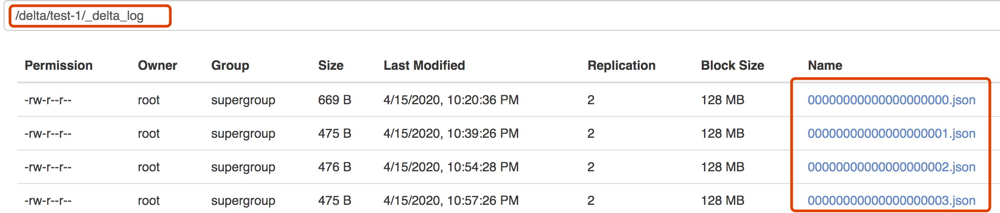
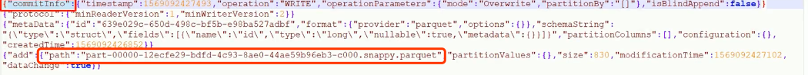
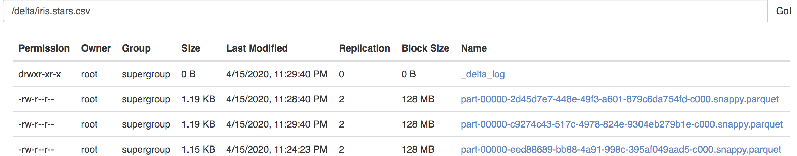

**主要解决两点**

* Delta Lake 是啥，它给spark 带来了哪些能力
* spark 代码中如何使用它

在``whatSparkCannotDone`` 中提到``spark``中不支持事务，所以会出现一些不能满足的场景，但似乎从另外一个角度来看``spark``这是合情理的。

> Spark 仅仅是一个处理引擎，它本身并没有存储、集群管理、元数据存储等能力，而是借助于其他框架完成这些功能，如：
>
> * 存储：hdfs、S3等
> * 集群资源管理：YARN、k8s、
> * 元数据： HIVE
>
> 这样看，spark 本身为计算而生，数据的可靠性是不关注的，如ACID 事务，所以如果需要事务，那么需要其他框架提供这个能力。如Delta lake

**什么是Delta Lake**

- 支持ACID事务
- 可扩展的元数据处理
- 统一的流、批处理API接口
- 更新、删除数据，实时读写（读是读当前的最新快照）
- 数据版本控制，根据需要查看历史数据快照，可回滚数据
- 自动处理schema变化，可修改表结构

如下是上面提到的spark，仅仅是一个计算框架，然后网上，往下都依赖其他能力。



然后如果还需要其他能力，那么在增加提供相应能力的框架，如支持事务，那么增加Delta Lake



spark 的计算程序通过delta Lake 读写数据，于是delta Lake负责提供事务，delta lake 操作的存储设备可以是hdfs， S3，等，这里需要确定的是确保使用的spark 和 Delta Lake 版本匹配，2.4.2以上的spark 才支持delta Lake，从高层的抽象理解Delta Lake，``An intermediary between Apache Spark and your Storage layer.``

跑几个程序看看delta lake 在spark 中是如何工作的。

进入spark-shell

``spark-shell --master spark://spark-master:7077 --packages io.delta:delta-core_2.11:0.4.0``

在 ``spark``中使用 ``Delta Lake``直接将它作为``spark``依赖添加，就可以使用了。

---

在``whatSparkCannotDone`` 中当覆盖写失败的时候会出现不一致的问题，现在在``Delta Lake`` 中再次演示，这里注意，delta 写进去的是parque格式，所以这里使用save，而不指定csv/json/libsvm 等格式了。

```scala
spark.range(100).repartition(1).write.mode("overwrite").format("delta")
.save("hdfs://spark-master:9000/delta/test-1")
```



```scala
import spark.implicits._  
Try(
    spark
      .range(100)
      .repartition(1)
      .map { i =>
        if (i > 50) {
          Thread.sleep(5000)
          throw  new RuntimeException("Oops!")
        }
        i
      }
      .write.mode("overwrite").format("delta")
      .save("hdfs://spark-master:9000/delta/test-1")
  )
```

如果直接执行上面的代码，那么会出错的，

> Failure(org.apache.spark.sql.AnalysisException: ** A schema mismatch detected when writing to the Delta table.**
> To enable schema migration, please set:
> '.option("mergeSchema", "true")'.
>
> Table schema:
> root
> -- id: long (nullable = true)
>
> Data schema:
> root
> -- value: long (nullable = true)

说是schema 不一致导致，这也增强了spark 某些场合不检查schema的问题，在文中``whatSparkCannotDone`` 演示过将不同``schema`` 的数据append 写进去了。

那么这里哪来的``schema``呢，spark delta lake 自动生成的。如下：

````scala
scala> spark.range(100).repartition(1).printSchema
root
 |-- id: long (nullable = false)

scala> spark.range(100).repartition(1).map { i =>
     |         if (i > 50) {
     |           Thread.sleep(5000)
     |           throw  new RuntimeException("Oops!")
     |         }
     |         i
     |       }.printSchema
root
 |-- value: long (nullable = true)
````

前后返回的schema 是不一样的。所以出错。

**这里也展示了 ``delta Lake`` schema 校验的新功能。**

那么如何验证``delta Lake`` 提供的原子性呢？

```scala
import scala.util.Try
import spark.implicits._  

scala> spark.range(100).select($"id".as("id")).repartition(1).write.mode("overwrite").format("delta").save("hdfs://spark-master:9000/delta/test-1")

scala> spark.read.format("delta").load("hdfs://spark-master:9000/delta/test-1").count
res24: Long = 100
```

覆盖写

```scala
Try(
    spark
      .range(100)
      .repartition(1)
      .map { i =>
        if (i > 50) {
          Thread.sleep(5000)
          throw  new RuntimeException("Oops!")
        }
        i
      }.select($"value".as("id")).write.mode("overwrite")
  		 .format("delta").save("hdfs://spark-master:9000/delta/test-1")
  )
[Stage 117:>                                                        (0 + 1) / 1]20/04/15 22:47:49 WARN scheduler.TaskSetManager: Lost task 0.0 in stage 117.0 (TID 2339, 192.168.99.102, executor 1): org.apache.spark.SparkException: Task failed while writing rows.
	at org.apache.spark.sql.execution.datasources.FileFormatWriter$.org$apache$spark$sql$execution$datasources$FileFormatWriter$$executeTask(FileFormatWriter.scala:257)
	at org.apache.spark.sql.execution.datasources.FileFormatWriter$$anonfun$write$1.apply(FileFormatWriter.scala:170)
	at org.apache.spark.sql.execution.datasources.FileFormatWriter$$anonfun$write$1.apply(FileFormatWriter.scala:169)
	at org.apache.spark.scheduler.ResultTask.runTask(ResultTask.scala:90)
	at org.apache.spark.scheduler.Task.run(Task.scala:123)
	at org.apache.spark.executor.Executor$TaskRunner$$anonfun$10.apply(Executor.scala:408)
	at org.apache.spark.util.Utils$.tryWithSafeFinally(Utils.scala:1360)
	at org.apache.spark.executor.Executor$TaskRunner.run(Executor.scala:414)
	at java.util.concurrent.ThreadPoolExecutor.runWorker(ThreadPoolExecutor.java:1149)
	at java.util.concurrent.ThreadPoolExecutor$Worker.run(ThreadPoolExecutor.java:624)
	at java.lang.Thread.run(Thread.java:748)
Caused by: java.lang.RuntimeException: Oops!
```

抛出了代码中的异常信息 "Oops!"

上面的代码会做一下3件事情

1. 删除原来数据
2. 写入新数据
3. 跑出异常

然后在看看结果

```scala
scala> spark.read.format("delta").load("hdfs://spark-master:9000/delta/test-1").count
res26: Long = 100
```

数据还是有的。

那么这里发生了什么？

在hdfs 中目前有这么多数据



在写一个数据

```scala
spark.range(100).select($"id".as("id")).repartition(1).write.mode("overwrite").format("delta").save("hdfs://spark-master:9000/delta/test-1")

scala> spark.read.format("delta").load("hdfs://spark-master:9000/delta/test-1").count
res28: Long = 100
```



如上图，这里新添加了一个这里并没有发生删除的操作，而是新创建了一个文件

在覆盖写一个文件，这写入102个数据，然后在读出来，看看能读出来多少条数据

```scala
scala> spark.range(102).select($"id".as("id")).repartition(1).write.mode("overwrite").format("delta").save("hdfs://spark-master:9000/delta/test-1")

scala> spark.read.format("delta").load("hdfs://spark-master:9000/delta/test-1").count
res30: Long = 102
```

读出来102条数据，截图如下，这个时候目录下有11个文件，比上次有多了一个。



保留了原始的数据，这是的不会丢失原来的数据，有很多份数据，那么spark是如何读到最近的呢，关键是在_delta_log 这个目录下



下面记录着关于版本的json文件，第一个文件告诉spark，来读我。依次类推



所以``delta lake`` 新加入一个 ``commit log`` 目录，用这个日志来解决ACID事务问题。


**如何更新删除**

先保存转换之后的数据。

```scala
scala> val df = spark.read.format("csv").option("header", "true").option("inferSchema", "true").load("hdfs://spark-master:9000/delta/iris.csv")
df: org.apache.spark.sql.DataFrame = [FName: string, LName: string ... 2 more fields]

scala> import spark.implicits._
import spark.implicits._

scala> val df1 = df.select($"FName",$"LName",$"Phone",$"Age",(when($"Age" > 50,"Old").otherwise("Young")).alias("AgeGroup"))
df1: org.apache.spark.sql.DataFrame = [FName: string, LName: string ... 3 more fields]

scala> df1.write.format("delta").mode("overwrite").save("hdfs://spark-master:9000/delta/iris.stars.csv")
```

然后在读取，以及进行各种更新，删除等操作。

读比较简单。

```scala
scala> val df = spark.read.format("delta").load("hdfs://spark-master:9000/delta/iris.stars.csv")
df: org.apache.spark.sql.DataFrame = [FName: string, LName: string ... 3 more fields]

scala> df.show
+-----+-----+-----+---+--------+
|FName|LName|Phone|Age|AgeGroup|
+-----+-----+-----+---+--------+
|   aa|   AA|  123| 52|     Old|
|   bb|   BB|  321| 48|   Young|
+-----+-----+-----+---+--------+
```

``delta lake`` 也提供了一种读取数据的方式。

```scala
scala> val dt = DeltaTable.forPath(spark, "hdfs://spark-master:9000/delta/iris.stars.csv")
dt: io.delta.tables.DeltaTable = io.delta.tables.DeltaTable@6619151a
scala> dt.toDF.show
+-----+-----+-----+---+--------+
|FName|LName|Phone|Age|AgeGroup|
+-----+-----+-----+---+--------+
|   aa|   AA|  123| 52|     Old|
|   bb|   BB|  321| 48|   Young|
+-----+-----+-----+---+--------+

scala> dt.delete("Fname=='aa'")
scala> dt.toDF.show
+-----+-----+-----+---+--------+
|FName|LName|Phone|Age|AgeGroup|
+-----+-----+-----+---+--------+
|   bb|   BB|  321| 48|   Young|
+-----+-----+-----+---+--------+

scala> dt.updateExpr("FName=='bb'", Map("Age" -> "Age" + 5))
<console>:42: error: type mismatch;
 found   : Int(5)
 required: String
       dt.updateExpr("FName=='bb'", Map("Age" -> "Age" + 5))
                                                         ^
scala> dt.updateExpr("FName=='bb'", Map("Age" -> "Age + 5"))
scala> dt.toDF.show
+-----+-----+-----+---+--------+
|FName|LName|Phone|Age|AgeGroup|
+-----+-----+-----+---+--------+
|   bb|   BB|  321| 53|   Young|
+-----+-----+-----+---+--------+
```



这里又生成了3个文件，我们这里对原始文件进行了更新和删除操作，所以新产生了2个文件。``Delta lake API will read the older file, modify the content, I mean to delete or update, whatever you applied, and write a new file with the modified data.``

---

**合并**

```scala
val df = spark.read.format("csv").option("header", "true").schema("FName STRING,LName STRING,Phone STRING,Age DOUBLE").load("hdfs://spark-master:9000/delta/irisdoubleAge.csv")

val df1 = df.select($"FName",$"LName",$"Phone",$"Age",(when($"Age" > 50,"Old").otherwise("Young")).alias("AgeGroup"))

df1.write.format("delta").mode("overwrite").save("hdfs://spark-master:9000/delta/irisdoubleAge.csv.stars")

scala> df1.printSchema
root
 |-- FName: string (nullable = true)
 |-- LName: string (nullable = true)
 |-- Phone: string (nullable = true)
 |-- Age: double (nullable = true)
 |-- AgeGroup: string (nullable = false)
```

```scala
import io.delta.tables._
val dt = DeltaTable.forPath(spark, "hdfs://spark-master:9000/delta/irisdoubleAge.csv.stars")
dt.toDF.show

val df = spark.read
  .format("csv")
  .option("header", "true")
  .schema("FName STRING,LName STRING,Phone STRING,Age DOUBLE")
  .load("hdfs://spark-master:9000/delta/irisdoubleAge.csv")
val df1 = df.select(
  $"FName",
  $"LName",
  $"Phone",
  $"Age",
  (when($"Age" > 50, "Old").otherwise("Young")).alias("AgeGroup")
)
df1.show

dt.as("stars")
  .merge(df1.as("inputs"), "stars.FName = inputs.FName")
  .whenMatched()
  .updateExpr(
    Map(
      "LName" -> "inputs.LName",
      "Phone" -> "inputs.Phone",
      "Age" -> "inputs.Age",
      "AgeGroup" -> "inputs.AgeGroup"
    )
  )
  .whenNotMatched
  .insertAll
  .execute();
dt.toDF.show
```

**时间穿梭**

``Delta lake`` 允许获取历史数据

```scala
scala> val dt = DeltaTable.forPath(spark, "hdfs://spark-master:9000/delta/iris.stars.csv")
dt: io.delta.tables.DeltaTable = io.delta.tables.DeltaTable@65a0785

scala> dt.history.show(false)
+-------+-----------------------+------+--------+---------+--------------------------------------+----+--------+---------+-----------+--------------+-------------+
|version|timestamp              |userId|userName|operation|operationParameters                   |job |notebook|clusterId|readVersion|isolationLevel|isBlindAppend|
+-------+-----------------------+------+--------+---------+--------------------------------------+----+--------+---------+-----------+--------------+-------------+
|2      |2020-04-15 23:29:40.111|null  |null    |UPDATE   |[predicate -> (FName#2628 = bb)]      |null|null    |null     |1          |null          |false        |
|1      |2020-04-15 23:28:40.84 |null  |null    |DELETE   |[predicate -> ["(`Fname` = 'aa')"]]   |null|null    |null     |0          |null          |false        |
|0      |2020-04-15 23:24:23.588|null  |null    |WRITE    |[mode -> Overwrite, partitionBy -> []]|null|null    |null     |null       |null          |false        |
+-------+-----------------------+------+--------+---------+--------------------------------------+----+--------+---------+-----------+--------------+-------------+
```

可以按照时间以及版本号读取历史

```scala
spark.read.format("delta")
  .option("timestampAsOf", "2020-04-15 23:28:40.84")
  .load("hdfs://spark-master:9000/delta/iris.stars.csv")
  .show

scala> spark.read.format("delta").option("timestampAsOf", "2020-04-15 23:28:40.84").load("hdfs://spark-master:9000/delta/iris.stars.csv").show
+-----+-----+-----+---+--------+
|FName|LName|Phone|Age|AgeGroup|
+-----+-----+-----+---+--------+
|   bb|   BB|  321| 48|   Young|
+-----+-----+-----+---+--------+
```

第二步是执行了个删除操作，所以这里比较与版本0，读取少了一行。

按照历史版本，读取0版本数据

```scala
scala> spark.read.format("delta").option("versionAsOf", 0).load("hdfs://spark-master:9000/delta/iris.stars.csv").show
+-----+-----+-----+---+--------+
|FName|LName|Phone|Age|AgeGroup|
+-----+-----+-----+---+--------+
|   aa|   AA|  123| 52|     Old|
|   bb|   BB|  321| 48|   Young|
+-----+-----+-----+---+--------+
```

最后注意：

You can't read anything before the first commit time and after the last commit time. What does it mean?

1. If you try the timestamp less than the first commit time. You will get an exception. Because there is no snapshot before this time.
2. If you try the timestamp between the commit time of version zero and the version one, you will get version 0.
3. If you want to read the last version, you must provide an exact timestamp for that version as accurate as to the precision of milliseconds.
4. If you try the time stamp greater than the first commit time. You will get an exception. Because there is no snapshot after this time.

[原文地址](https://www.learningjournal.guru/article/distributed-architecture/how-to-use-delta-lake-in-apache-spark/)


Session：Delta-lake与MinIO介绍
知识点：

Delta Lake 是什么

它为 spark 添加了什么特性

如何使用

 MinIO是什么
 快速搭建分布式MinIO
 Spark与MinIO的结合使用

