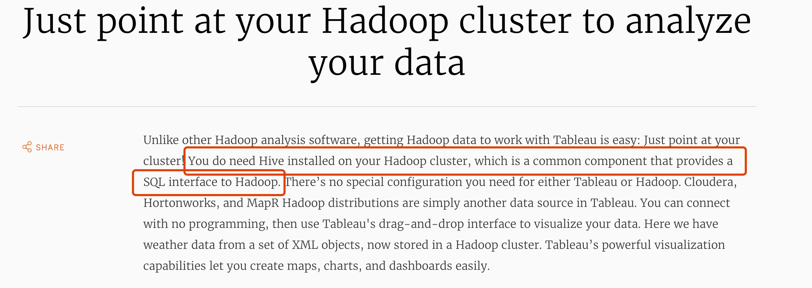
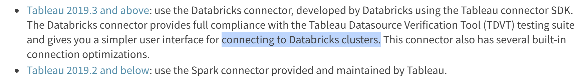
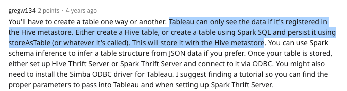
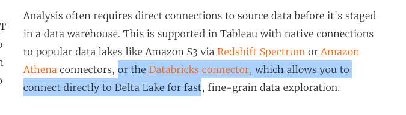

---

4年前的东东

https://docs.databricks.com/integrations/bi/tableau.html#connect-tableau-and-databricks-tableau-20193-and-above

https://www.reddit.com/r/bigdata/comments/4fztxq/spark_hive_and_tableau/

---

可以直接连接到Delta Lake 疑惑？？？

https://www.tableau.com/modern-data-architecture

---

https://help.tableau.com/current/pro/desktop/en-us/examples_databricks.htm

Tableau 中描述的步骤，只能拿到在hive 中有元数据的hdfs中的table(写到Hive)，才能查看到。按照给出来的步骤，直接存储在hdfs 中的parquet 数据并不能直接拿到。