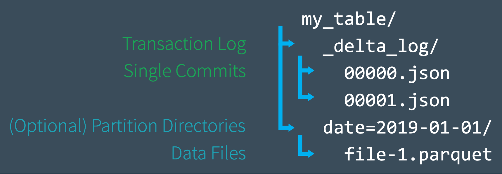
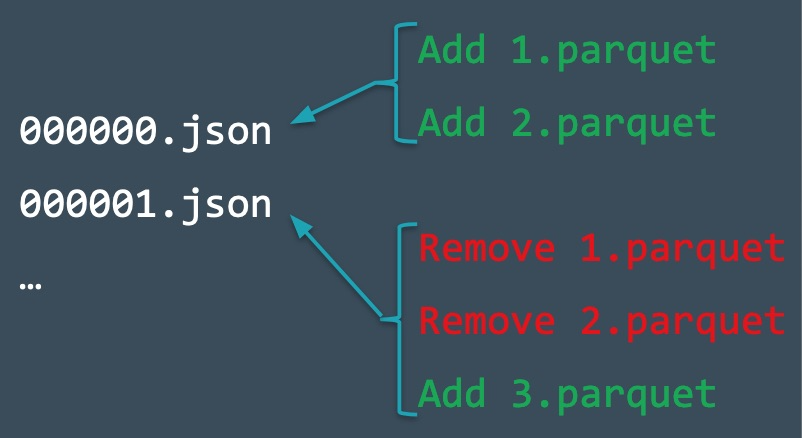
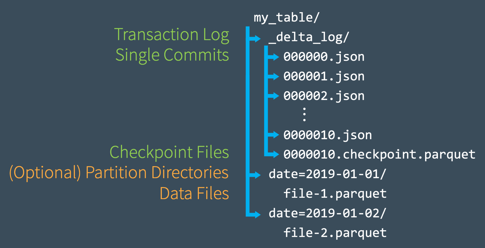
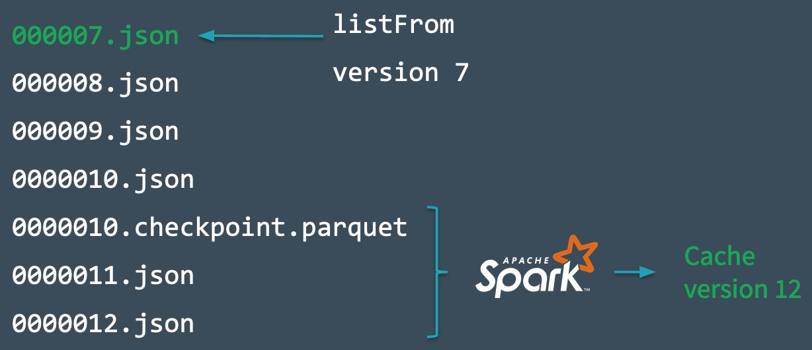
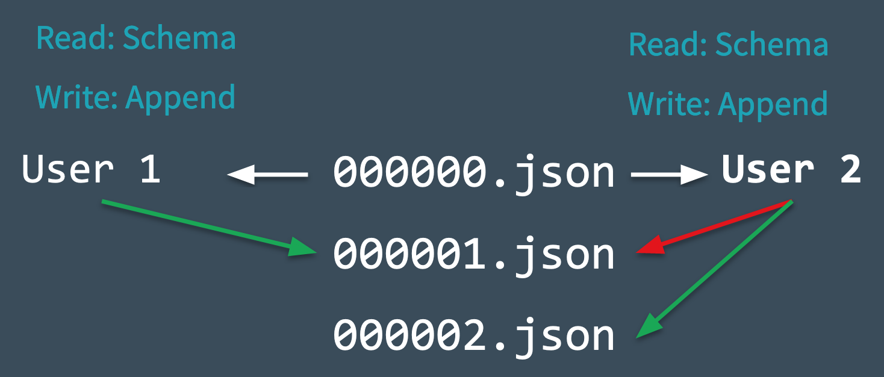

``transaction Log`` 是理解``Delta lake`` 的关键步骤之一，因为``transaction Log`` 贯穿着``Delta Lake`` 的最主要技术，包括

* ACID 
* Metadata 的扩展
* 时间穿梭

---

#### What is the Delta Lake Transaction Log

``transaction Log``  记录所有用户已经执行过了的所有的事务操作。这里也可以理解为记录了表的所有变化过程。

---

#### What Is the Transaction Log Used For

事务日志是delta lake的核心，它记录了delta表相关的所有commit操作。

1. delta表是一个目录，表的根目录除了表数据外，有一个_delta_log目录，用来存放事务日志；
2. 事务日志记录了从最初的delta表开始的所有commit事件，每个commit形成一个json文件，文件名是严格递增的，文件名就是版本号。
3. （默认）每10个json合并成一个parquet格式的checkpoint文件，记录之前所有的commit。
4. 事务日志有一个最新checkpoint的文件（_delta_log/_last_checkpoint），spark读的时候会自动跳到最新的checkpoint，然后再读之后的json。
5. delta lake 使用乐观的并发控制，当多个用户同时写数据时，（读数据是读当前最新版本的快照，互不影响），都是生成一个新版本的数据文件（文件名不重复），在提交commit时生成下一个版本的日志文件，因为日志版本号是连续递增的，如果检测到了同名的文件已存在，则说明有其他用户执行了新的commit，此时进行冲突检测，如果检测通过，则更新当前的snapshot，然后继续提交commit，如果未通过冲突检测，则报错。
6. 因为事务日志的存在，可以找到历史版本的数据，这也是时间穿梭的实现原理，delta lake可以根据commit记录生成历史版本的数据。
7. 新版本的数据生成后，旧版本的数据不会立刻从磁盘删除，可以使用 VACUUM 命令来删除磁盘上的历史版本数据。

---

#### Delta Lake 表示一个目录



如上就是目录的结构，每一次表的变动都会新生成一个parquet文件，然后按照次序也增加一个JSON文件，如第一次生成``00000.json``,  那么第二次就生成 ``00001.json``。



如上的操作提交``commit``，即使后来的提交将之前提交的内容扔掉了，这些操作都还是记录在事务日志中的，**Delta Lake 仍然保留这样的原子提交，以确保在需要审计表或使用“时间旅行”来查看表在给定时间点的样子时**。

此外，即使我们从表中删除了基础数据文件，Spark 也不会立刻从磁盘中删除文件。用户可以使用 VACUUM 命令删除不再需要的文件。



一旦我们提交了10次事务日志，Delta Lake 就会在相同的 _delta_log 子目录中以 Parquet 格式保存一个检查点文件（如上面的 0000010.checkpoint.parquet 文件）。每 10 次提交 Delta Lake 会自动生成检查点文件，这个是通过参数 checkpointInterval 参数设置。使用检查点文件(Checkpoint Files)快速重新计算状态。

**这些检查点文件在某个时间点保存表的整个状态 - 以原生的 Parquet 格式保存，Spark 可以快速轻松地读取。** 基于此，Spark reader 提供了一种“快捷方式”来完全复制表的状态，**从而允许 Spark 避免重新处理可能存在的数千个低效的小 JSON 文件。** 这里也说明了，每次保存下来操作的数据都是全量的数据，而不是增量式的保存发生变化的数据

为了提高速度，Spark可以运行一个 `listFrom` 操作来查看事务日志中的所有文件，快速跳转到最新的检查点文件，并且只处理自保存了最新的检查点文件以来提交的JSON。

为了演示这是如何工作的，假设我们已经创建了提交，并且事务日志已经记录到 000007.json。Spark 加快了提交的速度，并在内存中自动缓存了表的最新版本。与此同时，其他一些写入者已经向表中写入了新数据，并事务日志已经记录到 0000012.json 了。

为了合并这些新事务并更新表的状态，Spark 将运行 `listFrom` 方法来查看版本7之后对表的新更改。



Spark可以直接跳到最近的检查点文件（上图中的 0000010.checkpoint.parquet 文件），而不需要处理所有中间 JSON 文件，因为这个检查点文件包含 commit #10 中表的整个状态。现在，Spark 只需执行 0000011.json 和 0000012.json 的增量处理即可获得表的当前状态。然后 Spark 将表的版本12的状态缓存到内存中。通过遵循此工作流程，Delta Lake 能够使用 Spark 以高效的方式始终更新表的状态。

#### 处理多个并发的读取和写入

当 Delta Lake 处理多个并发读写时会发生什么？

答案很简单，由于 Delta Lake 由 Apache Spark 提供支持，因此不仅可以让多个用户同时修改表 - 这是预期的。为了处理这些情况，**Delta Lake 采用了乐观的并发控制。**

#### 什么是乐观并发控制？

乐观并发控制是一种处理并发事务的方法，它假定不同用户对表所做的事务(更改)可以在不相互冲突的情况下完成。它的速度快得令人难以置信，因为当处理 PB 级的数据时，用户很可能同时处理数据的不同部分，从而允许他们同时完成不冲突的事务。

例如，假设你和我正在一起玩拼图游戏。只要我们都在做拼图的不同部分——比如你在角落里，我在边缘上——我们没有理由不能同时做更大拼图的那一部分，并且以两倍的速度完成拼图。只有当我们同时需要相同的部件时，才会产生冲突。这就是乐观并发控制。

相反，一些数据库系统使用悲观锁定的概念，这是假设最坏的情况——即使我们有10,000块拼图，在某个时候我们肯定需要相同的拼图——这导致了太多的冲突。为了解决这个问题，它的理由是，应该只允许一个人同时做拼图，并把其他人都锁在房间外面。这不是一个快速(或友好)解决难题的方法!

当然，即使使用乐观并发控制，有时用户也会尝试同时修改数据的相同部分。幸运的是，Delta Lake 有相应的协议处理它。

为了提供ACID事务，Delta Lake 有一个协议，用于确定提交应该如何排序(在数据库中称为 serializability)，并确定在同时执行两个或多个提交时应该做什么。Delta Lake通过实现互斥（mutual exclusion）规则来处理这些情况，然后尝试乐观地解决任何冲突。该协议允许Delta Lake遵循ACID隔离原则，该原则确保多个并发写操作之后的表的结果状态与那些连续发生的写操作相同，并且是彼此隔离的。

一般来说，这个过程是这样进行的

- 记录起始表的版本；
- 记录读和写操作；
- 尝试提交；
- 如果有人已经提交了，检查一下你读到的内容是否有变化；
- 重复上面的步骤。

为了了解这一切是如何实时进行的，让我们看一下下面的图表，看看 Delta Lake 在冲突突然出现时是如何管理冲突的。假设两个用户从同一个表中读取数据，然后每个用户都尝试向表中添加一些数据。



- Delta Lake 记录在进行任何更改之前读取的表的起始表版本(版本0)； 
- 用户1和2都试图同时向表添加一些数据。在这里，我们遇到了一个冲突，因为接下来只有一个提交可以被记录为 000001.json； 
- Delta Lake使用“互斥”概念处理这种冲突，这意味着只有一个用户能够成功提交 000001.json。用户1的提交被接受，而用户2的提交被拒绝；
- Delta Lake 更倾向于乐观地处理这种冲突，而不是为用户2抛出错误。它检查是否对表进行了任何新的提交，并悄悄地更新表以反映这些更改，然后在新更新的表上重试用户2的提交(不进行任何数据处理)，最后成功提交 000002.json。

在绝大多数情况下，这种和解是悄无声息地、天衣无缝地、成功地进行的。但是，如果 Delta Lake 无法乐观地解决不可调和的问题(例如，如果用户1删除了用户2也删除的文件)，那么惟一的选择就是抛出一个错误。

最后要注意的是，**由于在 Delta Lake 表上进行的所有事务都直接存储到磁盘中**，因此这个过程满足 ACID 持久性的特性，这意味着即使在系统发生故障时，它也会保持。

---

### Time Travel

我们可以通过从原始表开始重新创建表在任何时间点的状态，并且只处理在该点之前提交的数据。这种强大的功能被称为“时间旅行”，或数据版本控制。这个功能也是由delta_log 日志目录中的记录所提供，该日志中保存着修改操作、时间、版本号、以及发生修改的parquet文件，基于这些信息，用户可以根据修改时间、版本号找到对应的历史数据版本。

### Data Lineage

作为对 Delta Lake 表所做的每个更改的最终记录，事务日志为用户提供了可验证的数据血统，这对于治理、审计和合规性目的非常有用。它还可以用于跟踪一个意外更改或管道中的一个 bug 的起源，以追溯到导致该更改的确切操作。用户可以运行 DESCRIBE HISTORY 来查看所做更改的元数据。

---

#### 深入研究 Delta Lake 事务日志的工作原理

- 事务日志是什么，它是如何构造的，以及提交如何作为文件存储在磁盘上；
- 事务日志如何作为一个单一的事实来源，允许 Delta Lake 实现原子性原则；
- Delta Lake 如何计算每个表的状态——包括它如何使用事务日志来跟踪最近的检查点，以及它如何解决“小文件”问题；
- 使用乐观并发控制允许多个并发读和写，即使在表发生更改时也是如此；
- Delta Lake 如何使用互斥来确保正确地线性（serialized）提交，以及在发生冲突时如何默默地重试提交。

[参考](https://mp.weixin.qq.com/s?__biz=MzA5MTc0NTMwNQ==&mid=2650717784&idx=2&sn=53174b4dd05642d0d8746b10555ddcf2&chksm=887da32ebf0a2a38ec4b0e159994c915ee460d554eb84feea993ab0a2f72efc4eb715a07d145&scene=21#wechat_redirect)

[参考2](https://databricks.com/blog/2019/08/21/diving-into-delta-lake-unpacking-the-transaction-log.html)

---

问题：

* ``delta Lake`` 每次都会读取数据和 ``_delta_log`` 中多个 json 文件有何关系？
* ``Delta table`` 和 ``常规的读写 parquet ``文件相互操作时候会发生什么？
* ``delta Lake table`` 每次操作是如何存储数据的？增量：全保存 


那么delta 中每个版本的数据是如何写进去的呢？ 是增量的(下次的数据版本值记录相对于上次记录版本的修改部分，还是还是会重新记录当前的新数据。)

```scala
  val data: Dataset[lang.Long] = spark.range(0, 5)

  createTable(data, fileName, outputPath)


  println("create Data")
  readTable(spark, fileName, outputPath).show()

  val deltaTable: DeltaTable = deltaReadTable(fileName, outputPath)
  update(deltaTable, "id % 2 == 0", Map("id" -> expr("id + 100")))
  println("update Data")
  deltaTable.toDF.show()

  delete(deltaTable, "id % 2 == 0")
  println("deltaTable Data")
  deltaTable.toDF.show()
```

给delta Lake中的数据进行3次操作，第一次生成一个表，第二次对表中id列为偶数的数据 + 100， 第三次对偶数数据进行删除操作。

创建过程中输出的数据，以及读操作完的路径下的数据的输出：

```scala
# create Data
+---+
| id|
+---+
|  0|
|  1|
|  2|
|  3|
|  4|
+---+

# update Data
+---+
| id|
+---+
|100|
|  1|
|102|
|  3|
|104|
+---+

# delte Table Data
+---+
| id|
+---+
|  1|
|  3|
+---+

# 最后的输出
+---+
| id|
+---+
|  1|
|  3|
+---+
```

每次读数据的时候是读取的最新的。这个最新推测是按照_delta_log 下面的 json 文件的文件名去决定的，如当前读取的时候会读取日志 ``0...02.json`` 中记录的 ``path 去读``的。


如果我将这个文件的中path改变'

先看下_delta_log日志部分，这里主要关注path 值``part-00000-e58ddf9e-1130-435a-99bd-8ced23d0ce6f-c000.snappy.parquet``'

下面这个log是第一次写数据的时候内容，

```scala
{"commitInfo":{"timestamp":1587866147055,"operation":"WRITE","operationParameters":{"mode":"Overwrite","partitionBy":"[]"},"isBlindAppend":false}}
{"protocol":{"minReaderVersion":1,"minWriterVersion":2}}
{"metaData":{"id":"49d34b05-df09-44ab-a026-432be251a270","format":{"provider":"parquet","options":{}},"schemaString":"{\"type\":\"struct\",\"fields\":[{\"name\":\"id\",\"type\":\"long\",\"nullable\":true,\"metadata\":{}}]}","partitionColumns":[],"configuration":{},"createdTime":1587866145353}}
{"add":{"path":"part-00000-e58ddf9e-1130-435a-99bd-8ced23d0ce6f-c000.snappy.parquet","partitionValues":{},"size":449,"modificationTime":1587866145000,"dataChange":true}}
```

下面是最后删除数据的log ``part-00000-293255e1-a3d5-4c0c-87b9-e07efc6387af-c000.snappy.parquet``

```scala
{"commitInfo":{"timestamp":1587866161162,"operation":"DELETE","operationParameters":{"predicate":"[\"((`id` % CAST(2 AS BIGINT)) = CAST(0 AS BIGINT))\"]"},"readVersion":1,"isBlindAppend":false}}
{"remove":{"path":"part-00000-c257c108-ec23-4834-b98f-3973bf04eb89-c000.snappy.parquet","deletionTimestamp":1587866161161,"dataChange":true}}
{"add":{"path":"part-00000-293255e1-a3d5-4c0c-87b9-e07efc6387af-c000.snappy.parquet","partitionValues":{},"size":437,"modificationTime":1587866161000,"dataChange":true}}
```

按照上面的猜测，spark读数据的时候回读取最近那个日志所指向的parquet文件，也就是发生delete 操作的那个 0...02.json日志，那么我将这个日志的的path替换为第一个写数据的时候产生的``delta_log``中的``path``

然后读取数据

```scala
val sparkDF: DataFrame = spark.read.format("delta").load(outputPath + fileName)
sparkDF.show()
print(sparkDF.printSchema())
```


这个时候读出来的是第一次写数据的那个版本数据。继续替换删除日志``ddelta_log``中的``path``为更新操作时候的那个``delta_log`` 中的 parquet path

``part-00000-c257c108-ec23-4834-b98f-3973bf04eb89-c000.snappy.parquet``

```scala
{"commitInfo":{"timestamp":1587866154522,"operation":"UPDATE","operationParameters":{"predicate":"((id#720L % cast(2 as bigint)) = cast(0 as bigint))"},"readVersion":0,"isBlindAppend":false}}
{"remove":{"path":"part-00000-e58ddf9e-1130-435a-99bd-8ced23d0ce6f-c000.snappy.parquet","deletionTimestamp":1587866154417,"dataChange":true}}
{"add":{"path":"part-00000-c257c108-ec23-4834-b98f-3973bf04eb89-c000.snappy.parquet","partitionValues":{},"size":451,"modificationTime":1587866154000,"dataChange":true}}
```


替换path 之后代码

```scala
val sparkDF: DataFrame = spark.read.format("delta").load(outputPath + fileName)
sparkDF.show()
print(sparkDF.printSchema())
```

读出来的数据确实是最后 ``000000002.json`` 那次``log``记录的日志。

这也验证spark 读数据的时候都是读取最新的那个 ``delta_log`` 中的 parqurt 文件

---

使用delta 生成的数据使用常规读取数据会发生什么，使用常规的方式写到``delta table ``中会发生什么。

* 常规方式读取 ``delta table``


使用常规的方式读取delta table 会将所有的数据都读进来(重复数据)，如上图最下角标出部分，红色部分是更新的时候生成的数据(偶数 + 100)，蓝色部分是原始的数据，绿色部分是删除之后的数据(删除偶数)。

* 常规方法写数据到delta 表中。


给表继续写了5条数据，数据能够写进去，新生成一个``parquet``，但是``delta_log`` 并没有增加，也就是说由于这个新写进去的``parquet并``不在``deltaLake`` 的事务管辖之内。

那么使用delta 读取数据。


确实如此，新写的数据不在``delta Lake`` 的事务管理之内，在读取的时候自然就不会涉及到这个``parquet``，读出来的数据依旧是``0000002.json`` 日志中删除后数据的结果。

而使用常规的读取方式


常规的方式就又读出来了目录下所有的``parquet``文件数据

---

那么写 ``delta table`` 的时候，对于新的操作记录是如何记录的，是增量的方式还是会保存一个包含全部历史状态的新 parquet 呢？

上面的实验中我们进行了如下操作新生成一个表(``write操作``)，更新偶数记录增加100(``update 操作``)，删除偶数记录(``delete 操作``)。生成了3个记录，以及三个parquet。直接查看每一个parquet中的内容就可以回答我们的疑问。

``Write path: part-00000-e58ddf9e-1130-435a-99bd-8ced23d0ce6f-c000.snappy.parquet``

``update path: part-00000-c257c108-ec23-4834-b98f-3973bf04eb89-c000.snappy.parquet``

``Delete path: part-00000-293255e1-a3d5-4c0c-87b9-e07efc6387af-c000.snappy.parquet``

写记录


更新记录


删除记录


通过上面的输出，得出结论delta 每次都会将本次操作的结果保存下来，所以是 历史+变化。而不是仅仅保存增量。

---

小结：

* ``delta Lake`` 每次都会读取最新的 ``_delta_log`` 中记录的那个``path`` 指向的数据
* ``Delta table`` 和 ``常规的读写 parquet ``文件相互都是可以操作的，只不过就是 ``有没有delta Lake 能力``的区别
* ``delta Lake table`` 每次都会保存下来此次操作的全部结果数据

---

