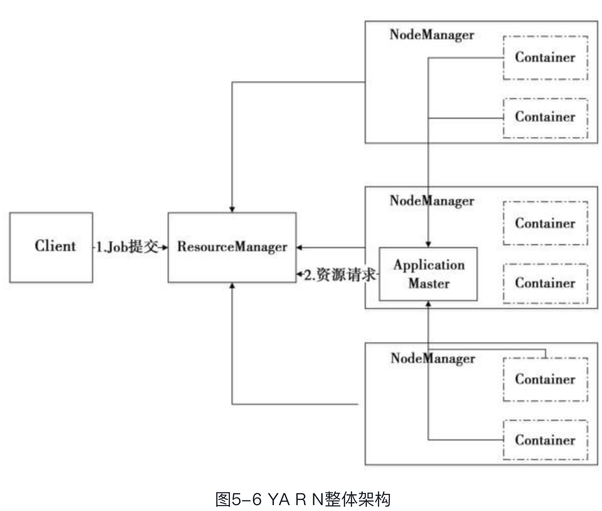

> Spark 不同的运行模式下实现了不同的SchedulerBackend 和 TaskScheduler

* YARN

**ResourceManager（即资源管理器）**全局管理所有应用程序计算资源的分配。它和每一台机器的NodeManager（即节点管理服务器）能够管理应用在那台机器上的进程并能对计算进行组织。

**每一个应用的ApplicationMaster** 则负责相应的**调度和协调**。ApplicationMaster 是一个详细的框架库，它结合从 ResourceManager获得的资源和 NodeManager 协同工作来运行和监控任务。每一个应用的ApplicationMaster 的职责有：向调度器索要适当的资源容器，运行任务，跟踪应用程序的状态和监控它们的进程，处理任务的失败原因。

ResourceManager 支持分层级的应用队列，这些队列享有集群一定比例的资源。**从某种意义上讲它就是一个纯粹的调度器**，它在执行过程中不对应用进行监控和状态跟踪。ResourceManager 是基于应用程序对资源的需求进行调度的；每一个应用程序需要不同类型的资源因此就需要不同的容器。资源包括：内存、CPU、磁盘、网络等。

**NodeManager** 是每一台机器框架的代理，是执行应用程序的容器，监控应用程序的资源使用情况（CPU、内存、硬盘、网络）并且向调度器汇报。

在Client提交了Job后，Application Master会向ResourceManager请求资源，在获得了资源后，Application Master会在NodeManager上启动Container，运行计算任务，并且和Container保持联系，监控任务的运行状态等。

---

**Master 和 Worker**

> Master 作为整个集群的管理者，需要worker 通过注册、汇报状态维护整个集群的运行状态，并通过这些状态来决定资源调度策略等。
>
> * 注册：Worker 启动的时候需要向master 注册，汇报自身的信息，然后worker接收来自 master 的调度。
> * 状态汇报：汇报Executor 和 Driver 的运行状态，在Master 故障恢复的时候，需要汇报Worker 上当前运行的Executor和Driver 的信息。包括启动任务，任务被杀死/停止等。同时Master也会给worker 发送一些消息，如master 变化的时候，需要给worker 发送新master 的地址，
> * 心跳报告：Worker 每隔指定周期向Master 发送报活的心跳。还包括一些资源使用情况，如CPU core 等，这些知识为了spark-UI的展示。

SparkContext是用户应用和Spark集群的交换的主要接口

