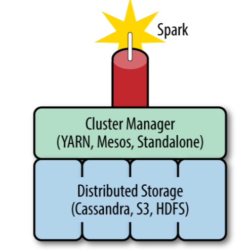
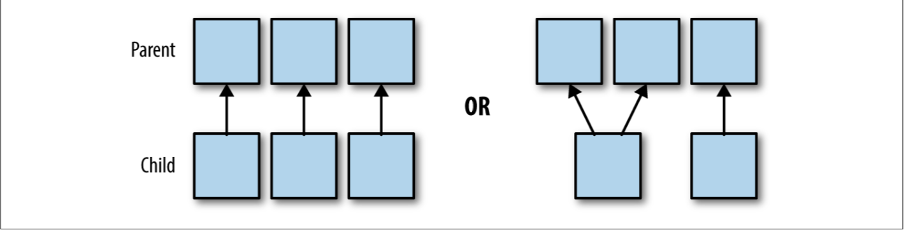
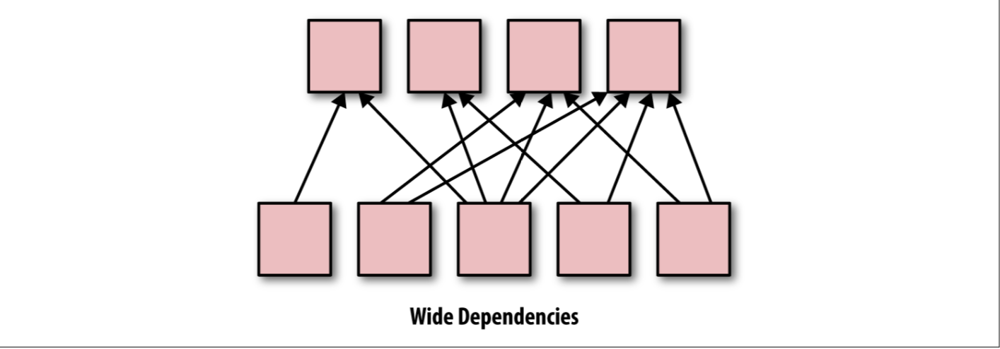

* The principles used to design spark, and cursory level , how spark programs are executed

> 1. Process data in parallel, 
> 2. Not provide data storage
> 3. Provide computations on spark JVM
>
> 
>
> 4. Spark provide a hight-level query language to process data
> 5. Spark build around a data abstraction call *Resilient Distributed Databasets*
> 6. Simi-strucctured typed version of RDD called DataFrames
> 7. ML and mLlib for machins learning, MLlib is primarily build on top of RDD, and ML is more tiger-level than MLlib and build on top of spark SQL DataFrame

---

**This book is. more focus on optimizing programs writen with the spark core and spark SQL**.

---

**Spark model of parallel computing: RDD**

> RDD: represents large datasets, that is immutable, distributed collections of objects.
>
> The objects that comprise RDDs are called **partitions** ccomputed on different nodes of distributed system.
>
> **lazy evaluation, in-memory storage, and immutability allows Spark to be easy-to-use, fault-tolerant, scalable, and efficient.**

**Lazy**

> An action that make result collection to Driver or write distributed storage system.
>
> The benefits of **being. lazy**
>
> 1. like map and filter function, because of lazy execution, function map and filter function can send to data partition only once. If is not lazy execution, first send map to data partition after done and then send filter to data partition to execution, that will more efficient
> 2. Easy to implement, remember the code amount to wordcount of spark and MR.

**Lazy evaluation and fault tolerance**

> Fault tolerant meaning spark will not fail, lose data, or. Return inaccurate result. in the event of a host machine or network fail
>
> Because each partition of the data contains the dependency information needed to recalculate the partition. Spark not need to maintain the logs of update to each RDD, since the RDD itself contains all the dependency infomation needed to replicate each of it partitions, thus if the partition lost the RDD has enough information about its lineage to recompute it.

**hard to debug when lazy evaluation**

> RDD interface with the properties that each type of RDD must implement. These properties include the RDD’s dependencies and information about data locality

**RDD five main properities**

> 1. List of partition objects that make up the RDD
> 2. a function for computing an iterator of each partition
> 3. list of  dependencies on other RDD
>
> Others is optionally
>
> 4. partitioner 
> 5. prefered locations
>
> 4 and 5 properties is. not used much, more used its default properties

**narrow and wide dependency**

Narrow dependency

> 
>
> Wide dependency
>
> 
>
> **Narrow** : partitions in narrow transformation can either depend on on Parent or a Unique subset of the parent partitions that know as design time(colesce), thus narrow transformation can be executed on an arbitrary subset of the data without any information about the. Other partition。
>
> Transformations with wide depen‐ dencies include sort, reduceByKey, groupByKey, join, and anything that calls the rePartition function.
>
> **wide**:  the child partitions depend on an arbitrary set of parent parti‐ tions. The wide dependencies (displayed as red arrows) cannot be known fully before the data is evaluated。The dependency graph for any operations that cause a shuffle ** such as groupByKey, reduceByKey, sort, and sortByKey) follows this pattern.**
>
> If an opera‐ tion will require a shuffle to be executed, Spark adds a ShuffledDependency object to the dependency list associated with the RDD
>
> > 为什么在宽依赖中，需要数据 shuffle， 因为spark 在计算的时候是将计算逻辑移动到数据partition 所在的container 去计算，所以计算的时候是需要在一个partition 存在所有一块的数据，如果不在一起，那么就将数据移动到一块。
> >
> > **Coalesce**
> >
> > 经常用于存重新划分partition， 如有100个分区，每个分区中有100M数据，但是经过一波的filter，那么每个分区的数据可能就只有100K了，这个时候就需要对数据重新分区了，因为分区太多，意味着执行太多的task(一个分区一个 task)，那么每个task处理的数据量很小，就会造成线程频繁的在task之间切换，使得资源开销较大，且很多任务等待执行，并行度不高，这会造成集群工作效益低下。
> >
> > **为了解决这一个问题，常采用RDD中重分区的函数（coalesce函数或rePartition函数）来进行数据紧缩，减少分区数量，将小分区合并为大分区，从而提高效率**
> >
> > ### 使用情景
> >
> > 假设RDD有N个分区，需要重新划分成M个分区：
> >
> > 1. N < M: 一般情况下N个分区有数据分布不均匀的状况，利用HashPartitioner函数将数据重新分区为M个，这时需要将shuffle设置为true。**因为重分区前后相当于宽依赖，会发生shuffle过程**，此时可以使用coalesce(shuffle=true)，或者直接使用repartition()。
> > 2. 如果N > M并且N和M相差不多(假如N是1000，M是100): 那么就可以将N个分区中的若干个分区合并成一个新的分区，最终合并为M个分区，这是**前后是窄依赖关系**，可以使用coalesce(shuffle=false)。
> > 3. 如果 N> M并且两者相差悬殊: 这时如果将shuffle设置为false，父子ＲＤＤ是窄依赖关系，他们同处在一个Ｓｔａｇｅ中，就可能造成spark程序的并行度不够，从而影响性能，如果在M为1的时候，为了使coalesce之前的操作有更好的并行度，可以将shuffle设置为true。

**spark Job Scheduling**

> * Spark Application
>
> > Spark Application corresponds to a set of spark Jobs defined by one SparkContext in the driver program, 
> >
> > and when  app started, the driver a series of executor are started on the worker nodes, one node may contain several executors.
> >
> > **spark context** determines how many resources are allotted to each executor.
> >
> > 
> >
> > when start spark Driver
> >
> > 1. Driver program pings the cluster manager
> > 2. the class manager launches a number of spark executors（blue circles）
> > 3. one node has multiple spark executors
> > 4. an executor cannot span multi nodes and each executor can have multi partitions
> >
> > 

* DAG(Directed Acyclic Graph)

> The DAG builds a graph of stages for each job, determines the locations to run each task.

* Jobs

> Each Spark job corresponds to one action, and each action is called by the driver program of a Spark application。
>
> The edges of the Spark execution graph are based on dependencies between the parti‐ tions in RDD transformations

* Stages

> a job is defined by calling an action. The action may include one or several transformations, **and wide transformations define the breakdown of jobs into *stages*.**
>
> **Each stage corresponds to a shuffle dependency created by a wide transformation in the Spark program**
>
> **one stage can be thought of as the set of computa‐ tions (tasks) that can each be computed on one executor without communication with other executors or with the driver**

* Tasks

> A stage consists of tasks. The *task* is the smallest unit in the execution stage. 
>
> all the tasks for one stage must be completed before the next stage can start，
>
> one stage can be computed without moving data across the partitions

一系列`Task` 构成 `Stages`, 一系列`Stages` 构成`Jobs` ， 整个计算过程构成是`DAG`,  一个`Action` 动作触发一个`Job`。

