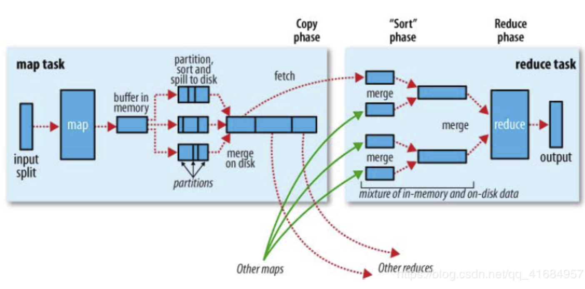
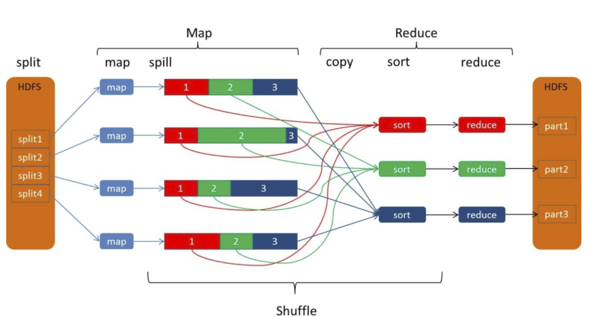
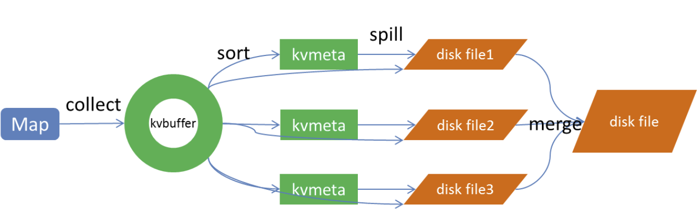

* **Shffle**

> `shuffle` 的本意是打乱的意思，但是在`MapReducer` 和 `Spark` 等计算引擎中，它是将打乱的数据进行 `整理` 的意思，将数据更加的整齐防止，使其具有一定的规则化数据。
>
> `shuffle`  操作涉及到磁盘的读写和网络的传输，所以`shuffle` 的性能的高低会之间影响到整个程序的运行效率。

* **MapReduce Shuffle**

> 如上图是`MapReduce`的过程
>
> * `Map` 端读取数据，并对数据进行切分为`partition`, 一个 `partition` 执行一个 `map` 任务，然后执行 `map` 操作，`map` 操作将数据映射为`(key, value)` 的形式，然后输出。
> * `shuffle` 操作，对`Map` 的输出进行一系列的`规整`操作，然后将数据为下一个阶段`Reduce`准备好
> * `Reduce` 执行`归并`逻辑，然后将输出写入到 `hdfs` 中。

* **shuffle 处理Map 和 Reduce的中间结果**

> `shuffle` 分为`Map`端的`shuffle` 和 `Reduce` 端的 `shuffle`

* **Map 端的Shuffle**

> `Map` 输出的结果不会立马写到磁盘中(上图中map-> spill 阶段不是直接写磁盘)，因为频繁的读写严重降低效率。所以过程如下：
>
> 
>
> 1. map 数据输出到一个环形缓存中，如写了环形缓存的80%的时候，然后开始写数据到内存中
> 2. 写的过程中带着分区参数、然后根据分区参数和 key，进行排序，(这个时候可以进行一些combine操作)然后写到磁盘中
> 3. 对同一个分区中的数据，但是写到不同磁盘文件中的数据，进行合并(一个分区数据会很大，然后大于环形缓冲区中的内存大小，所以同一个分区数据会写出到多个磁盘文件)，并再次排序，使得数据基于分区参数和key，使得文件内的有序达到全局有序。

* **Reduce 端的 Shuffle**

> 如上上图所示
>
> 1. 从每个 `mapTask` 的磁盘文件中拉去对应分区的数据(数据在 `map` 端的`shuffle` 中已经完成了规整操作，还包括偏移量(有一个额外的所有文件记录偏移)`Reduce` 可以直接去拿)
> 2. 拉取数据之后，在此`排序` `合并`，最后交给 `Reducer` 逻辑处理
> 3. 结果写 `Hdfs`

* **所有的排序均为了计算更加高效**

> `Map 端 shuffle`如果不排序，那么 `Reduce shuffle` 在拿数据的时候，就需要扫描全局数据。
>
> 而排好序之后，就只需要扫描一部分数据了。

---

* **Spark shuffle**

> 包括 `HashShuffle` 和 `SortShuffle`,  二者只是做数据的拉去，并没有额外排序/合并操作。

---

**差异**

> * 二者本质上都是将 `Map` 端获得的数据使用分区器进行划分，并将数据发送到对应的 `Reduce`程序，所以从功能角度看，二者是一样的
> * 但是从流程上来看差别很大。`MR` 是 `Sort-based`，会有一系列的 `spill、sort、merge、sort`等操作，而spark 就没有这些，它默认使用 `HashShuffle` 进行数据拉取合并。
> * Hadoop MapReduce 将处理流程划分出明显的几个阶段：map, spill, merge, shuffle, sort, reduce等。每个阶段各司其职，可以按照过程式的编程思想来逐一实现每个阶段的功能。在Spark 中，没有这样功能明确的阶段，只有不同的 stage 和一系列的 transformation，所以 spill, merge,aggregate 等操作需要蕴含在 transformation中。

> `spark shuffle`  是在发送宽依赖的时候，这个时候的shuffle 也是和 `MR shuffle` 一样，也会发送读写磁盘，并且`SortShuffle` 也会按照 `partitionID` 和 key进行排序，然后写磁盘。		

