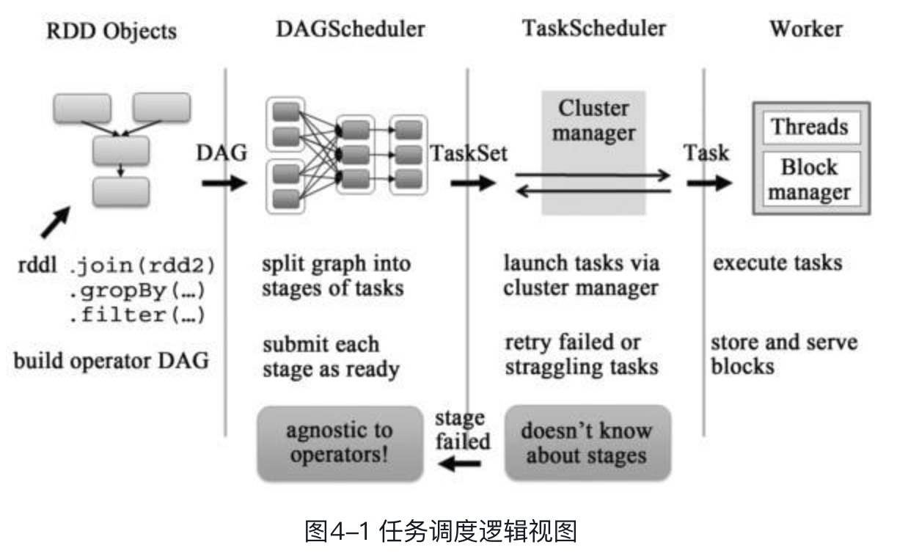

> 调度模块主要包括2大部分
>
> * DAGScheduler
> * TaskScheduler
>
> 它们负责将用户提交的计算任务按照DAG划分为不同阶段且将不同阶段的计算任务提交到集群进行最终的计算。

> DAGScheduler 主要负责分析用户提交的应用，并根据计算任务的依赖关系建立DAG，然后将DAG划分为不同的Stage，其中每个Stage由可以并发执行的一组Task构成，这些Task的执行逻辑完全相同，只是作用于不同的数据，而且DAG在不同的资源管理框架实现也都是相同的。
>
> DAGScheduler将Task划分好之后，就将这组Task提交到 TaskScheduler， TaskScheduler通过Cluster Manager 在集群中的某个worker的Executor 上启动任务，在Executor中允许的任务，如果本地没有缓存那么会重头到尾计算，最后将计算的结果返回给Driver或者保存在本地。

* Scheduler 的实现概述

> 1）org.apache.spark.scheduler.DAGScheduler
>
> 2）org.apache.spark.scheduler.SchedulerBackend(trait)
>
> 3）org.apache.spark.scheduler.TaskScheduler
>
> * SchedulerBackend
>
>   > 作用是分配当前可用的资源，具体就是向当前等待分配计算资源的Task分配计算资源（即Executor）
>   >
>   > 并且在分配的Executor上启动Task，完成计算的调度过程
>
> * TaskScheduler
>
>   > 作用是为创建它的SparkContext调度任务，即从DAGScheduler接收不同Stage的任务，并且向集群提交这些任务

* DAGScheduler

> 前面提到DAGScheduler主要负责的应用的DAG划分为不同的Stage，其中每个Stage由可以并发执行的一组Task构成，这些Task的执行逻辑完全相同，只是作用于不同的数据。
>
> DAGScheduler 和 TaskScheduler 都是在SparkContext创建的时候创建的，

* Stage 的划分

> 用户提交的计算任务是一个由RDD构成的DAG，如果RDD在转化的时候需要做Shuffle，那么这个Shuffle 的过程将这个DAG分为了不同的阶段(Stage).
>
> 由于shuffle 的存在不同的stage是不能并行计算的，因为后面的stage需要前面stageshuffle 的记过，而一个stage有一组完全独立的可并行计算的任务（Task）组成，这些任务是完全一样的，只不过是不同的数据，Task 的个数也就是Partition个数。
>
> * 划分依据
>
>   > 宽依赖被称为是DAG划分的分界线，划分出来的Stage是根据可否进行并行化计算的。
>
> * 划分过程
>
>   
>
>   如上图，Stage 的划分是从最后一个RDD开始的，也就是上图中G的那个Action，从SparkContext的runJob开始，从G算子的依赖开始，RDD G 依赖2个RDD，一个是RDD B，一个是RDD F，其中先处理B还是F是随机的，这里首先处理B，由于和B是窄依赖关系所以G 和 B 可以划分为一个stage中，在处理F，而F和G的依赖是宽依赖，所以F 和 G 会被划分到不同的Stage。然后在处理B的依赖，B和A的依赖是宽依赖，所以B和A 也会被划分到不同的Stage，然后F的依赖D和E都是窄依赖，所以被划分到一个stage中，最后DAG 被划分到三个Stage。
>
>   **那么Stage是如何计算的 ？**
>
>   以Stage 1为例，由于RDD A有三个Partition，因此它会生成三个org.apache.spark.scheduler.ShuffleMapTask，这些Task会将结果写入到三个Partition，实现细节可以参阅第7章。Stage 2同样也是由ShuffleMapTask组成。不过Stage3是由三个org.apache.spark.scheduler.ResultTask构成的。

> 首先取得需要计算的Partition，然后判断该Partition的ResultTask有没有，然后去决定是否执行compute，执行的时候会为每个Partition 生成Task，然后这些Task会被封装到TaskSet中，最后提交到TaskScheduler，

> 至此DAGScheduler 就完成了它的工作，
>
> 综上DAGScheduler主要完成：DAG -> 划分Stage -> 起Task -> 生成TaskSet
>
> 然后将接下来的事情交给TaskScheduler

* TaskScheduler 任务调度实现详解

> Task 被分配到Executor 上
>
> TaskSet -> 分配到TaskSetManager(TaskSetManager 会根据数据的就近原则为Task分配计算资源，监控Task的执行状态并采取必要的措施，比如失败重启) -> 为每个Task 具体分配资源 （到这里的执行都是在Driver端完成的）-> Task 到达Executor -> 执行Task
>
> 在分配到TaskSetManager中会进行调度，调度的方式有 FIFO(先进先出)、FAIR(公平调度)，

> **FIFO**: 首先要保证Job ID较小的先被调度，如果是同一个Job，那么Stage ID小的先被调度（同一个Job，可能多个Stage可以并行执行，比如Stage划分过程中图4-4中的Stage 1和Stage 2）
>
> **FAIR**： 

* 运行结果的处理

> Driver 收到Executor 的任务的执行结果
>
> Task 在Executor 执行完成时，通过向Driver 发送StatusUpdate 的消息来通知Driver 任务的状态更新为TaskState.FINISHED。
>
> Driver 首先会将任务的状态更新通知TaskScheduler，然后在这个Executor 上重新分配新的计算任务，Executor在将结果发送回Deiver 的时候会根据结果的大小设置不同的策略
>
> > 1. 如果结果大于1GB，那么直接丢弃这个结果。这个是Spark1.2中新加的策略。可以通过spark.driver.maxResultSize来进行设置。
> > 2. 对于“较大”的结果，将其以tid为key存入org.apache.spark.storage.Block-Manager；如果结果不大，则直接回传给Driver。那么如何判定这个阈值呢？
>
> 如果任务执行失败，那么会重新进行提交
>
> 调用TaskSetManager来处理任务失败的情况，如果任务的失败次数没有超过阈值（阈值可以通过spark.task.maxFailures设置，默认值是4），那么会重新提交任务。执行的方式也很简单，也就是将执行失败的任务重新放入到调度队列中。
>
> TaskSetManager首先会根据失败的原因来采取不同的动作，比如如果是因为Ta s k的结果发序列化失败，那么说明任务的执行是有问题的，这种任务即使重试也不会成功，因此这个TaskSetManager会直接失败。如果这些任务需要重试，那么它会重新将这些任务标记为等待调度。

* 小结

> 理解 Stage、Task， Task 是集群上运行的基本单元，一个Task 负责处理RDD 的一个Partition这些Task的处理逻辑是完全一致的。这一组Task就组成了一个Stage。
>
> 有2中Task
>
> * ShuffleMapTask: 计算结果放到不同的bucket，到后续的Stage 的Task 使用
> * ResultTask 计算结果返回到Driver，

> 在用户触发了一个动作后，比如count、collect，SparkContext会通过runJob的函数开始进行任务提交。最后会通过DAG的事件处理器传递到DAGScheduler本身的handleJobSubmitted，它首先会划分Stage，提交Stage，然后提交Task。至此，Task就开始在集群上运行了。

> Stage 的开始
>
> 一个Stage的开始就是从外部存储或者shuffle结果中读取数据；一个Stage的结束就是由于发生shuffle或者生成结果时。

