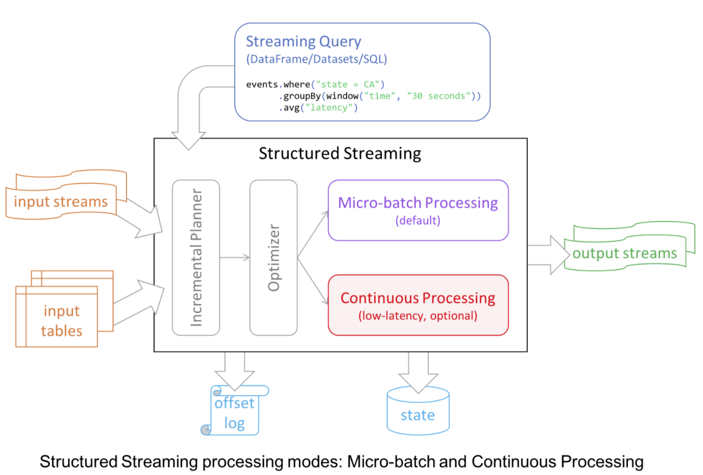
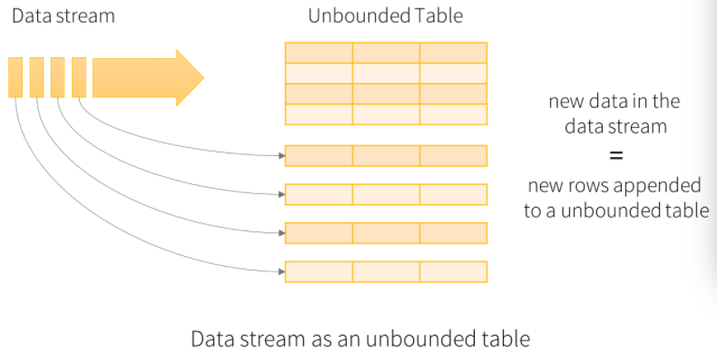
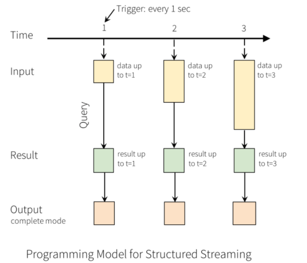
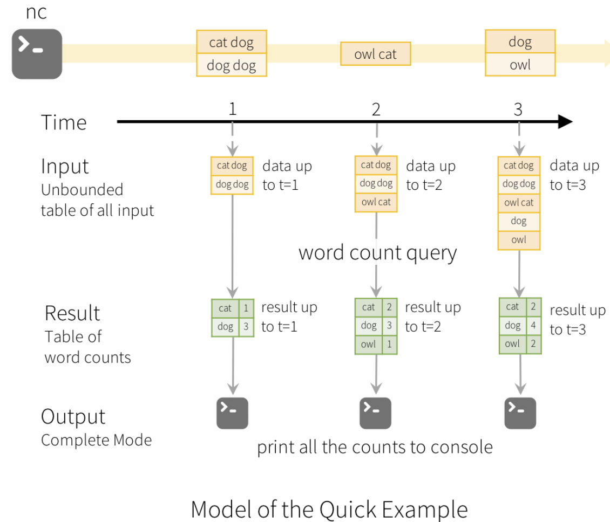
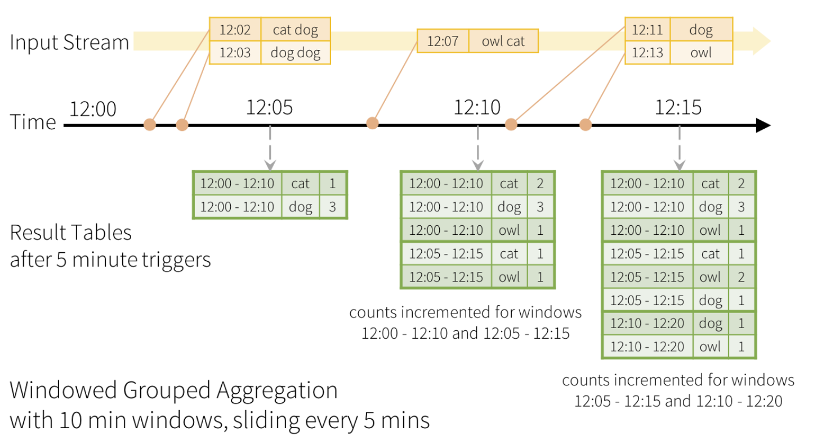
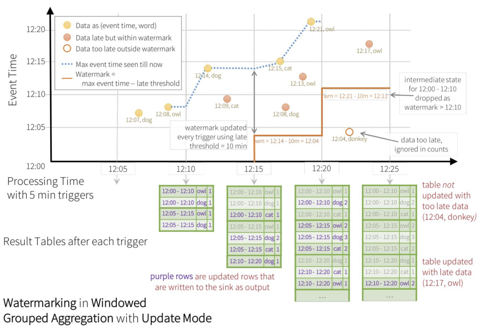
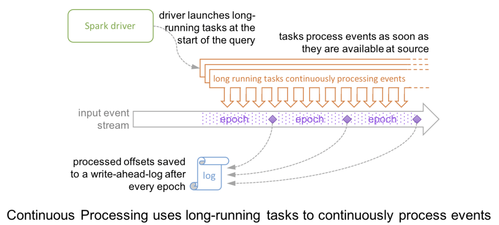

#### spark streaming 和 Structured Streaming

Spark streaming 的维护现在越来越少，而structured streaming 的发展以及维护要快很多，这里从二者的优缺点开始比较

* Spark Streaming 的不足

  > * 使用 Processing Time 而不是Event Time
  > * 复杂的底层API，Spark Streaming 是基于 DStram 提供的(数据模型)
  > * 输入到输出的一致性，spark Stream 只能保证处理过程的一致性，而不能保证读和写的一致性
  > * 批流代码不统一

* Structured Streaming

  > 增量query 模型： Structured Streaming 将会在新增的流式数据上不断执行增量查询，同时代码的写法和批处理(DF/Ds)API 是一样的
  >
  > 执行从读到操作数据到写数据的一致性
  >
  > 复用Spark SQL 执行引擎
  >
  > 

* Structured Streaming 设计核心

  > * 输入输出 exactly-once 一致性，要求input 是可以重放(replay)的，这样出错了的时候能够重新读数据，outPut 写也是要幂等的。
  > * API 完全复用 Spark SQL 的 batch API，还提供了Streaming 特有的API，trigger，watermark，stateful operator
  > * 执行复用 spark SQL 执行引擎

---

#### 概括

Structured Streaming 是建立在Spark SQL 之上的可扩展，容错的处理引擎，其操作可以和批处理一样 spark SQL 会处理增量的连续的更新。

Structured Streaming  是基于micro-batch 处理引擎，处理数据流式将数据看城市小batch job，可以实现100毫秒的延迟以及精确一次的容错保证(achieving end-to-end latencies as low as 100 milliseconds and exactly-once fault-tolerance guarantees)

从spark2.3 开始，提供了新的低延迟的处理模型，称为连续处理**Continuous Processing**，可以实现最低1毫秒的延时

#### 编程模型

Structured Streaming  编程的关键是将动的数据流看做是一个 持续添加进来元素的 Table，它会激活一个新的流处理模型，这是一个非常小的批处理模型，可以将在它上面的处理看做是在一个静态Table上处理的模型。来往我们看看这个模型

**基本概念**

将新进来的数据作为unbounded Table 的行，不断的将该行添加进去



这里又几个概念

* Input Unbound Table: 流式数据的抽象表示
* Query: 对 input Table 的增量式查询
* Result Table Query 产生的结果表
* Output Result Table 输出

```scala
// Create DataFrame representing the stream of input lines from connection to localhost:9999
val lines = spark.readStream
  .format("socket")
  .option("host", "localhost")
  .option("port", 9999)
  .load()

// Split the lines into words
val words = lines.as[String].flatMap(_.split(" "))

// Generate running word count
val wordCounts = words.groupBy("value").count()

// Start running the query that prints the running counts to the console
val query = wordCounts.writeStream
    .outputMode("complete")
    .format("console")
    .start()
```

代码可以这样来理解：

> 将流式数据当成是一张不断增长的table，也就是图中的**Unbounded table of all list**，然后每秒 trigger 一次，在trigger 的时候将query 引用到 input table 中增量的数据中，有时候还需要和之前的静态数据椅子组成成结果，然后生成一张Result Table

假设说触发每次的 query 操作间隔为1s，那么没一秒都会有一个Table 输出，然后新的操作会基于当前来的的数据

、

输出到外部存储系统中，这样对外部存储系统也是有要求的，有不同的写的方式

* Complete mode:  整个更新的结果表写到外部存储
* Append Mode：从上次触发结束开始算起，仅仅将新追加到结果表中的行写到外部存储，这种模式，相当于是一条一条数据的外外部系统中写，以及写进去的row，不能在改变了
* Update Mode:  假如说已经有row1(1,2)已经写到了外部存储，这个时候新来了一条key 为一样的，但是值不一样row(1,4)，需要去更新已有的这条数据，这个时候就是更新模式



和 batch 相比较，streaming 模式还提供了一些特有的算子操作，window，watermark，stateful operator 等

	* 窗口操作和事件时间



现在有一个事件时间长度为10min，滑动步长为5min 的滑动窗口，时间开始是[12:00,12:10],

[12:05,12:15],[12:10,12:20],

```scala
import spark.implicits._

val words = ... // streaming DataFrame of schema { timestamp: Timestamp, word: String }

// Group the data by window and word and compute the count of each group
// 先将数据根据 word 分组，然后在每组中使用 window 函数，并在每个窗口内执行 count 操作
val windowedCounts = words.groupBy(
  window("eventTime", "10 minutes", "5 minutes"),
  $"word"
).count()
```

* watermark

是为了处理延迟数据 ，很多情况下对于这种 late data 的时效数据并没有必要一直保留太久。比如说，数据晚了 10 分钟或者还有点有，但是晚了 1 个小时就没有用了，另外这样设计还有一个好处就是中间状态没有必要维护那么多。watermark 的形式化定义为 max(eventTime) - threshold，早于 watermark 的数据直接丢弃。

```scala
import spark.implicits._

val words = ... // streaming DataFrame of schema { timestamp: Timestamp, word: String }

// Group the data by window and word and compute the count of each group
val windowedCounts = words
    .withWatermark("eventTime", "10 minutes")// 需定义在聚合之前
    .groupBy(
        window("eventTime", "10 minutes", "5 minutes"),
        $"word")
    .count()

// 结果输出模型必须使用Append 或者 Update 模式
```

用下图表示更加形象。在 12:15 trigger 时 watermark 为 12:14 - 10m = 12:04，所以 late date (12:08, dog; 12:13, owl) 都被接收了。在 12:20 trigger 时 watermark 为 12:21 - 10m = 12:11，所以 late data (12:04, donkey) 都丢弃了。



在使用wm 之后，一个数据的写如，也是一句wm的，一个窗口结束之后才会写，而窗口的结束是根据wm的，而不是当前最大的事件时间。

除此之后 Structured Streaming 还提供了用户可以自定义状态计算逻辑的算子：

- mapGroupsWithState
- flatMapGroupsWithState

---

#### 容错

流式处理最关键的就是如何实现**端到端的exactly-once 语义**，structure stream 为了实现此，sink 和执行引擎会跟踪执行过程，所以当执行失败的时候，ss可以在任何时候地方重新执行，使用的没一个source 都会去追踪读取数据的偏移量，如kafka，确保数据读取的一致性，streaming 引擎会使用 checkpoint 和 weite-ahead logs去记录读取数据的偏移量。

所以通过上步骤实现端到端的exactly-once 语义

* check-point 和 write-ahead log 记录source 的偏移量
* streaming 引擎追sink 和 执行步骤的过程，可以在任何时间/地方重启

---

#### 创建 streaming DataFrames 以及 streaming Dataset

```scala
// 这个方法返回的是一个动态表的 loader
val streamReader: DataStreamReader = spark.readStream

// DataStreamReader 创建流式DataFrame，这里的 lines 是一个动态的 DataFrame，数据在时刻发生变化
val lines: DataFrame = streamReader
.format("socket")
.option("host", "localhost")
.option("port", 7777)
.load()
```

默认情况 ss从file 读进来的源需要指定数据的schema，默认spark不会去推断，如果需要推断，则需要设置

`spark.sql.streaming.schemaInferene=true`

* API

可以使用任何的 DataFrame 上的api，或者注册视图，到Streaming DataFrame

---

#### 支持Streaming Dataset 和 static Dataset

#### Triggers

用于设置query 是在 micro-batch query 还是在fixed batch 间隔触发或者是连续的query

* 未指定(默认)：查询以微批处理执行，该模式下，前一个微批处理完之后立即开始处理下一个微批
* 固定间隔微批：查询将以微批次模式执行，在该模式下，微批次将按用户指定的时间间隔启动。
  - 如果前一个微批处理在该间隔内完成，则引擎将等待该间隔结束，然后再开始下一个微批处理。
  - 如果前一个微批处理花费的时间比间隔要长（例如，缺少间隔边界），那么下一个微批处理将在前一个微批处理完成后立即开始（即，它不会等待下一个间隔边界） ）。
  - 如果没有新数据可用，则不会启动微批量。
* 一次性微批 ：查询将仅执行一个微批处理以处理所有可用数据，然后自行停止。在您要定期启动群集，处理自上一周期以来可用的所有内容然后关闭群集的情况下，这很有用。在某些情况下，这可能会节省大量成本。
* 以固定的检查点间隔连续进行(**Continuous with fixed checkpoint interval**
  *(experimental)*), 实现真正的spark 流式子处理

```scala
import org.apache.spark.sql.streaming.Trigger

// Default trigger (runs micro-batch as soon as it can)
df.writeStream
  .format("console")
  .start()

// ProcessingTime trigger with two-seconds micro-batch interval
df.writeStream
  .format("console")
  .trigger(Trigger.ProcessingTime("2 seconds"))
  .start()

// One-time trigger
df.writeStream
  .format("console")
  .trigger(Trigger.Once())
  .start()

// Continuous trigger with one-second checkpointing interval
df.writeStream
  .format("console")
  .trigger(Trigger.Continuous("1 second"))
  .start()
```


---

#### Continuous Processing Mode

实现了1毫秒的低延迟以及端到端的exactly-once语义

好，终于要介绍到“真正”的流处理了，我之所以说“真正”是因为 continuous mode 是传统的流处理模式，通过运行一个 long-running 的 operator 用来处理数据。之前 Spark 是基于 micro-batch 模式的，就被很多人诟病不是“真正的”流式处理。continuous mode 这种处理模式只要一有数据可用就会进行处理，如下图所示。epoch 是 input 中数据被发送给 operator 处理的最小单位，在处理过程中，epoch 的 offset 会被记录到 wal 中。另外 continuous 模式下的 snapshot 存储使用的一致性算法是 Chandy-Lamport 算法。



使用该真正流式处理，只需要做配置**continuous trigger**

```scala
val a = spark
  .readStream
  .format("kafka")
  .option("kafka.bootstrap.servers", "host1:port1,host2:port2")
  .option("subscribe", "topic1")
  .load()

val b = a.selectExpr("CAST(key AS STRING)", "CAST(value AS STRING)")
// 中间可能有比较复杂的情况

b.writeStream
  .format("kafka")
  .option("kafka.bootstrap.servers", "host1:port1,host2:port2")
  .option("topic", "topic1")
  .trigger(Trigger.Continuous("1 second"))  // only change in query
  // 1秒钟执行一次
  .start()
```


这种模式相比与 micro-batch 模式缺点和优点都很明显。

- 缺点是不容易做扩展： **2.4.5 的文档中只允许使用 map 类的操作** select, filter,mapPartitions 等非shuffle 操作
- 优点是延迟更低

- Continuous processing engine launches multiple long-running tasks that continuously read data from sources, process it and continuously write to sinks. The number of tasks required by the query depends on how many partitions the query can read from the sources in parallel. Therefore, before starting a continuous processing query, you must ensure there are enough cores in the cluster to all the tasks in parallel. For example, if you are reading from a Kafka topic that has 10 partitions, then the cluster must have at least 10 cores for the query to make progress.

连续处理引擎启动一个长期运行的tasks，连续的从数据源读取数据，并且处理，然后写到Sinks，这里又一个要求就是task 的个数取决于partition，所以在读数据的时候最好知道数据有多少个分区，然后和机器的cores 能够对在一起。

