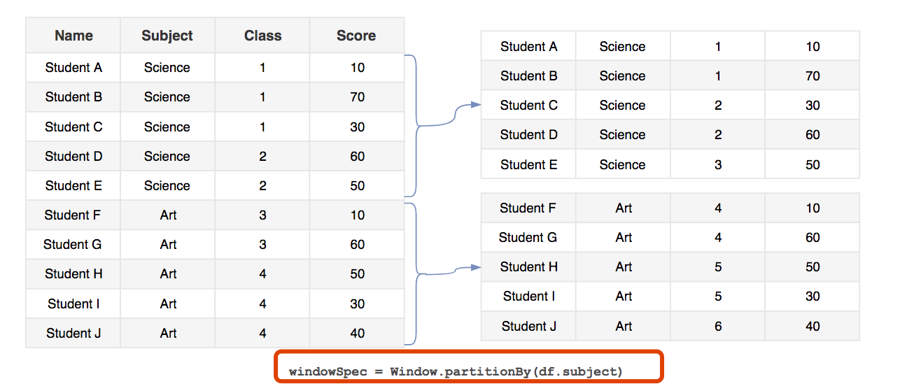
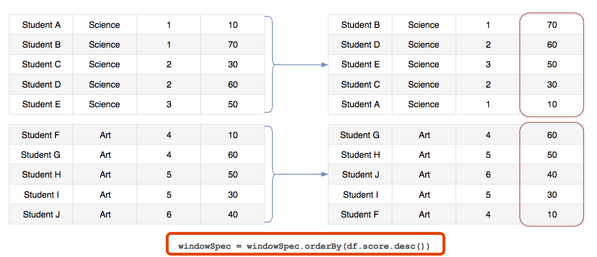
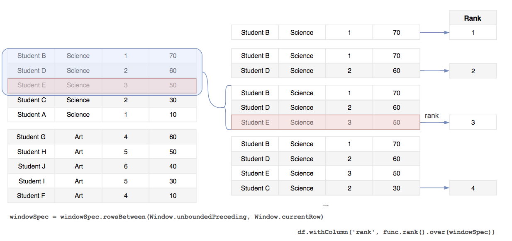
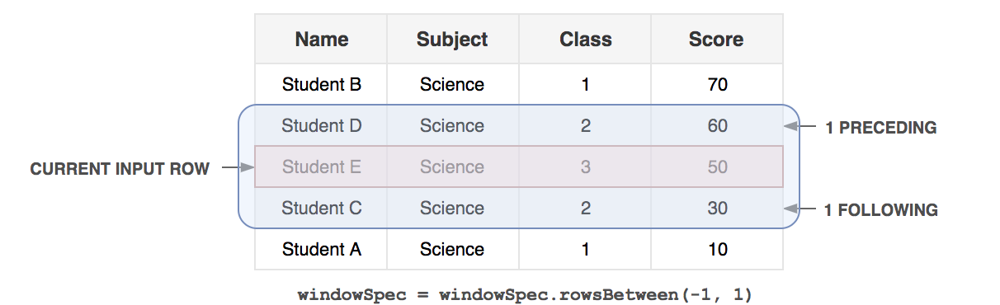
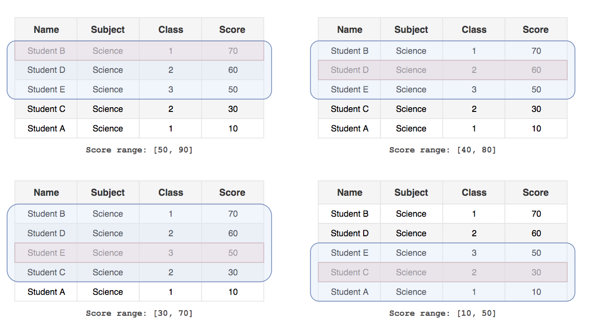
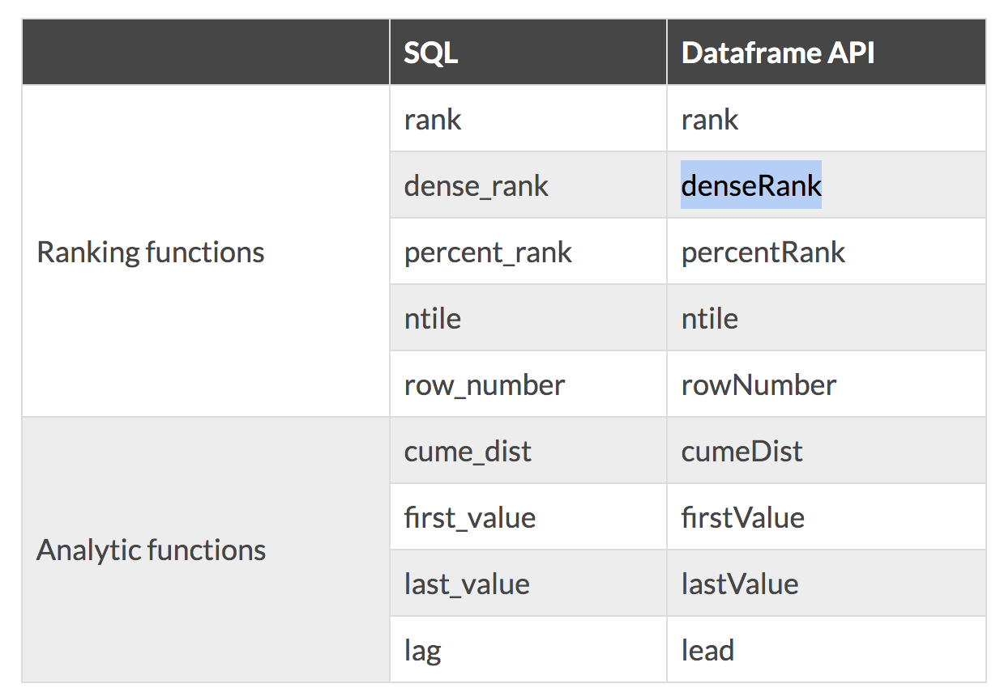
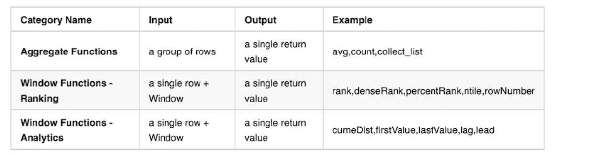

> 对于一个数据集，`map` 是对每行进行操作，为每行得到一个结果；`reduce` 则是对多行进行操作，得到一个结果；而 `window` 函数则是对多行进行操作，得到多个结果（每行一个）。本文会以实例介绍 `window` 函数的基本概念和用法。

### 计算成绩排名

---

例如大学里有许多专业，每个专业有若干个班级，每个班级又有许多学生，这次考试，每个学生的成绩用 pyspark 表示如下：

```python
df = sqlContext.createDataFrame([
    ["Student A", 1, "Science", 10],
    ["Student B", 1, "Science", 20],
    ["Student C", 2, "Science", 30],
    ["Student D", 2, "Science", 40],
    ["Student D", 3, "Science", 50],
    ["Student E", 4, "Art", 10],
    ["Student F", 4, "Art", 20],
    ["Student G", 5, "Art", 30],
    ["Student H", 5, "Art", 40],
    ["Student I", 6, "Art", 50],
    ], ["name", "class", "subject", "score"])

```

现在我们的需求是：计算每个学生在专业里的成绩排名。

首先，我们将学生按专业分成两组：



接着我们按分数从高到低进行排序：



之后是执行窗口函数。对于每个学生，我们将排在它之前的所有学生取出，再计算当前学生排在第几名：



```python
windowSpec = Window.partitionBy(df.subject) \
                    .orderBy(df.score.desc()) \
                    .rowsBetween(Window.unboundedPreceding, Window.currentRow)

df.withColumn('rank', psf.rank().over(windowSpec)).show()
```

```
+---------+-----+-------+-----+----+
|     name|class|subject|score|rank|
+---------+-----+-------+-----+----+
|Student D|    3|Science|   50|   1|
|Student D|    2|Science|   40|   2|
|Student C|    2|Science|   30|   3|
|Student B|    1|Science|   20|   4|
|Student A|    1|Science|   10|   5|
|Student I|    6|    Art|   50|   1|
|Student H|    5|    Art|   40|   2|
|Student G|    5|    Art|   30|   3|
|Student F|    4|    Art|   20|   4|
|Student E|    4|    Art|   10|   5|
+---------+-----+-------+-----+----+
```


## 如何定义窗口

一个窗口需要定义三个部分：

1. 分组，如何将行分组？在选取窗口数据时，只对组内数据生效
2. 排序，按何种方式进行排序？选取窗口数据时，会首先按指定方式排序
3. 帧(frame)选取，以当前行为基准，如何选取周围行？

### Row Frame(行帧)

行帧，即选择帧的时候通过行数指定。语法为 `rowsBetween(x, y)`，其中 `x, y` 可以是数字，`-n`表示向前数 `n` 行，`n` 表示向后数 `n` 行。除此之外，还可以是：

- `Window.unboundedPreceding` 表示当前行之前的无限行
- `Window.currentRow` 表示当前行
- `Window.unboundedFollowing` 表示当前行之后的无限行

例如，要选择当前行的前一行和后一行，则 pyspark 的写法为 `rowsBetween(-1, 1)`，对应 SQL 的写法为 `ROWS BETWEEN 1 PRECEEDING AND 1 FOLLOWING`，表示如下图：



### Range Frame(范围帧)

有时，我们想根据当前行列值的范围来选取窗口，语法为 `rangeBetween(x, y)`。例如，当前的分数为 `60`，选择范围帧 `rangeBetween(-20, 20)`，则会选择所有分数落在 `[40, 80]` 范围内的行。如下图：



## 窗口函数

从通用性的角度来说，选定帧内数据后，做何种计算，需要让用户自行定义。考虑到效率和便利性等因素，Spark SQL 不支持自定义的窗口函数[[1\]](https://lotabout.me/2019/Spark-Window-Function-Introduction/#fn1)，而是提供了一些内置的优化过的函数，来满足日常的需求。

Spark SQL 支持三种类型的窗口函数：排名函数(ranking function)、分析函数 (analytic functions)和聚合函数(aggregate functions)。其中聚合函数（如 `max`, `min`, `avg` 等)常用在 `reduce` 操作中，不再介绍，其它函数如下：



---

[博客](https://knockdata.github.io/spark-window-function/) 简绍了在`scala spark` 中使用窗口函数

spark window fucntions have the following traits

* Perform a calculation over a group of rows, called the `Frame`
* a frame corresponding to the current row
* return  a new value to for each row by an aggregate/window function
* can use `SQL` grammer or `DataFrame` API

There are hundreds of [general spark functions](https://spark.apache.org/docs/latest/api/scala/index.html#org.apache.spark.sql.functions$) in which **Aggregate Functions** and |**Window Functions** categories are related to this case.



```scala
package com.bigData.spark.SQL

import com.bigData.spark.Commons
import org.apache.spark.sql.expressions.Window
import org.apache.spark.sql.types._
import org.apache.spark.sql.functions._

case class Salary(depName: String, empNo: Long, name: String, salary: Long, hobby: Seq[String])

object windowss {
  def main(args: Array[String]): Unit = {

    val spark = Commons.spark
    import spark.implicits._

    val empsalary = spark.createDataFrame(
      Seq(
          Salary("sales",     1,  "Alice",  5000, List("game",  "ski")),
          Salary("personnel", 2,  "Olivia", 3900, List("game",  "ski")),
          Salary("sales",     3,  "Ella",   4800, List("skate", "ski")),
          Salary("sales",     4,  "Ebba",   4800, List("game",  "ski")),
          Salary("personnel", 5,  "Lilly",  3500, List("climb", "ski")),
          Salary("develop",   7,  "Astrid", 4200, List("game",  "ski")),
          Salary("develop",   8,  "Saga",   6000, List("kajak", "ski")),
          Salary("develop",   9,  "Freja",  4500, List("game",  "kajak")),
          Salary("develop",   10, "Wilma",  5200, List("game",  "ski")),
          Salary("develop",   11, "Maja",   5200, List("game",  "farming"))
      ))

    empsalary.createTempView("empsalary")

    /*
        Created with Window.partitionBy on one or more columns
        Each row has a corresponding frame
        The frame will be the same for every row in the same within the same partition.
        Aggregate/Window functions can be applied on each row+frame to generate a single value
        (聚合/窗口函数只会在当前行以及上下frame 组成的窗口中产生一个value 结果作为当前row 的结果)

        可以不指定 partitionBy，在所有的数据上操作
     */
    val overCategory = Window
      .orderBy($"salary".desc)

    /*
      然后计算
        using function avg to calculate average salary in a department
        using function sum to calculate total salary in a department
     */
    val df = empsalary
      // .withColumn("average_salary_in_dep", array_contains($"hobby", "game") over overCategory)
      // 回顾这个知识点的时候，提示 array_contains 不能用在 window 中
      .withColumn("average_salary_in_dep", array_contains($"hobby", "game"))
      .withColumn("total_salary_in_dep", sum($"salary") over overCategory)
// +---------+-----+------+------+---------------+-----+-----+
// |  depName|empNo|  name|salary|          hobby|  avg|total|
// +---------+-----+------+------+---------------+-----+-----+
// |  develop|    8|  Saga|  6000|   [kajak, ski]|false| 6000|
// |  develop|   10| Wilma|  5200|    [game, ski]| true|16400| // 当 salary 值一样的时候，计算是一样的
// |  develop|   11|  Maja|  5200|[game, farming]| true|16400| // 和上面一样
// |    sales|    1| Alice|  5000|    [game, ski]| true|21400|
// |    sales|    3|  Ella|  4800|   [skate, ski]|false|31000|
// |    sales|    4|  Ebba|  4800|    [game, ski]| true|31000|
// |  develop|    9| Freja|  4500|  [game, kajak]| true|35500|
// |  develop|    7|Astrid|  4200|    [game, ski]| true|39700|
// |personnel|    2|Olivia|  3900|    [game, ski]| true|43600|
// |personnel|    5| Lilly|  3500|   [climb, ski]|false|47100|
// +---------+-----+------+------+---------------+-----+-----+

    // 使用 partitionBy
  val overCategory = Window
    .partitionBy($"depName")
    .orderBy($"salary".desc)
    
// +---------+-----+------+------+---------------+-----+-----+
// |  depName|empNo|  name|salary|          hobby|  avg|total|
// +---------+-----+------+------+---------------+-----+-----+
// |  develop|    8|  Saga|  6000|   [kajak, ski]|false| 6000|
// |  develop|   10| Wilma|  5200|    [game, ski]| true|16400|
// |  develop|   11|  Maja|  5200|[game, farming]| true|16400|
// |  develop|    9| Freja|  4500|  [game, kajak]| true|20900|
// |  develop|    7|Astrid|  4200|    [game, ski]| true|25100|
// |    sales|    1| Alice|  5000|    [game, ski]| true| 5000| // 分组重新统计
// |    sales|    3|  Ella|  4800|   [skate, ski]|false|14600|
// |    sales|    4|  Ebba|  4800|    [game, ski]| true|14600|
// |personnel|    2|Olivia|  3900|    [game, ski]| true| 3900|
// |personnel|    5| Lilly|  3500|   [climb, ski]|false| 7400|
// +---------+-----+------+------+---------------+-----+-----+
    
    
    
    /*
      lag & lead in a group
      lag means getting the value from the previous row;
      lead means getting the value from the next row.
     */

//    val df = empsalary
//      .withColumn("lead", lead($"salary",1) over overCategory)
//      .withColumn("lag", lag($"salary",1) over overCategory)
//      .select("depName","empNo","name","salary","lead","lag")
//
//    val diff2 = df.withColumn("higher_than_next", 'salary - 'lead)
//                 .withColumn("lower_than_previous", 'lag - 'salary)
//    diff2.show()
//
//    val diff3 = df.withColumn(
//      "higher_than_next", when('lead.isNull, 0).otherwise('salary - 'lead)).withColumn(
//      "lower_than_previous", when('lag.isNull, 0).otherwise('lag - 'salary))
//    diff3.show()
// +---------+-----+------+------+---------------+----+----+----------------+-------------------+
// |  depName|empNo|  name|salary|          hobby|lead| lag|higher_than_next|lower_than_previous|
// +---------+-----+------+------+---------------+----+----+----------------+-------------------+
// |  develop|    8|  Saga|  6000|   [kajak, ski]|5200|null|             800|               null|
// |  develop|   10| Wilma|  5200|    [game, ski]|5200|6000|               0|                800|
// |  develop|   11|  Maja|  5200|[game, farming]|4500|5200|             700|                  0|
// |  develop|    9| Freja|  4500|  [game, kajak]|4200|5200|             300|                700|
// |  develop|    7|Astrid|  4200|    [game, ski]|null|4500|            null|                300|
// |    sales|    1| Alice|  5000|    [game, ski]|4800|null|             200|               null|
// |    sales|    3|  Ella|  4800|   [skate, ski]|4800|5000|               0|                200|
// |    sales|    4|  Ebba|  4800|    [game, ski]|null|4800|            null|                  0|
// |personnel|    2|Olivia|  3900|    [game, ski]|3500|null|             400|               null|
// |personnel|    5| Lilly|  3500|   [climb, ski]|null|3900|            null|                400|
// +---------+-----+------+------+---------------+----+----+----------------+-------------------+

    /*
      rank
     */

//      val df = empsalary
//          .withColumn("salaries", collect_list($"salary") over overCategory)
//          .withColumn("rank", rank() over overCategory)
//          .withColumn("dense_rank", dense_rank() over overCategory)
//          .withColumn("row_number", row_number() over overCategory)
//          .withColumn("ntile", ntile(3) over overCategory)
//          .withColumn("percent_rank", percent_rank() over overCategory)
//          .withColumn("avg_salary", (avg($"salary") over overCategory).cast("int"))
//          .withColumn("total_salary", sum($"salary") over overCategory)
//          .select("depName","empNo","name","salary"
//          ,"rank", "dense_rank","row_number","ntile","percent_rank")

//    df.show()

    /*
      Running Total
      Running Total means adding everything up until the currentRow

      Range Frame: use range functions to change frame boundary.
        create new Window.partitionBy on one or more columns
        Its  usually  has orderBy so that the data in the frame is orderd
        Then followed by rangeBetween or rowsBetween
        Each row woll have a corresponding frame
        Frame boundary can be controlled by rangeBetween or rowBetween
        Aggregation/window functions can be applied on each+frame to generate a single value

     */

    val overCategory2 = Window
            .partitionBy($"depName")
            .orderBy($"salary".desc)
//            .rowsBetween(Window.currentRow, 1)
      .rowsBetween(Window.unboundedPreceding, Window.unboundedFollowing)
          val df = empsalary
              .withColumn("salaries", collect_list($"salary") over overCategory2)
              .withColumn("total_salary", sum($"salary") over overCategory2)
              .withColumn("median_salary", element_at('salaries, (size('salaries)/2 + 1).cast("int")))

    .select("depName","empNo","name","salary"
              , "total_salary","median_salary")

    // Use groupBy then join back to calculate the median value
    // sort_array: Sorts the input array for the given column in ascending order,
    val dfMedian = empsalary.groupBy("depName").agg(
            sort_array(collect_list('salary)).as("salaries"))
        .select('depName, 'salaries,
        element_at('salaries, (size('salaries)/2 + 1).cast("int")).as("median_salary"))
    dfMedian.show()

    val df2 = empsalary.join(broadcast(dfMedian), "depName").select(
      "depName", "empNo", "name", "salary", "salaries", "median_salary")
    df2.show(false)

  }
}

```

