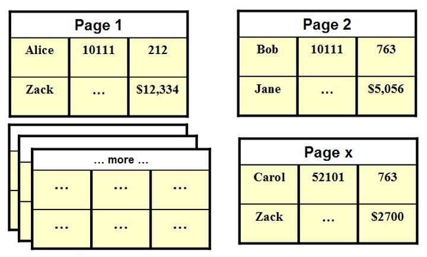

[文章来源](https://www.zhihu.com/people/tiannyxie)

#### 定义

- 行式存储把一行中的数据值串在一起存储起来，然后再存储下一行的数据，以此类推
- 列式存储把一列中的数据值串在一起存储起来，然后再存储下一列的数据，以此类推

#### 例子

数据库以行、列的二维表的形式表示数据，但是却以一维字符串的方式存储，举个例子

上面的表包括 Empid，Lastname、Firstname，Salary 四个字段。

数据库会把这个表存储在一系列的一维字节中，由操作系统将这一系列的字节写到磁盘中。

行式数据库把一行中的数据串在一起存储起来，然后再存储下一行的数据，以此类推，如下：

`1,Smith,Joe,40000;2,Jones,Mary,50000;3,Johnson,Cathy,44000;`

列式数据库把一列中的数据串在一起存储起来，然后再存储下一列的数据，依次类推，如下：

`1,2,3;Smith,Jones,Johnson;Joe,Mary,Cathy;40000,50000,44000;`

上面是简化的说法，只是为了便于表达意思。

#### 例子2

在行式数据库中，每一行数据都看做一个整体，可以被认为是一小块数据，这样每一块数据都是紧挨着另一块数据存放在硬盘中。一般情况下，可以认为每一行存储的数据就是硬盘中的一组连续的字节。

为了方便讨论，有如下表，假设每一行都包含一个用户的信息，每个用户的所有属性都整块的存储在硬盘上

在硬盘上，大量的页面用来存储所有的数据。现在假设数据库中的每行信息都存储在同一页上，也就是说，每一页只能保存一个用户的所有信息。在上面的例子中，Alice 的所有信息都被存储到一个页面中，如果需要获取或者更新 Alice 的信息，那么某一时刻在内存中仅需存储关于 Alice 的单一页面。如所示：

好了，现在目光转向列式存储。如果是基于列的数据库，所有的数据都是以列的形式存储的。同样，我们假设每一列的存储只对应一个页面，那么用户的每个属性信息都会被单独存储在一个页面，如下：

那么，现在考虑如下场景。如果使用的是行式数据库，你正好需要对一行数据进行操作时，数据库的性能是最好的，因为仅一个页面被放到了内存中（这只是个示例，实际上操作系统会带来不止一个页面的数据）。

但是，如果你只是想对表中所有数据的某一列的数据做一些操作，这意味着你将花费时间去访问每一行，可你用到的仅是一行中的小部分数据。此时使用的若是列式数据库，就可以方便快捷的访问数据，因为每一列的信息都是存储在一起的。

蛋疼的时候来了，假如现在使用的是列式存储，你又想获取 Alice 的所有信息，那你又必须去读取大量的列（页面）来获取所有的数据。

正因为如此，才有了行式存储和列式存储的使用场景的区别。

当你的核心业务是 OLTP 时，一个行式数据库，再加上优化操作，可能是个最好的选择。
当你的核心业务是 OLAP 时，一个列式数据库，绝对是更好的选择

---

你如果要算join，就需要行存储，你如果要算 aggregation，就用列存储。

#### 列存储的优势

* (**存储上能节约空间**)列式存储把相同类型的数据归在一起，压缩比可以很高，通常能到10%~25%。数据库的瓶颈通常在IO(**减少 IO**)，很高的压缩比，可以大大减轻数据读取的压力，提高响应速度。

* 除去字符串类型，其他类型的字段通常是固定长度的，而且在磁盘和内存的字节顺序通常是一致的，可以直接映射，省去了解析的过程。而在行存储中，只要有变长的字段存在，需要逐行逐字段的解析。

* 列式存储可以向量化的处理一个字段。可以将一个列的一整块连续数据读入CPU cache，效率非常高。而且，可以利用CPU的向量化处理指令并行处理一些常用计算，譬如求和，比较大小等等。而这一切在行存储中都做不到。

---

列式存储(Columnar or column-based)是相对于传统关系型数据库的行式存储(Row-basedstorage)来说的。简单来说两者的区别就是如何组织表(翻译不好，直接抄原文了)：

#### 行式存储的适用场景包括：

1、适合随机的增删改查操作;
2、需要在行中选取所有属性的查询操作;
3、需要频繁插入或更新的操作，其操作与索引和行的大小更为相关。

#### 列式存储引擎的适用场景包括：

1、查询过程中，可针对各列的运算并发执行(SMP)，最后在内存中聚合完整记录集，最大可能降低查询响应时间;
 2、可在数据列中高效查找数据，无需维护索引(任何列都能作为索引)，查询过程中能够尽量减少无关IO，避免全表扫描;
 3、因为各列独立存储，且数据类型已知，可以针对该列的数据类型、数据量大小等因素动态选择压缩算法，以提高物理存储利用率;如果某一行的某一列没有数据，那在列存储时，就可以不存储该列的值，这将比行式存储更节省空间。

列存储适合使用的场景

数据需要频繁更新的交易场景
表中列属性较少的小量数据库场景
不适合做含有删除和更新的实时操作