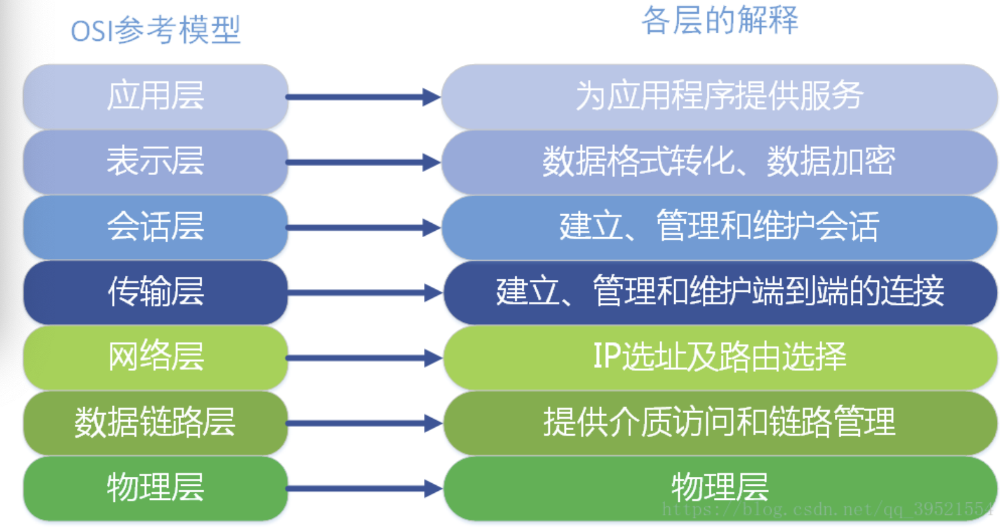
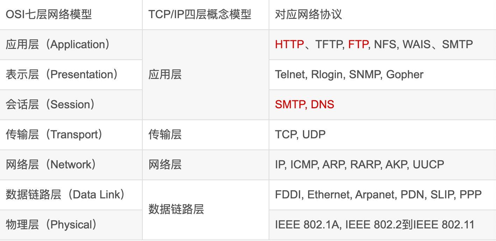
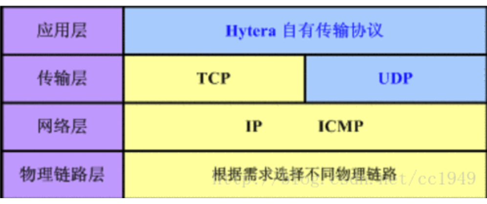
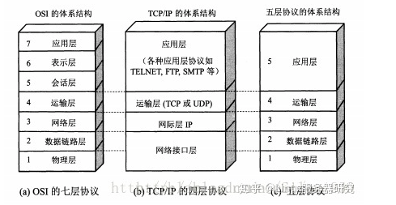

[参考文章](https://blog.csdn.net/qq_39521554/article/details/79894501)

[参考文章](https://zhuanlan.zhihu.com/p/34904010)

OSI定义了网络互连的七层框架:

每一层实现各自的功能和协议，并完成与相邻层的接口通信。OSI的服务定义详细说明了各层所提供的服务。某一层的服务就是该层及其下各层的一种能力，它通过接口提供给更高一层。各层所提供的服务与这些服务是怎么实现的无关。

**OSI参考模型是学术上和法律上的国际标准**，是完整的权威的网络参考模型。**而TCP/IP参考模型是事实上的国际标准，即现实生活中被广泛使用的网络参考模型。**

### **OSI七层和TCP/IP的区别**

- TCP/IP他是一个协议簇；而OSI（开放系统互联）则是一个模型，且TCP/IP的开发时间在OSI之前。
- TCP/IP是由一些交互性的模块做成的分层次的协议，其中每个模块提供特定的功能；OSi则指定了哪个功能是属于哪一层的。
- TCP/IP是五层结构，而OSI是七层结构。OSI的最高三层在TCP中用应用层表示。

#### 4 层

4 层是说 TCP/IP 四层模型，主要包括：应用层、运输层、网际层和网络接口层

数据包从上往下，没经过一层，协议就会在包头上面加点东西，到了接收端，再层层解套出来

---

#### 4层负载均衡和七层负载均衡的区别

所谓四层负载均衡就是使用IP加端口的方式进行路由转发: 在第四层网络层才有了IP:port。

七层负载均衡一般是基于请求URL地址的方式进行代理转发：七层有域名信息的(当然也是有MAC 和 IP:port)。

还有基于MAC地址信息(虚拟MAC地址到真实MAC地址)进行转发的二层负载均衡和基于IP地址(虚拟IP到真实IP)的三层负载均衡： 2层数据链路层只有mac 信息。

##### 安全角度

7层更加的安全，可以过来恶意流量

##### 常见的四层和七层均衡设备

* 四层: F5、LVS等

* 七层: nginx、apache等

---

* 物理层

  > 硬件设备的机械特性规定了网络连接时所需接插件的规格尺寸、引脚数量和排列情况等

* 数据链路层

  > 建立相邻结点之间的数据链路，提供数据帧（Frame）在信道上无差错的传输，数据链路层在不可靠的物理介质上提供可靠的传输。这里又设备的MAC 地址

* 网络层

  > 网络层的任务就是选择合适的网间路由和交换结点， 确保数据及时传送。
  >
  > 网络层将数据链路层提供的帧组成数据包，包中封装有网络层包头，其中含有逻辑地址信息- -源站点和目的站点地址的网络地址。如 果你在谈论一个IP地址，那么你是在处理第3层的问题，IP是第3层问题的一部分.

* 传输层

  > 当你谈论TCP等具体的协议时这个层负责获取全部信息，因此，它必须跟踪数据单元碎片、乱序到达的 数据包和其它在传输过程中可能发生的危险。第4层为上层提供端到端（最终用户到最终用户）的透明的、可靠的数据传输服务。

* 会话层

  > 在会话层及以上的高层次中，数据传送的单位不再另外命名，而是统称为报文。**会话层不参与具体的传输，它提供包括访问验证和会话管理在内的建立和维护应用之间通信的机制**。如服务器验证用户登录便是由会话层完成的。

* 表示层

  > 解决拥护信息的语法表示问题,提供格式化的表示和转换数据服务。数据的压缩和解压缩， 加密和解密等工作都由表示层负责。

* 应用层

  > 操作系统或网络应用程序提供访问网络服务的接口。应用层协议的代表包括：FTP、HTTP等。

**TCP/IP四层模型跟OSI模型有什么不一样?**

OSI是一个完整的、完善的宏观理论模型;而TCP/IP(参考)模型，更加侧重的是互联网通信核心(也是就是围绕TCP/IP协议展开的一系列通信协议)的分层，因此它不包括物理层，以及其他一些不想干的协议;其次，之所以说他是参考模型，是因为他本身也是OSI模型中的一部分，因此参考OSI模型对其分层。

**五层模型的意义?**

所谓的五层协议的网络体系结构其实是**为了方便学习计算机网络原理而采用的**，综合了OSI七层模型和TCP/IP的四层模型而得到的五层模型。

---

**在应用中确实是这样的，值听过说4层负载(IP:PORT  访问)和7层负载(域名访问)，并没有听过5层负载**

