### 网络的概貌

---

**局域网**

> 覆盖范围小，自己花钱买设备，自己维护，带宽固定， 

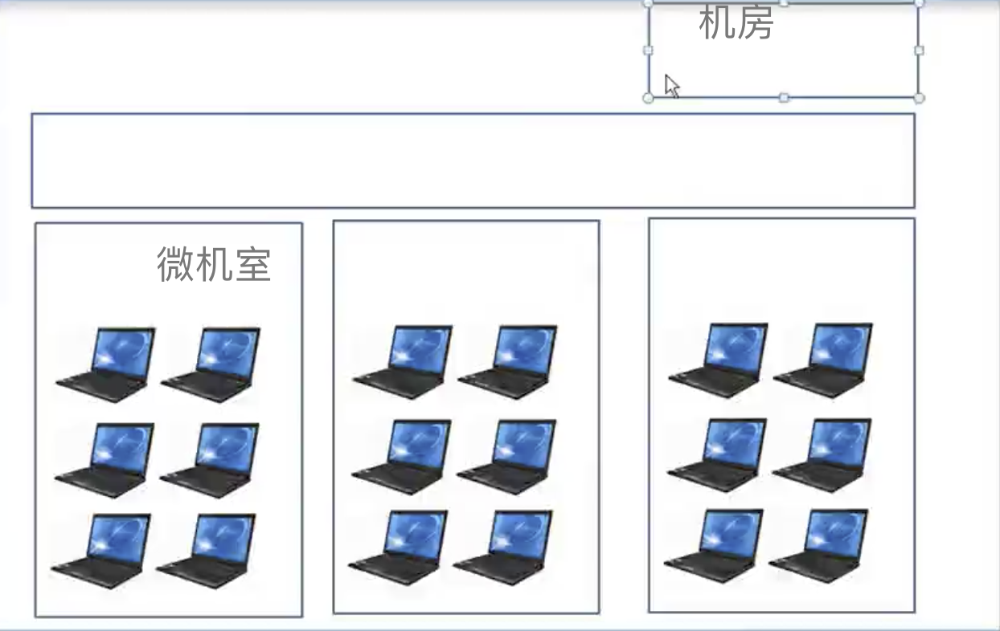

如图所示是机房到微机室的一个设备，现在如果想要微机室的计算机能够联网，那么是否可以这么联网呢？

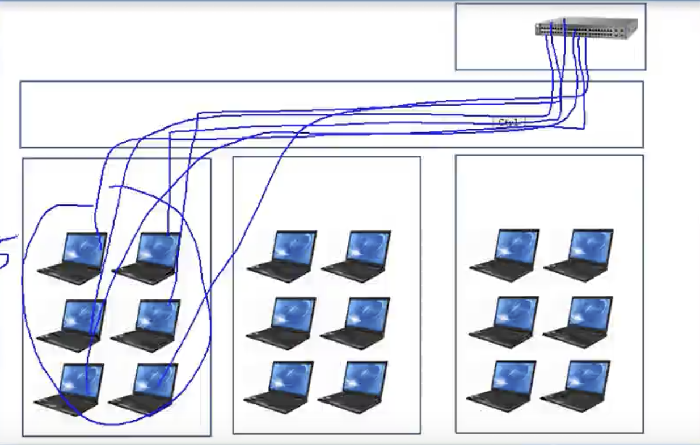

似乎是可以的，但是如果有500台甚至跟多的计算机呢？ 显示就不可以了，那一捆一捆的线。

那么下面的这种方式呢？ 

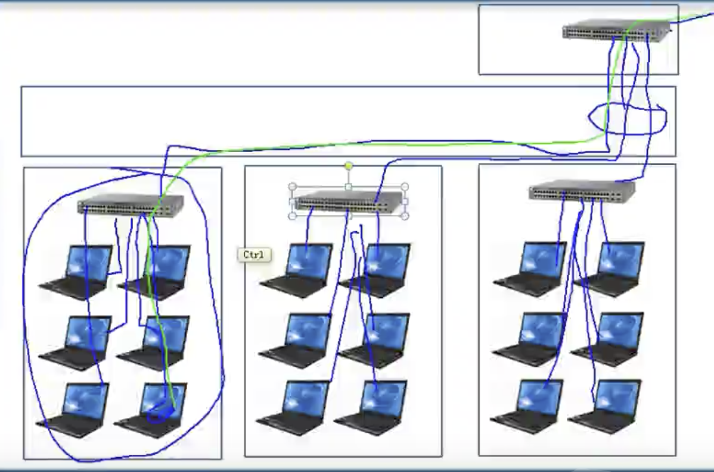

每一个教室放一个交换机，教室里面的机器都练到交换机，然后交换机上使用一根线去连接机房。

这样只有3根线就可以连接。

局域网有所限制，也就是一个交换机连接的机器不能超过100台，同时交换机到机房的线长度，也不超过100米，交换机在分配流量的时候，100台机器连接上去之后，网速并不会限制，交换机到机房的信号会得到加强。

每个机房的交换机称为是**接入层** ，机房的那个交换机称为是**汇聚层**， 

如果网络是按照如下的方式接入。

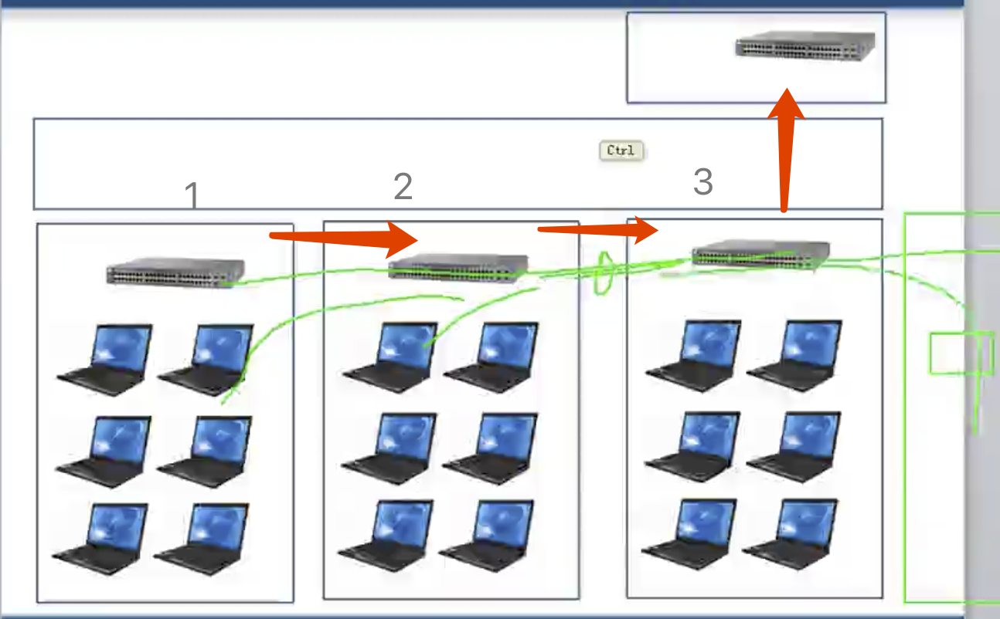

那么也是有问题的 第3台的交换机需要成袋第2台和第1台的流量。第3台的机器的压力是相当大的。

---

**Internet广域网**

> Internet ISP(Internet Service Provider) 自己的机房，对网民提供网络服务
>
> 广域网， 电话线拨号上网，带宽固定，花钱买带宽，买别的服务，线路等都是由别人维护

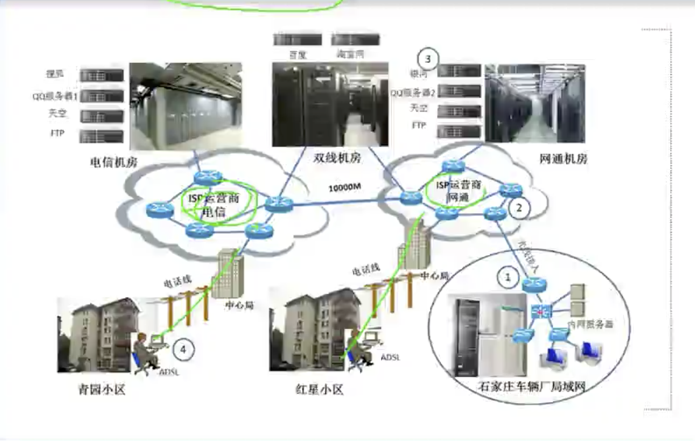

在生活中会有各种各样的网络运营商(ISP)，如长城，联通，移动，电信等，这些运营商负责将用户接入到Internet， 如上图，在运行商内部有各种各样的连接，之间的带宽，但是各运营商之间就会产生带宽问题，连接比较少，所有的流量都走有限的链路，也就是对于一个web，如果将服务器放到网通，那么网通的用户访问就会很快，但是电信的用户访问就会收到限制，比较好的解决方式是将这个web在各个运营商都放个服务器，这也就是在网络上下载东西的时候，都会去选择电信/网通等下载。其实指的就是去哪个运营商去下载。

所以访问一个网站有时候会很慢，即使你的带宽不错，那是由于跨了很多个的广域网，尤其是访问国外的网络。

---

### 计算机数据通信过程

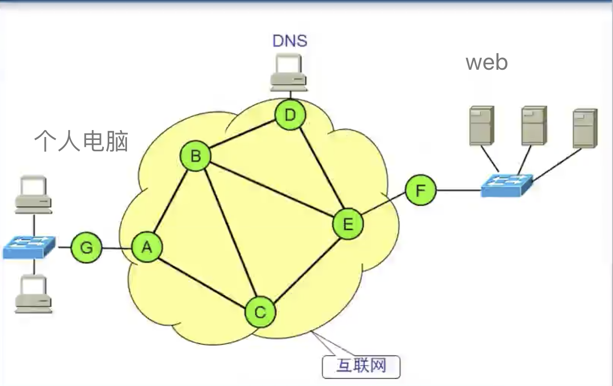

网页的数据是如何到达个人的电脑。

每个计算机网站都有一个地址，是全球统一规划，都是唯一的。

地址

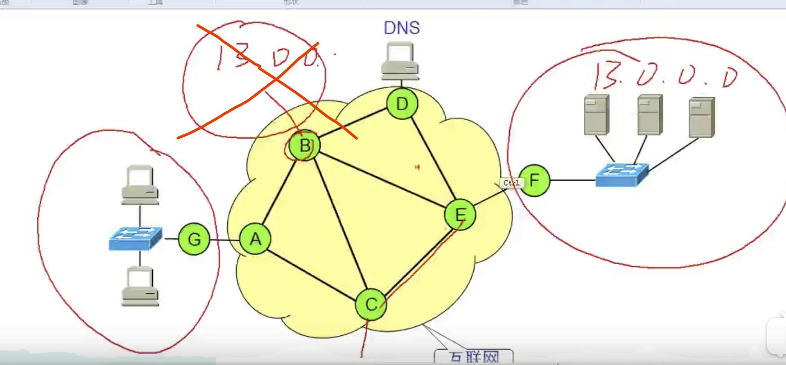

如图，每个计算机网站的网段都不是一样的，如果是一样的那么访问13 网段的时候那就不知道该去访问哪台了。这种全球唯一的地址，也就是公网地址，和电话号码一样。

现在我有一个13.0.0.0 的网段，同时还会有一个子网掩码 255.0.0.0

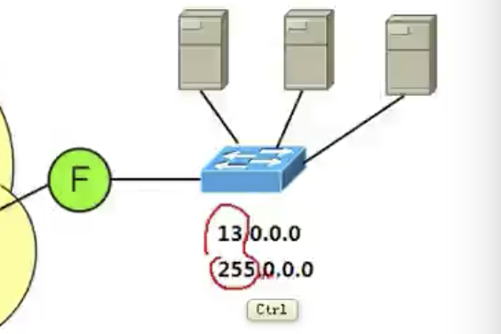

那么这二者之间的什么关系呢？**一个网段它分为网络部分和主机部分**，13.0.0.1， 这里假设13是网络部分，后面的0.0.1 就是主机部分，相当于我们电话号码中的010-5213623， 区号-个人号码一样，而子网掩码的功能就是说明那些事网络部分，那些事主机部分，如上图255.0.0.0， 说嘛13 部分是网络部分，如果子网掩码是 255.255.0.0， 那么13.0 就是网络部分。

现在对网络的地址进行规划，**G F 代表的是路由器，它的地址一般是该网段的第一个地址。**

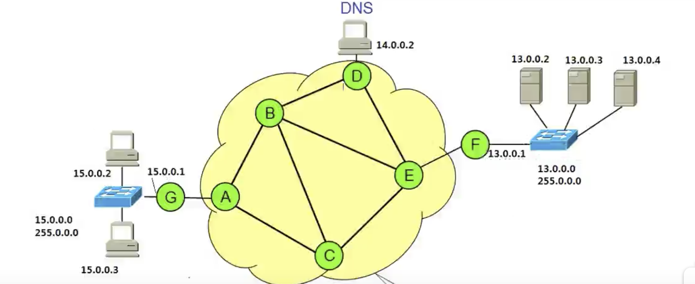

**网关**，所谓网关就是，在一个网段的计算机在往出发送流量的时候，都会发送给路由器，其中路由器的地址就是这个网段中的网关，如上图中的G 和 F。

**MAC地址**：计算机在出厂的时候一台计算机就拥有一个mac 地址，或者说是物理地址。标到上图上就是m1, m2.。。

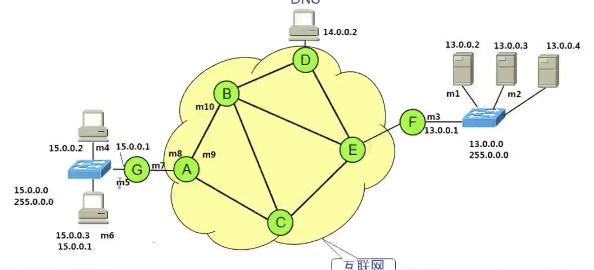

**浏览器如何浏览到网页**

网页中输入 **http://www.91/123/com**, 先会去DNS 出去解析IP，然后将ip地址返回来。

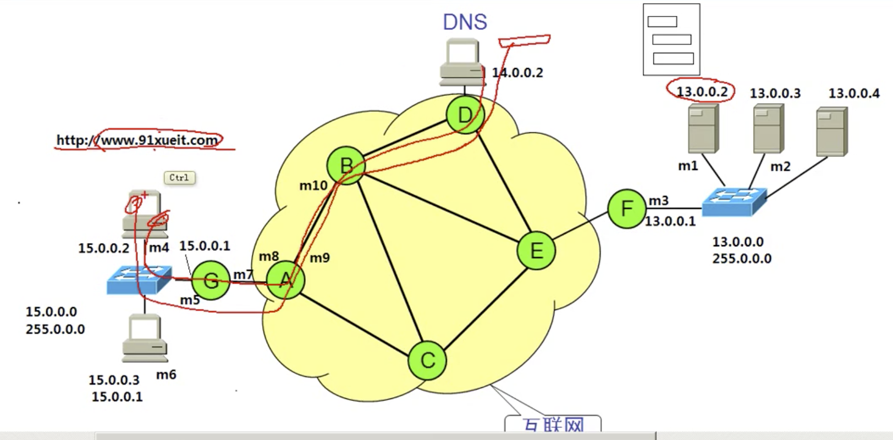

返回继续发送数据包，目标就是上面获取到的ip。

那么在发送数据的时候，需要有数据内容，源地址，目标地址，数据包中需要从计算机中发送带所在的路由器，路由器然后在往出发。在数据包中还需要有当前所在计算机的MAC地址和目标地址的MAC地址，**IP 地址决定数据最终要到哪里去，MAC 地址决定了数据要发到下一台哪台机器，所以在网络上可以追踪到源IP，但是找不到Mac地址。**

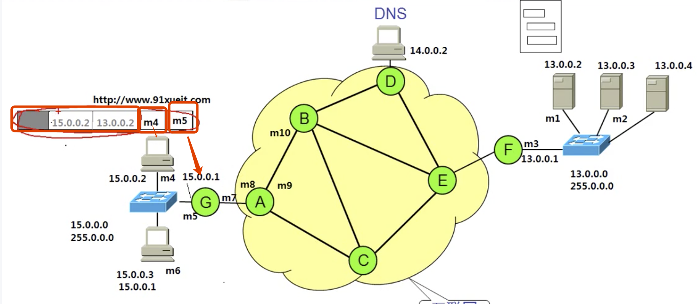

上面红色的内容就称为数数据帧

当前机器的mac地址为m4的机器，将数据发送到mac地址为m5 的机器。然后在从m7机器发送到m8机器，那么这个时候，数据帧中的 m5就变成了m7, m5 就变成了m8

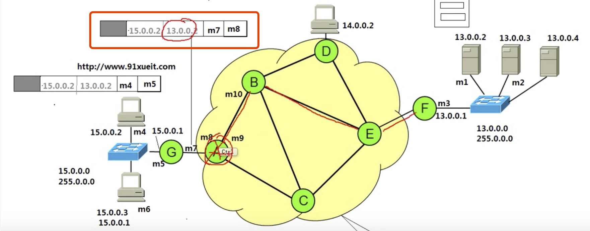

然后继续修改mac地址

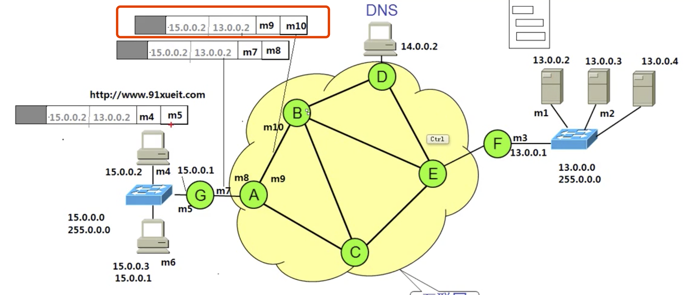

当请求到目标IP 之后，它需要将网页返回到请求客户端。需要将数据切成一个一个小包并加密，发送回去。

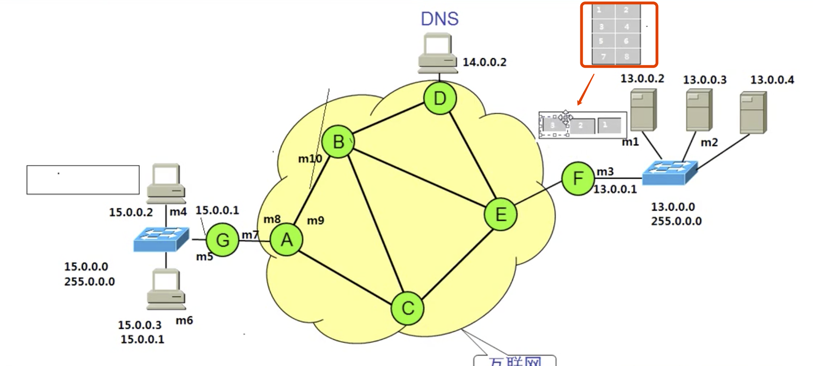

一个一个的包传递，传递的时候和刚才传过来的动作大部分是一样的，不一样的地方如下：

在传递的时候，缓存中还会保留发出去的那个包

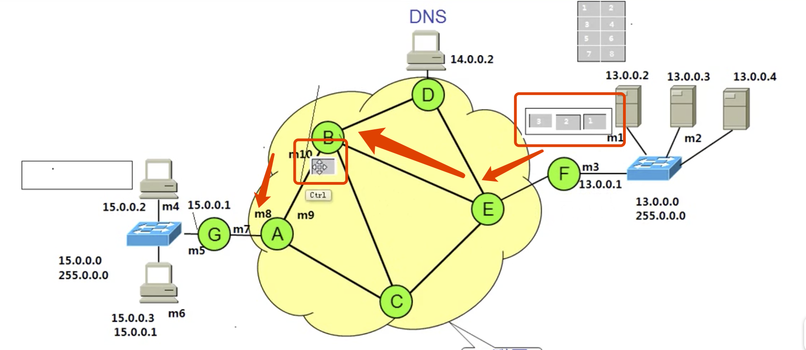

是因为数据包在传送的过程中会丢失，如果丢失那么还需要继续发送。

当一个包发送成功之后，会有反馈回来，“我的包发送好了， 可以发下一个了” 这个时候开始发送下一个。

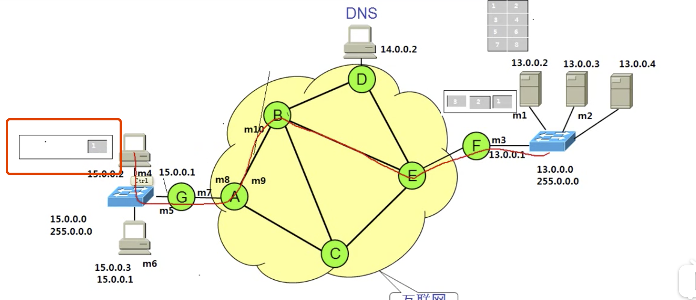

---

**OSI 参考模型**

**应用层**： 所有能产生网络流量的程序，如微信app。 

**表示层**：对应用层产生的数据进行传输的数字进程压缩，加密。

**会话层**：浏览器访问某个网站的时候需要和这个网站建立一个会话，确保二者之间的沟通，如果浏览器打开了多个网站，那么会话层就能保正浏览器和网站A的沟通和网站B的沟通，浏览器就不会讲网站B返回的信息当成为网站A 的信息。通过命令 netstat -n 可以查看会话。

**传输层**：当会话层建立会话沟通之后，那么需要依靠传输层保证可靠传输，浏览控制，不可控传输

**网络层**： 准备传输后，那么久需要在网络上选择一条最佳路径去传输数据，

**数据链路层**： 帧的开始(特殊的0101标书结束)和结束(特殊的0101标记头)， 实现透明传输(中间差插的转义的位会被忽略，及一些差错校验)。只是检查错误。

**物理层**：定义网络设备的接口标准，如水晶头就是8个头等，还有一些电气标准，如何在屋里链路上传输更快的速度。

**分层的好处：**

> 标准化
>
> 分工明细，互不影响
>
> 解决问题的时候按照低到高层的指导原则去排查

> **从物理层开始排查**： 查看网卡（连接）状态
>
> 1. 网线断了，查看发送包到接收到的包之间差不多。水晶头出现问题，计算机线使用2根接收包，2根发送包。
>
> **数据链路层造成的故障**: 
>
> 1. Mac 地址冲突
> 2. 运营商停止服务，也就是欠网费了。
>
> 3. 网速不一致，网卡只能接收100M，但是交换机强制是使用1000M
>
> **网络层故障：** 规划的地址选择路径
>
> 数据包扔到了一个不能达到目标的路径。子网掩码错误，网关错误，路由器配置错误
>
> 应用层故障：设置了错误的代理

---

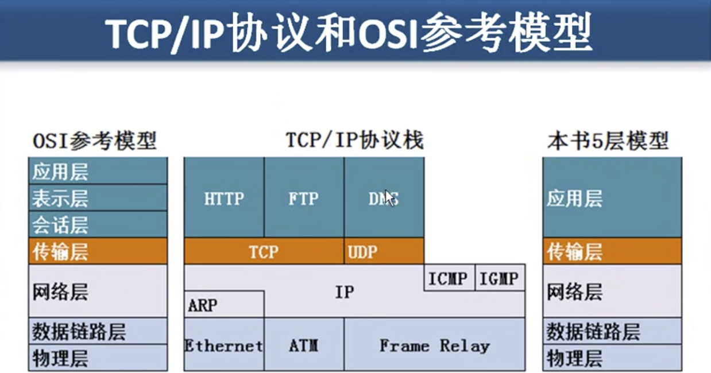

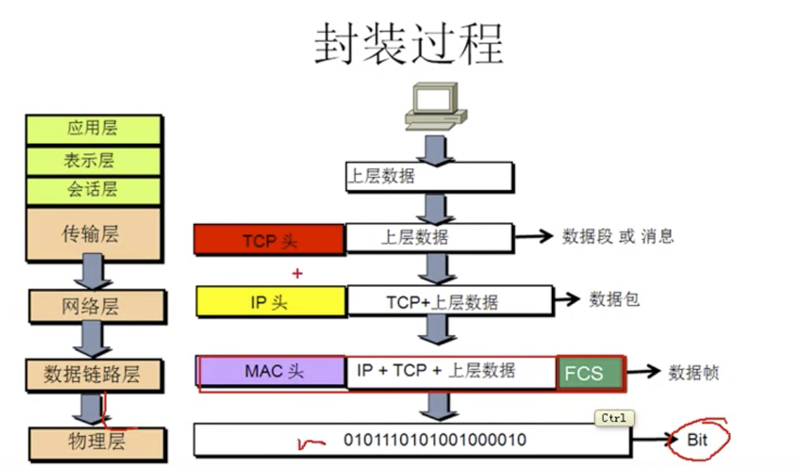

FCS 为校验，校验数据的完整性，好比在快递的包装中写着里面有4件快递。

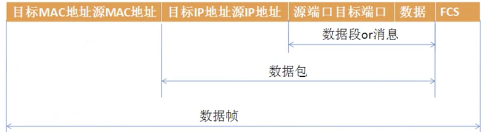

在接收的时候，需要去掉那些没用的数据，好比接收到快递之后扔掉包装盒子

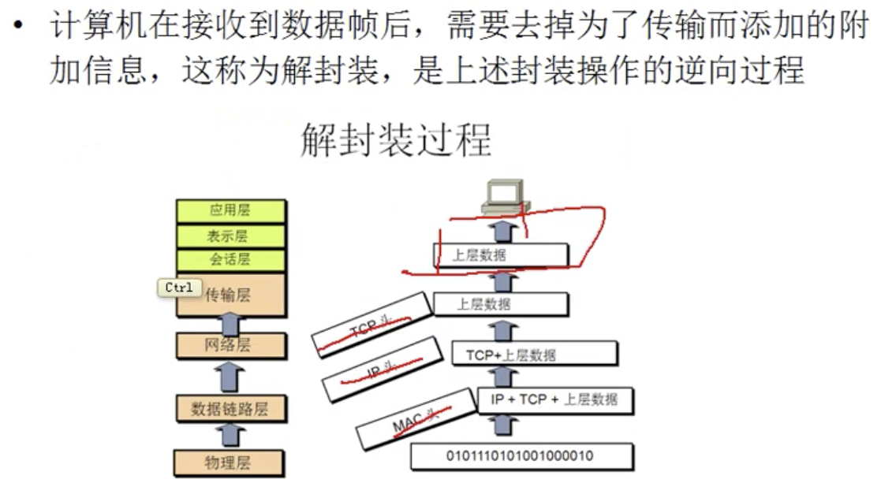

**计算机网络的性能指标：**

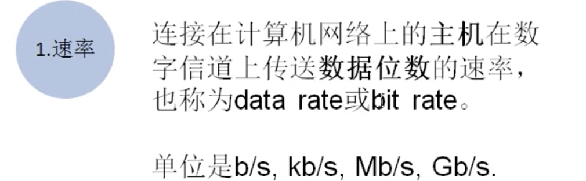

> 01, 就是2个比特，一个位称为是一个比特。一个字节=8比特。

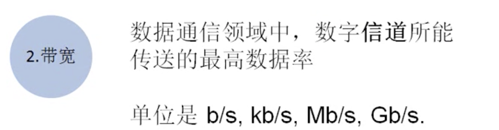

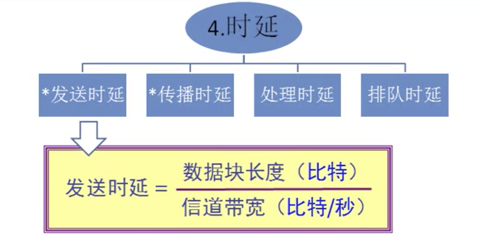

> 发送时延迟：数据从发送口出来的延迟。
>
> 数据完全被接收，才算数据传输结束。
>
> 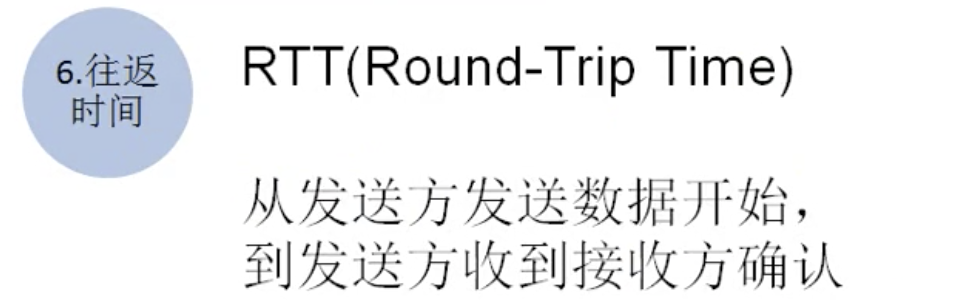

