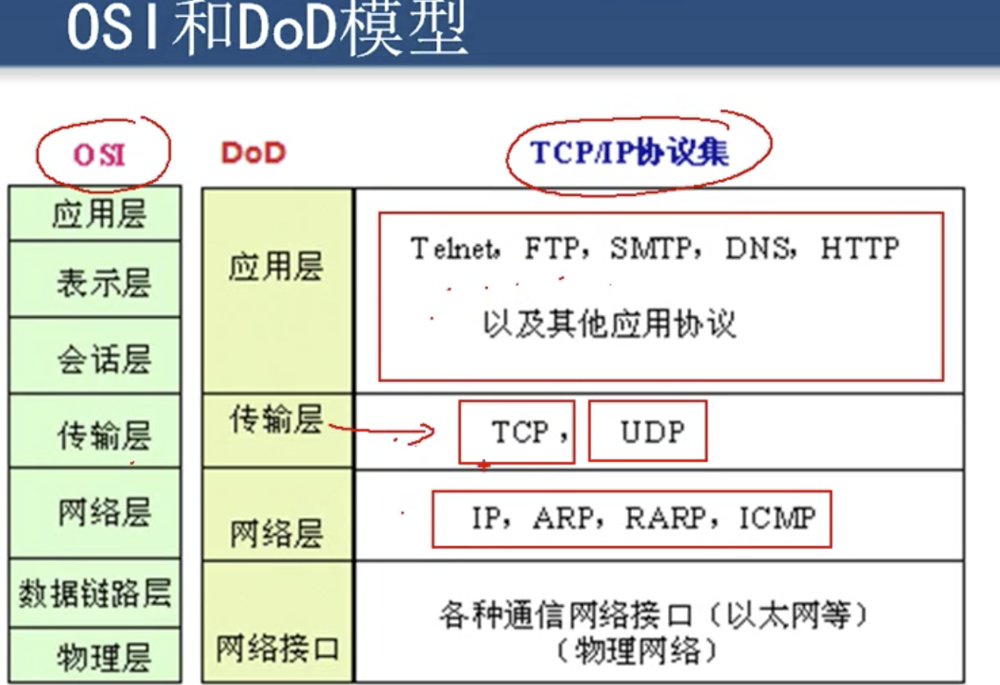

**传输层**

> TCP： transmission Control Protocal  传输控制协议:  需要将要传输的文件分段传输，要建立会话，实现可靠传输，流量控制功能
>
> UDP：User Data Protocol 用户数据包协议：一个数据包就能够完成数据通信，不需要分段，也**不需要建立会话**，也不需要流量控制， **不可靠传输**， 传输失败后，会在发送一个，可能过了一会发现都发不出去，才会报这东西发不出去。

传输层和应用层之间的关系

TCP 或者 UDP 加上一个端口就可以表示到应用层的一个协议

这里看出53是一个特殊端口，TCP 或者 UDP 指向这个端口，都表示指向了DNS 服务，绝大部分使用的都是UDP 协议指向DNS

SMTP: 发送邮件用的，PDP 用于收协议

服务器使用TCP 和 UDP 的端口侦听客户端的请求，客户端使用IP地址定位服务器，只开方TCP 必要的端口(网卡开必要的端口)保证机器的安全，如机器只运行一台web服务，那么久只开启网卡的80端口就OK。

查看服务器上整体的端口

> Netstate -an

查看服务器上建立的会话

> Netstate -a

查看服务器上建立的会话的进程

> Netstate -nb

---

**TCP**

tcp 特点

tcp 如何实现可靠传输

tcp 如何实现流量控制

tcp 如何避免网络拥塞

> TCP 是面向连接的传输协议，传输之前确保网络是通的
>
> 每一条TCP 连接只能有2个端点，每一条tcp 连接只能是点对点的(点 是IP:port  的组合)
>
> tcp 提供可靠交付的服务
>
> tcp 提供全双工通信：同时收和发，在接收的同时，还需要反馈回去哪些包收到了，哪些没收到
>
> 面向字节流传输

传输层实现可靠传输：停止等待确认，发送出去之后，没有确认返回，不会继续发送

当出差错无法确认返回之后，发送方会任务之前发出去的包没有被收到，然后重发

如果重复接收，那么需要确认丢失重复报。

缺点，信道利用率低，需要前一个包收到并接收到确认返回才发第二个包

解决方法就是连续发送

还有一种机制是**累计确认**，也就是当收到第三个包的时候回发送依次确认返回，前面2个就不会发生确认返回。

确认号，表示返回给发送者下一次该发第多少个字节了。

窗口：每次发送多少个累计之后才返回确认

---

对称加密: 加密秘钥和解密秘钥是同一个

