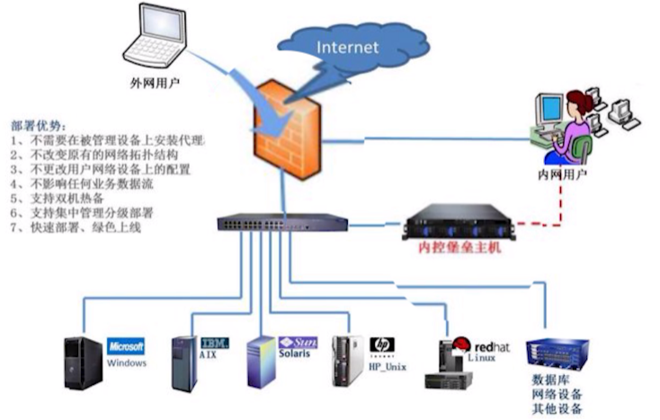

#### 防火墙和堡垒机区别

* 防御对象不同

  > 防火墙是私有网络和公网直接的门卫。
  >
  > 堡垒机是内部运维人员和私网之间的门卫
  >
  > 

* 防御作用不同

  > 防火墙所起的作用是隔断，无论谁都过不去，是对访问链接做控制
  >
  > 堡垒机其职能是检查和判断是否可以通过，只要符合条件都可以通过，是一种强化的可以主动防御进攻的系统，是一个设备管理

#### 防火墙

需要的预备知识

* TCP/IP 协议栈架构
* TCP 三次握手及其状态变化
* TCP 端口概念
* IP 数据包格式以及路由原理

