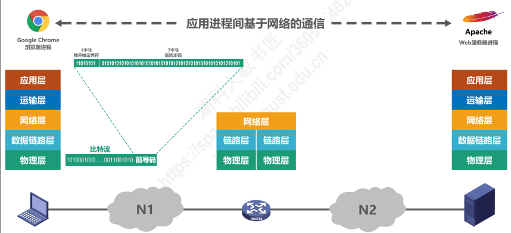
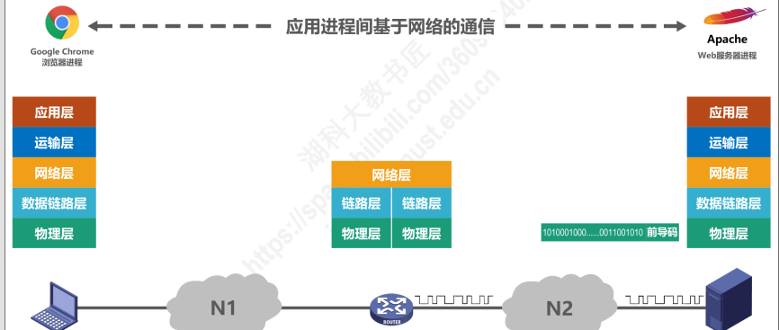
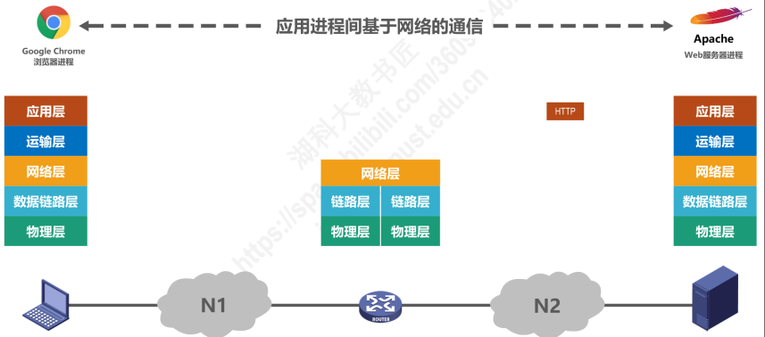

### 基础概念

#### 网络

若干节点和链接这些节点的组成。

#### 互联网

多个网络通过路由器连接起来，也就是*网络的网络*， 一个覆盖更大的网络

#### 因特网

世界上最大的互联网络。

#### 因特网服务提供者ISP(Internet Service Proviser)

`isp` 向因特网管理机构申请成块的 `IP` 地址，同时拥有通信线路，通过 `ISP` 就可以连入网络。

我国的三大网络提供商电信，移动，联通。

#### ISP 的三层结构

根据提供服务的覆盖面积的大小以及所拥有的ip地址的不同，ISP分为三层

* 服务面积最大国际性区域：主干网，覆盖国际性链路
* 是第一层的用户，区域性/国家性区域，连入到第一层网络
* 本地ISP，是第二次的用户，校园网/无线移动用户/企业网等

所以在请求国际服务器的时候，需要经过多层ISP请求，所以会慢很多。

#### 组成

边缘部分

1. 所有连接在因特网上的 `主机`组成，可以是电脑，平板，手机，摄像头等设备，这部分是用户直接使用的，用来进行通信和资源共享

核心部分

1. 大型网络和链接这些玩两个的路由器组成，这部分是为边缘部分提供服务的，提供连通性和交换

#### 三种交换方式

1. 电路交换

   电话交换机

   1. 建立链接：分配通信资源，2. 通话: 一直占用资源， 3. 释放链接：归还通信资源

      使用电路交换传送计算机数据时候，线路的效率很低。例如在用户编辑+发送一份数据的时候，会一直占着通信资源，其他人均是不可使用的，例如编辑的时间10分钟，然后话10秒发送，那么前前后后会占用10分10秒的的通信资源。
2. 分组交换

   发送方，

   路由器：缓存分组/转发分组

   接收方

   将内容一段一段的通过路由器发送，内容中包含着目的地，所以需要先建立链接

   避免报文长时间占用链路
3. 报文交换

   现在基本没有了，直接发送到下个节点，不需要先建立链接，交换机上需要存储转发，不限制报文大小，需要交换机有较大的缓存大小。

   

灵活性查: 先建立链接，建立链接时间比较长，紧急时间下比较不好控制

难以规格化：数据直达，不同类型报文，不同速率，不同的终端难相互进行通信，以及控制

---

### 计算机网络的定义和分类

### 计算机体系结构

#### OSI 体系结构 & TCP/IP & 教学结构

IP 和 TCP 协议是整个体系中最重要的协议。

#### 分层的必要性

将庞大二复杂的问题，转化为若干个局部较小问题，这些局部较小问题易于研究和处理。

**计算机网络中面临的主要问题，以及如何划分到不同的层**

物理层：完成传输

1. 使用什么传输媒体
2. 采用怎么样的物理接口
3. 使用怎么样的信号表示

仅仅物理层可以完成2台直连机器直接数据的传输。

当多台主机的时候，多台主机通过总线网络链接

数据链路层：一个网络中机器数据传递

1. 如何标识主机，主机标识问题(使用MAC 地址可标识)
2. 如何信号从一连串比特流中区分出地址和数据
3. 如何协调主机争用总线(总线模式已经淘汰，现在使用路由器)

当多个由路由器连接的网络的时候，物理链路层就不可以完成传输了。

网络层：

多个网络的时候，还需要对每个网络，以及网络中的机器进行标识

1. 标识网络个的各个主机：网络和主机编制问题，IP地址
2. 源主机和目的主机可以有不同的路径：路由器如何转发分组，如何进行路由选择

当一个机器上运行这多个应用，那么一个数据包应该是发送给哪个应用接受呢？

运输层：

1. 如何解决进程之间基于网络的通信问题
2. 出现传输错误时候，如何处理

应用层：进程建交互来完成特定的网络应用

以上细节完成每层不同的任务，以及解决问题

#### 分层举例

应用层将传输信息封装为HTTP请求体

应用层将数据传到运输层加入TCP信息

数据到达网络层，将IP信息加入到传输数据头

到达数据链路层，将报文包装为帧

到达物理层，将报文转化为可传输的电信号

到达路由器，路由器是一个3层设备，依次完成

物理层接收到点信号

电信号，转化为数据链路层帧

网络层从帧中解读出带有TCP/IP 信息的数据包

网络层中，在路由表中找到发送目的IP

接下来完成的步骤和之前一样，封装帧，转化为可传输的电信号，然后到达目的地之后，依次解包

