### 数据链路层概述

链路：从一个节点到相邻节点的一段物理线路。

数据链路：链路 + 实现通信协议的硬件

帧：数据链路上以帧为单位进行传输和处理

#### 三个重要问题

##### 封装成帧

对运输层交付的数据单元加上帧头和帧尾。

##### 差错检测

帧在传输过程中可能会出现误码，差错检测用于检测传输过程中是否发送误码。

如上图中在传输前的帧尾部分有FCS检错吗，然后再传输到目的地之后，接收方在根据检测算法从数据单元中计算出检测码，对比计算出的检测码和帧尾部分的FCS码值是否一样，如果一样，那就表示没有发送误码。

##### 可靠传输

当差错检测检测出在传输过程中发生了误码。

如果是不可靠传输，那么该数据单元就会被丢失，不会有其他措施。

如果是可靠传输，那么久会有其他措施，例如说通知发送方重新发送，直到发送的数据在传输中没有发送误码。

可靠传输：就是发送方发送什么，接受方就能接受什么。

---

#### 封装成帧

给上次交付的协议数据单元添加帧头和帧尾，使之成为帧

帧定界：接受方的数据链路层如何从物理层交付的比特流中提取一个个帧。

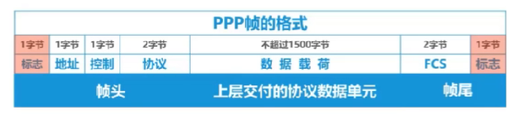

还有一种前导码和帧间间隔方式去区分一个帧

#### 差错检测

FCS检测码，检测在传输过程中是否产生误码。

##### 奇偶检验

FCS检测码是1位奇偶检验位，表示整个数据中的''1'' 的个数位奇/偶数个。

存在问题：如果在传输过程中产生了**2位置的误码**，那么FCS检测码的值是不会发生变化的。

##### 循环冗余检验CRC

收发双方约定好一个生成多项式

发送方基于带发送的数据和生成多项式计算出差错检测码，将其添加到待传输的数据后面的一起传输

接受双方通过接受多项式来计算收到的数据是否产生了误码。

检错码只能检测出在帧传输过程中出现的差错，并不能定位错误，所以无法**纠正错误**

如果想要纠正传输中的差错，可以使用冗余信息更多的纠错码进行前向纠错，但是纠错码的开销就会比较大**在计算机中较少的使用**

该种方式虽然比较复杂，但是易于使用硬件实现，所以使用广泛。

#### 可靠传输

使用差错检测检测出了帧在传输中发送了误码(比特错误)。

可靠传输是相对于数据链路层的上层，网络层而言。

##### 可靠传输

实现发送端发送什么，接收端就可以接受到什么

##### 不可靠传输

将发送过程中出现误码的帧，直接丢弃，然后其他什么都不做。

一般而言有线传输收到的干扰会比较少，可以使用不可靠服务传输，

而对于无线传输，传输过程中收到的干扰会比较多，所以要求向上层提供可靠传输服务。

传输差错还包括

* 分组丢失
* 分组失序
* 分组重复

##### 实现可靠传输的机制

###### 停止等待协议

发送方发送一个数据之后，需要接受方返回一个 `ACK` 的反馈，表示数据已经被收到了，然后发送方才可以将数据从发送方缓存中删除。

如果接受方检测之后发现收到的是一个误码的帧，然后就会给发送方发送一个 `NAK` 的反馈，表示发生了误码，然后发送方需要将数据重新发送。

发送方每发送一个数据之后，就需要等待接受接受方的反馈，然后才能发送下一个，第一个图

还有一个问题是，如果接收方返回的反馈信号，发送方也接受不到，这个时候就需要有一个超时计时器，如果超时计时器设置的重传时间内没有收到返回，发送方就会对上一个数据进行重写发送。第二个图

但是这由又会出现另外一个问题，就是成功接受数据后，返回的 `ACK` 没有传回去，那么发送方就会重新发送，导致接受方数据重复。

为了解决这个问题，会在每个数据帧上带上序号，如果发现后面来的帧中带的序号，之前的帧中已经有了，那么会将后面来的帧丢失掉。第三个图

同时还需要对返回回来的信号进行序号，不然会对上个信号的确认返回，接收方会认为是当前数据发送的确认反馈。第四个图

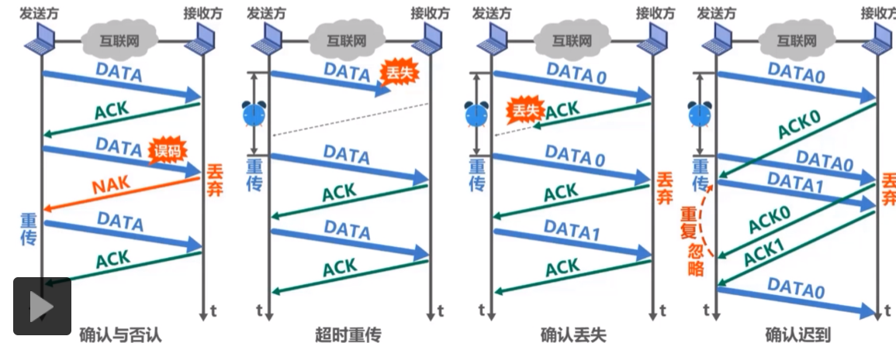

上面也可以看出，停止-等待协议是非常低效的，因为要等待反馈，然后才能继续下发下一个数据帧。信道的利用率比较低。

###### 选择重传协议

停止-等待协议的基础上，流水线式的发送，在等待返回的时间内，继续发送

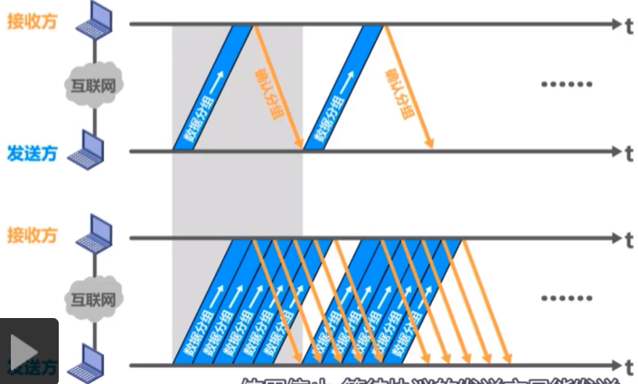

先对比特进行编码，例如使用3个比特分组进行编码，0-7，0-7以此重复编码，包括接受方也是一样。发送窗口也是有一定限制的，然后再窗口内的数据是可以依次发送

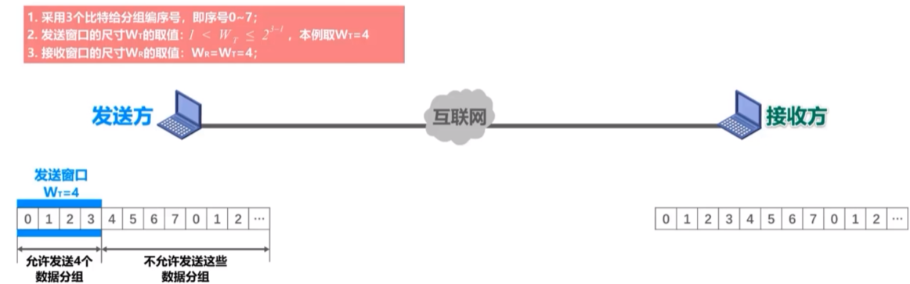

限制将4个数据依次连续发送出去。

然后在接受方进行接受，但是在传输过程中2号数据丢失了。

接受方开始接受数据，然后每接受一个数据，会给发送方进行一个确认反馈，在接受窗口也会往前滑动，

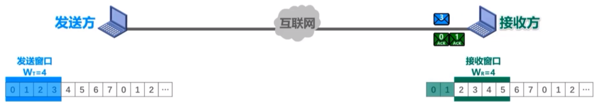

继续接受数据

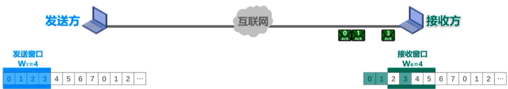

这个时候接受方的窗口是不能往前滑动的，因为接受到的3号数据是未按照顺序接受到的。确认信号返回给发送方，发送方收到一个确认分组，窗口向前移动一个

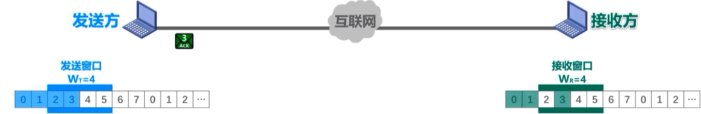

这样4和5号数据就落入到新的窗口。已经发送的0号和2号数据就可以从发送方的缓存中删除，接受方接受到的0号和1号数据也可以交付给上次的服务处理

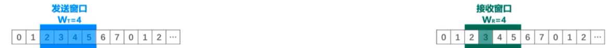

发送方可以继续发送4号和5号数据，然后发送方的窗口是不能向前滑动的。并且将接受到的3号确认返回做标记，防止3号数据重新发送。接受方也可以继续接受4和5号数据，以及反馈4号和5号数据，

次数接受和发送方的窗口都是不能移动的。

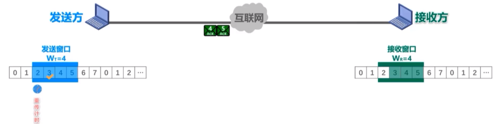

2号位置的重传计时器已经到时，发现其还没有接受到确认返回，就会触发重发

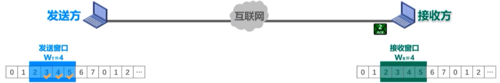

以及接收方返回确认反馈。接受窗口就可以往前移动4个位置，发送方接受到2号位置的正确反馈，其窗口也可以往前移动4个位置

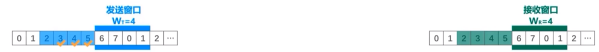

#### 点对点协议 PPP

Point-to-point 协议，是目前使用最广泛的点对点数据链路层协议。 是用户和ISP网络服务提供商链接的协议

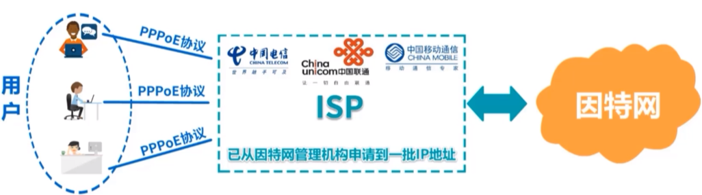

在点对点链路传输各种协议的数据包提供一种标准方法，包括一下部分构成：

1. 对各种协议数据包的封装方法-封装成帧
2. 链路控制协议LCP- 用于建立，配置以及测试数据链路的链接
3. 一套网络控制协议NCPs(有多个协议组成的)- 其中每一个协议支持不同的网络层协议，例如支持TCP/IP 中的IP，以及苹果公司的AppleTalk协议

###### 帧格式

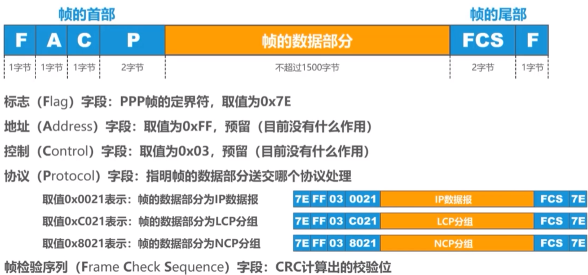

###### 媒体接入控制的相关概念

媒体介入控制：Medium Access Control

如下图：当主机C和主机D同时往共享媒体数据的时候，就会发生碰撞，其他的主机该是接受C还是接受D呢？每次介入控制就是做这个事情

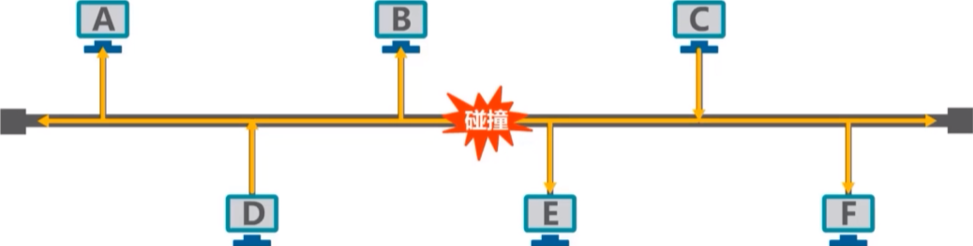

###### 静态划分信道-信道复用

###### 动态介入控制-随机接入

多个主机链接到一条总线上，各主机随机发送数据，当多个主机同时发送帧的时候就会发生碰撞。

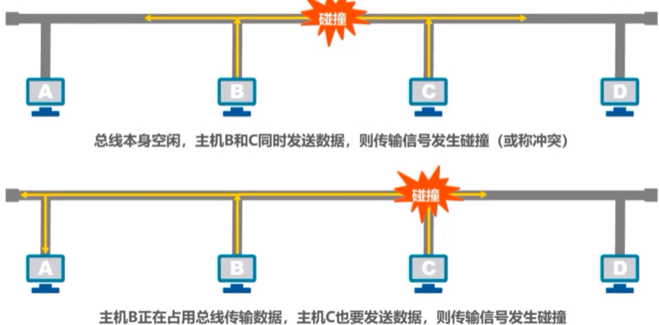

早期使用载波监听多址介入/碰撞检测CSMA/CD(Carrier Sense Multiple Access/Collision Detection)

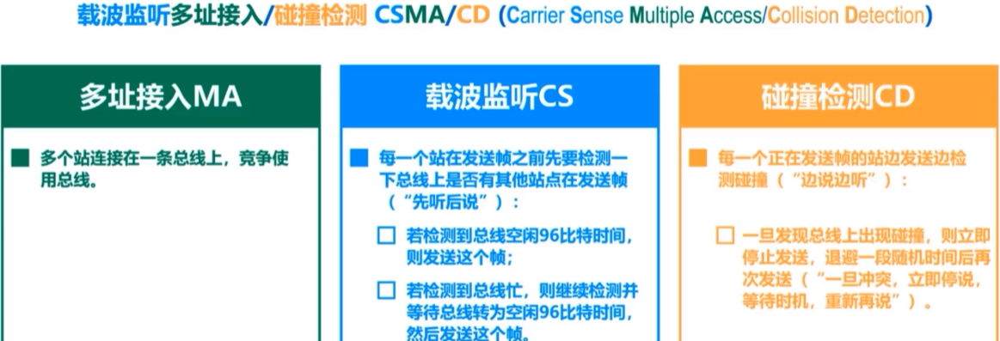

96比特时间：发送96比特帧使用的时间，也成为最小间隔时间

###### 多址接入

多个主机连接到一个总线上。各主机随机发送帧

###### 载波监听

如果主机C要发送帧，那么需要先监听总线上有空闲36bit空闲时间后。就可以发送帧。

###### 碰撞检测

假如这个时候B主机也要发送，那么就先检测是否有96bit空闲时间(持续检测))，如果没有那么继续发送。检测出了由空闲时间，那么久发送帧，如果在还没有发送结束的时候，突然检测到没有96bit时间了，那么就暂停发送，直到再次检测到有96bit空闲时间。

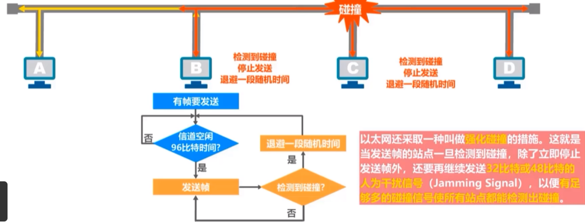

#### MAC /IP/ARP 地址

两台主机使用点对点信道的就不需要使用地址。

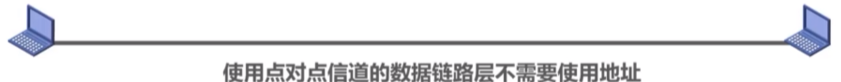

使用一个总线-广播信道上将多台电脑链接起来，要实现两个主机之间的通信，则每个主机都必须要有一个唯一的标识，即一个数据链路层的地址。

在每个主机发送的帧中必须携带标识发送主机和接受主机的地址，由于这类地址是由于媒体介入控制MAC(Media Access Control)， 所以这类地址称为MAC 地址。MAC 地址一般被固话到网卡(网络适配器)中，**MAC地址也成为是硬件地址或者物理地址**

IP地址属于网络层的内容。

是因特网上主机和路由器使用的地址，用于标识两部分信息，如IP 192.168.58.100

* 网络编号：标识因特网数以百万计的网络，如 `192.168.58`
* 主机编号：同一个网络上不同的主机，或者路由器接口，如 `100`

ARP: 地址解析协议：通过IP地址找到MAC地址

每台机器都会有一张ARP高速缓存表，在B主机向C主机发送帧的时候，需要在帧中封装C主机的MAC地址，但此时发现在B的本地ARP缓存表中没有其信息，于是B主机需要以广播方式发送ARP请求报文，

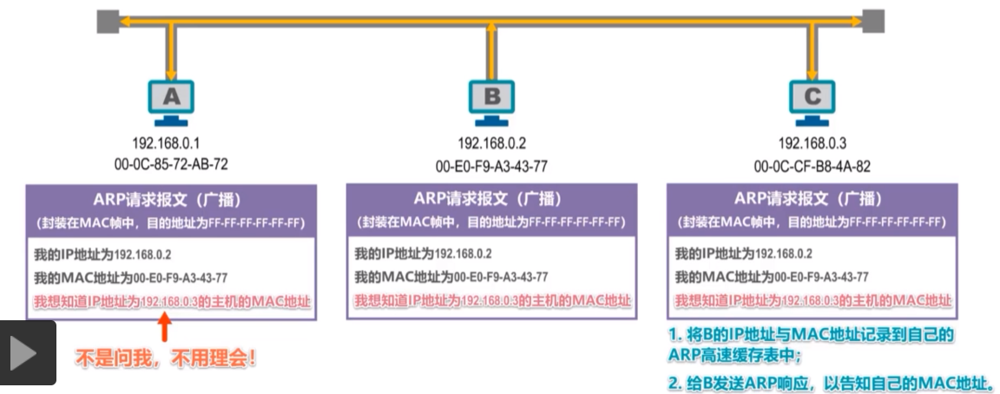

然后C主机响应ARP

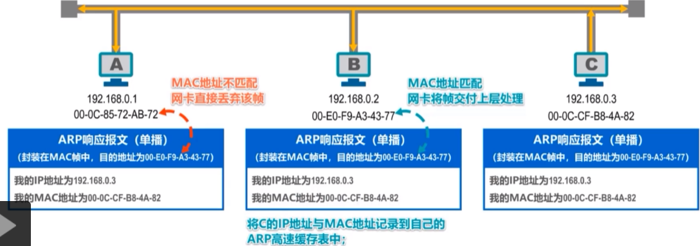

最后将响应的C主机的MAC地址缓存在自己的MAC缓存表中。

#### 集线器和交换机

集线器工作在物理层，每个接口仅仅简单的转发比特，不进行碰撞检测(由各占的网卡检测)

集线器一般有少量的容错能力和网络管理功能

交换机通常会有多个接口，每个接口都可以直接和一台主机或者另外一个以太网交换机链接，一般都是工作在全双工方式。

工作在数据链路层

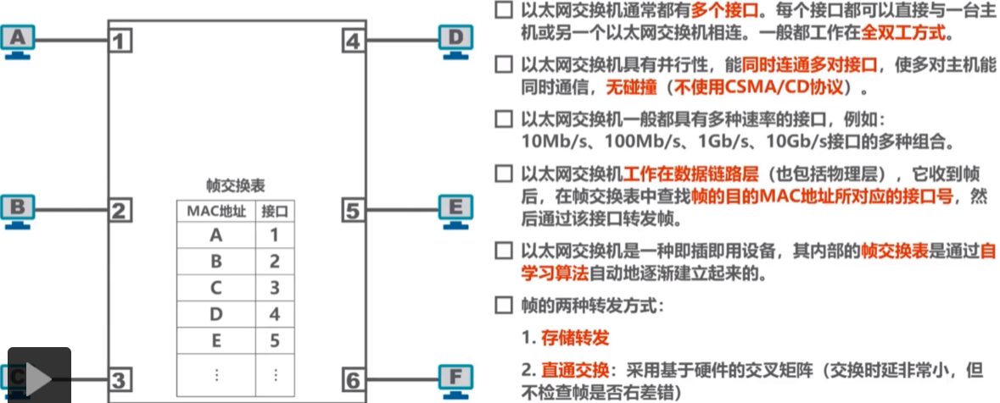

集线器和交换机的区别

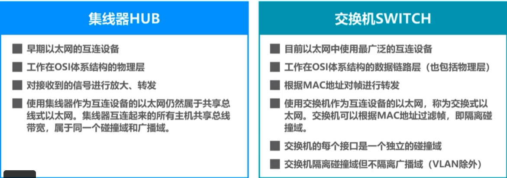
