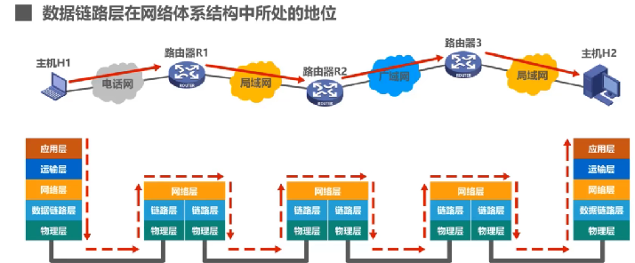
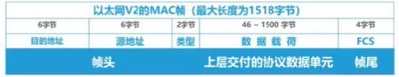

### 数据链路层概述

链路：从一个节点到相邻节点的一段物理线路。

数据链路：链路 + 实现通信协议的硬件

帧：数据链路上以帧为单位进行传输和处理

#### 三个重要问题

##### 封装成帧

对运输层交付的数据单元加上帧头和帧尾。

##### 差错检测

帧在传输过程中可能会出现误码，差错检测用于检测传输过程中是否发送误码。

如上图中在传输前的帧尾部分有FCS检错吗，然后再传输到目的地之后，接收方在根据检测算法从数据单元中计算出检测码，对比计算出的检测码和帧尾部分的FCS码值是否一样，如果一样，那就表示没有发送误码。

##### 可靠传输

当差错检测检测出在传输过程中发生了误码。

如果是不可靠传输，那么该数据单元就会被丢失，不会有其他措施。

如果是可靠传输，那么久会有其他措施，例如说通知发送方重新发送，直到发送的数据在传输中没有发送误码。

可靠传输：就是发送方发送什么，接受方就能接受什么。

---

#### 封装成帧

给上次交付的协议数据单元添加帧头和帧尾，使之成为帧

帧定界：接受方的数据链路层如何从物理层交付的比特流中提取一个个帧。
