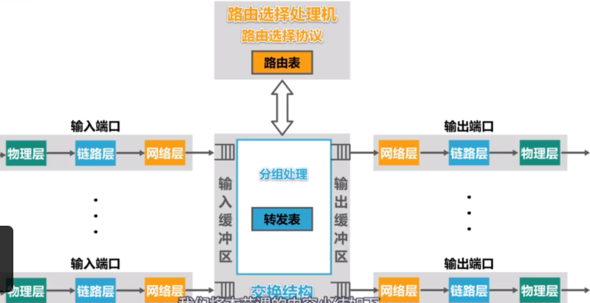
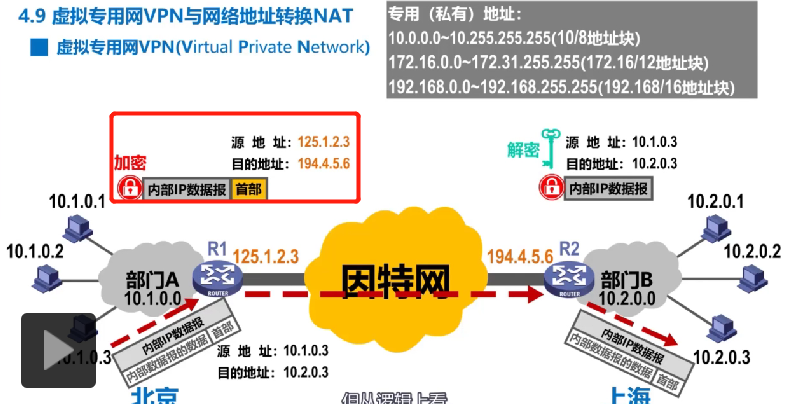
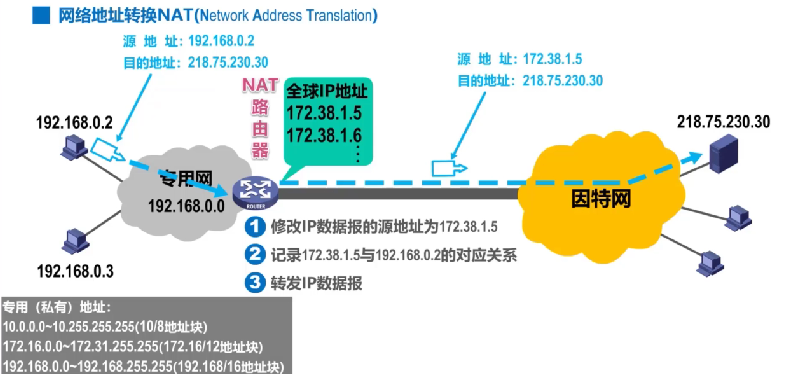
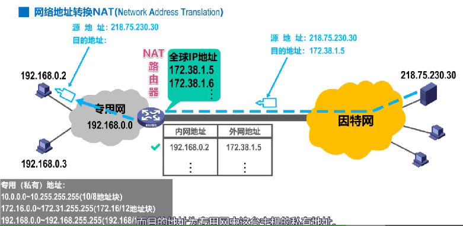

#### 概述

每个网络，如果只是自己内部每台主机之间的通信，那么使用数据链路层+物理层就可以通信。但是如果还需要实现多个网络(异构网络)之间的通信。

网络层的主要任务是事先网络互联，进而事先数据包在各网络之间的传输。

网络层需要解决一下问题

* 网络层向运输车提供怎样的服务，可靠/不可靠服务
* 网络层寻址问题
* 路由选择问题，源地址向目的地址发送报文，多个路径如何选择。

#### 网络层提供的两种服务

##### 面向连接的虚电路服务

##### 无连接的虚电路服务

* 不可靠通信由用户主机来保证
* 不需要建立网络层连接
* 每个分组可以走不同的路径
* 这种通信的方式传输分组可能会误码，丢失，重复和失序
* 网络本身不提供端到端的可靠传输服务，这使得网络中的路由器可以做的笔记简单

#### IPv4 地址

`IPv4` 地址就是给因特网上给每台主机(路由器)分配一个在全世界范围内是唯一的32比特的标识符，目前 `IPv4`已经分配完毕，现在全面开发商用部署 `IPv6.`

##### 点分十进制表示方法

##### 分类编制

##### 子网掩码

32位比特的子网掩码可以表明分类IP地址的主机好部分被借用了几个比特作为网号。

使用连续的1来对应网络号和子网号

使用连续的0表示主机号

2个子网分别是 `218.75.230.1` 和 `218.75.230.0`，然后在网段 `218.75.230.1` 和 `218.75.230.0 又可分别`分陪出126个主机IP。

##### 无分类编制的IPv4

消除了A、B,C 类地址，以及划分子网的概念.

##### 定长子网掩码应用规划

##### 变长子网掩码应用规划

#### IP 数据是如何转发的

回答一下几个问题

* 源主机如何识别目的主机是否在同一个网络中
* 不同网络中的主机是如何通信的

##### 如何识别是否在同一个网络中

因为同一个网络中发送数据的时候，是不需要进行转发的。所以在发送的时候会先去发送是否在同一个网络中

主机C需要发送数据到主机F主机。

只需要将主机C和自己的子网掩码进行计算，是否和主机F的IP和F 的子网掩码计算结果是否相同，如果相同则是在同一个网络中

##### 跨网络主机如何知道将包发给那个路由器转发呢

网络A如何需要和网络之外的其他网络，例如B，进行通信，那么就需要给网络A指定路由器，该路由器进行转发，所以在发送数据的时候，主机能找到该网络的路由器就可以将数据转发出去。该指定的路由器也成为是默认网关。

当A主机将报文发送到路由器R的时候，R从报文中可以知道源地址和目的地址的IP，然后通过该IP，从自己的路由表中查找，查找目的地址的默认网关(通过子网掩码可以计算得到)，是否在路由器上直连，直连，然后将数据包进行发送。

**路由器会隔离广播数据包的。 也就是广播数据包只能在同一个数据包中进行广播，路由器不会将广播数据包转发**

#### 路由选择协议

* 静态路由选择
  人工配置的网络路由，默认路由，特定主机路由
  简单，开销小，不能适用网络状态(流量、拓扑)的变化，小规模网络中使用
* 动态路由选择路由器通过选择协议自动获取路由信息
  较好的适用网络状态的变化，大规模网络中使用

##### 路由器的基本结构

多个输入输出端口的计算机，其任务是转发分组，整个路由器可以分为2大部分

* 路由选择部分
  路由选择处理机，根据选择使用的路由选择协议，周期性和其他路由器交互信息，更新路由表
* 分组转发部分
  * 交换结构
  * 一组输入端口
  * 一组输出端口

信号从物理层进入比特流，到达链路层解析出帧，去掉帧头和帧尾，送到网络层，

如果数据包分组是普通待转发的数据分组，则根据分组首部中的目的地址，进行查表转发，若找不到转发条码，则丢弃分组，否则按照匹配条码中的指定的转发端口，进行转发，然后到达另外一个输出端口，链路层封装帧，物理层比特流发送电信号。

如果信息是路由器直接的交换信息的路由报文，**则把路由分组转发到路由选择处理机**，更具内容更新路由表

#### IP四数据报的首部格式

#### 虚拟专用网VPN 和 网络地址转化NAT

VPN(virtual private network)

利用公用的因特网作为本机构各专用网络之间的通信载体，用于IPv4 地址的短缺，一个机构能够申请到的IPv4地址数量往往远小于本机构所拥有的主机数量，所以虚拟网络中的个主机所分配的地址应该是本机构可以自由分配的专用地址，**而不是需要申请的在因特网上使用的共有地址。**

这样分配的地址只能在内部使用的私有地址，不能和因特网上的主机通信(只可使用为本地地址，而不能用作全球地址)，且这些私有地址的分配均是由国际协议规定的，在因特网上的路由器，对因特网上 的虽有私有地址均是不进行转发的。

然后对于私有网段，需要有一个具有全球唯一的IP地址的路由器，该路由器专门只对于私有网段的转发。路由器是可以接入全球的因特网的，从而使得私有网段中的主机可以通过因特网进行通信。

在发送数据的时候，在数据包到达路由器的时候，会对内部的数据包进行加密，然后将加密后的数据进行封装，添加上目的地路由器IP(可连入互联网的)，然后发送到目的地路由器，然后将内部数据包进行解密，解密的报文中包含着内部地址IP，然后将数据报文发送到目的地。

俩个专用网之间发送数据，是通过公网发送，但是在效果上，好像就是本机构的专用网上进行的传送。

#### NAT

网络地址转换，Network Address Translation

用户缓解IPv4地址空间的耗尽的问题。

**NAT 使用大量内部专用地址的专用网络用户共享少量全球地址来访问英特网上的主机和资源**

装有 NAT 软件的路由器，它至少有一个可以访问因特网的IP，所有使用私有地址的主机，在访问外网的时候，都需要通过NAT 软件将私有地址转化为全球IP 地址。

如下图：

192.168.0.0 是私有网段。172.38.1.x 是全球IP 地址。

发送

返回

交互不能由外网发起访问私有主机，所以不能有私有主机作为服务器。
