#### 概述

每个网络，如果只是自己内部每台主机之间的通信，那么使用数据链路层+物理层就可以通信。但是如果还需要实现多个网络(异构网络)之间的通信。

网络层的主要任务是事先网络互联，进而事先数据包在各网络之间的传输。

网络层需要解决一下问题

* 网络层向运输车提供怎样的服务，可靠/不可靠服务
* 网络层寻址问题
* 路由选择问题，源地址向目的地址发送报文，多个路径如何选择。

#### 网络层提供的两种服务

##### 面向连接的虚电路服务

##### 无连接的虚电路服务

* 不可靠通信由用户主机来保证
* 不需要建立网络层连接
* 每个分组可以走不同的路径
* 这种通信的方式传输分组可能会误码，丢失，重复和失序
* 网络本身不提供端到端的可靠传输服务，这使得网络中的路由器可以做的笔记简单

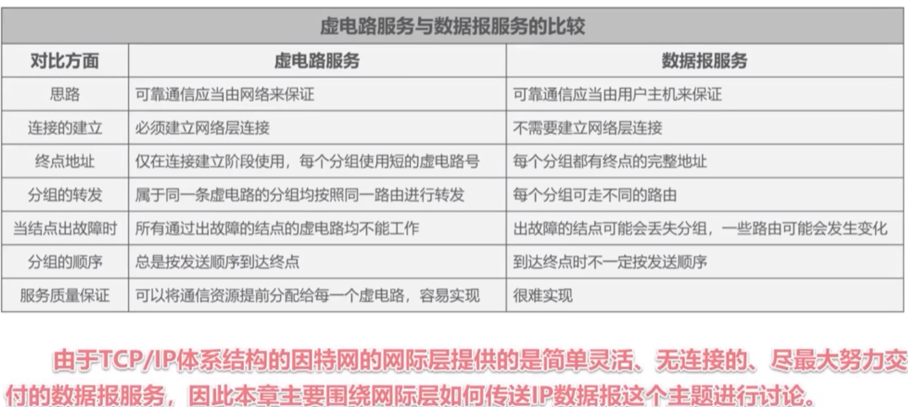

#### IPv4 地址

`IPv4` 地址就是给因特网上给每台主机(路由器)分配一个在全世界范围内是唯一的32比特的标识符，目前 `IPv4`已经分配完毕，现在全面开发商用部署 `IPv6.`

##### 点分十进制表示方法

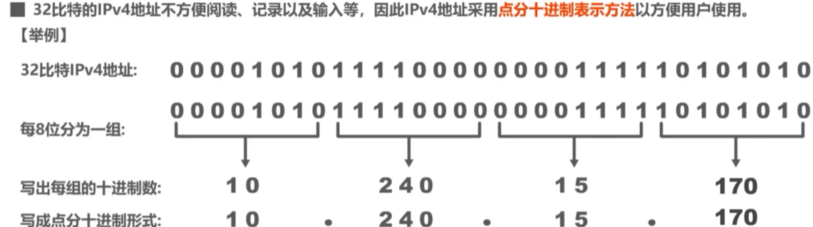

##### 分类编制

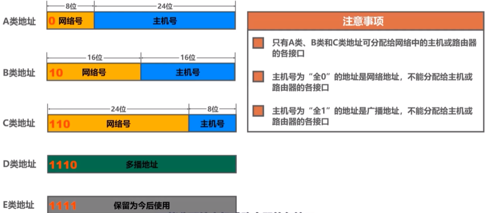

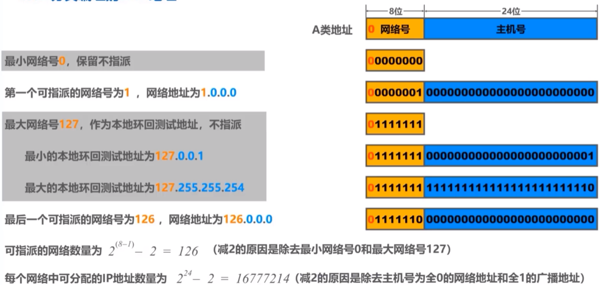

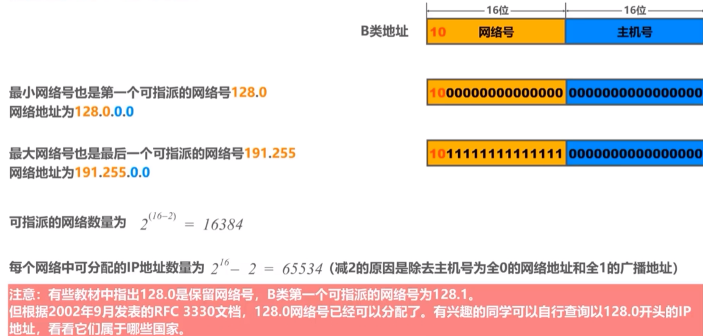

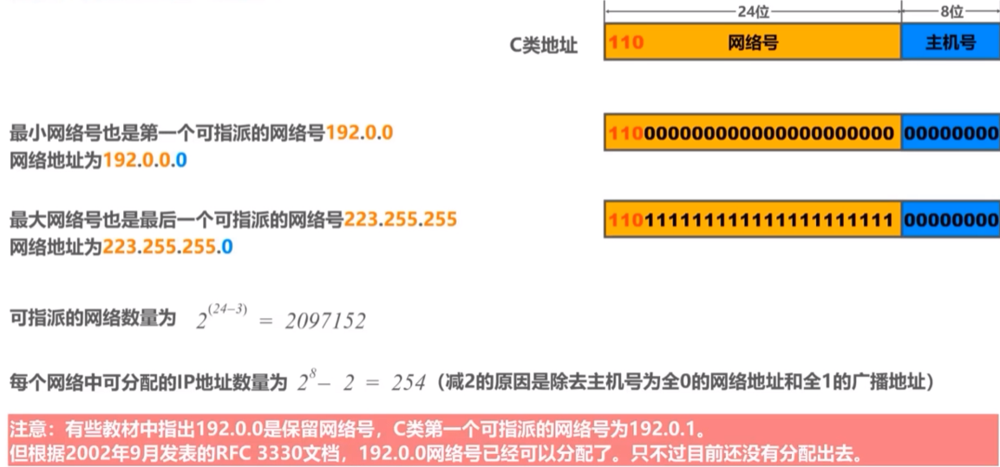

##### 子网掩码

32位比特的子网掩码可以表明分类IP地址的主机好部分被借用了几个比特作为网号。

使用连续的1来对应网络号和子网号

使用连续的0表示主机号

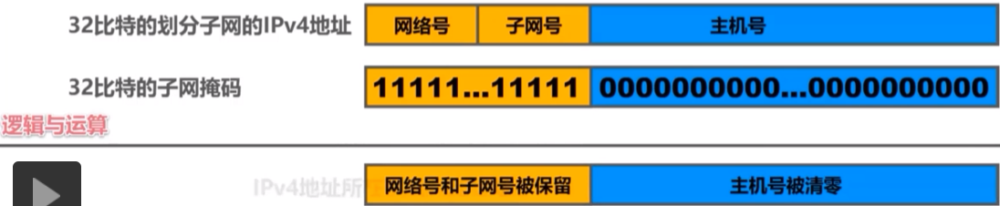

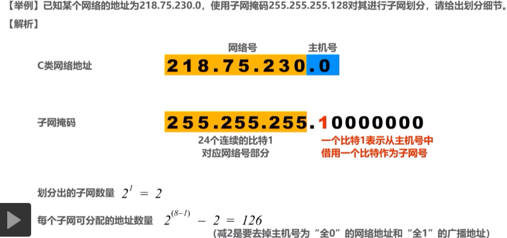

2个子网分别是 `218.75.230.1` 和 `218.75.230.0`，然后在网段 `218.75.230.1` 和 `218.75.230.0 又可分别`分陪出126个主机IP。

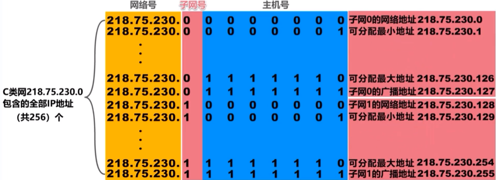

##### 无分类编制的IPv4

消除了A、B,C 类地址，以及划分子网的概念.

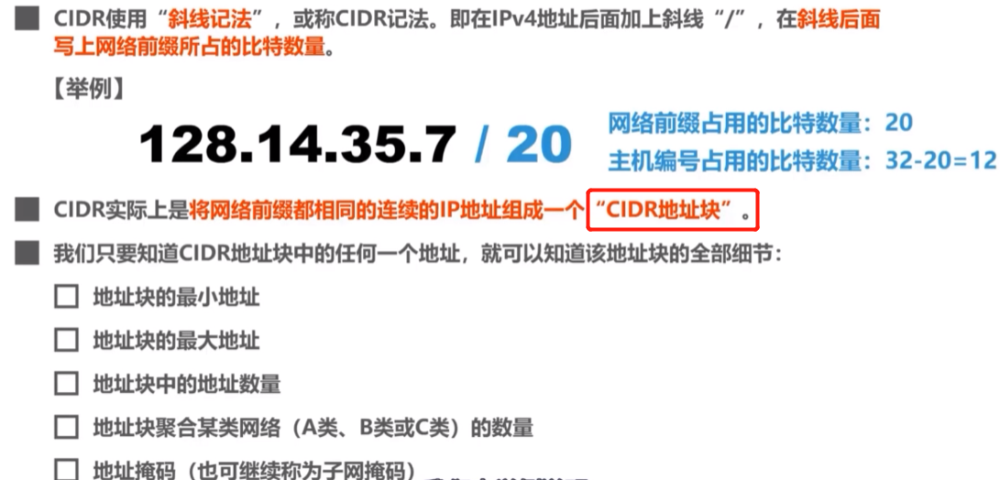

##### 定长子网掩码应用规划

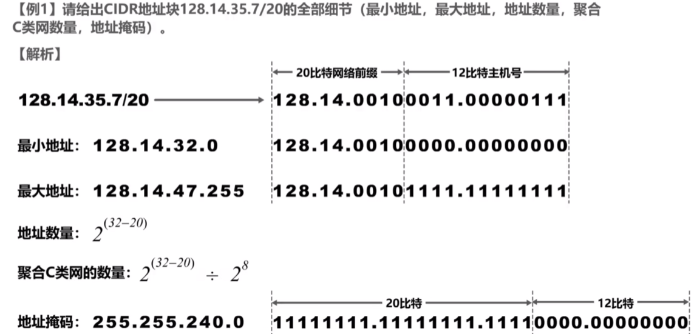

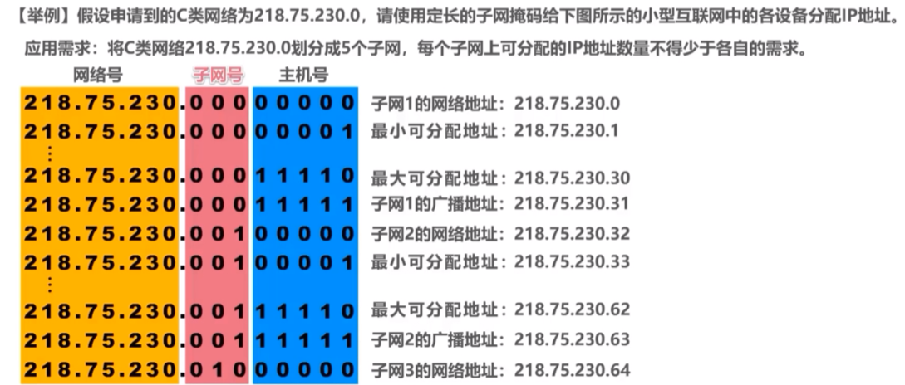

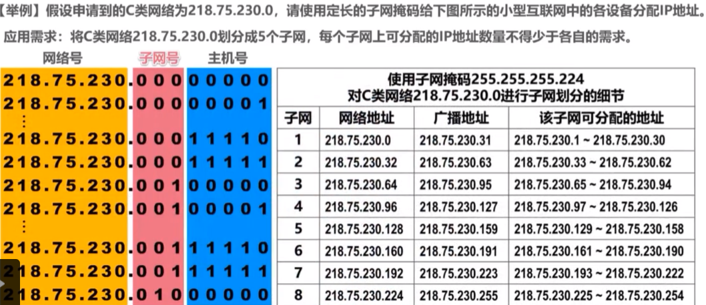

##### 变长子网掩码应用规划

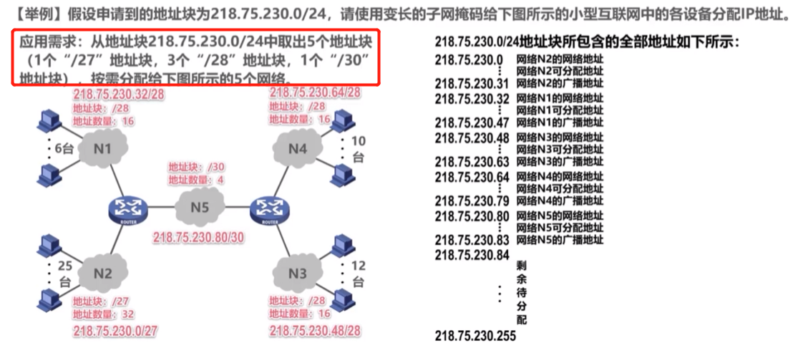

#### IP 数据是如何转发的

回答一下几个问题

* 源主机如何识别目的主机是否在同一个网络中
* 不同网络中的主机是如何通信的

##### 如何识别是否在同一个网络中

因为同一个网络中发送数据的时候，是不需要进行转发的。所以在发送的时候会先去发送是否在同一个网络中

主机C需要发送数据到主机F主机。

只需要将主机C和自己的子网掩码进行计算，是否和主机F的IP和F 的子网掩码计算结果是否相同，如果相同则是在同一个网络中

##### 跨网络主机如何知道将包发给那个路由器转发呢

网络A如何需要和网络之外的其他网络，例如B，进行通信，那么就需要给网络A指定路由器，该路由器进行转发，所以在发送数据的时候，主机能找到该网络的路由器就可以将数据转发出去。该指定的路由器也成为是默认网关。

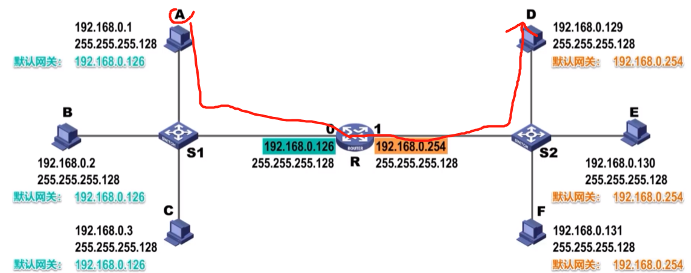

当A主机将报文发送到路由器R的时候，R从报文中可以知道源地址和目的地址的IP，然后通过该IP，从自己的路由表中查找，查找目的地址的默认网关(通过子网掩码可以计算得到)，是否在路由器上直连，直连，然后将数据包进行发送。

**路由器会隔离广播数据包的。 也就是广播数据包只能在同一个数据包中进行广播，路由器不会将广播数据包转发**
