概念

物理层，网络层，链路层共同解决了将主机通过异构网络互联起来所面临的问题，实现了主机到主机的通信。

实际上在网络中进行通信的真正实体是位于通信两端主机中的**进程**。

**运输层的任务就是为在不同主机上的应用进程提供之间的通信服务**

运输层协议称为端到端的协议。

* 面向连接的TCP 协议
* 无连接的UDP 协议

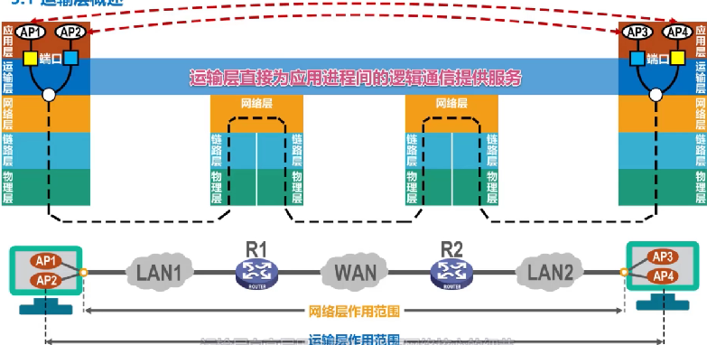

#### 端口号、复用和分用

在操作系统上的进程是统一使用进程表示ID来表示的，但是不同的操作系统有这不同的标识ID方法，为了使不同操作系统进程之间可以进行通信，那么就使用统一的协议，实际中使用 `TCP/IP`体系的应用进行进程的标识。

`TCP/IP`体系使用端口号来区分应用层不同的应用进程。

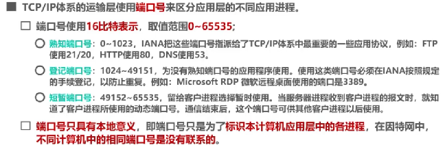

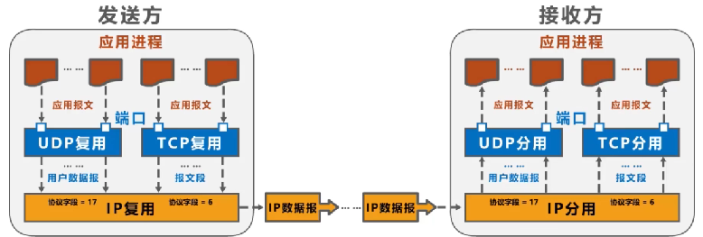

##### 常用熟知端口号

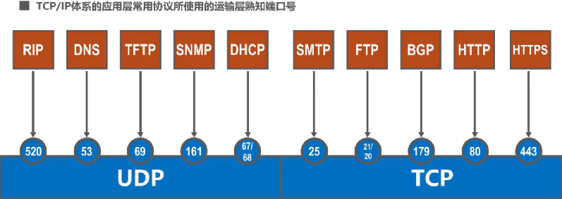

#### TCP 和 UDP 对比

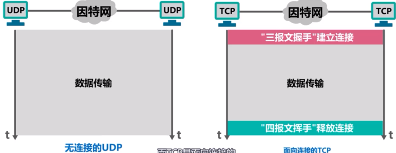

UDP 的数据传输可以是

广播方式

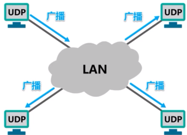

多播方式

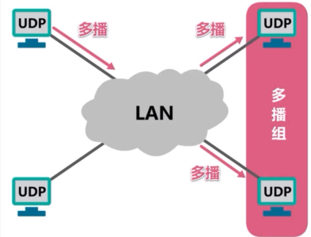

单播方式

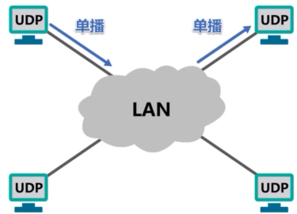

TCP 方式在发送数据前需要建立安全链接，所以仅仅是支持单播的。

UDP 是**直接面向报文的**，传输层直接将udp 首部添加到报文中，然后交付给下层进行传输，接受的时候也是，将udp 首部去掉然后将报文交付给上层。

而TCP 则不一样，**它是面向字节流的**，然后再TCP传输层将字节流进行缓存，然后使用窗口的机制取出一部分字节，添加tcp首部之后交付给下层传输，接受的时候也是将接受到的字节流，去掉首部，然后交付给上层。

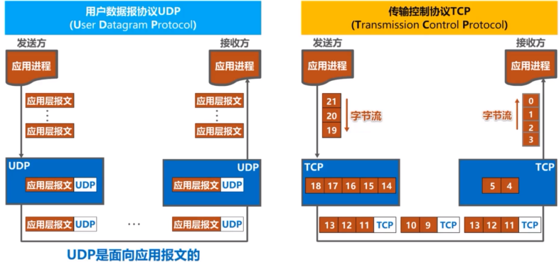

UDP 向上层提供的是无连接，不可靠的服务，使用于电话，视频会议等实时应用

TCP 是向上层提供，面向连接的，可靠性服务，适用于要求可靠性传输应用，例如文件传输应用

UDP 首部简单的多，只提供源端口和目的端口。

#### TCP 流量控制

一般情况下，总是希望数据传输的能够快一点，但是如果发送方将数据发送的过快，接受方就来不及接受，就会早上接受方数据堵塞，数据丢失。

所谓流量控制就是**让发送方的发送速率不要太快，让接受方来的机接受数据**

利用滑动窗口机制，可以很方面的实现流量控制。

举个例子，在主机A 和 B 发送数据前建立链接的时候，主机B告诉主机A，我的接受窗口为400，所以主机A 在发送的时候也会将自己的窗口设置为400

1. 主机A 将窗口中的1-100号字节流方式发送出去，窗口中还有300字段进行发送，TCP 报文段seq=1表示将序列号=1的字节流发送出去
2. 主机A将窗口中的101-200序号的数据进行发送，主机A还可以发送200个字节，TCP 报文段seq=101表示将序列号=101的字节流发送出去
3. 主机A将窗口中的201-300序号的数据进行发送的时候，数据丢失了。这个时候窗口中还有100个字节发送
4. 主机B对接受到的字节流进行累计确认，返回的ACK=1(TCP确认标志位). ack=201(接受序号，201号数据之前的数据已经全部接受), rwnd=300, 将序号201号以前的数据进行确认，并将接受窗口调整为300，对主机A进行流量控制

5. 主机A接受到确认反馈之后将窗口向前滑动，使得已经发送并成功接受的数据移出窗口，并将发送的窗口调整为返回的窗口
6. 主机A发送301-400号数据，
7. 主机A发送401-500号数据，不能在发送新的数据了
8. 这个时候之前丢失的201-300号数据未收到返回的超时机制触发，主机A将201-300号数据进行重新发送，不能发送新的数据
9. 主机B对主机A发送的数据进行接受反馈，并将窗口大小调整为100，对主机A进行流量控制

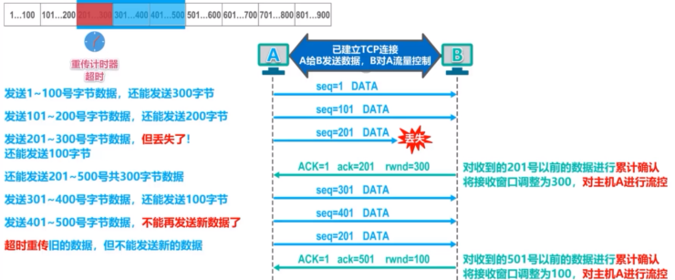

10. 主机A收到确认反馈之后，调整自己的发送窗口，以及将窗口前移动，这个时候主机A还可以发送100个字节流
11. 主机A发送数据，主机B接受数据，并将自己的窗口调整为0，这个时候主机A是不能在发送数据了

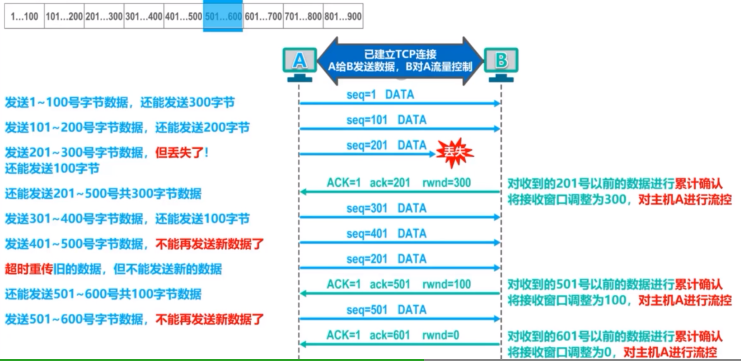

12. 主机A可以将自己缓存中的601号数据之前的均删除掉
13. 过了段时间之后，主机B可以接受数据了，发送了一个窗口为300的反馈，但是这个反馈丢失了，这个时候主机A也是一直在等待主机B发送反馈
14. 每当A主机接受到0窗口报文的时候就会启动一个定时器，定时器到了，这个时候主机A是会发送一个零窗口探测报文
15. 返回的报文如果不是0窗口报文，就按照指定窗口开始发送字节。如果是0就重写启动计时器

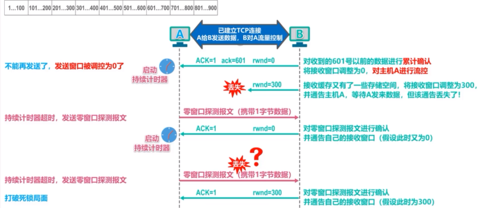

#### 拥塞控制

拥塞：在某段时间，在网络中对某一个资源的需求超过了该资源锁能提供的可用部分，网络的性能就会变坏。

如果不进行控制，整个网络的吞吐量随着输入负荷的增大而下降。
