物理层：

> 定义网络设备的机械特性，电气特性，功能特性，过程特性

数据链路层：

> 封装成帧，透明传输，无差错接收，

网络层为计算机提供什么服务？

> 在不同的机器之间将数据包选择一条最有路径传输出去。基于数据包的IP地址转发，不负责数据的完整性校验(链路层进行校验)，只是尽可能的转发数据包
>
> 路由器工作在第三层(网络层)，所以说路由器是三层设备，路由器只关心数据包去哪，发送到下一个路由器

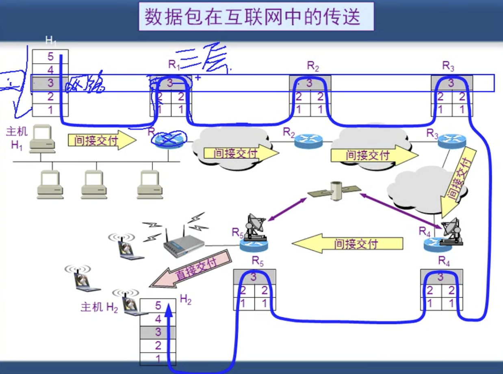

一个不成文的规定：

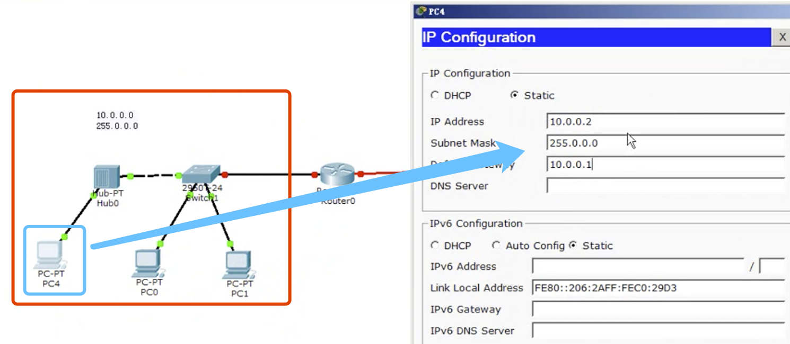

如上图是红色部分是一个局域网，在这个局域网中规划网络的网段为 10.0.0.0， 子网掩码是 255.0.0.0， 然后规划这个局域网的理由器为蓝色部分，网络为箭头指向的内容，其中在这里这个网段的路由器的网关就是这个网段的第一个能用的网址也就是 10.0.0.1，其他的pc4， pc0, pc1 都需要从10.0.0.2开始设置IP，这是一个不成文的规定，当然这个10.0.0.1 也可以是其他的。

然后规划第二台机器

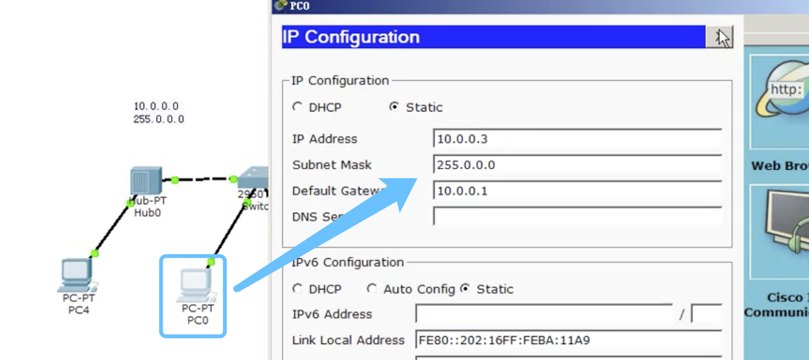

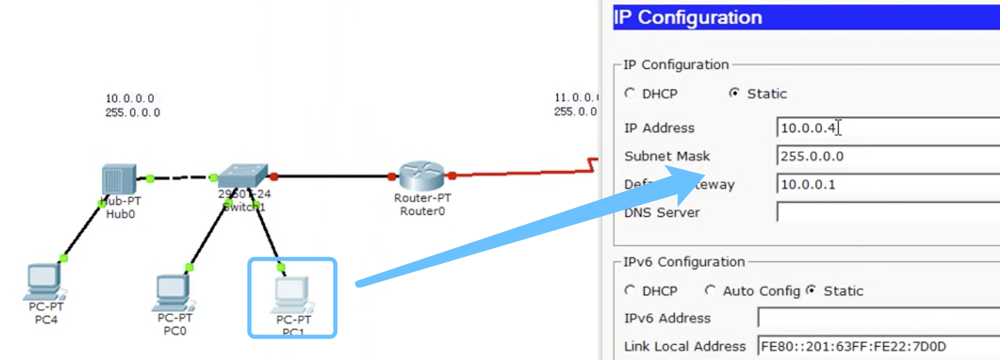

结束

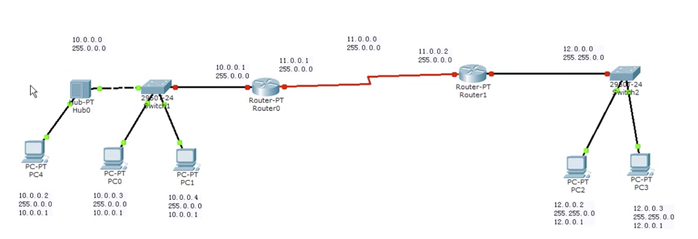

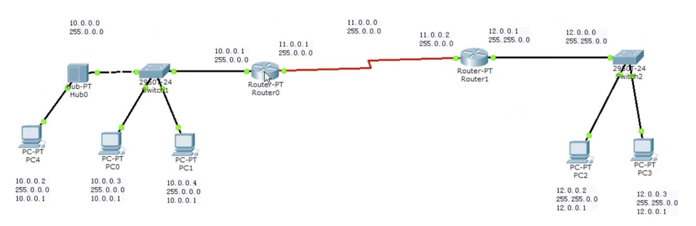

这个PC4机器ping PC3 会不同，是因为路由器0到路由器1是不同的，此时路由器并不知道将数据包的下一站是哪个，它需要管理员配置路由表才能知道。路由器需要知道网段12 经过网段11到达网段10， 以及网段10经过网段11到达网段12

查看路由表：

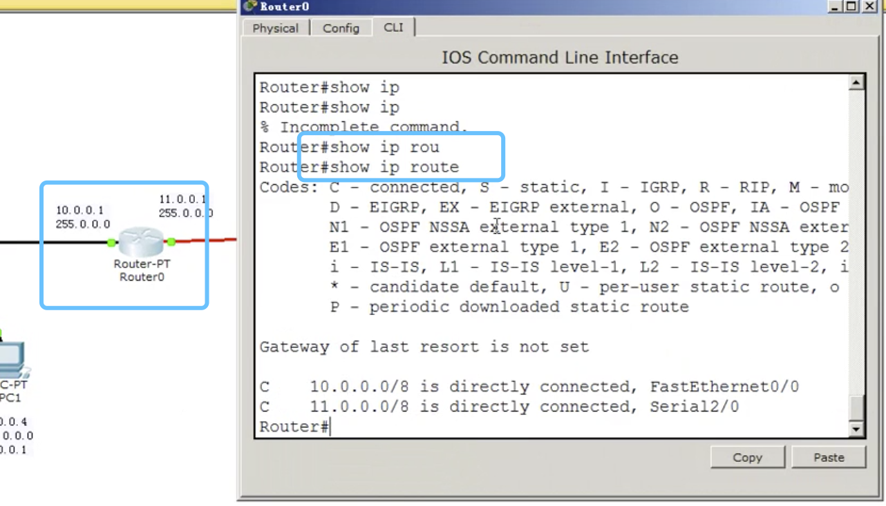

现在能够看到他时连着2个网段，并没有连到12网段，所以连不到12的网络

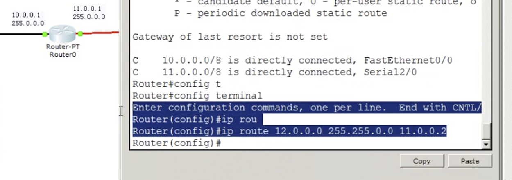

这样请求就能从路由器0到达路由器1，然后在配置路由器1到路由器2的路由表。路由表只是将网段的路由器之间的通信，至于继续到达哪台机器，那么到达路由器之后，路由器是知道的。

---

**网络设备和OSI模型的关系**

> 1. 计算机通信的过程
> 2. 本网段通信和跨网站通信

计算机通信的过程: 以pc4要和pc3通信为列子

> 1. 准备传输的数据
>
> 2. 传输层会对数据进行分段，并且编上号码
>
> 3. 网络层对分段后的数据加上源记以及目标地址
>
> 4. 数据链路层，链路上发送，还需要加上物理层mac 地址，使用自己的子网掩码，判断自己在哪个网段，然后使用的子网掩码判断自己的目标地址在哪里，如果是在同一个网段，那么直接使用arp协议广播解析目标IP地址的mac，然后使用对方的mac地址直接封装，床送过去
>
>    如果不是在同一个网段，这个时候不能直接传输，需要发到路由器，让路由器转过去
>
>    另外2种方式，都是需要在加上FCS 的校验码
>
> 5. 物理层，将数据变为比特流
>
> 数据在每一次都有自己的名字。

上述的过程是需要2层的地址，物理层的地址和网络层的地址，物理层的地址就是MAC 地址，网络输出的过程中需要知道下一跳的地址，网络层的地址是目标地的地址

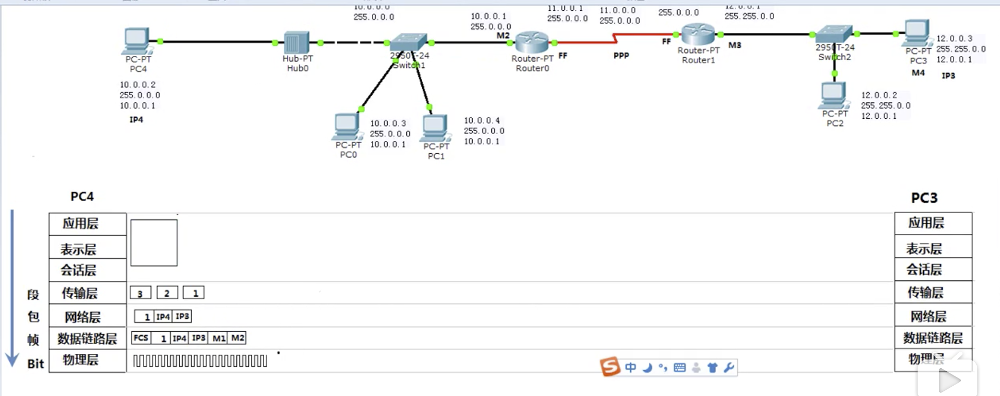

交换机接收比特流进行存储，交换机查看mac 地址，选择一个口将数据传输出去。交换机是在数据链路层的东西，但是他还能看懂物理层的东西，所以说交换机是二层设备。

路由器收到数据之后，将mac地址(数据链路层东西)去掉，值保持数据和源/目标地址，

跨路由器发送，到达另外一个路由器

路由器是一个三层设备，是因为路由器能看懂三层之内的信息，网络层数据链路层，物理层

新的路由器发送出去的时候，需要在链路层对mac 地址进行重新封装

最后上传到目标机器的时候，一层一层将地址去掉，只留下内容

发送的时候是一个封装过程

接收的时候是一个解封过程

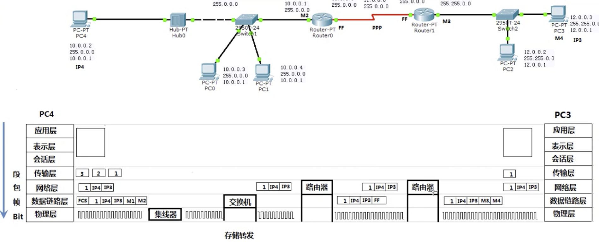

mac 地址只能是在一个网段内传输的时候会增加的信息，在路由器之间传输的时候，并不会只需要保留目标/源IP地址。

**交换机和路由器能不能中病毒**

> 病毒就是一段代码，是应用程序在应用层工作，所以不会中病毒，也就是应用层下面的层都是不能中这些病毒
>
> 但是可以影响应用层下面的层，病毒可以制造大量的流量，使得其他的设备网络变差

---

**网络层协议**

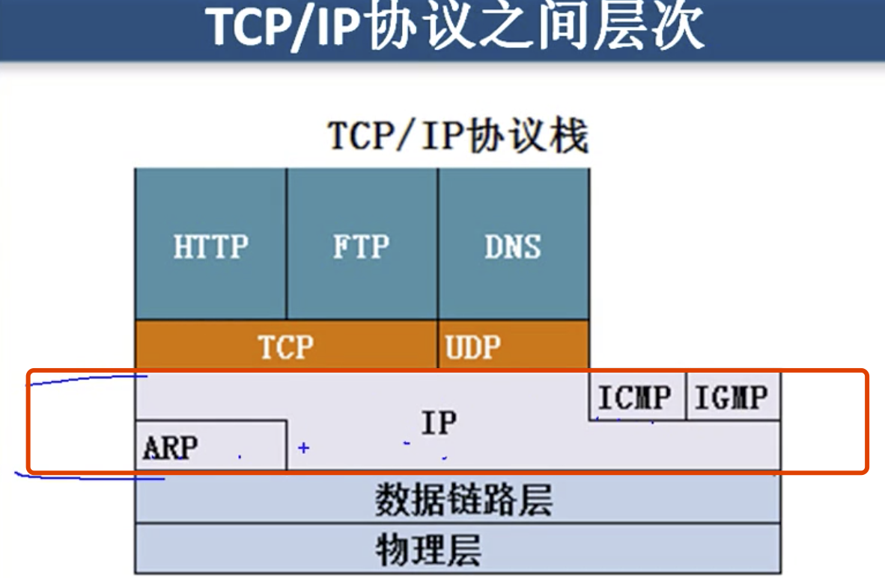

ARP 协议为IP提供服务，IP 协议为ICMP/IGMP 提供服务

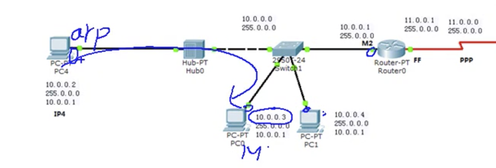

ARP 的功能就是如上图所示，当在一个网段里面访问(ARP 只能在网段里发广播)的时候ARP 发现目标MAC地址，直接去发送包。事情是这样完成的

> 当PC4 需要发送数据包到10.0.0.3的时候，那么会发一个广播，大概意思就是说，“10.0.0.3的mac地址是多少”， 然后10.0.0.3 受到之后，发现是在说自己然后就给发送广播的那个机器说是我然后pc4 就受到了10.0.03 的mac 地址，然后接下来就是发送信息，pc4 会将这个mac 地址缓存在来，后面就不需要在广播了。

>  » arp -a                                                                        
> ? (10.202.101.129) at 2:50:41:0:1:1 on gpd0 ifscope permanent [ethernet]
> ? (192.168.31.1) at 50:64:2b:92:1c:93 on en0 ifscope [ethernet]
> ? (224.0.0.251) at 1:0:5e:0:0:fb on en0 ifscope permanent [ethernet]
> ? (239.255.255.250) at 1:0:5e:7f:ff:fa on en0 ifscope permanent [ethernet]

---

Ping 命令 package internet Group 包探索器

ICMP： 协议的命令, 网络层，测试网络通还是不通，能否到达，能否返回

 » ping www.baidu.com                                                             
PING www.a.shifen.com (61.135.169.125): 56 data bytes
64 bytes from 61.135.169.125: icmp_seq=0 ttl=51 time=50.819 ms
64 bytes from 61.135.169.125: icmp_seq=1 ttl=51 time=49.681 ms
64 bytes from 61.135.169.125: icmp_seq=2 ttl=51 time=50.479 ms
64 bytes from 61.135.169.125: icmp_seq=3 ttl=51 time=50.167 ms

ttl 是数据包的生存时间，当发数据的时候，每过一个路由器ttl 就减1， 直到ttl等于0，这个时候保就不会再发送了。主要是防止网络上一直找不到目标而出现一直循环站网络流量的现象

