[B 站来源](https://www.bilibili.com/video/BV1T5411p78c)

主要内容：

* 从一个HTTP 请求来看网络分层原理
* HTTP
* HTTP 请求的完整过程
* TCP 协议
* HTTPS 协议

---

#### 从一个HTTP 请求来看网络分层原理

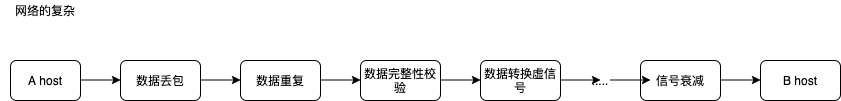

数据从一个 `host` 传输到另外一个 `host` 会经过很多的网络设备，不管是哪个网络设备多会出现**数据包丢失**的问题，当发生丢失的情况，那么就需要重新传输数据，那么重新传输数据则也有可能发生**数据重复**的问题(数据包每没有丢失，只是延迟了，然后就被认为是丢失了)，由于设备出现故障或者数据传输过程被认为篡改，那么还需要有**数据完整性校验**，同时，如果是在公网上传输，还需要经过光电**信号的转换**，传输的过程中，还会涉及到**信号衰减**.

**所以网络在整个传输的过程中是一个非常复杂的过程。**

---

为了简化这个复杂的过程，于是对网络进行了分层

每一层只和紧挨着的上层或者下层进行交互，往网络分层，这样Juin可以修改，甚至替换某一层的软件，只要层与层之家的接口保持不变.

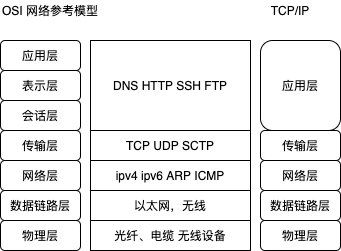

应用层是各种各样的软件。

引用层以下的是计算机的内核部分，是计算机的功能。

对于开发人员，可以只认识其2层，**应用层**和**内核层**

---

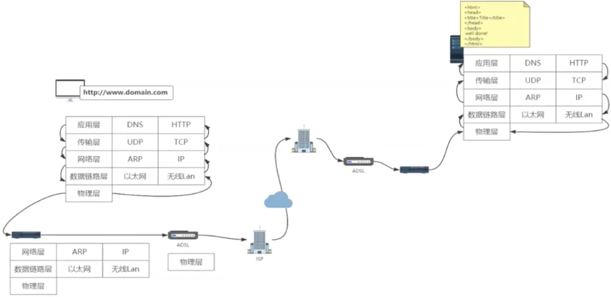

通过域名访问公网

1. 浏览器解析域名
   1. 查看浏览器中是否有缓存，有则返回，否则继续往下
   2. 查看本地机器的 hosts 配置文件中是否有域名对应的IP 地址，有则返回，否则继续往下
   3. 去DNS 服务器你请求IP
      1. 去本地机器上配置的DNS IP，去这个IP 地址去拿域名对应的IP
      2. 如果本队DNS 中获取不到，那么去这个DNS 的根DNS 服务器去查，直到查到后返回
2. 网络层 将IP加到请求报文
3. 数据链路层，二层寻址，将自己的MAC 地址加到请求报文
4. 物理层
5. 路由器，三层设备

---

#### HTTP

超文本传输协议，名字中有`传输` 字样，其实他本身并不具有传输的能力(通过TCP 协议传输)，它是一种无状态的，以气你管求你应答的方式运行的协议。使用可扩展性的语义和自描述消息格式，和基于超文本信息系统灵活的互动

##### HTTP 报文

三大部分组成

* 起始行：描述请求或响应的基本信息
* 头部字段集合：使用 key-value 形式更详细的说明报文
* 消息正文：实际传输的数据，可以是文本，图片，视频等

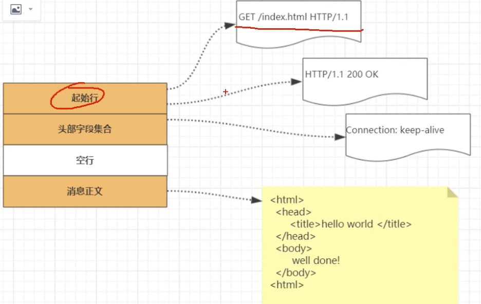

头字段，可以是任意自定义的头部，给HTTP 带来了无限的扩展可能。

* 头字段不区分大小写，不可以出现空格，可以使用连字符'-'，但是不能使用下划线
* 字段顺序没有语义的
* 原则上不能出现重复

##### HTTP 请求过程

当用户浏览器地址栏中输入地址回车之后，发生什么事情呢？

* 首先干活的是浏览器应用程序，他要解析出`URL` 的域名

* 根据域名获取对应的IP 地址，首先重浏览器的缓存中查看，如下可以查看浏览器中对应的IP 解析

  `chrome://net-internals/#events`

  如果没有则从本地域名及诶西文件 hosts 中查查看，还没有则去本地DNS/根DNS server 中去获取，知道获得IP

* 浏览器发起 http 请求报文，发送报文

* 服务器收到请求报文之后，解析报文，生成响应，发送响应数据

* 浏览器收到效应，开始渲染页面

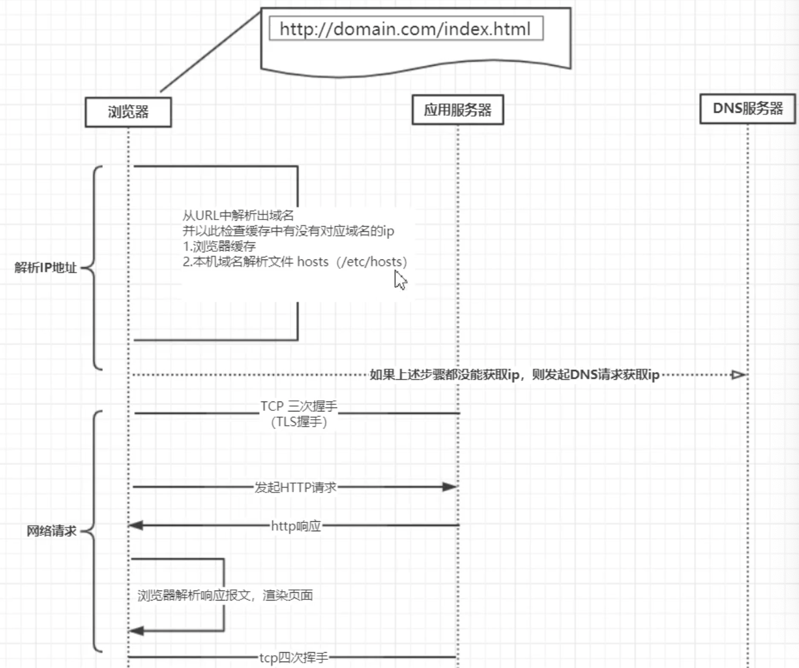

---

#### TCP

Transmission Control Protocol, 面向连接的，可靠的、基于字节流的传输层通信协议

特点：

* 基于连接的，数据传输之前需要建立连接
* 全双工的，双向传输，客户端，服务器可以相互读写数据
* 字节流，不限制数据大小，打包成报文段(数据切分，排序)，保证有序接收，重复报文自动丢失
* 流量缓存，解决双方出出力能力不匹配
* 可靠的传输服务，保证到达，丢包时候通过重发机制实现可靠性
* 拥塞控制：防止网络出现恶性拥塞

##### TCP 连接管理

1. TCP 连接四元组：源地址:源端口， 目标地址:目标端口
2. 确立连接: TCP 三次握手
   1. 同步通信双方初始序列化
   2. 协商TCP 通信参数

**如何握手**： 建立连接

先看看TCP 的报文

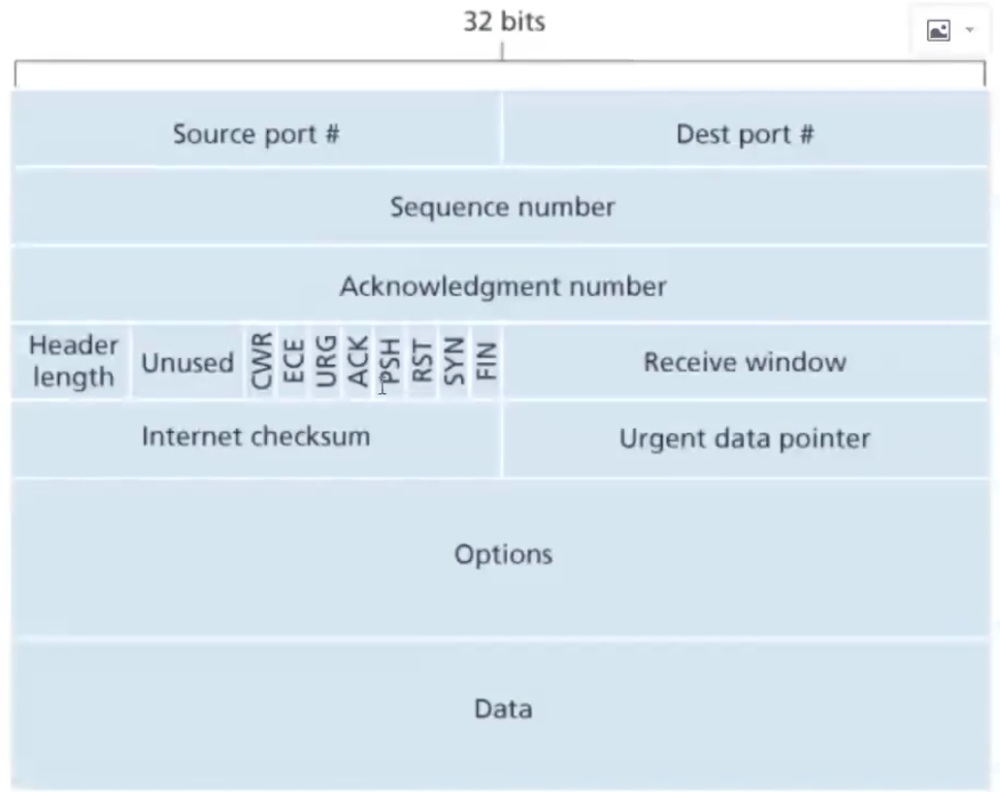

`Options 和 Data` 是不必填项

中间大写是`报文标志`，表示当前是一个什么类型的报文，如 `SYN=1` 是建立连接的同步序列号

`ACK=1` 是效应报文。

`Receive window` 当前服务器可以接受数据大小的一个值。

`URG=1`  是一个紧急的报文，服务器优先去处理，指向 `Urgent data pointer ` 内存

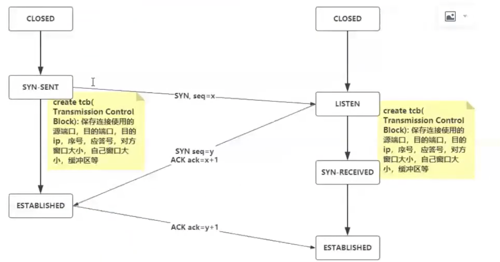

1. 服务器首先会进入 `LISTEN` 的状态，监听一个端口，如 `80`
2. 客户端发送一个请求，创建一个数据结构，用来存储使用的源端口，目的端口，目的IP，序号、应答号、对方窗口大小、自己窗口大小、缓冲区等，发送 `SYN` 的请求报文，然后客户端进入 `syn-send`  状态。
3. 服务端受到之后，也是立马创建和连接相关的自己的一个数据结构，并且给客户端回一个 `ack`  的报文，客户端受到这个报文，同时服务端也会给你客户端发送 `SYN` 报文，同时这个过程都带着 `seq` 序列号，它的作用是知道客户端服务端识别是谁发送/应答的请求。相互唯一确认对方，服务端的状态发生变化
4. 当客户端接收到消息之后，然后客户端的状态也发生变化，然后告诉服务端 `ACK`, 接收到了报文。

以上客户端确认了服务端，服务端确认了客户端，完成三次握手

---

##### 四次挥手： 关闭连接

客户端和服务端都可以关闭

1. 客户端发送 `FIN` 报文，告诉服务端，我这边不会再给你发送数据了。
2. 服务端会给客户端发送 `acck`  表示收到了客户端的报文

  这个时候客户端不在会给服务端发数据了，但是服务端还是可以给客户端发送请求的

  这个时候是客户端后面不在向服务端发送数据，这个时候服务端可能还在对之前客户端发的请求进行一些  处理，还可能会给客户端发送请求。

4. 服务器的收尾工作做完了，之后也不会再给客户端发送响应了，于是给客户端发送 `FIN ` 的报文，也告诉客户端，我后面也不在给你发送响应了
5. 客户端收到之后，回复 `ACK` 给服务端，服务端断开连接

双方连接均断开。

---

#### 字节流协议

TCP 把应用交付的数据仅仅看成是一连串的无结构的字节流，TCP 并不知道字节流的含义，TCP 并不关心应用程序一次次将多大的报文发送到TCP 的缓存中，而是根据对方给出的窗口值和当前网络拥堵程度来决定一个报文段应该包含多少个字节

MSS： Max Segmeng Size： 默认526byte 实际数据

如何保证传输过程中数据拆分后，在接收之后的顺序呢？通过  seq ，它会标志数据的顺序。

---

#### HTTP 协议

`HTTP`  是数据在整个网络上 `裸奔`的，数据均是明文的。任何人都会截获，修改或者伪造报文，具有**不可靠性**

HTTPS 是在 HTTP 和TCP 层传输中间上加了一层安全层，也就是在数据传输之前进行加密，接收到的事实在解密，在传输的过程中是密文。

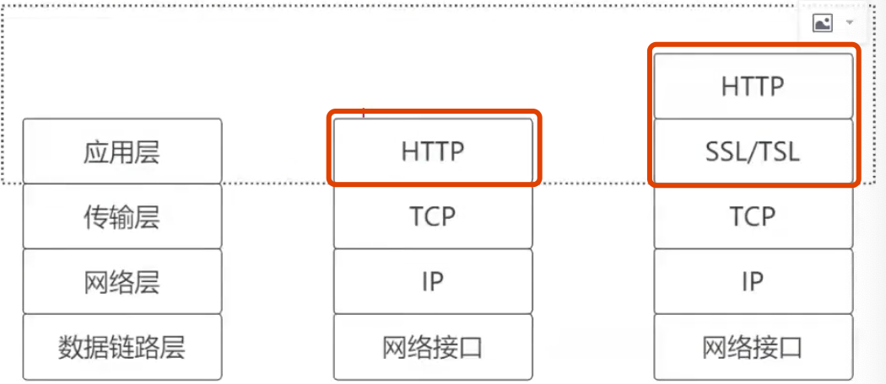

**SSL/TSL**

SSL： Secure Socket Layer，后来改为了 TLS: Transport Layer Secure

**摘要算法**

> 将任意数据加密为定长的密文，如有 sha1, sha2, sha1 256, md5

**对称加密**

> 编码、解码使用相同的秘钥，如AES/RC4/ChaCha20

**非对称加密**

> 2个密匙，一个公钥，一个私钥，公钥是可以公开的，私钥是保密的，非对称加密是可以解决 **秘钥交换** 的问题，网站密码保管私钥，公钥任意分发，登录网站，只需要使用公钥加密就可以，密文只能有私钥持有者才能解密。私钥加密可以用公钥解密。公钥加密私钥也可以解密，但是公钥和公钥或者私钥和私钥 是不能彼此加解密的。

单独使用对成加密，那么无法完成加密密匙的传输

而单独使用非对称加密，那么服务器返回给客户端的数据几乎是 **裸奔的**，因为公钥 是被公开的了，服务器发出来的 私钥 加密的数据 ，是可以被公钥解密的。

在传输的时候，非对称加密算法，完成加密算法的一个传输。二者取长补短

1. 在建立完成TCP 连接 之后
2. HTTP   S 层进行交换密匙，服务器端会返回公钥
3. 客户端使用公钥将客户端发起的 `对称加密秘钥` 使用公钥加密，这个时候 传输的过程中，是 无法截获这个对称加密秘钥的。
4. 服务端接收到 之后，使用 私钥将 数据解密，拿到客户端的对称加密秘钥，使用该秘钥加密数据和客户端进行数据交换，这个传输过程中，信息是无法被截获的 。后面的数据 的传输都是通过对称加密算法 加密传输 的。

对此加密算法比非对称加密算法效率更高。

这样后面服务器和客户端就能正常加密传输了。

这里会有一个问题，

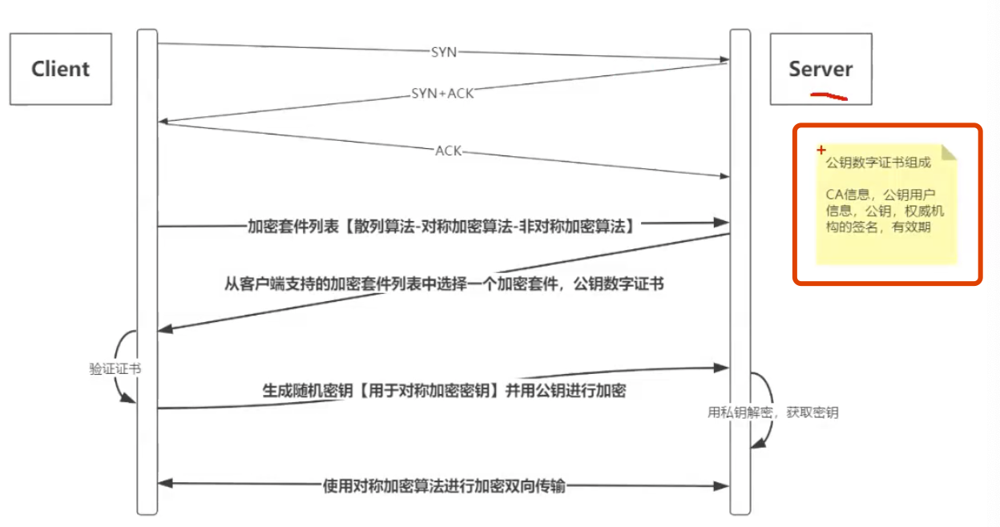

在最初的建立TCP 连接的是，如果就被黑客给黑了，在客户端不知道的情况下，黑客伪造了公钥私钥，那么后面客户端发送的数据就被解密了。基于此又发明了 **证书**

在服务器给客户端发送公钥的时候不单纯发送一个公钥，而是**公钥数字证书**，证书中还会加一些签名信息，这些签名均是权威机构发布的，用来证明这个公钥的正确性，不是黑客所为。

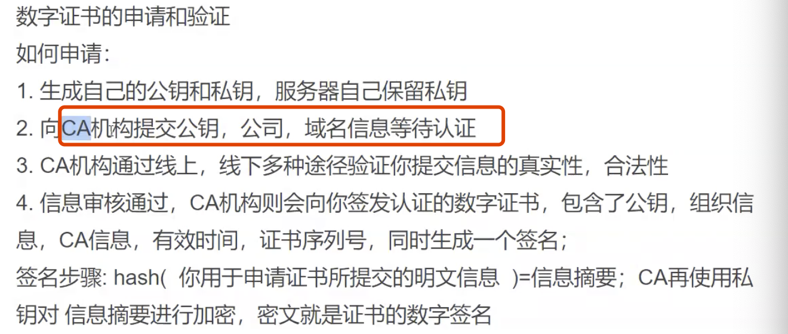

**浏览器验证证书**

证书里面会包含加密证书的哈希算法，将证书解密，然后拿着解密的明文信息，得到摘要，拿着CA

浏览器就能查看到证书的信息

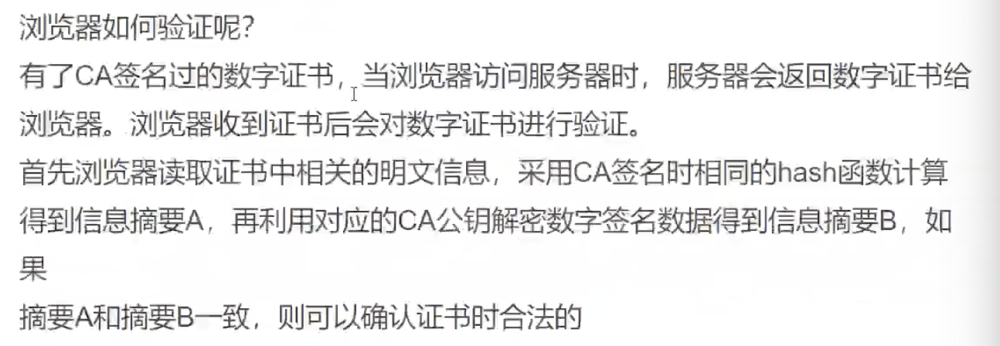

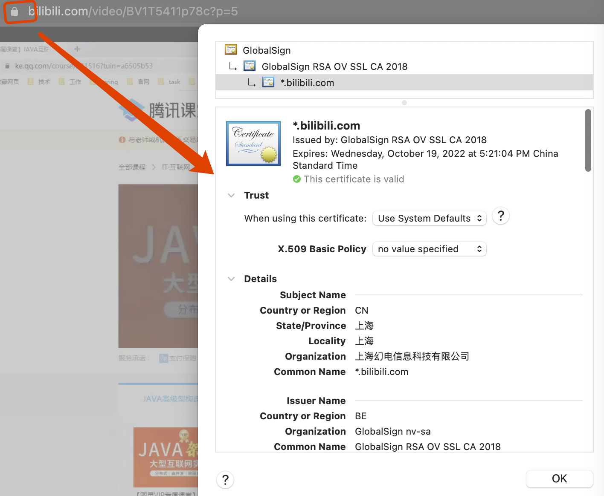

---

当前请求的IP 和路由表中的掩码进行运算得到目的地的网关(下一条)，然后通过网关将其发送出去。

---

