### 消息队列俩种模式

#### 点对点

> 消费者主动拉去数据，消息收到后消息会删除
>
> 消费生产这发送消息 到Queue中，然后消息消费者从Queue 中取出并且消费消息，消息被消费之后，queue 中不再存储，所以消息消费者不可能消费到已经被消费的消息，queue 支持存在多个消费者，但是一个消息而言，只会有一个消费者，如果第二个消费者还想消费一个已经被消费了的消息，那么消息生产者需要在 生产一个消息

#### 发布/订阅模式

> 一对多，消费者消息 数据之后不会消除消息，但是这个消息也不会一直存在在队列中，可以通过可配置的方式设置保存消息的时间（默认7天）。
>
> 消息生产者(发布)将消息发布到 topic 中，同时有多个消息消费者(订阅)消息该消息，和点对点方式不同，发布到topic的消息会被所有订阅者 消费。
>
> 其信息的消费有两种
>
> * 消费者主动拉取数据
>
>   > 如队列中好长时间没有消息，但是消费者还要轮询去看是否还有消息，浪费资源
>
> * 队列推动消息到消费者：
>
>   >  资源不统一，如队列中只能以1M/s的速率吐数据，而第一个消费者可以以10M/s 的消费，那么有点浪费资源，而另外一个只能以100KB/s 消费数据，那么他又会被压死。

### 基础架构

主题

* 分区的
* 每个分区是有副本的
* 副本是其leader 的 follower


一个分区只能被同一个消费者组里面的消费者消费(提高并发，所以消费者组里面 的个数和主题的分区个数 一致的时候)


还需要一个zk 保证多有的kafka 节点还有消费者的消费 信息(kafka 中没有想hdfs 总的nameNode 的节点)，假如说一个节点挂掉了，那么kafka 会记得消费者消费到哪里了，当kafka恢复之后，消费者接着消费。

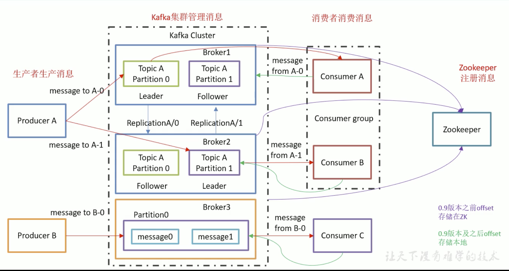

#### 安装

整个安装过程还是挺简单的, 主要参考

https://www.jianshu.com/p/745fbbd641a7

https://www.jianshu.com/p/944d54c2ce71

后台启动命令

```shell
先启动zk
/opt/bigData/zookeeper/bin/zkServer.sh start
/opt/bigData/kafka/bin/kafka-server-start.sh -daemon config/server.properties

注意在配置的时候，需要在配置文件中写入
listeners=PLAINTEXT://192.168.99.100:9092
advertised.listeners=PLAINTEXT://192.168.99.100:9092
否则api端发送的消息接收不到，当然每个虚拟机上的IP是不一样的，这里我只复制了leader 的配置
```

每次启动都需要跑到每台机器上去启动，有点小麻烦

```shell
#!/bin/bash

case @1 in
	"start"){
		for i in spark-master, spark-slave1, spark-slave2
		do
			echo "******* 启动机器 $i kafka **********"
			ssh $i "/opt/bigData/kafka/bin/kafka-server-start.sh -daemon /opt/bigData/kafka/config/server.properties"
		done
	};;
	"stop"){
		for i in spark-master, spark-slave1, spark-slave2
		do
			echo "******* 启动机器 $i kafka **********"
			ssh $i "/opt/bigData/kafka/bin/kafka-server-stop.sh"
		done
	};;
	
esac
```

#### 基本命令

命令和 zk紧密关联

* 查` /kafka-topics.sh --list --zookeeper spark-master:2181`

* 删 `./kafka-topics.sh --zookeeper spark-master:2181 --delete --topic first`

* 增 `/kafka-topics.sh --create --zookeeper spark-master:2181 --topic first --partitions 2 --replication-factor 2`

  > 当名字冲突的时候会有异常抛出，可以这么处理
  >
  > `./bin/kafka-topics.sh --create --zookeeper spark-master:2181 --topic topic-create --partitions 2 --replication-factor 2 --if-not-exists`

> 在创建副本数的时候，副本数最大不能超过 broker的个数/集群node 个数。

* 查看详细 `./kafka-topics.sh --describe --topic first --zookeeper spark-master`

---

#### 发布/订阅模式

* 发布消息到主题 `./kafka-console-producer.sh --topic first --broker-list spark-master:9092`
  * 接收主题 `./kafka-console-consumer.sh --topic first --bootstrap-server spark-master:9092`

Kafka 的数据默认保存了7天，新起一个消费者也可以拿到之前的数据

`./kafka-console-consumer.sh --topic first --bootstrap-server spark-master:9092 --from-beginning`

---

#### 工作流程

每一个`broler`  都维护了一个从头开始的消息(每个消息都有从头开始offset位置)，这个offset位置在消费者也会存储，kafka 并不能 保证全局有序性如第一条消息发送到broker1，第二条消息发送到broker2等，只会在一个broker内保持有序

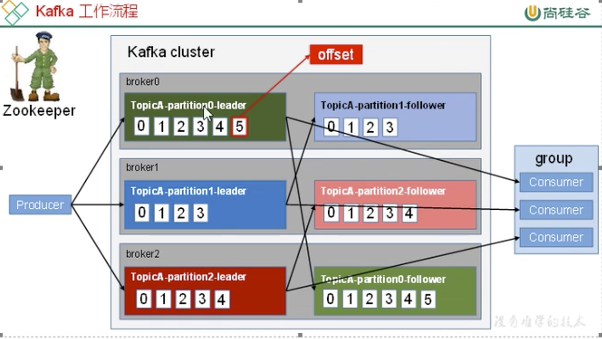

生产者和消费者都是面向主题(topic)的, topic 是逻辑上的概念，partition 是物理机器上的概念，每个partition 对于一个log文件，log  文件中存储了producer 生产的数据 ，producer 生产的数据不断追加到log 文件末端，且每条数据都有自己的offset，消费者组中的每个消费者，都会时候记录自己消费了那个offset，以便出错恢复时，从上次的位置继续 消费。

每条消息都会存储在 `log.dir`目录下存储，

```shell
[root@spark-master first-1]# ls
00000000000000000000.index  00000000000000000000.log  00000000000000000000.timeindex  leader-epoch-checkpoint
```

其中.log 大小是可配置的，`log.segment.bytes` 当log 文件大小超过这个值之后，就会生成一个新的文件以及对应的index文件，文件的 命名以上次log 中消息的最后offset。

index定位哪个consumer 上次读到了log文件的什么offset

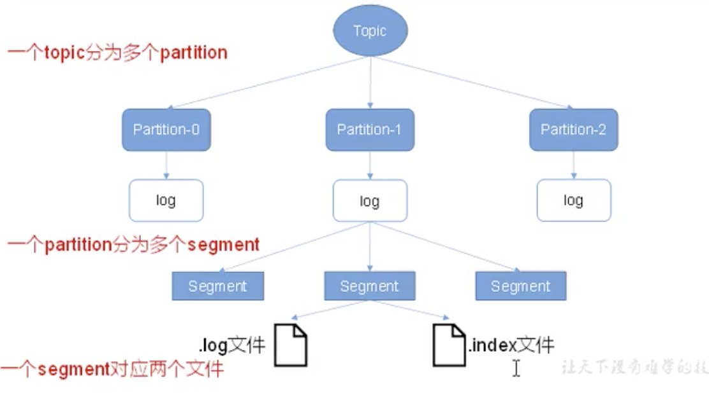

没一个log都固定大小的，index 也是固定的，在index 中找到 消息的offset，然后带着offset 去log 中差对于的数据。

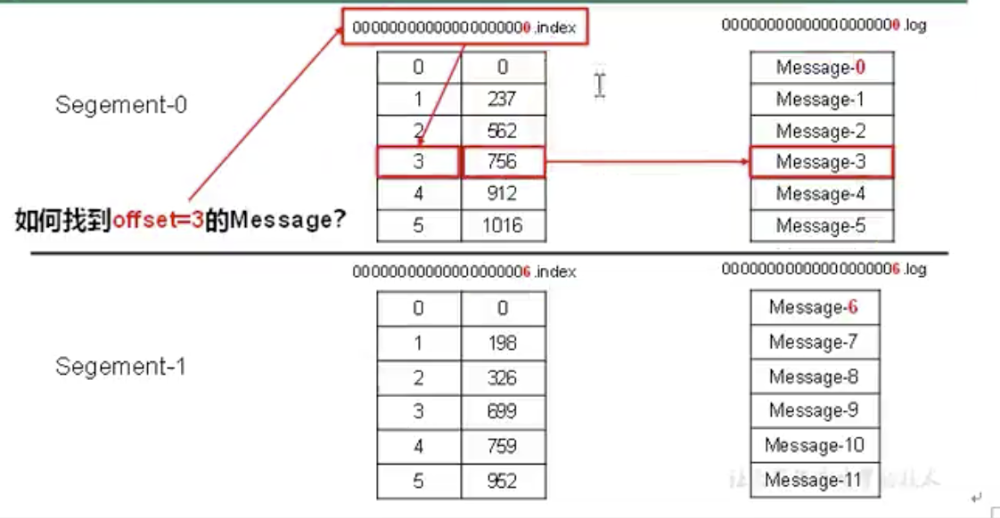

##### 生产者的分区策略

##### 数据可靠性保证

副本数据同步策略：kafka使用全部完成，才发送ack给producer 表示数据同步完成。

但这种方式会有较高的延迟(但对kafka 影响较小)

#### ISR 策略

```shell
[root@spark-slave2 bin]# ./kafka-topics.sh --describe --topic first --zookeeper spark-master:2181
Topic:first	PartitionCount:2	ReplicationFactor:2	Configs:
	Topic: first	Partition: 0	Leader: 1	Replicas: 1,2	Isr: 1,2
	Topic: first	Partition: 1	Leader: 2	Replicas: 2,0	Isr: 2,0
```

Isr（in sync replica set） 同步副本，如果出现以下问题，有一个follower 挂掉了 ，迟迟不能和 leader 同步数据，那么安装全部 同步策略，这个时候，给producer 就迟迟不能发回 ack 消息，使用ISR策略，当一个follower 迟迟不能给leader 返回消息的时候，那么leader 将该follower提出集群，这个时间使用参数`replica.lag.time.max.ms` 设置。如果 leader 发送故障，那么从ISR中选举新的leader。

---

#### acks 应答几种策略

**数据不丢失保证**

acks:

* 0: producer 不等待broker 的ack，这一操作提供了一个最低的延迟，broker一接收到还没有写入磁盘就以及返回，当broker 故障时候有可能数据丢失
* 1：producer 等待 broker 的ack，partition 的 leader 落盘成功后返回ack，如果在follower 同步成功之前 leader 故障，那么数据也会丢失
* -1(all)：producer 等待broker 的ack，等待leader 和 follower(ISR中的) 全部落盘成功返回ack，但是如果在folloer 同步完成后，broker 发送ack 之前，leader 发生故障，**那么会操作数据重复。**

----

#### 故障处理 

**数据不一致保证(消费者可见一致性)**

如一下情况

```
leader    10条数据
follower1 8条数据
follower1 9条数据
```

当leader 挂调之后，不管是选举出来1还是2作为新的leader，总会存在数据不一致的问题，数据都会变少

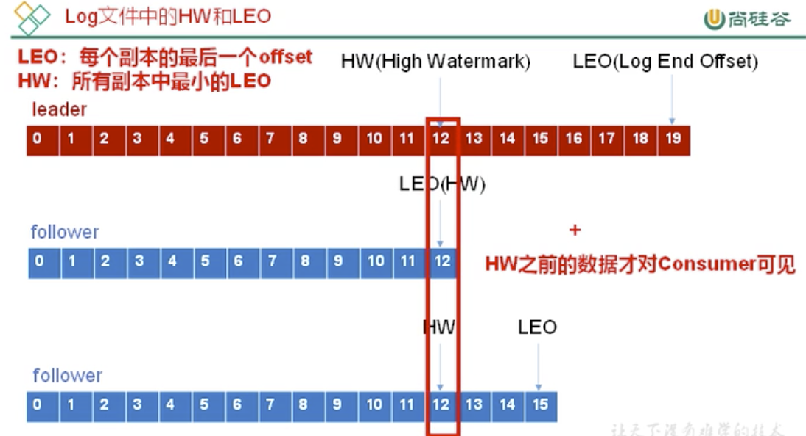

于是就是上面的问题，有一个hw为所有副本中的最低，这个值以内 的数据才是对用户可见 的，还有一个leo每个副本最大的offset

这个时候如果再去选一个新leader出来，那么对 于消费者看到的数据是一一致性的。

然后各个follower会将各自的HW之后的数据全部截调，然后将新leader hw之后的数据同步数据。

如上图，红色leader挂调了，当选第三条为新leader后，会将index 13、14、15位置的消息同步到第二条的index 12后面。

#### Exactly once

如果ack=-1，那么producer 和 server 之间 不会 丢失数据，即 `At Least Once` 语义

ack=0 保证生成这和消费者只会被发送一次 `At Most Once`

* 幂等性

一个 函数，无论接收什么输入，其结果均为固定不变的。

但是对于某些场景，下游数据消费者要求既不重复也不丢失，也就是 `Exactly Once`

而上述的两种方式均不能保证。于是新版本(0.11)的kafka 引入 `幂等性` 也就是不管 Producer 不管发送多少次重复数据，Server 只会持久化一条。 ack=-1 + 幂等性 就实现了新的需求

保证数据既不丢失，也不重复。

配置 `enable.idompotence=true` 开启幂等性，Producer 在初始化 的时候回被分配一个PID，发送同一个 partition 的时候会附带着 Sequence Number， 而Broker 端会对 <PID, Partition, SeqNumber> 做缓存，当具有相同的主键的消息提交 的时候，Broker 只持久化一条。

但是一旦kafka  重启 PID 就会发生变化， partition也会有不同的主键，所以幂等性无法保证跨 分区会话的Exactly Once

```java
ACK:0/1/-1: 数据不丢失保证
ISR: HW/LEO：数据对消费者一致性保证
```

---

#### 分区分配策略

**当消费者组里的的消费者个数发生变化的时候会重新分区**

#### Consumer

消费者采用`pull` 的方式从`broker` 中读取数据

`push` 模式很难适应消费速率不同的 消费，因为消息发送速率是`broker` 决定的，但是`pull`的不足在于，当`kafka` 没有数据，消费者会陷入死循环，针对这点，`kafka` 的消费者在消费数据的时候，会传入一个时间参数`timeout` 如果当前没有数据可以消费，那么`consumer`等待一会在返回，这个时间就是`timeout`

一个`consumer group` 中有多个`consumer`，一个`topic `有 多个`partition`，就涉及到`partition`  的分配问题，既确定 哪个`partition` 由哪个 `consumer` 消费，2中方式

* RoundRobin，安照组划分 (轮询)这样好处是消费者之间的分区最多只会相差1个

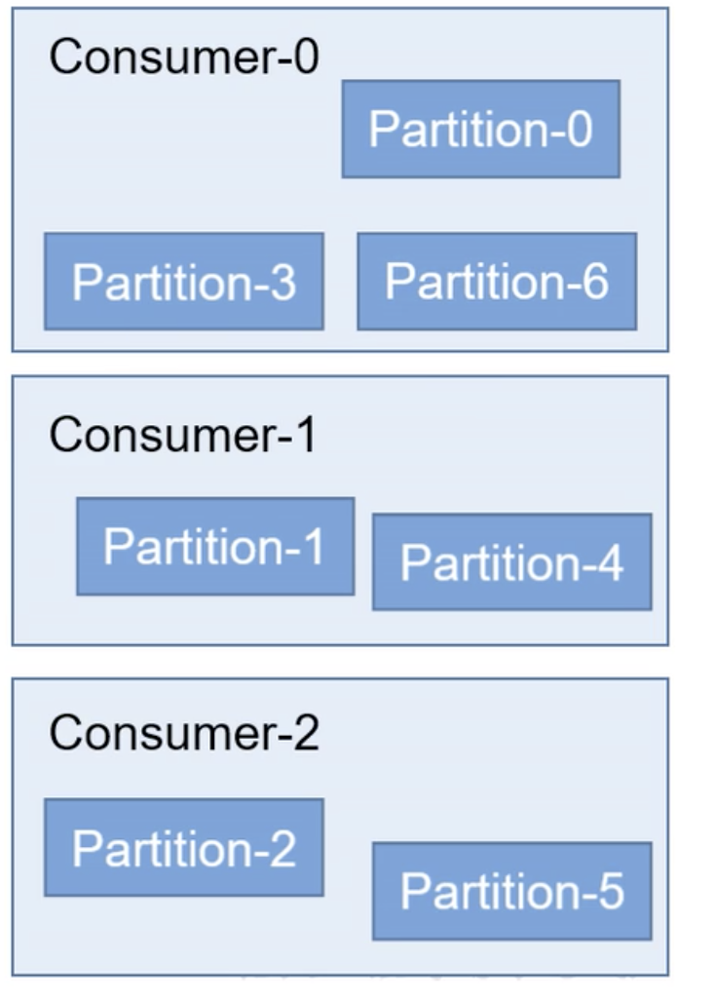

但也有一比较少见的事情，如现在有2个消费者`A`和`B` 有三个主题，其中`A`订阅了主题`T1和 T2`而`B`订阅了`T2和T3`如果还是按照这种方式的话，那么就会造成将主题`T1`中的分区分给了`B`虽然这很不常见，但理论上讲是可以 造成的。

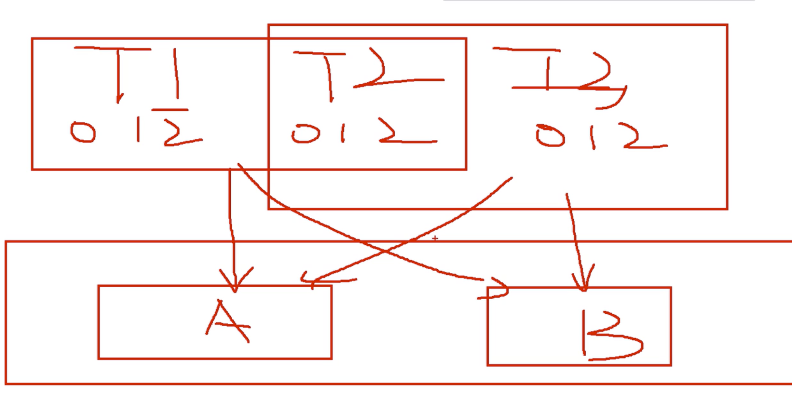

随意上述轮询的方式除非消费者是一样的/一个使用这种方式，否则不使用这种方式

* Range，按照主题范围划分(默认方式)，只有订阅的消费者才会消费

只针对主题进行划分，不按照消费者组划分，根据一个范围来分配 

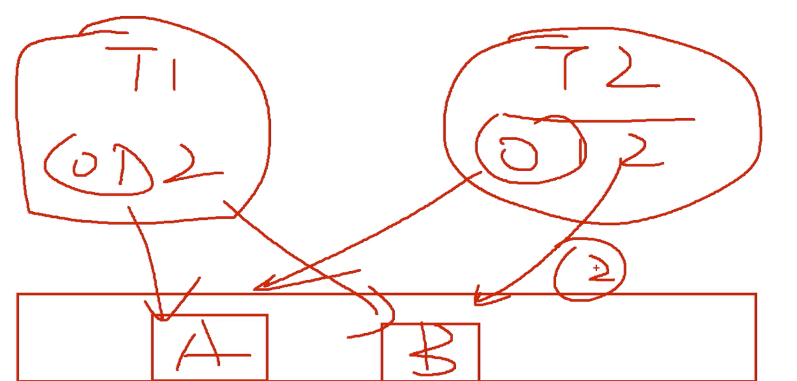

如上，`T1`分区的0，1范围分给A消费者，2给B消费者，`T2` 也是一样的，这样的问题是，消费者的分区会差距比较大。

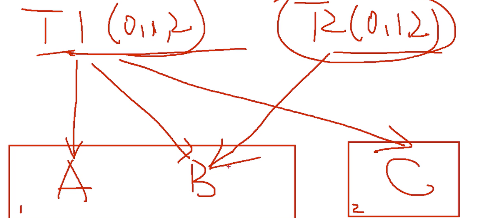

如上使用range 划分

* 先确定每个主题都被那些消费组消费了，然后给订阅了自己的消费组发送信息
* `T1` 被 `A,B,C`均消费了，`C` 单独一组，`A,B` 一组 ，所以`C` 拥有全部的分区，而A  和 B 平分按照算法 0,1,2 组
* 同样 T2组被 A,B订阅，那么也就值发送分区给AB消费，而不会 给C所在的组。

#### 消费过程

在消费的过程中，当遇到故障的时候，无法消费，当故障排除后 ，需要从故障前消费的位置继续消费，所以消费者需要实时记录自己消费到了哪个offset。

加入现有有一个消费者`A` 它订阅了分区`1,2,3`那么这个时候同组的又进来一个消费者`B`将第三个分区分给了消费者`B`那么这个时候消费者`B` 应该是从第三个分区的什么地方开始消费呢？答案是从消费者`B` 消费了的地方继续消费，这里的前提是消费者位于同一个组。

所以这个`offset`是由三个东西构成的 `消费者组、主题、分区` ，

####  案例

`./kafka-console-producer.sh --broker-list spark-master:9092 --topic bigdata`

`./kafka-console-consumer.sh --topic bigdata --bootstrap-server spark-master:9092`

进入zookeeper中

`./zkCli.sh`

查看根目录

`[zk: localhost:2181(CONNECTED) 1] ls /`

> [cluster, controller_epoch, controller, brokers, zookeeper, admin, isr_change_notification, consumers, log_dir_event_notification, latest_producer_id_block, config]

查看 `controller` 目录

> [zk: localhost:2181(CONNECTED) 2] get /controller
> {"version":1,"brokerid":0,"timestamp":"1593703999162"}
> cZxid = 0x10000001a
> ctime = Thu Jul 02 23:33:18 CST 2020
> mZxid = 0x10000001a
> mtime = Thu Jul 02 23:33:18 CST 2020
> pZxid = 0x10000001a
> cversion = 0
> dataVersion = 0
> aclVersion = 0
> ephemeralOwner = 0x10000157b380000
> dataLength = 54
> numChildren = 0

主要看 brokerid":0 也就是第一个kafka 节点 ，也就是这里第一个kafka 节点是leader，这里明确，先注册的节点就是leader节点

查看`brokers` 目录

> zk: localhost:2181(CONNECTED) 4] ls /brokers
> [ids, topics, seqid]

继续查看

> [zk: localhost:2181(CONNECTED) 6] ls /brokers/ids
> [0, 1, 2]

>[zk: localhost:2181(CONNECTED) 7] ls /brokers/topics
>[bigdata, first, __consumer_offsets]

查看消费者

[zk: localhost:2181(CONNECTED) 9] ls /consumers
看不下去了，新版本中并没有看到关于消费者的信息，课堂老师将的这里面会有消费者，然后继续进入消费者目录，就能看到offsets目录，继续进入，然后看见主题了，继续进入就能看到分区，然后可以使用 `get` 从分区中拿数据了。

---

在 `consumer.properties` 中增加配置 `execlude.internal.topics=false`

是能够消费系统主题

kafka0.9 之后，consumer 默认将offset 保存到了kafka 一个内置的topic 中，称为`__consumer_offset`

`bin/kafka-console-consumer.sh --topic __consumer_offsets --bootstrap-server spark-master:2181 --formatter "kafka.coordinator.group.GroupMetadataManager\$OffsetsMessageFormatter" --consumer.config config/consumer.properties --from-beginning`

---

#### 优化

* 顺序写磁盘：追加到文件末端

* 零复制技术：

  想像中的将文件a内容写到文件b中的过程可能是这样的，

  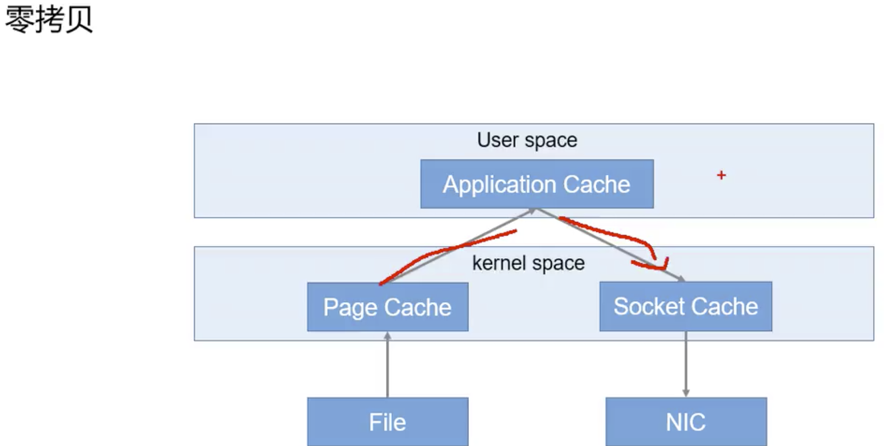

这样效率太慢了，零拷贝就是user space  直接给操作系统发送复制指令，由操作系统完成

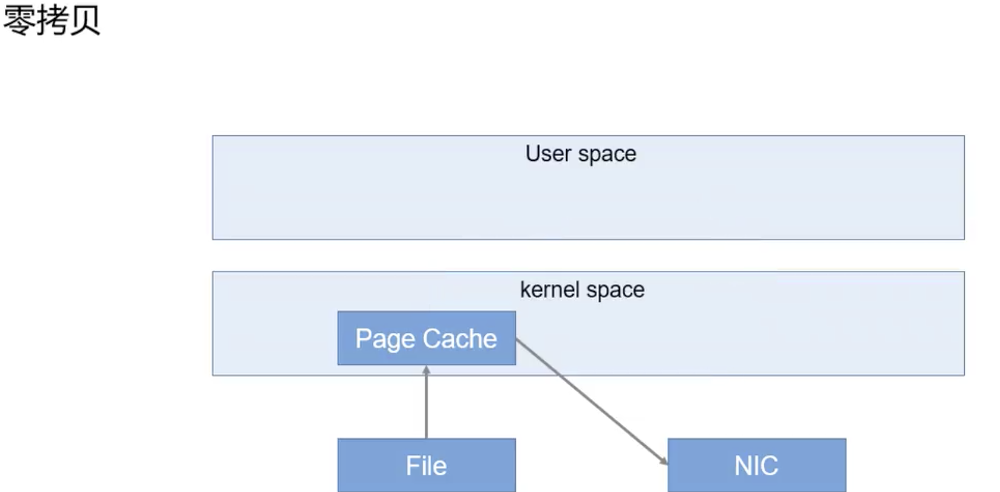

**依然不大懂**

---

#### Zookeeper 在 kafka 中的作用

选出一个 leader(抢占)，谁是leader 都OK，信息均共享，反正有一个  leader 就OK。

---

#### 事务

事务可以保证kafka 在Exactly Once 的语义基础上，生产和消费可以跨越分区和会话，要么全部成功，要么全部失败。

* **Produce** 事务

保证实现跨分区会话 的事务，映入一个全局唯一的Transaction ID， 并将produce 获得的PID 和 Transaction ID 绑定，这样当Producer 重启后就可以通过正在进行的Transaction ID 获得原来的PID

为了管理Transaction kafka 引入了Transaction Coordinator。

* **Consumer** 事务

生产这已经精确保证消息被写入到kafka  中了。

对Consumer 而言，事务就相对较弱，尤其是无法保证 commit 的信息被精确消费，这是由于Consumer可以通过 offset访问任何信息。

---

**消息的发送**

> 发送消息使用**异步发送**的方式，在消息发送的过程中，设计到了2个线程， `main`主线程和`sender` 线程，以及一个线程共享变量` RecordAccumulator`(存放待发送数据)
>
> `main`线程将消息发送给 `RecordAccumulator`, `sender` 线程不断从`RecordAccmulator` 中拉取消息发送到`Broker`

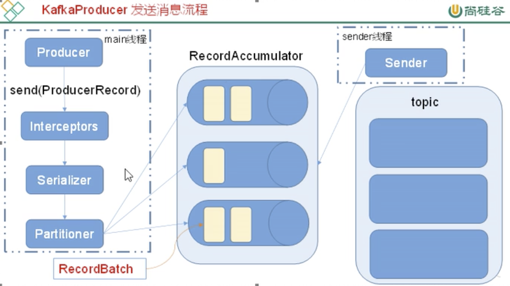


