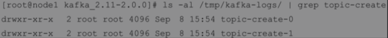
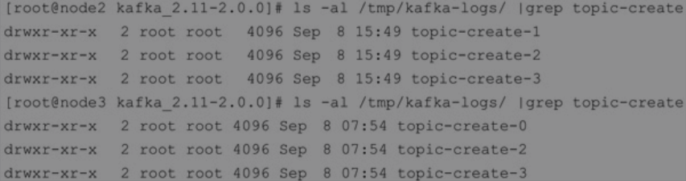
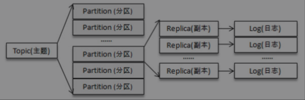
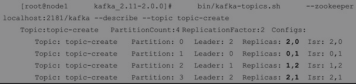
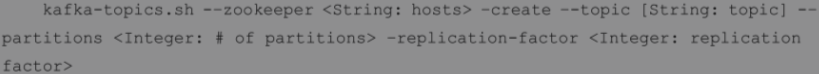

#### 主题和分区

主题作为消息的归类，可以在细分为若干个分区，分区可以看做对消息的二次归类

分区的划分不仅为kafka 提供了可伸缩性、水平扩展能力，通过多副本机制来为 kafka 提供数据冗余以提高数据的可靠性。

主题和分区都是逻辑上的概念，分区可以有若干个副本，每个副本对应一个日志文件

这里主要内容包括

* 主题的管理
* 初识 kafkaAdminClient
* 分区的管理
* 分区数的选择

#### 主题的管理

主题管理包括创建主题、查看主题信息、修改主题和删除主题等操作。

通过脚本

```java
$KAFKA_HOME/bin/kafka-topics.sh
```

完成以上的操作。

当然还是可以通过 `KafkaAdminClient` 方式实现。

如果配置`auto.create.topics.enable=true`那么久会出现一些不可预期的事情发生。

就是当你向一个不存在的主题发送、拉取消息的时候就会创建这个主题，且这个主题的创建方式都是默认的行为，也就是1个分区

`default.replication.factor=1`

1个分区副本

`default.replication.factor=1`

这些行为都是非预期的，所以应该将自动创建分区关掉

`auto.create.topics.enable=false`

更加推荐的方式是通过`$KAFKA_HOME/bin/kafka-topics.sh` 脚本来创建主题。


##### 创建主题

```shell
bin/kafka-topic.sh --zookeeper localhost:2181/kafka--create --topic topic-create
--partitions 4 --replication-factor 2
```

创建一个分区数为4， 副本因子为2的主题，书中使用了包含3个 `broker` 节点的集群

```javascript
node1 brokerId=0
node2 brokerId=1
node3 brokerId=2
```

执行完脚本之后，kafka 会在 log.dir/log.dirs 参数配置的目录下创建对应的主题分区，默认情况下这个目录为 `tmp/kafka-logs/`

查看`node1` 节点中创建的主题分区



这里需要知道明明方式是 `<topic>-<partition>`

所以上面的 `node1` 中是创建了主题`topic-create`的2个分区分别是0和1分区。

我们创建的2个分区和2个副本，看看其他的2个机器的分区



这里就看出了所有的4个分区，以及每个分区的2个副本均是分布在不同的 `broker` 中的。

所以主题-分区-副本-log日志的关系



可以通过`describe` 查看分区及副本的情况。



Isr表示分区的ISR集合，Replicas表示分区的所有的副本分配情况，即AR集。

**总结**： 创建主题的指令如下




##### 分区副本的分配

生产者的分区分配是指为每条消息指定其所要发往的分区

消费者中的分区分配是指为消费者指定其可以消费消息的分区

分区分配是指为集群制定创建主题时的分区副本分配方案，即在哪个broker中创建哪些分区的副本

---

#### kafkaAdminClient

通过它可以将主题的管理功能集成到系统中，通过调用API 的方式就可以实现对主题的管理。


