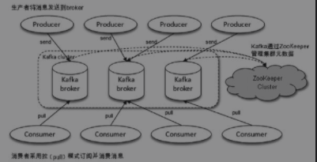
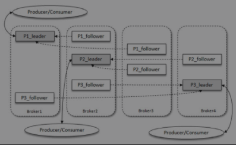
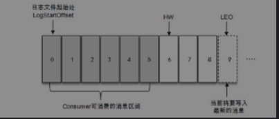
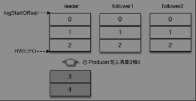
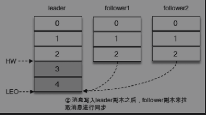
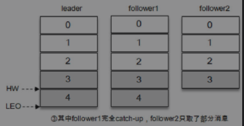
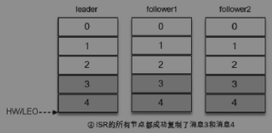

#### 基本概念

典型的kafka 体系包括

* 若干 producer：客户端，产生消息
* 若干 broker：kafka 服务器实例
* 若干consumer：服务端消费消息
* 以及一个 zookeeper： 管理元数据

##### 分区

主题是逻辑上的概念，将下消息以主题为单位进行归类，主题细分为多个分区，一个分区只属于单个主题，同一个主题下多个消息包含的消息是不同的，同一个主题下的每个分区可以分区在不同的 broker 中。增加分区可以实现水平扩展。

##### 副本

副本提供容灾能力，同一个分区中的不同副本保存的相同的消息，副本之间是“一主多从” 的关系，leader 中完成读写，flowller 从leader 中同步消息，副本处在不同的 broker 中，当leader 出现故障，那么从followe 中选举新的leader

##### 副本AR(assigned replicas)

所有副本称为 AR

##### 副本ISR(in-sync replicas)

所有和leader 副本保持一定程度（可忍受的）的同步成为 ISR

##### 副本OSR(out-of-sync replicas)

所有和leader 副本同步滞后过多的副本称为OSR

所以 AR = ISR + OSR

一般而言我们均希望 AR=ISR，并且OSR 为空。

leader 副本维护和跟踪 ISR 和 OSR 的副本，当ISR 中的副本落后太多那么就剔除到OSR中，同样OSR 中的同步跟上来了，那么也放到ISR 中，当leader 失败的时候，只会从ISR 中选举新的leader，而不会去OSR 中选举(到OSR 中选举这个也是可配置的)

#### LEO(log end offset) 和 HW(high watermark)

Leo ： 当前日志文件中下一条带写入消息的偏移量

hw: 消费者只能拉取到的 offset

#### ISR 与 HW以及 LEO 之间的关系

入上图有三个副本，他们的消息都是同步一一致的也就是 hw/leo 都一样，现在新来了2个消息

新的消息同步到leader中，现在follower 需要从leader 中同步消息。

follower 同步消息也不不一致的，如某一个时刻 follower1的消息同步完成，但是follower 的消息同步就延迟1个。

这个时候 hw 和 leo 就不一样了，用户可以读取的消息始终是 ISR 中最低的offset，也就是木桶理论。

最后消息是完全同步的。

