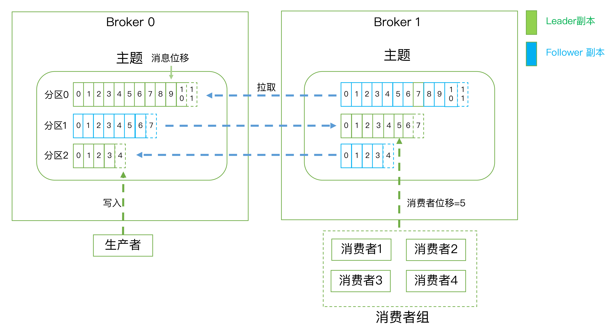

#### kafka 是什么

> Apache Kafka 是消息引擎系统，也是一个分布式流处理平台

针对第二点 `分布式流处理平台`

> 官网上明确标识 Kafka Streams **是一个用于搭建实时流处理的客户端库**而非是一个完整的功能系统。这就是说，你不能期望着 Kafka 提供类似于集群调度、弹性部署等开箱即用的运维特性，你需要自己选择适合的工具或系统来帮助 Kafka 流处理应用实现这些功能。
>
> Kafka 只是提供了一些简单的流式处理的算子组件。

针对第一点`消息引擎系统`

> * 点对点模型（Peer to Peer，P2P）
>
>   同一条消息只能被下游的一个消费者消费，其他消费者则不能染指
>
> * 发布订阅模型

#### kafka 的概念以及架构初识

* 主题

> 发布订阅的对象是主题，可以为每个业务、应用甚至没类数据都创建专属的主题。

* 生产者(是kafka 的客户端)

> 向主题发布消息的客户端，可以给一个或多个主题发送消息

* 消费者(是kafka 的客户端)

> 订阅消费主题中的消息

* kafka 中的服务端Broker

> 生产者和消费者均是客户端，有客户端那就需要有服务器，所谓服务器就是`Broker`, 一个kafka 集群是由多个Broker 组成，Broker 负责接收和处理客户端发送的请求，以及对消息进行持久化，他是有备份的(实现高可用)，分布在不同的机器上。

* 副本机制： 解决数据的持久化和不丢失

> 备份的思想很简单，就是把相同的数据拷贝到多台机器上，而这些相同的数据拷贝在 Kafka 中被称为副本（Replica），副本保持着相同的数据，但是有着不同的角色，kafka中有2类副本
>
> 1. 领导者 leader Replica： 对外提供服务
> 2. 追随者 follower Replica: 当leader Replica 挂了选一个 follower Replica 做 leader 对外提供服务
>
> 生产者总是会给 leader Replica 发送消息，消费者总是从leader Replica 消费消息，而Follower Replica 总是会给 leader Replica 发送消息，请求Leader Replica 将最新生产的消息发送给它，这样保持Follower Replica 和 Leader Replica 的同步。

* 分区机制： 解决伸缩性问题

> 数据量太大无法存储下来，那么将数据切分为多份，存储在不同的 Broker 中。
>
> kafka 中的分区是将主题划分为多个分区`partition`，每个分区是一组有序的消息日志，生产者的每条数据发送到一个分区中
>
> 上面提到的副本机制其实是对分区的副本。

* 消费组

> 多个消费者实力共同组成一个组来消费一组主题。
>
> 为什么要引入消费者组呢？主要是为了提升消费者端的吞吐量。多个消费者实例同时消费，加速整个消费端的吞吐量（TPS）
>
> **消费者组里面的所有消费者实例不仅“瓜分”订阅主题的数据**，而且更酷的是它们还能彼此协助。假设组内某个实例挂掉了，Kafka 能够自动检测到，然后把这个 Failed 实例之前负责的分区转移给其他活着的消费者。这个过程就是 Kafka 中大名鼎鼎的“重平衡”（Rebalance）。嗯，其实既是大名鼎鼎，也是臭名昭著，因为由重平衡引发的消费者问题比比皆是。

* 消费者位移

> 消费者在消费消息的过程中必然需要有个字段记录它当前消费到了分区的哪个位置上

---

#### 思考

* 请思考一下为什么 Kafka 不像 MySQL 那样允许追随者副本对外提供读服务？

> 1. kafka保存的数据和数据库的性质有实质的区别就是数据具有消费的概念，是流数据，kafka是消息队列，所以消费需要位移，而数据库是实体数据不存在这个概念，**如果从kafka的follower读，消费端offset控制更复杂**
> 2. 消息从主节点同步到从节点需要时间(保证PA，不保证C)，可能造成主从节点的数据不一致，因为follower 中的数据是从leader 中同步过来的，如果还没有同步过来，就来读flower 中会有数据不一致的问题，如果等flowwer 同步了在读，那么造成性能下降
> 3. 因为mysql一般部署在不同的机器上一台机器读写会遇到瓶颈，Kafka中的领导者副本一般均匀分布在不同的broker中，多副本同时读取(leader 是副本级别的，而不是服务器级别的)已经起到了负载的作用，同一个topic的已经通过分区的形式负载到不同的broker上了，读写的时候针对的领导者副本，但是量相比mysql一个还实例少太多，个人觉得没有必要在提供度读服务了

----

#### kafka 的一些参数

* 静态参数

> 所谓静态参数就是那些配置在 `server.properties`  文件中的参数，这些参数不管你是新增、修改还是删除。同时，你必须重启 Broker 进程才能令它们生效。

* broker 端参数--存储信息

> `log.dirs`： 指定broker若干文件目录路径，挂载不同的磁盘，没有默认值，需要用户亲自设定`/home/kafka1,/home/kafka2,/home/kafka3`
>
> `log.dir`: 只能设置一个。

##### Zookeeper 的作用

> 它是一个分布式协调框架，负责协调管理并保存 kafka 集群的所有**元数据信息**，比如集群中有哪些Broker 在运行，创建了哪些 Topic，每个Topic 都有多少分区以及这些分区的leader 副本都在哪些机器上等信息。

* Broker 连接相关的

> 监听器: 它是若干个逗号分隔的三元组，每个三元组的格式为
>
> <协议名称，主机名，端口号>
>
> 这里协议的名称可能是标准的名字，比如 `PLAINTEXT` 表示铭文传输，SSL 表示使用SSL/TSL 加密传输等。也可以自己定义协议名字等一旦你自己定义了协议名称，你必须还要指定listener.security.protocol.map参数告诉这个协议底层使用了哪种安全协议，比如指定listener.security.protocol.map=CONTROLLER:PLAINTEXT表示CONTROLLER这个自定义协议底层使用明文不加密传输数据。
>
> 主机名这里 Broker 端和 Client 端的配置最好是填写主机名。

* Topic 管理的参数

> `auto.create.topics.enable:` 是否允许自动创建 Topic，最好设置为 flase
>
> `unclean.leader.election.enable`： 是否允许 Unclean Leader 选举
>
> 这个参数也最好设置为 false，那么什么是`unclean leader` 呢？ 在当当前的leader 挂了的时候，从其他分区副本中选择leader，那么是不允许落后太多的副本精选leader的，而这些落后太多的副本就是`unclean leader`, 加入落后太多的副本成了leader，那么就意味着很多数据的丢失。
>
> `auto.leader.reblance.enable`： 是否允许定期进行leader 选举。
>
> 切换leader 的代价会很高，一般也会将这个参数关闭。

* 数据保留方面参数

> `log.retention.{hours|minutes|ms}`：这是个“三兄弟”，都是控制一条消息数据被保存多长时间。从优先级上来说 ms 设置最高、minutes 次之、hours 最低，一般而言hour 设置的会比较多谢
>
> `log.retention.bytes`：这是指定 Broker 为消息保存的总磁盘容量大小，这个参数既有broker端也有topic端，不过最终都是作用于topic的。如果自己使用的话一般设置为-1.表示有多少空间就可以使用多少空间，这个参数一般会使用在云上的多租户。
>
> `message.max.bytes`：控制 Broker 能够接收的最大消息大小。

#### Topic 级别参数

> 每个 topic 都可以设置自己的参数，这些参数作用在 topic 上会覆盖全局的那些参数。
>
> 2 个最终要的参数
>
> `retention.ms`：规定了该 Topic 消息被保存的时长。默认是 7 天，即该 Topic 只保存最近 7 天的消息
>
> `retention.bytes`：规定了要为该 Topic 预留多大的磁盘空间。和全局参数作用相似，这个值通常在多租户的 Kafka 集群中会有用武之地。当前默认值是 -1，表示可以无限使用磁盘空间。
>
> Topic 级别的参数，通过以下的2中方式可以设置
>
> * 创建 Topic 的时候设置
>
> > `bin/kafka-topics.sh --bootstrap-server localhost:9092 --create --topic transaction --partitions 1 --replication-factor 1 --config retention.ms=15552000000 --config max.message.bytes=5242880`
> >
> > 这里就完成了topic `transaction` 的参数 `retention.ms`  配置
>
> * 修改 Topic 的时候设置
>
> > `bin/kafka-configs.sh --zookeeper localhost:2181 --entity-type topics --entity-name transaction --alter --add-config max.message.bytes=10485760`
> >
> > 在实用的时候修改。
>
> 