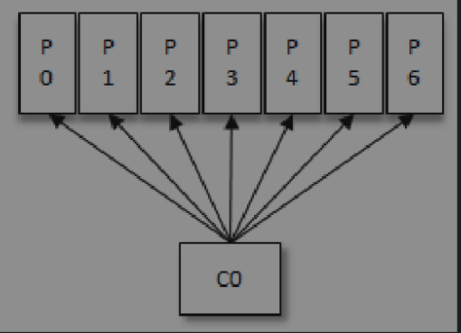

应用程序可以通过KafkaConsumer来订阅主题，并从订阅的主题中拉取消息

#### 消费者与消费者组


按照Kafka默认的规则，最后的分配结果是消费组A中的每一个消费者分配到1个分区，消费组B中的每一个消费者分配到2个分区，两个消费组之间互不影响。每个消费者只能消费所分配到的分区中的消息。换言之，**每一个分区只能被一个消费组中的一个消费者所消费**。


一起来看看消费者组内的消费者的变化时对应的分区分配的演变

假设目前消费者组内只有一个消费者CO，订阅了一个主题，这个主题中包含7个分区，那么这个时候



就是消费者 co订阅了这7个分区，它会收到来自7个分区的数据。

这个时候又来了一个消费者 c1


按照逻辑，需要将原来的消费者的co的部分分区分配给c1，消费者c0和c1负责各自分配到的分区，彼此之间没有逻辑上的干扰。

紧接着这个时候又来了一个消费者c2.继续将分区分配给c2


接着来消费者，那么分区不停的分配，知道消费者个数大于分区数，那么久会出现有的消费者消费不到数据。


点对点模式是基于队列的，消息生产者发送消息到队列，消息消费者从队列中接收消息。


发布/订阅模式在消息的一对多广播时采用

* 如果所有的消费者都隶属于同一个消费组，那么所有的消息都会被均衡地投递给每一个消费者，即每条消息只会被一个消费者处理，这就相当于点对点模式的应用。
* 如果所有的消费者都隶属于不同的消费组，那么所有的消息都会被广播给所有的消费者，即每条消息会被所有的消费者处理，这就相当于发布/订阅模式的应用。

---

#### 客户端开发

消费者客户端正常的逻辑如下：

1. 配置消费者客户端参数以及创建相应的消费者实例
2. 订阅主题
3. 拉取并消费消息
4. 提交消费位移
5. 关闭消费者实例

```java
Properties properties = new Properties();
properties.put(ConsumerConfig.BOOTSTRAP_SERVERS_CONFIG,"192.168.99.100:9092");
properties.put(ConsumerConfig.ENABLE_AUTO_COMMIT_CONFIG, false);
properties.put(ConsumerConfig.AUTO_COMMIT_INTERVAL_MS_CONFIG,"1000");

properties.put(ConsumerConfig.KEY_DESERIALIZER_CLASS_CONFIG,"org.apache.kafka.common.serialization.StringDeserializer");
properties.put(ConsumerConfig.VALUE_DESERIALIZER_CLASS_CONFIG, "org.apache.kafka.common.serialization.StringDeserializer");

// 消费者隶属的消费组的名称
properties.put(ConsumerConfig.GROUP_ID_CONFIG,"bigData1");

properties.put(ConsumerConfig.AUTO_OFFSET_RESET_CONFIG, "earliest");

KafkaConsumer<String, String> consumer = new KafkaConsumer<>(properties);

// 订阅多个主题，还可以以正则表达式订阅
consumer.subscribe(Collections.singletonList("first"));

while (true) {
  // 拉数据，给一个时间，在这段时间内拉取不到数据就停止轮询, 批量拉取

  ConsumerRecords<String, String> result = consumer.poll(Duration.ofMillis(1000));
	
  // 除此之外，还可以订阅特定的分区
  // consumer.assign(Arrays.asList(new TopicPartition("first", 0)));
  //消费数据 解析打印 ConsumerRecords
  for (ConsumerRecord<String, String> record : result) {
    String key = record.key();
    String value = record.value();
    System.out.println("key: "+ key + " value: " + value);
  }
  // 提交偏移
  consumer.commitSync();
}
```

#### 反序列化

Kafka所提供的反序列化器有ByteBufferDeserializer、ByteArrayDeserializer、BytesDeserializer、DoubleDeserializer、FloatDeserializer、IntegerDeserializer、LongDeserializer、ShortDeserializer、StringDeserializer。

```java
public class CompanyDe implements Deserializer<Company> {

    @Override
    public void configure(Map<String, ?> configs, boolean isKey) { }

    @Override
    public Company deserialize(String topic, byte[] data) {
        if (data == null) {
            return null;
        }
        
        if (data.length < 8) {
            try {
                throw new SerialException("aa");
            } catch (SerialException throwables) {
                throwables.printStackTrace();
            }
        }

        ByteBuffer buffer = ByteBuffer.wrap(data);
        int numLen, addressLen;
        String name, address;

        int nameLen = buffer.getInt();
        byte[] nameByte = new byte[nameLen];
        buffer.get(nameByte);

        addressLen = buffer.getInt();
        byte[] addressBytes = new byte[addressLen];
        buffer.get(addressBytes);

        name = new String(nameByte);
        address = new String(addressBytes);
        return new Company(name, address);
    }

    @Override
    public void close() {

    }
}
```

**一般情况还是不建议自定义序列化和反序列化因为这回增加生产者和消费者之间的耦合度**

在实用中，如果kafka 提供的满足不了需求，那么建议使用推荐使用Avro、JSON、Thrift、ProtoBuf或Protostuff等通用的序列化工具来包装，以求尽可能实现得更加通用且前后兼容。


#### 消息消费

kafka 的消息是基于拉模式的，是一个不断拉轮询的过程，消费者所做的就是不停的调用 poll 方法，可以传入一个时间，如果在这段时间内拉不到数据，那么进入阻塞时间。

拉回来的消息中有很多的信息

```java
ConsumerRecords<String, String> result = consumer.poll(Duration.ofMillis(1000))
```

一次拉回来所获得的所有消息集合。

每一个消息组成如下

```java
public class ConsumerRecord<K, V> {
    public static final long NO_TIMESTAMP = RecordBatch.NO_TIMESTAMP;
    public static final int NULL_SIZE = -1;
    public static final int NULL_CHECKSUM = -1;

    private final String topic;
    private final int partition;
    private final long offset; // 所属分区的偏移量
    private final long timestamp; // 表示时间戳的类型
    private final TimestampType timestampType;
    private final int serializedKeySize; // Key 经过序列化之后的大小
    private final int serializedValueSize; // Value 经过序列化之后的大小
    private final Headers headers; // headers表示消息的头部内容
    private final K key; // 消息的键和消息的值
    private final V value;
    private final Optional<Integer> leaderEpoch;

    private volatile Long checksum;
}
```

#### 位移提交

消费者使用offset来表示消费到分区中某个消息所在的位置。

每次调用`poll` 方法的时候，它返回的是还没有被消费国的消息集，要做到这一点就需要记录上一次消费时候的消费位移，并且这个消费位移必须做到持久化保存，而不是单单的保存在内存中。

在旧消费者客户端中，消费位移是存储在 `zookeeper` 中的，而在新的消费者客户端中，消费位移存储在 kafka 内部的主题 `__consumer_offsets` 中。

**自动位移提交的方式**在正常情况下不会发生消息丢失或重复消费的现象，但是在编程的世界里异常无可避免，与此同时，自动位移提交也无法做到精确的位移管理。

开启手动提交功能的前提是消费者客户端参数

```enable.auto.commit=false；auto.commit.interval.ms=5(默认)```

这个参数表示 Kafka Consumer 每隔 X 秒自动提交一次位移，这个值默认是5秒 ，Kafka 会保证在开始调用 Poll() 方法时，提交上一批消息的位移，再处理下一批消息

> 就是在自动提交间隔之间发生 Rebalance 的时候，此时 Offset 还未提交，待 Rebalance 完成后， 所有 Consumer 需要将发生 Rebalance 前的消息进行重新消费 

手动提交的方式。

对应于KafkaConsumer 中的

同步 `commitSync()`

> 提交由 `poll` 方法返回的最新位移值，它是一个同步操作，会一直阻塞等待直到位移被成功提交才返回，如果提交的过程中出现异常，该方法会将异常抛出 

异步 `commitAsync()`

> 调用 commitAsync() 之后，它会立即返回，并不会阻塞，因此不会影响 Consumer 的 TPS。另外 Kafka 针对它提供了callback，方便我们来实现提交之后的逻辑，比如记录日志或异常处理等等。由于它是一个异步操作， 假如出现问题是不会进行重试的，这时候重试位移值可能已不是最新值，所以重试无意义 


#### 再均衡

再均衡是说分区的所属权从一个消费者转移到另一个消费者的行为，它为消费者组具备高可用和伸缩性提供保障，使得我们可以方便安全的删除消费者组内的消费者或者往消费者组内添加消费者，不过再均衡发生期间，消费组内的消费者是无法读取消息的，也就是这段时间消费组内是不能消费消息的，当一个分区被分配带另外一个消费者时候这个消费者的当前状态会丢失，**这个时候会发送重复消费**，

比如消费者消费完某个分区中的一部分消息时还没有来得及提交消费位移就发生了再均衡操作，之后这个分区又被分配给了消费组内的另一个消费者，原来被消费完的那部分消息又被重新消费一遍，也就是发生了重复消费。一般情况下，应尽量避免不必要的再均衡的发生。

在订阅主题的时候，可以给主题中一些方法，这些方法是在该主题发生再均衡的时候执行的方法，用于一些准备或者收尾的动作

```java
subscribe（Collection＜String＞ topics，ConsumerRebalanceListener listener）
subscribe（Pattern pattern，ConsumerRebalanceListener listener）
```


#### 多线程实现

KafkaProducer是线程安全的，然而KafkaConsumer却是非线程安全的。KafkaConsumer中定义了一个 `acquire()`方法，用来检测当前是否只有一个线程在操作，若有其他线程正在操作则会抛出ConcurrentModifcationException异常。

KafkaConsumer中的每个公用方法在执行所要执行的动作之前都会调用这个`acquire()`方法，只有wakeup（）方法是个例外


