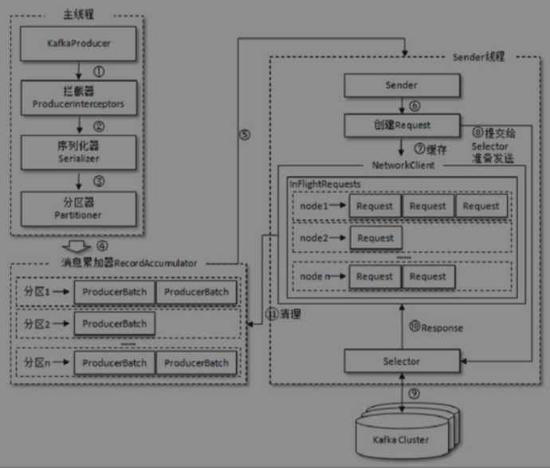

#### 消费者

##### 构建消息对象

```java
public class ProducerRecord<K, V> {
    private final String topic;
    private final Integer partition;
    private final Headers headers; 
    private final K key;
    private final V value;
    private final Long timestamp;
}
```

`header` 消息头部，大多是设置一些和应用相关的信息。

`key`： 消息的附加信息，可以用来计算分区号，从而将消息发往特定的分区。


#### 必要的配置

```java
Properties properties = new Properties();
properties.put(ProducerConfig.BOOTSTRAP_SERVERS_CONFIG, "192.168.99.100:9092");

properties.put("key.serializer", "org.apache.kafka.common.serialization.StringSerializer");
properties.put("value.serializer", "org.apache.kafka.common.serialization.StringSerializer");

```

`BOOTSTRAP_SERVERS_CONFIG`： 该参数用来指定生产者客户端连接Kafka集群所需的broker地址清单，具体的内容格式为host1：port1，host2：port2可以设置为1个，kafka 可以根据这个找到其他的，不过最好设置超过1个，防止宕机。

`kafkaProducer` 是线程安全的，可以在多个线程中共享单个实例，也可以将它进行池化来供其他线程调用。

#### 发送消息

```java
// 创建生产者对象
KafkaProducer<String, String> producer = new KafkaProducer<>(properties);

// 发送数据
for (int i = 0; i < 10; i++) {
  Future<RecordMetadata> first = producer.send(new ProducerRecord<>("first", "SS","atgugui: " + i));

  /*
     send 是异步发送，返回一个Future，当调用
     get 方法会阻塞线程，执行结束后才执行其他线程
  */
  RecordMetadata recordMetadata = first.get();
}
```

Send 方法默认是异步的，会出现消息发送出去了，但是 kafka 并没有收到消息的问题，如果在之后再调用 get 方法，那么producer 就会等消息发送成功之后才算执行结束，确保消息被kafka 接受成功。

send 还有一个方法

```java
public Future<RecordMetadata> send(ProducerRecord<K, V> record, Callback callback)
```

在发送的时候给一个回调函数。发送成功那么就会回调回调函数，否则抛出异常。

```java
producer.send(new ProducerRecord("first", 0,"key","=+=:" + i), (recordMetadata, e) -> {
     if (e == null){
         // 发送成功
         System.out.println("partition: "+ recordMetadata.partition() + " offset: " + recordMetadata.offset());
     } else {
         System.out.println("发送消息失败");
         e.printStackTrace();
      }
  });
```


#### 序列化

消息发送给kafka 需要转换为字节数组，同样消费者获取消息也需要将字节数组反序列化，使用的序列化器和反序列化器是需要一一对应的，

序列化抽象方法

```java
public interface Serializer<T> extends Closeable {

		// 配置当前类，创建kafkaproducer实例的时候调用的。确定编码类型
    void configure(Map<String, ?> configs, boolean isKey);

  	// 完成序列化
    byte[] serialize(String topic, T data);
    default byte[] serialize(String topic, Headers headers, T data) {
        return serialize(topic, data);
    }

    @Override
    void close();
}
```

当kafka 自定义的序列化类无法满足需求的时候，可以使用自定义的序列化器或者使用开元的序列化工具Avro、JSON、Thrift、ProtoBuf和Protostuff等。

```java
public class Company implements Serializer<Company> {
    private String name;
    private String address;
    
    @Override
    public void configure(Map<String, ?> configs, boolean isKey) {
        // 可以不配置，默认使用utf-8 编码
    }

    @Override
    public byte[] serialize(String topic, Company data) {
        if (data == null) return null;
        
        byte[] name, address;
        try {
            byte[] nameBytes = data.name.getBytes("utf-8");
            byte[] addressBytes = data.address.getBytes("utf-8");

            ByteBuffer buffer = ByteBuffer.allocate(4 + 4 + nameBytes.length + addressBytes.length);
            buffer.putInt(nameBytes.length);
            buffer.put(nameBytes);
            
            buffer.putInt(addressBytes.length);
            buffer.put(addressBytes);
            return buffer.array();
            
        } catch (Exception e) {
            
        }
        return new byte[0];
    }

    @Override
    public void close() {
    }
}

// 使用的时候配置
properties.put("key.serializer", "kafka.producer.Company");
```

#### 分区器

消息发送到 broker 需要经过 拦截器、序列化器、分区器。

经过序列化之后需要经过分区器确认需要发送的分区，kafka 中有提供默认的分区器, 默认是轮询的方式分配消息到分区中。

```java
public class partition1 implements Partitioner {

    /*
       这里又必要查看下，默认的分区 DefaultPartitioner 的方法
       cluster 可以拿到当前集群的一些信息
     */
    @Override
    public int partition(String topic, Object key, byte[] bytes, Object value, byte[] bytes1, Cluster cluster) {
		// Integer partitionCnt = cluster.partitionCountForTopic(topic);
		// return key.hashCode() % partitionCnt;
		// 这里具体如何分区写数据，是根据具体业务逻辑去写的
        return 1;
    }

    @Override
    public void close() {
    }

    @Override
    public void configure(Map<String, ?> map) {
      // 方法主要用来获取配置信息及初始化数据
    }
}
```

#### 拦截器

在序列化和计算分区前调用，用来在消息发送前做一些准备工作，比如按照某个规则过滤不符合要求的信息，修改消息的内容等。也可以在发送回调逻辑前做一些定制化的需求，

其实现也是比较简单，主要就是实现接口

```java
public interface ProducerInterceptor<K, V> extends Configurable {
  // 获取配置信息和初始化数据时候调用
  void configure(Map<String, ?> configs);
  
  // 该方法封装进send方法中 ，即它允许在用户主线程中，Producer确保在消息被
  // 序列化以及计算分区前调用该方法，用户可以在该方法中对消息做任何操作
  // 但最好保证不要修改消息所属的 topic 和 分区，否则会影响目标分区的计算
  public ProducerRecord<K, V> onSend(ProducerRecord<K, V> record);
  
  // 该方法会在消息从 RecordMetadata 成功发送到 kafka Broker 之后
  // 或者在发送过程中失败时候调用，优先于onsend callback 的调用 并且通常都在 producer 回调逻辑出发之前
  // 它运行在 producer 的IO线程中，因此不要在该方法中放入很重的逻辑
  // 否则会拖慢 producer 的消息发送效率
  public void onAcknowledgement(RecordMetadata metadata, Exception exception);
  public void close();
}
```

实现自定义的拦截器

```java
public class TimeInterceptor implements ProducerInterceptor {
    @Override
    public ProducerRecord onSend(ProducerRecord record) {
        String value = (String) record.value();
        long timeStamp = System.currentTimeMillis();
        String newValue = String.format("{%d}:{%s}", timeStamp, value);

        // record 对象是不可改的, 需要新创建
        return new ProducerRecord<>(record.topic(),record.partition(), record.key(), newValue);
    }

    @Override
    public void onAcknowledgement(RecordMetadata metadata, Exception exception) {

    }

    @Override
    public void close() {

    }

    @Override
    public void configure(Map<String, ?> configs) {

    }
}
```

然后在配置中添加拦截器

```java
properties.put(ProducerConfig.INTERCEPTOR_CLASSES_CONFIG,
                Arrays.asList("kafka.interceptor.TimeInterceptor",
                        "kafka.interceptor.CounterInterceptor"));

// 可以指定多个拦截器，生成拦截器链
```

如果拦截链中的某个拦截器的执行需要依赖于前一个拦截器的输出，那么就有可能产生“副作用”。设想一下，如果前一个拦截器由于异常而执行失败，那么这个拦截器也就跟着无法继续执行。在拦截链中，如果某个拦截器执行失败，那么下一个拦截器会接着从上一个执行成功的拦截器继续执行。

---

#### 客户端的整体架构



上结构图中看出，客户端主要有2个线程在运行，一个主线程和 send 线程，主线程就是kafkaProducer 创建消息，然后通过拦截器、序列化器、分区器的作用之后缓冲到消息累加器。sender 将消息从消息累加器中获取消息然后发送到kafka 中。

消息累加器累加消息，供sender 可以批发送消息。它是一个双端队列，每一个分区都维护这一个双端队列RecordAccumulator中的双端队列 Deque 中放着 ProducerBatch，即Deque＜ProducerBatch＞，主线程往队列尾部添加消息，send 从头部获取消息

图中 其中Node表示Kafka集群的broker节点

InFlightRequests保存对象的具体形式为 Map＜NodeId，Deque＜Request＞＞，它的主要作用是缓存了已经发出去但还没有收到响应的请求（NodeId 是一个String 类型，表示节点的 id 编号）

#### 生产者中的一些参数

这些参数一般是不需要修改的，理解这些参数可以更合理的使用客户端。

##### acks

指定分区中必须要有多少个副本收到这条消息，之后生产者才会认为消息被成功写入了。acks 是生产者中非常重要的一个参数，它涉及到消息的可靠性和吞吐量之间的权衡，有三种类型的值(都是字符的)

acks=1(默认)，即生产者发完消息之后，只要leader 副本收到消息就返回了，也会有丢失消息的风险，如leader 收到消息，但是flower 同步消息的时候leader 挂了，这个时候重新选举出来的leader 就不会包含这个消息，这个消息就丢失了。

acks=0, 生产者发送完消息不需要等待任何服务器端的返回，这个配置可以实现最大的吞吐量，但是消息丢失的可能性会更大。

acks=-1/all, 生产者发送完消息之后需要等待所有的 ISR 中的副本都成功写入消息，才收到服务器的成功响应。可靠性最强。


##### max.request.size

限制客户端能够发送的最大值，默认值为 1048576B，即1MB。这个参数不建议修改，因为还需要配合 broker 端的 message.max.bytes一起修改，比如将broker端的message.max.bytes参数配置为10，而max.request.size参数配置为20，那么当我们发送一条大小为15B的消息时broker 就无法接受消息。


##### retries和retry.backoff.ms

retries 配置生产者重试的次数，默认值为0

retry.backoff.ms 有关，这个参数的默认值为100，它用来设定两次重试之间的时间间隔，避免无效的频繁重试


#### compression.type

配置消息的压缩方式，默认是None，该参数还可以配置为“gzip”“snappy”和“lz4”