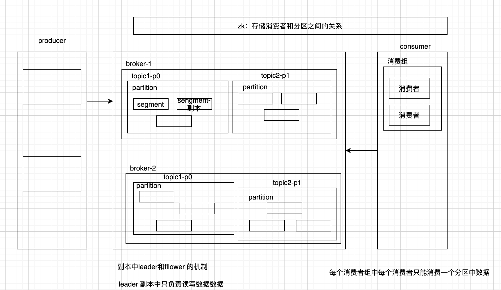

#### Kafka 的用途有哪些，以及使用场景

* 消息系统

> 和传统的消息系统都具备**系统解耦**，冗余存储，**削峰限流**，缓冲、异步通信等功能，其次还提供了大多数消息系统都难以实现的顺序性保证以及回溯消费的功能

* 存储系统

> kafka 可以将消息数据以分布式的方式存放到磁盘。通过配置存储方式可以实现永久存储

* 流式处理平台

> Kafka 不仅仅为流式处理框架提供可靠的数据来源，还提供了一个完整的流式处理平台，比如窗口、连接以及聚合操作等。

#### 为什么使用 kafka

> 如果生产者生产的数据大于下游消费的速度，那么数据先写到kafka 中，缓存到一定程度然后写到下游存储或者让下游消费，使得上下游解耦，或者减轻下游系统的负载。
>
> kafka 支持不同业务员的场景，天然的和流处理系统的集成。

#### 简单介绍下 kafka

#### SparkStreaming 消费 kafka 的2种方式

> * receiver 方式
>
>   Receiver 通过调用kafka 的高阶api来获取kafka中的数据，会先加载到sparkexecutor 的内存里面，如果一时间数据过多可能会OOM，然后sparkStreaming 启动的Job 就会处理这批数据。这种方式默认是无法保证数据的高可用的，可能会应为底层节点的失败而丢失数据，如果需要保证数据的高可靠，需要开启WAL预写日志，WAL机制会将消费到的数据往分布式文件系统中写一份数据，这样就可以保证底层节点就算失败，数据不丢失。
>
>   spark中保存的offset 和 kafka 高阶api (zookeeper)中的offset 不一致
>
> * direct
>
>   更加健壮机制，定时从kafka topic + partition 获取最新的offset，从而定义每个batch的offset 范围，通过调用kafka 底层的api 指定offset获取数据。
>
>   仅消费一次且消费一次的事务
>
>   简化并行处理，读取多个kafka partition 数据，那么spark 在创建rdd 的时候rdd 中的分区和和kafka 中的分区是对应关系

#### Kafka 中的 ISR、AR、OSR 等分别代表什么

#### Kafka 中的 HW LEO LW 分别代表什么

> 注意 HW = min(LEO from ISR)

#### Kafka 中是如何体现消息的顺序的

> 和分区的的关联。
>
> 分区的有序性，topic 下的无序

#### Kafka 中的分区器、序列化器、拦截器，以及处理顺序

> 注意先解释解释三者的功能。
>
> 序列化: 对象变为字节数组

#### 客户端的整体框架是咋样的，有几个线程

> 主线程和 sender 线程

#### 新旧 Kafka 客户端的区别

> 注意区别， offset 放在 Zookeeper 中/放在 Beoker 中
>
> Zookeeper 不适合频繁的读写

#### 消费组中的消费者个数如果超过 topic 的数量，那么就会有消费者消费不到数据？这是否正确，如果正确那么有什么 hack 的手段？

> 一般而言当消费者组中消费者个数大于分区个数，就会有消费者消费不到数据
>
> 可以公国自定义 AbstractPartitionAssignor 实现消费策略，从而实现同一组消费内的任意消费者都可以消费订阅主题。

#### 说一些造成重复消费的例子

* `rebalance` 消费者自动提交偏移量导致

> 消费者A，第一次poll 了100条数据，刚好这个时候到了提交偏移量的时候，提交了偏移量，偏移量到了 100+1,在后面的操作中，消费了 100 条数据，但是这个时候还没有到提交偏移量的时候，这个时候由于添加进来消费者，发生了重平衡，更好有另外一个消费者B消费该分区的数据，但是消费者A 还没有提交第二次的消费便宜，而这个时候消费者B就重复消费了消费者A 消费的东西。

* 消费者手动提交消费

> 和上面的例子一样，当poll 了消费，然后在消费，在消费的过程中发生了异常，或者宕机，或者发生了在平衡，而这个时候偏移量还没有提交，那么下次再 poll 消费的时候就会发生重复消费。

#### 哪些情况会造成漏消费

也就是没有消费

* 在设置 `ACK = 1(default)` 的时候

> 生产者发送了消息，leader 收到了信息，然后就返回了收到消息的通知，但是这个时候刚刚好leade 挂了， follower 也没有从leader 中同步来信息，这个时候这个消息就会丢失。

* 在设置 `ACK = 0` 的时候

> 也就是生产者发后就忘，不管broker 收到没有，只要生产者发送完消息，就当broker 以及收到消息了，这个时候实现最大吞吐，但是最容易导致消息丢失

* 在设置 `ACK = -1/all` 的时候 + `partition 副本=1`

> 这个 ack 值下，需要等所有的 `ISR` 都均收到才收到消息，才算发送成功，但是这里partition 的分区只有1，那么就退回到 `ack=1` 的情况。

#### 如何实现可靠性

* 生产者可靠性保证

> `ack=all`, retries = N,

* broker

> Replication.factor 副本至少 > 1
>
> min.insync.replicas > 1 ISR 副本数量至少2个

* 消费者

> 手动消费偏移
>
> 消费完在提交

