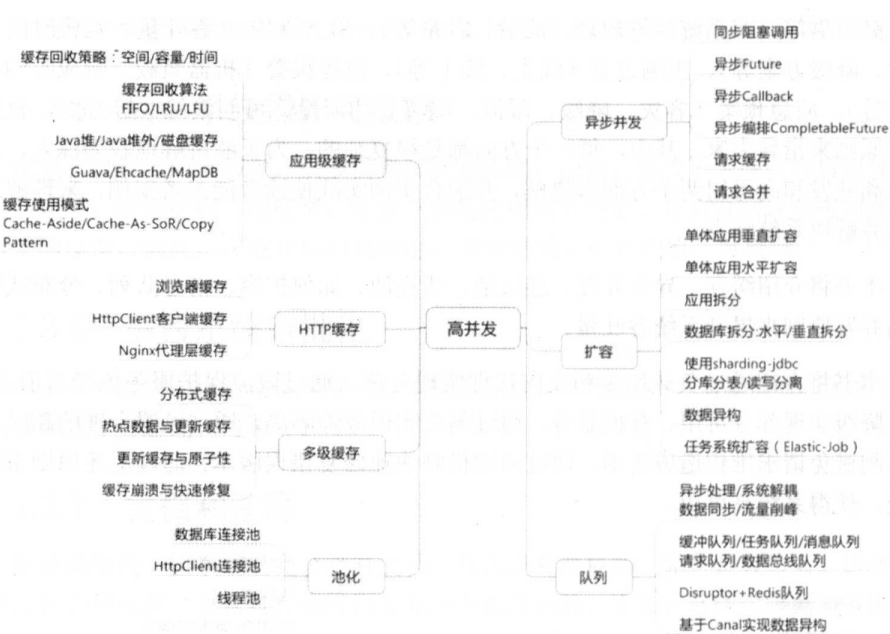
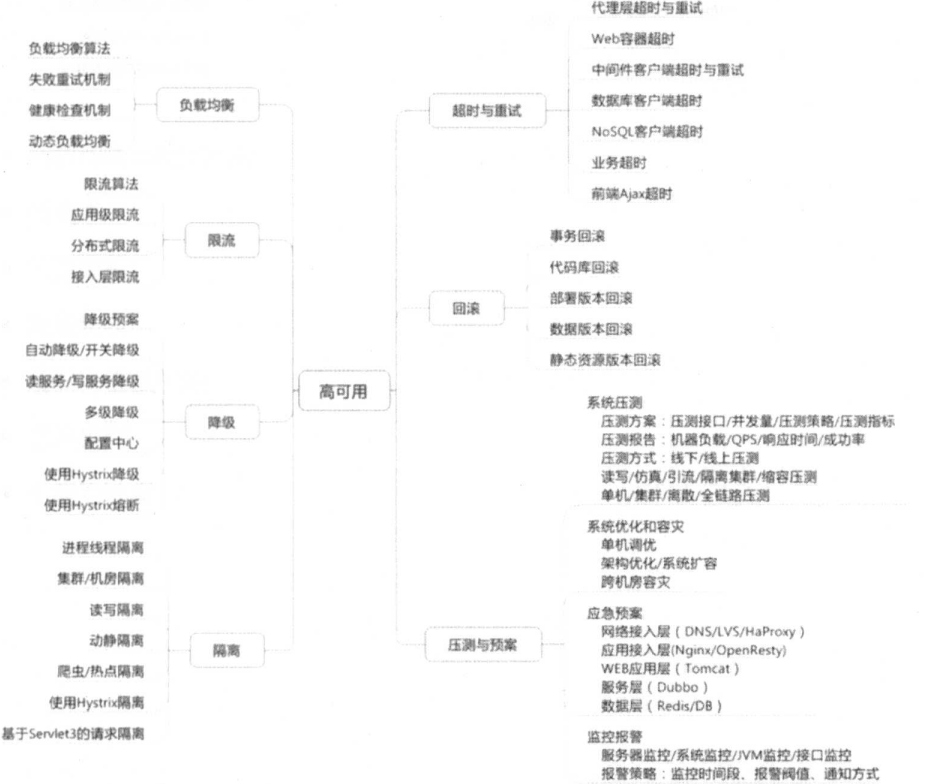
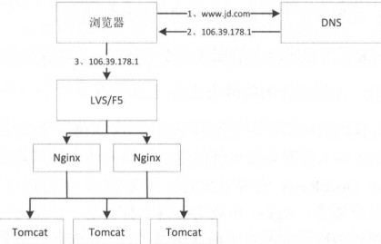
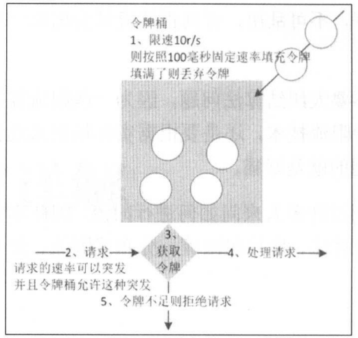
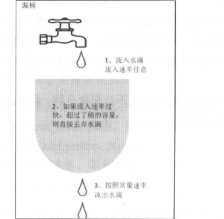

### 系统设计的一些原则

一个系统不是一下子就设计完美的，在具有有限资源的情况下，一定是先解决当下最核心的问题，预测并发现未来可能出现的问题，一步步解决最痛点的问题，系统设计是一个不断迭代的过程，在迭代的过程中发现并修复问题。

满足需求的系统是不断迭代优化出来的，是一个持续的过程，不存在完美的**架构银弹**。在最开始做好一个号的基础的系统设计，实现风控把控和进度风险，预测并规划未来，**不要过度设计**，从迭代中演进和完善。

在设计系统时候，需要多考虑**墨菲定律**

* 任何事情都没有表明看起来那么简单
* 所有的事情都会比你预计时长长
* 可能出错的事总会出错
* 如果担心某种事情发送，那么它就更有可能发生

> 0事故源于百次的关注

系统划分时，也要思考康威定律

* 系统架构师公司组织架构的反映
* 应该按照业务闭环进行系统拆分/组织架构划分，实现闭环/高内聚/第耦合，减少沟通成本
* 如果沟通出现问题，那么就应该考虑进行系统和组织架构的调整
* 在合适时机进行系统拆分，不要一开始就把系统/服务拆分的非常细，虽然闭环，但是每个人维护的系统多，维护成本高

如果刚开始遇到的不是核心问题，那么不要复杂化系统设计，但先行规划和设计是由必要的，**对现有问题有方案，对未来架构有预案。**


#### 高并发原则

* 无状态

应用需无状态，这样应用容易水平扩展；配置文件有状态，例如不容的机房读取不同的数据源，通过配置文件/配置中心指定。


* 拆分

从一开始大而全的系统进行服务拆分，可以按照：

1. 系统维度拆分(业务/系统功能)
2. 功能维度：如优惠券系统拆分为后台券创建系统、领券系统、用券系统
3. 读写维度：根据读写比例特征拆分，如拆分读服务可以考虑根据使用缓存提升性能，写的量大考虑分库分表。
4. 模块维度：代码维度拆分


* 服务化

进程内服务 -> 单机远程服务 -> 集群手动注册服务 -> 自动注册和发现服务 -> 服务的分组/隔离/路由 -> 服务治理限流/黑白名单


* 消息队列

用来解耦系统，解除同步调用，服务间异步处理、流量削峰/缓冲。不过在使用消息队列的时候需要主机生产消息失败、失败后的重试次数，以及最后失败后后续处理失败。消息重复问题，特别是分布式消息队列中。


* 大流量缓冲

大促的时候流量会比平常高N倍，此时需要特殊的设计保证系统的平稳度过，解决的手段一般都是**牺牲强一致性**

> 平稳度过意味着保持高可用，每个系统都是可用的，这就是A，另外是分布式系统，也就是P，而CAP是不能同时满足的，所以牺牲C。


* 数据校对

消息异步机制的场景下，会存在消息的丢失，需要考虑数据校对和修正来保证数据的一致性和完整性


* 缓存银弹

缓存对于读服务来说是对抗**流量** 的银弹：可以是浏览器缓存、APP客户端缓存、CDN缓存、

接入层缓存：例如使用Nginx搭异常介入层，这里可以实现缓存、应用层本地缓存(这由的缓存性能最好，没有网络消耗，是缓存小数据量最好方式)

分布式缓存：小数据了量在本地缓存无法存储的情况下，使用分布式缓存


#### 高可用原则

* 降级

要有一个降级开关，这个开关推可以是在数据库、也可以是在配置中心，可以控制只读本地缓存中内容

或者业务降级，保证核心功能，例如能下单、能支付，并保证数据的最终一致性，其他功能可以直接返回一个提示页面/文字。


* 限流

防止恶意请求量，恶意攻击或者防止超过系统峰值，可以考虑

1. 恶意请求只访问到 cache
2. 穿透到后端应用的流量可以考虑使用`nginx` 的`limit` 模块处理
3. 恶意IP使用`nginx` deny 屏蔽


* 可回滚


#### 业务设计原则

* 防重设计
* 幂等设计
* 流程可定义
* 状态和状态机


#### 总结

系统设计考虑的比较多，保证系统高并发、高可用、高可靠等。

系统容量设计(容量、流量)、

SLA指定(吞吐、响应时间、可用性、降级)、

压测方案(线上、线下)、

监控报警(机器负载、响应时间，可用率)、

应急预案：容灾、降级、限流、隔离、切流量、可回滚


后续内容主要以以下几点展开：缓存、异步并发、连接池、如何扩容、消息队列、分布式任务。

主要是从高并发和高可用角度。







---


### 高可用

#### 负载均衡和反向代理

在搭建集群的应用系统的时候，例如在访问`www.jd.com` 的时候，请求先到了DNS域名服务器，域名服务也具有一定的负载均衡的功能，例如我是在北京访问的，那么就会把获取靠近北京的机房的对外统一服务的`F5/LVS` 的统一`IP`，访问该`IP`然后进入到后端的业务集群的前置负载均衡器`nginx`,然后再到达应用服务器。



对于小流量，并发低的情况就不需要`LVS/F5` 直接使用一台`Nginx` 直接对外提供服务，作为唯一入口就可以了，单台`Nginx` 理论上可以有10万的并发。

但是并发在高一点就需要将`Nginx` 集群化了，不管如何集群化，总是需要一个统一的入口，这个入口接入所有请求，那么就需要考虑比单台`Nginx` 可支持并发更高的的入口，此时可以考虑`LVS/H5`

> `LVS` 是基于linux 操作系统，系统级别的软负载均衡，F5是硬件负载均衡，其可支持并发可以到达100万，是最强的负载均衡

所以上面截图的架构师一般生产的负载均衡架构图。

`nginx` 可以提供的功能有：负载均衡、故障转移、失败重试、容错、健康检测等

##### Nginx

* `upstream` 配置

`upstream` 的配置可以完成负载均衡和反向代理

```nginx
upstream backend {
  server 192.168.61.1:9080 weight=1;
  server 192.168.61.2:9080 weight=1;
}

location / {
  proxy_pass http://backend
}
```

凡是到达到根目录下的请求，都会被转发到`192.168.61.1:9080、192.168.61.2:9080` 两个服务器上。

负载均衡算法可以支持的有:

1. `round-robin`: 轮训，默认

2. `ip_hash`: 根据客户`IP` 进行负载均衡，相同的`IP` 会到达同一个`upstream` 的`server`.

3. `hash key [consistent]` 对某一个key进行哈希

   ```nginx
   upstream backend {
     hash $uri
     server 192.168.61.1:9080 weight=1;
     server 192.168.61.2:9080 weight=1;
   }
   ```

   存在的问题是，当添加/删除一个服务器会导致很多key被重新负载到不同的服务器，服务端后端可能会出现问题

4. `least_conn`: 将请求负载到最少活跃的服务器上


* 失败重试

```nginx
upstream backend {
  server 192.168.61.1:9080 max_fails=2 fail_timeout=10s weight=1;
}
```

当在`fail_timeout` 的时间内失败了`nax_fails` 次请求，则认为改上游服务器不可用，然后会去掉改服务器，`fail_timeout` 时间后会再次将该服务器加入到服务列表中来。

* 心跳检查


* 长连接

配置`nginx` 到服务器直接的长连接

> 具体对于`nginx` 的使用和学习，需要专门的课程去学习，做笔记，这里请学习架构内容。

#### 隔离术

将系统/资源分隔开，系统隔离是为了系统在发送故障时候，能限定椽笔范围和影响范围，也就是在发生故障的时候不会出现**雪球效应**。

保证服务间相互不影响其可用性，可以使用的手段有: 线程隔离、进程隔离、集群隔离、机房隔离、读写隔离、快慢隔离、动静隔离、爬虫隔离等。

在出现问题的时候可以考虑赋值均衡路由、自动/手动切换分组或者降级手段保证可用性。

* 进程隔离

  就是将系统拆分为多个子系统，实现物理隔离

* 读写隔离

  例如`Redis` 和 `MySQL` 的副读主写的分离架构，当主集群发送故障的时候，整个系统还是可以读的，不影响用户访问

* 动静隔离

  就是将`JS、css` 这类静态资源放在`CDN` 中，防止对于这些静态资源的请求到达服务器，增加服务器的压力

* 热点隔离

  对于秒杀、抢购这些访问量高于平均访问量的局部业务模块尝做成试独立系统进行隔离，或者因为外界事件导致读热点，尝试使用多级缓存搞定，而写热点一般可以通过缓存+队列来削峰。

`Hystrix` 分布式系统的隔离方案，其功能有

1. 提供线程和信号量的隔离

   > 为不同的接口分配一定的资源，当自己的资源用完直接返回错误，而不是去抢占别人的资源
   >
   > 防止在共享线程池的时候，某个接口由于响应变慢，一直占着线程，长时间就会占满线程池，如果线程池分开后就不会有这个问题了，单一接口占满了线程池，也不影响其他接口

2. 优雅降级

   > 当一些接口访问超时后，或者出现故障时可以屏蔽掉改接口，或者接口直接返回缓存的脏数据
   >
   > 服务降级一般是从整体的负荷考虑，主动降级；服务还启动着，但是服务中的某个接口出现故障，服务主动处理该接口 

3. 熔断机制，使服务快速失败以及恢复

   > 一些故障导致服务可用率下降，及时熔断，快速失败。
   >
   > 服务熔断一般是某个服务挂掉了引起的，服务整体停止对外服务，如果不停止可能会引起雪崩。

它通过这些方式来组织级联失败并保证系统弹性、可用。

#### 限流详解

通过对并发访问进行限速或者二在一个时间窗口内的请求进行限速来保护系统，一旦达到限制速率则可以拒绝服务或者定向到错误页面告知资源没有了、或者排队等候(如秒杀)。

在压测的时候可以找出系统的处理峰值，然后设定峰值阈值来防止当系统过载的时候，通过拒绝处理过载的请求来保障系统可用。

一般的限流方法有：

1. 现在总并发数，如数据库连接池
2. 限制瞬时并发数
3. 限制时间窗口内的平均速率

限流和缓存以及降级是处理高并发问题上的三大主要手段。

限流算法有：令牌桶、漏桶。计数器也可以粗暴的用于限流。


##### 令牌桶

存放固定令牌的桶，安装固定速率网里面添加令牌

1. 假设速率是2r/s, 按照每500ms的固定速率网桶中添加令牌
2. 桶中最多存放b个令牌，当桶满后，新添加的令牌被丢弃或者拒绝
3. 当一个n字节大小的数据包到达，那么就从桶里面删除n个令牌，接着数据包被发送到网络中
4. 如果桶中的令牌不足n个，则不会删除令牌，数据包会被限流，被丢弃或者放到缓冲区



只要桶内有令牌，那就可以进来请求，也就是可以处理突发情况，

##### 漏桶算法

作为一个计量工具，可以用于流量整形和控制

1. 一个固定容量的漏桶，安装常量固定速率流出水滴
2. 如果桶是空的，则不需要流出水滴
3. 可以任意速率流入水滴到漏桶
4. 如果流入水滴超出桶的容量，则流入的水滴溢出了(被丢弃)，而同容量不变



漏出水滴的速率是固定的，对突发的请求具有一定的平滑作用。


对于一个系统来说，总会有一个QPS的上限，当超过这个上限就会拖垮系统，所以需要对系统进行过载保护。

可以现在总资源数，例如数据库的连接，分配给应用A的连接数是100，当超过100的时候就直接排队或者抛出异常。

在抢购等业务中接口会遇到突发访问量激增情况 ，需要对该接口的总并发/请求数进行细粒度的限流。

还可以现在接口在时间窗口内的请求数

可以平滑某个接口的请求数，在面对突发访问激增的情况，对突发激增的访问进行整形，让系统以平均速率进行处理

在`Guava` 包中提分的限流算法，以上的功能都具有，只不过都是单机的。

分布式限流：

可以使用`Redis+lua` 和 `Nginx + Lua` 实现。


节流，在一段时间内来的相同的请求，值响应最后一个。

#### 降级特技

当访问激增，或者服务器/数据库出现问题的时候，响应长时间不返回，当影响到核心业务的时候，此时使用降级保证核心服务的可用，即使系统是有损的，但是核心业务要保证。


在降级之前需要对系统功能进行梳理，看看系统是不是可以丢卒保帅，梳理出哪些可以降级，哪些是必须要誓死保护的。


#### 超时和重试


#### 回滚机制


#### 压测和预案


---

### 高并发

#### 应用级缓存

缓存就是让数据更加解决使用者，目的是让访问速度更快，其工作机制是从缓存中读取数据，如果没有在从慢速设备上读取实际数据并同步到缓存。

缓存命中率 = 从缓存中获取数据次数/总读取次数。


缓存回收策略：

1. 基于空间，如缓存设备存储空间达到上限时候，就删除数据。
2. 基于实际：TTL(Time to live)存活期，过了这个时间就删除；TTI(time to idle) 空闲期，缓存数据太久没有被访问后移除缓存


Java的缓存类型

1. 堆缓存，没有序列化和返序列化的开销，最快的缓存，缺点也明显数据量很大的时候GC暂停时间比较常，一般使用软/弱引用存储这些缓存对象。可以使用`Guava Cahe、Ehcache、MapDB`
2. 堆外缓存，减少GC时间，支持更大的缓存空间，但有序列化和返序列化
3. 磁盘缓存
4. 分布式缓存，解决上述三种缓存的单机容量问题， 以及数据一致性问题


多级缓存，本地缓存 -> 分布式缓存。

现从本地缓存中去，取不到再到分布式缓存中去取。另外本地缓存过期时间应该比分布式中的时间少一半，防止分布式环境下多实例本地数据不一致问题

##### 缓存使用模式实践

`SoR(system-of-record)：` 记录系统，也就是实际原始存储数据的系统。

主要有两大类：

`Cache-Aside:` 业务代码围绕着`Cache` 写，业务代码直接维护缓存，在实现的时候：

写场景

1. 先从缓存中获取数据
2. 如果缓存没有命中，则回溯到`SOR` 获取源数据
3. 获取到数据后，将数据写到缓存中

读场景

1. 向将数据写到`SOR`
2. 写入成功后同步到缓存

`Cache-Aside` 这种方式适合使用`AOP` 去实现。


`Cache-As-SoR`

把`Cache` 看做是`SOR`，所有的操作都是对着`Cache` 进行，然后`Cache` 在委托给`Sor`进行真实的读/写，在业务代码中只看到`Cache` 的操作，看不到关于`SOR` 相关的代码。在`Guava` 中都是由这种功能的

它有三种实现方式


* `Read-through`

  业务代码调用`Cache`，如果`Cache` 不中，那么由`Cache` 去回溯`SoR`，

  `Guava` 中的功能`CacheLoader`

* `Write-through`

  称为穿透写模型/直写模式，业务代码调用`Cache`去修改或者新增数据，`Cache` 服务写缓存和写`SOR`

* `Read-behind`

  回写模式，不同于`Write-through`的同步写`SOR` 和`Cache`，它是异步的，还可以实现批量写。

#### HTTP缓存

#### 多级缓存

缓存算法、缓存热点数据、缓存更新策略、更新缓存和原子性、缓存崩溃、款速恢复。

基本都是解决读性能的问题。

通过解决上述问题，从架构和提供缓存命中率层讨论缓存方案。

多级缓存就是在不同系统层级进行数据缓存，提升访问效率

#### 连接池详解

#### 异步并发

#### 扩容

#### 队列

异步处理、系统解耦、数据同步、流量削峰、扩展、缓冲


