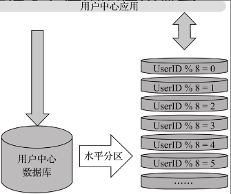

### 序

互联网 + 电商 + 支付：特定决定ali必须要有很高的稳定性和可靠性，每一笔订单，订单的状态，每一次支付都不能有差错。

例如在双11，每秒要有十万比以上的订单，高可用。

**高可用、海量数据、复杂业务逻辑** 是阿里业务系统的主要挑战。

本书是阿里在应对此挑战的探索，在**技术上、组织架构**上。

技术上的探索

* 数据库水平扩展，去IOE
* 复杂业务系统的结构化服务化，业务减耦，SOA，EBS
* 大型系统消息处理
* 关键业务系统的实时调控

再好的技术和框架如果不给企业带来业务价值，就没有太大意义，所以本书更多是从**技术架构解决了什么问题**，企业收获了哪些业务价值的角度进行说明和阐述，并没有描述太多晦涩的理论、算法和模型。

---

### Chpt01

> *阿里巴巴共享业务事业部发展历程中所遇到的一系列问题和困境*

**大中台、小前台**

**中台**： 集合整个集团的运营数据能力、产品技术能力，对前台业务形成支持

淘宝和天猫，技术架构上初期都拥有独立的商品、交易、评价、支付、物流等功能。

成立共享事业部，梳理淘宝和天猫的业务和功能，将公共的、通用的功能沉淀到该事业部，避免功能的重复建设和维护，更加合理的利用资源

**厚平台、薄应用**

共享事业部，**厚平台**的体现，将前台应用中公共的业务进行沉淀 **包含了用户中心、商品中心、交易中心、评价等**

**以上共享事业部**打磨过程和验证的这套方案，可能是让非互联网行业的企业摆脱困境的最好出路。为什么呢。细细如下分析：

* 烟囱式建设模式

三大电商体系技术独立支持架构，独立开发，独立运维

导致这由可能的原因有：

1. 开发团队考虑到电商模式的不同，所以需要独立建设
2. 新的业务团队认为在之前的电商平台基础上改造会有历史包袱，还不如重新构建

而这由的事情在其他企业几乎天天发生，基本上没新上一个系统，也就预示着一个新的烟囱形成，长期就导致烟囱林立，这也是很多企业面临互联网转型困难的根节所在。

烟囱的系统建设弊端

1. 重复功能建设和维护带来的重复投资

2. 打通烟囱系统的**交互的集成和协作成本**，例如要获取用户的消费行为，爱好等信息，要进行分析做到精准营销，但是发现会员信息、商品信息、订单信息等都被烟囱式的系统建设分到不同的系统中，因此需要不得不打通这些烟囱，从而获取到平台所需的全局用户消费信息。

   基于此问题，提出各种`SOA` 理念的`ESB`产品以及解决方案。

3. 不利于业务的沉淀和持续发展，增加新功能困难，要动业务逻辑，甚至是数据库，普遍本着**多一事不如少一事，不动就不会出错的原则**而不愿意对已经上线的功能进行修改，这是对企业伤害最大的，这种方式始终无法满足业务快速响应和业务模式创新的需求，时间长了就是**推倒重来**，这由对于之前多年业务的沉淀保留多少，扔掉多少，是最大的资产损失。

这些问题本质上都是由于系统所提供的服务能力没有随着企业业务的发展做到与时俱进。业务发展迅速，由量变到质变，于是系统就推到重来了。

**什么才是懂业务**

懂业务不是说对具体流程、操作、数据模型方面，而是说对业务的下一步发展有这自己的理解和看法，对业务流程如何进一步优化更好第提升业务，甚至是能够提出创新的想法，为业务带来新的业务增长点。

但是IT人员不动业务，其原因中一方面IT信息化部门一直处于“业务支持”的职能位置，即只是为了满足业务部门需求而进行IT系统建设的实施和运维部门。其最大价值也自认为是负责项目的上线，甚至是同时可以负责多个项目。

而如何摆脱这样的困境，选择什么样的IT业务架构以及基于哪些技术原则为企业真正打造一个在互联网时代满足业务发展的IT基础架构呢 ？

### chpt02 

共享服务体系的建设，使得ali摆脱了烟囱式的系统建设，是ali中台战略的核心组成

#### SOA 服务重用

> SOA理念最核心的价值：**松耦合**的服务带来业务的**复用**，通过服务的**编排**助力业务的**快速响应和创新**

SOA 在企业落地中，几乎无一例外都是通过搭建ESP(企业服务总线)，使得各个系统以服务封装/调用的方式实现不同系统之间的业务交互

以上中台，前台设计，解决了【烟囱的系统建设弊端】中的前两条

1. 解决重复建设和维护带来的成本浪费。

   不管是1688还是淘宝或者聚划算都会有创建订单流程，这些流程也会因为业务场景的不同，而有所不同，但是无论在那个条件下，都会存在会员信息的验证、商品库存的修改等，将这些通用 的流程单独抽象出来下城到共享服务，1688还是淘宝或者聚划算就都可以共享这些通用服务了。

2. 解决【**交互的集成和协作成本**】例如当1688和淘宝网前端需要交互的时候，他们直接可以不直接通过EBS进行交互，因为各个应用核心业务层都已经通过共享服务体系实现统一，直接在共享服务内部统一就可以完成协作和交互。

3. 解决【业务的沉淀和持续发展】

   拥抱变化，SOA项目不在是基于**一种**集成项目建设的方式，也不需要追求**业务稳定**，需要新的增长的业务不断的滋养，从一开始单薄的业务功能逐渐长期、持续的成长为企业最为宝贵的IT资产。

   这里更多是一种思维、态度的改变。企业要多写耐心，避免走入**项目制(单独为xxx服务)**，不断将抽象出来的公共共享服务可以为各种前端业务应用所所用。

#### 共享服务是培训创新的土壤

好的创新一定是从自己的土壤中长出来的，而不是从哪里借鉴或者抄过来的，所谓业务专家，那么一定是在改领域中有体系知识，这个知识也一定是从点到线再到面的一个形成过程，而共享服务就有这个的环境。

以交易中心为例，不同的业务交易场景，如1688、淘宝、天猫都会有各自交易流程的业务架构师，他们对各自的交易业务十分擅长，这些都是各个业务场景中对交易业务的**点**，而这些交易流程中关键的核心的可共享流程都是下沉到共享层的交易中心，那么共享交易中心的架构师锁接触到不同业务模式下的交易相关需求，他所接触到的是业务的**线到面**。

那么在阿里内部是由创新产生一个BCP business Check Platform 的平台，改平台用来使用业务规则的方式，对交易业务镜像逻辑上的验证，例如用户退单后，退单流程走了，退货流程走了，退款流程也走了，但是会员中心没有将其积分扣除，改系统就是用于发现这些业务流程上的Bug。

#### 赋予业务快速创新和试错能力

先投入小团队，基于共享平台能力实现一个MVP产生，然后快速投入市场，如果市场反应平平，那么可以证明这个产品不怎么样，就算直接砍掉，那也是很小成本的事情，但是如果市场反应很好，那么就可以网上堆资源，快速迭代开发。

聚划算就是这样产生的。

这就好比侦察兵，一袋发现有敌情，那么快速呼叫远程炮火进行攻击，呼叫支援。

共享中的架构师，产生专门的业务架构师，带来领域专家，给组织效能也带来了提升

对共享服务体系有一个全局概念式的理解，它就是抽离出上层业务可共享的，最核心的业务功能，它是领域级别的，例如会员共享服务、交易共享服务等。将企业领域能力沉淀下来，这样的共享服务的产生对组织，对个人都是有一个快速试错并掉头的机会，对于个人在领域知识更是有一个全面的理解，并提供一个可以达到领域专家的机会。

所以说共享服务体系是一个**赋能** 的角色，可以给企业赋能，给个人赋能。

对于共享领域，他是上层业务系统的基石，这就要它在稳定性、可扩展性、需求快速响应等能力更高的要求。需要成熟完善的技术体系支撑

### chp03

#### 分布式服务框架

* 单一系统转变为服务化架构改变的过程
* 什么是去中心化

淘宝期初是一个超过500人的团队，一起维护一个WAR包，存在这由的问题

1. 项目团队协助成本高，业务响应越来越慢

   代码合并冲突多，代码不一致

2. 应用复杂度高

   没有人能够掌握全部系统功能知识，平台打包发布的时候，就会蕴含比较大的风险

3. 错误难隔离

   非核心功能，会影响到核心功能，二者是运行在一个环境中的

4. 数据库链接难扩展

   所有业务均打包在一个war包，所有的数据也都保存在同一个数据库中，造成数据链接池资源紧张

5. 应用扩展成本高

解决以上问题根本在**业务拆分**

#### 中心化与去中心化

##### SOA

* 面向服务分布式计算
* 服务间松耦合
* 支持服务的封装
* 服务注册和发现
* 服务契约方式定义服务交互方式

中心化”和“去中心化”服务框架均是SOA的实现，并不是两套体系，且没有优劣之分。

企业建了很多烟囱式的系统，各个系统使用的技术平台、框架、语言各异。当需要在这些系统间进行点对点的交互时候，ESB避免了在服务调用提供方接口改变的时候，服务调用方都需要跟着改变，而治需要在ESB上面调整就好，ESB降低系统之间的耦合，同时也提供了负载均衡，服务管控等能力。

中心化和可扩展性是不可同时具备的，可扩展性意味着集群中的不可靠节点中随时会删除，以及增加可靠节点。所以不能固定某个节点为master，master 是随着机器的增加或者删除随时产生的。

而在互联网产品中，随着用户的增加，系统可扩展是系统不崩溃的前提，是一切业务发展的前提。所以**互联网产品基本都会选择去中心化的架构**

去中心化要求服务提供者和服务调用者直接无需通过任何服务路由中介，避免因为**中心点** 出问题带来难扩展，以及潜在的**雪崩**，采用点对点的调用。

ESB的架构师这样的

这是中心化的设计，每次调用都需要通过服务总线。而且这个总线一旦有问题，那么系统就GG。且所有请求都要经过它，请求多了，它的压力也大。也会有雪崩。

去中心化的架构是这样的

##### 微服务

* 分布式服务组成的系统。
* 按照业务而不是技术来划分组织。
* 做有生命的产品而不是项目。
* 智能化服务端点与傻瓜式服务编排。
* 自动化运维。
* 系统容错。
* 服务快速演化。

微服务”是SOA的一种演变后的形态，与SOA的方法和原则没有本质上的差别，在进行二者对比，会有以下差异

* 微服务强调多个分布式的组合，而不是SOA基于中心化的企业无法中心
* 按照业务划分组织，SOA实施的方式是以项目，而不是以产品的方式让业务在发展过程中快速演化
* 更加强调了能力向服务端的迁移，而不是像传统ESB的方式，将整体服务架构中的所有**核心能力都运行在ESB上**

尤其是容器化的发展，微服务也快速在企业中应用。但是微服务不是银弹，也存在问题

* 微服务设计，边界如何划分，微的粒度如何把握
* 错综复杂的调用
* 如何编排

去中心化的必要性，以及SOA 和微服务的架构介绍。介绍了实现共享架构的一些纯技术性的架构，以及这些架构的发展，优劣对比

哪个架构更加的适合，看看建设共享服务中心的原则，根据这些原则，去选择哪个技术。

### chpt04

共享服务中心是中台架构的基石，如何构建稳定可靠、最高效地支撑上层业务快速创新的共享服务能力是中台战略成功落地的关键。

一般而言服务能力分为两个层次

* Paas能力，可靠性、可用性、容错、监控、运维等通用能力
* 业务能力：核心业务支持

在建设的过程中会有如下问题：

* 如何建设的
* 需要几个服务中心、各个服务中心的边界是什么，划分的原则和标准是什么
* 服务中心多大合适，对应的组织团队和流程如何保障
* 服务中心的服务数量应该多少，粒度该多大

介绍淘宝的服务中心，依次解决这些问题：

##### 淘宝服务中心全貌

初期有四大服务中心：

1. 用户中心(UIC)
2. 商品中心(IC)
3. 交易中心(TC)
4. 店铺中心(SC)

后来随着业务的发展，又沉淀出了物流中心、数据中心等。

###### 用户中心

统一了淘宝原来的各个业务线分散的用户体系，首先对这个进行重构，是因为用户中心相对于交易中心没有那么的重要，等有了一定的重构经验，然后再对其他重要的进行重构。

###### 商品中心

是最复杂的业务场景，有以下几大原因

数据量大，每天新增的商品信息也巨大，卖家多，统一的商品发布体系很难满足所有的卖家，商品类目维护

##### 什么是服务中心

是一个生命力的个体，在整个体系中承担自己专门的职能，跟随整个体系、业务的发展一起发展进化。

服务中心的服务也是形态多样性的，并不是狭义的接口服务，接口是服务的主要表现形式，但是并不仅仅于这个形式：

1. 依赖于接口的服务：为上层提供接口，可以是RPC、或者Web API
2. 依赖数据的服务，大数据分析能力

服务中心也是可以进一步划分的，服务中心是业务领域的概念，但是落地的时候并不需要二者一一对应，**服务中心是根据业务和数据的完成性和独立性设计的**，

##### 服务中心划分原则

服务中心的划分原则更多的是架构设计经验总结，很难进行进准量化。

架构本来就是一个**追求平衡的艺术**，不仅是设计原则上的平衡，还要在技术、成本、资源、性能、团队等各方面进行平衡，**以最高效地解决主要问题。**偏执地追求一个维度的完美肯定会在其他方面付出代价。

主要兼顾三方面，如果不能兼得，那么抓住主要矛盾。

共享服务中的架构目的：

* 通过服务拆解来降低系统的复杂性
* 通过服务共享来提供可重用性
* 通过服务化来达到业务支撑
* 通过统一数据来消除数据交互

设计角度来看，主要是要遵循面向对象的分析和设计的方法。

运营角度来看，一个服务中心应该是一个完整的业务模型，例如一个商品中心，不是说对商品的增删改查，而是说建立一个全球最大的商品库，并提供商品库的管理运营的方法和配套的工具服务。

工程角度来看，一个商品中心踏实基于分布式架构，分布式架构解决了一体化架构在大规模应用上的问题。

具体在项目中的一些原则：

* 高内聚低耦合

高内聚是从服务中心的业务界域来说的，在一个服务中心内的业务应该是相关性很高、依赖性很高的；而服务中心之间应该是业务隔离性比较大的，即追求尽可能的低耦合

* 数据完整性

这是和高内聚低耦合一样的，将该思想穿透到数据模型层面

* 渐进性的建设原则

是从降低风险和实施难度这个角度出发，服务化架构本来就是一种敏捷的实践，我们是推荐**小步快跑**的方式逐步推进。

### chpt05

 数据拆分

由于服务中心承载着整个集团的所有领域服务业务支撑，如何支撑访问性能的要求，以及未来可能增长的需求 ？在这个过程中，**数据库是最容器产生性能瓶颈的组件**

看看淘宝如何基于**分布式数据库平台**解决改问题的。以及看看在改造过程中**分库分表** 的最佳实践。

各个服务中心拥有各自独立的数据库，即采用数据**垂直分区**的方式对业务数据进行分区。

**首先是数据库的读写分离**，主数据库实现增、改、删，从数据库实现查询，然后主数据库数据到从库进行数据同步

整体上也大大提升了数据库的读写能力。

但是写压力是无法分担的，**垂直分区无法解决写操作压力大，水平分区，将单库的操作压力分到多个库**。

但是在很多场景中需要跨库的操作，如JOIN、排序统计等，还需要更加强大的数据库以及对应的工具。

##### 分库分表的实践

* 发展

Cobal -> TDDL, 不过现在业界基本都在使用`MyCat`，分布式数据库中间件，这里主要介绍下`TDDL`

支持跨库join、统计等计算

三层数据源每层都按JDBC规范实现，使得对前端应用没有任何代码侵入。

Matrix层（TDataSource）实现分库分表逻辑，底下持有多个GroupDs实例。

Group层（TGroupDataSource）实现数据库的主备/读写分离逻辑，底下持有多个AtomDs实例。Atom层（TAtomDataSource）实现数据库连接（ip、port、password、connec-tionProperties）等信息的动态推送，持有原子的数据源。

一个完整的交互流程：

* 数据尽可能的平均拆分

不管是何种分库分表的方式，其本质上都是将原来放在一个表中的大数据量拆分到多个库/表中，从而避免数据库的压力。

最重要的一个原则就是要拆分后的库/表存储的数据尽可能的平均。

具体如何拆分那就得结合业务场景来决定。当拆分逻辑不合适产生数据热点的时候，可以这样环境

数据库只保存3个月的数据/300万数据，这些数据放在交易数据库中，超过这个规定那么数据归档到归档数据库中。

* 尽量减少事务边界

在查询的时候，如果查询SQL带着分库/表的键值，那么这样的查询和直接查询单表示没有什么区别的，但是有些业务场景的SQL却是没有键值。

这种情况下中间件就会查询多个库/表，然后将这些查询结果进行聚合返回给前端应用。这个时候就会出现**全表扫描**，所谓**事务边界**就是说单个SQL语句在后端数据库上同时执行的数量，全表扫描就是事务边界的最大值，其值越大，会有如下弊端：

1. 系统的锁冲突概率大。
2. 系统扩展难，会出现数据库连接的**木桶效应**，此时一个数据库由多次sql执行，如果某个数据库的链接到达瓶颈，即使是后端有再多的分库也无济于事。
3. 整体性能越低：因为在查询多个表后，然后再聚合数据，这里会有2个时间延误，一个是表查询时间，全部查询结束取决于最慢的那个，还有就是聚合查询回来的数据时间。

全表扫描这种事情并不是完全不可接受的，因为在复杂业务场景(复杂查询条件)中这是很普遍的。当每个表的数据比较平均的时候，每个表数据不大，聚合也不会花费时间。

* 异构索引尽量降低全表扫描

用于解决上面的全表扫描问题，触发边界事务的场景还是会挺多的，那么异构索引可以解决，也就是专门创建一张表用于存储索引，达到**空间换时间** ，加快访问速度，避免全表扫描

如图，在创建一条`order` 记录的时候，同时会给索引表中存储一条索引，改索引表的id`buver_id` 就是可能会发生全表扫描的那个条件，然后根据该条件获取到`orderid`，然后再回到业务表中获取数据。

一般来说，应用可能会按照多个维度创建多个异构索引表，采用这样数据全复制的方法会带来大量的数据冗余，从而增加不少数据库存储成本。

实现这个过程可以通过2种方式：

1. 应用侧实现
2. 数据库侧实现，淘宝内部有一个**精卫** 的组件实现

### chpt06

系统的性能优化-**异步化与缓存和**，在分布式事务下，应用利用数据库事务特性解决的事务性问题已经够满足。

* 异步调用解决大量同步调用带来的性能问题。
* 分库分表后，数据库异步操作场景下，那些事务处理方式实现一致性和数据库性能平衡
* 缓存的使用

##### 业务流程的异步化

如淘宝一个订单的创建需要调用超过200个微服务，即使这些微服务逻辑是在一个JVM中完成，一个程序执行20ms，那么所有的微服务调用完，那也得超过4s，这么长时间肯定是无法忍受的。

如果真的是如图所示的顺序调用方式，服务的会话处理线程长时间的资源占用，对于服务器的整体的系统吞吐也是巨大的影响的。

解决的方式就是**异步化**，具体而言对于严格必须先后调用关系的服务保持顺序执行，而对于可以并行化的均采用异步化的处理方式。

阿里内部使用消息中间件的方式实现了业务异步化，从而是的整个订单的创建所有时间限制在300ms，出了用户体验上的增加，整个平台的吞吐量几何倍增加。

一个订单的完成要跨越多个服务中心，如交易中心生成订单、商品服务中心预减库存，还有支付服务。如何保证这些服务在一定订单中同时成功或者失败呢。

##### 数据库事务异步化

以互联网还款核心功能为列，当要还一笔块，需要经历

而且一般业务上来讲，还款日是月底的某一天，从服务器的角度来看，这段时间的请求会非常多，数据库的压力也会非常大。

若将这些过程一次还款流程全部发生在一个JVM(进程中)，整个过程又是上面没有使用中间件的场景，那么这些请求全部都是和一个数据库交互，可以直接使用数据库自带的事务就好。

但是事情却往往不是这样的。

那么解决异步场景下的事务一致性，得使用数据库事务的异步化，也就是将大失误拆分为小事务，降低数据库的资源被长时间事务锁占用，这样就可以提供平台的处理吞吐量和事务操作的响应时间。

整个过程如下：

用户点击还款后，会产生一条还款启动的消息，发送到服务器。然后一次开始从1到5完成操作，没个操作从a开始执行到b,c。

以上的业务流程异步化，或者是数据库事务异步化，都涉及到如何保证业务事务一致性的问题，并没有完美的解决方案，一下是淘宝在分布式事务上的探索，创新尝试。

传统数据库，体现在ACID(原子性、一致性、隔离性和持久性)，一个操作包含的所有处理都完成了，对数据库的修改才会持久化到数据库，操作过程总任何的失败，对数据库的修改都会无效。

基于CAP理论和在其基础上延伸出的BASE理论，有人提出了“柔性事务”的概念，用于解决这种分布式事务

##### CAP理论

一个分布式系统最多只能同时满足一致性(Consistency)、可用性(Availability)和分区容错性(Partition tolerance)这三项中的两项.

C: 所有节点分区在同一个时间的数据完全一致性。

A：是说高可用的可用性，所有节点分区均可在请求的时候在一定时间内能获得返回响应。

P：分区容错性，在某个节点分区出错(节点之间网络出问题)的时候，分布式集群整体上对外是可用的，且数据是一致的。

不要P，放弃分区容忍性，也就是采用单机系统，根本上失去了可扩展性，影响系统的规模。也就是单一的数据库是满足CA 一致性和可用性的。

不要A，遇到分区故障，受影响的服务就得等待数据一致，等待期间无法对外提供服务。

不要C，部分分区还是能够获取到正确的结果，部分分布则无法获取到。

##### BASE 理论

源于对大规模分布式系统的实践总结，是对CAP理论的延伸，即使无法做到强一致性(CAP全部满足就是强一致性)，但可以通过适合的方式达到最终一致性。

BASE是指基本可用(Basically Available)、柔性状态(Soft State)、最终一致性(Eventual Consistency)

**基本可用，分布式出现故障的时候，允许损失部分可用性**，保证核心可用，在大促的时候，访问激增，部分用户访问会被降级。

**柔性状态，允许系统存在中间状态**，中间状态不影响系统整体可用性，如在分布式存储mysql有三个副本，允许不同节点同步数据采用异步复制方式，存在一定延时，这就是柔性状态。

**最终一致性，所有副本经过一段时间后**，才能达到一致性，是弱一致性的表现。

ACID和BASE失完全相反的设计哲学，ACID追求强一致性，BASE支持的是大型分布式系统，牺牲强一致性获得高可用。

实现base 理论的事务就是柔性事物，针对不同的分布式场景业界常见的解决方案有 2PC、3PC、TCC、可靠消息最终一致性、最大努力通知这几种 

**互联网平台一定首先考虑的是系统服务能力的高可用**，分布式系统比较于单机，由于涉及到网络，所以消息会存在丢失的风险，消息总会是不可靠的。

**两阶段提交法(2PC)**实现分布式事务，

第一阶段：事务管理器会向各个客户端轮训，询问各个客户端是否已经就绪，如果有一个未就绪好，那么整个事务回滚。

第二阶段：所有的客户端/参与者都就绪，提交事务。

事务管理器一般由专门的中间件提供，是一个重要的组件，

分布式事务协调者在第一阶段通过对所有的分布式事务参与者请求“预备”操作，达成关于分布式事务一致性的共识。分布式事务参与者在预备阶段必须完成所有的约束检查，并且确保后续提交或放弃时所需要的数据已持久化。在第二队段，分布式事务协调者根据之前达到的提交或放弃的共识，请求所有的分布式事务参与者完成相应的操作。

事务执行时间延长，意味着锁发生冲突概率增加，并大大，就会累计事务，甚至死锁，系统性能以及吞吐就会出问题

这就是为什么**互联网很少采用两阶段提交** 的分布式事务。

**柔性事务**，原子性主要由日志保证，事务日志中记录事务的开始、结束信息，根据日志可以回滚或重做REDO/UNDO 日志将数据恢复到一致状态。

**可靠消息传递**，节点间传递会有失败、成功、不知道成功还是失败三种状态，可靠性传递就是解决第三种状态。

消息投递只有两种模式：

1. 消息仅投递一次，但是可能会没有收到
2. 消息至少投递一次，但可能会投递多次

在业务一致性的高优先级下，第一种投递方式肯定是无法接受的，因此只能选择第二种投递方式，第二种方式存在重复投递，所以要求处理程序要**幂等性**，不同的业务会有不同的实现幂等性的方式，阿里内部使用**排重表** 的方式。

**造成数据库性能和吞吐率瓶颈往往是因为强事务带来的资源锁**

放弃锁是一个方法，放弃锁并不是说放弃隔离，这点很重要，放弃锁的几种实现

* 避免事务进入回滚

这对业务有要求，事务在出现异常时，可以不回滚也能满足业务的要求，即使错了错误，业务流程继续往下走。

* 辅助业务变化明细表

在多个事务中发起购买商品101号商品的时候，多个事务并不直接去访问商品表去扣减库存，这由商品表就不会因为多事务访问的时候更新库存而加锁而限制其吞吐。多个事务直接给库存预减明细表中插入记录(每次插入都需要去检查商品表库存额明细表中101商品所有预减库存和)，当用户付款之后则真正地将商品数据表中的库存减除。

* 乐观锁机制

  避免了长事务中的数据库加锁开销，

  

阿里共发展和演变出三套成熟的分布式事务(柔性事务)解决方案：

**基于分布式消息的事务**

通过MQ事务消息功能特性达到分布式事务的最终一致。

上图是基于MQ提供的事务消息功能实现分别对两个不同数据库进行事务处理的流程示意。

步骤1和2是事务发起方执行的第一个本地事务，向MQ服务端发送消息，这并不是一个普通消息，而是事务消息(在MQ服务端处于一个特殊状态)，但是此时MQ订阅方是无法感知到该消息的，也就无法对其进行消费。

开始执行步骤3执行第一个数据的本地单机事务操作 ，这个操作执行的结果会影响后面步骤。

当本地事务执行成功，接着执行步骤4，将之前MQ上的事务消息状态更新为正常。

执行步骤3的过程中如果出现其他原因，导致程序没有给MQ服务端发送步骤4的消息，那么这个事务消息的状态会保持不变，而MQ服务端会定时扫描它的事务消息，如果发现一些事务消息一直没有状态更新，那么会执行步骤5，MQ服务器会到MQ发送端去拿之前执行本地事务的执行结果，也就是到了步骤6。

如果发现事务根本就没有执行，则告诉MQ服务端丢掉消息事务，如果已经执行成功了，只是由于其他什么原因而没有返回执行结果，告诉MQ服务端，将消息事务状态更新为正常。

步骤8，MQ订阅这读到正常状态的消息事务，开始执行第二个本地事务，如果第二个事务执行成功最终实现2个不同数据库上本地事务执行成功，如果失败，那么可以通过MQ告诉第一个事务，将第一个事务进行回滚。

这由采用消息事务保证前后多个数据库的事务同时成功或者失败，保证事务的一致性，同时避免2阶段提交事务方式对数据长时间的资源锁定，整体提供数据库的吞吐。

事务的参与者通过订阅消息服务实现不同库事务直接的关联

**XTS框架**

基于BASE的思想实现的一套类似**两阶段提交的分布式事务**方案，用来保障在分布式环境下高可用性、高可靠性的同时兼顾数据一致性的要求。

XTS是TCC（Try/Confirm/Cancel）型事务。

在`Confirm` 阶段，默认是不会出错的，也就是只要`Try` 成功，`Confirm` 一定是成功的。

`Concel` 是叶子执行错误需要回滚的状态，执行业务取消，预留资源释放。

分布式事务平台TXC

