### 概述

#### 技术架构演化

##### 特点

* 高并发、大流量
* 高可用：7x24小时不间断服务
* 海量数据
* 用户分布广泛、网络情况复杂
* 安全环境恶劣
* 需求款速变更，发布频繁
* 渐进式发展：从小网站开始，逐渐发展

##### 发展历程

网站的技术挑战主要来自于**庞大的用户**，**高并发的访问和海量的数据**，任何简单的业务在处理P计的数据和数亿的用户，问题就会变的棘手。**用户多，多用户并发访问产生多数据，一切的源头都是在用户量**

* 初始阶段

> 访问量少，只需要一台服务器就可以，服务器一般使用linux，应用程序使用PHP开发，然后部署在Apache上，数据库一般使用MySQL

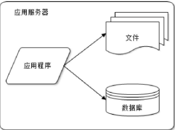

* 应用服务和数据服务分离

> 一台服务器无法满足需求，越来越多的访问导致性能越来越差，**数据越多导致存储空间不足**，使用到
>
> 文件服务器：存储大量用户上传文件，需要大硬盘。
>
> 应用服务器：需要处理大量的业务逻辑，需要强大的CPU。
>
> 数据服务器：需要快速磁盘检索和数据缓存，需要更快的磁盘和更大的内存。

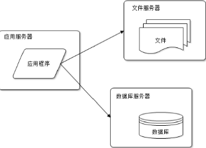

> 但随着网站的进一步发展，数据库的压力会月打来大，导致访问延迟。

* 使用缓存改善网站性能

> 网站访问特点：**80%的业务访问集中在20%的数据上**，搜索引擎的搜索集中在热门词汇上，只有经常登录的用户才会发微博、看微博，这部分用户也只占总数的一部分。
>
> 如果将这一部分数据缓存下来，是否就可以减少数据库的访问压力了呢 ?
>
> 缓存一般分为2种：
>
> * 本地缓存: 访问更快，但受本地应用服务器内存限制(会和应用争内存)
>
> * 远程缓存：专门部署大内存服务器作为分布式缓存服务器

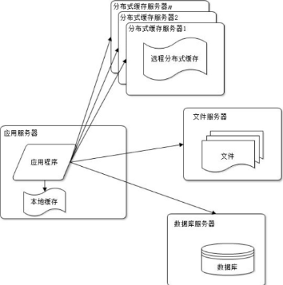

> 使用缓存后，网站的访问限制变为应用服务器

* 使用应用服务器集群

> 解决高并发、海量数据访问问题。**当一台服务器访问能力有限，不要尝试换更大的服务器，更恰当的做法增加服务器**
>
> 进一步实现网站的**可伸缩性**

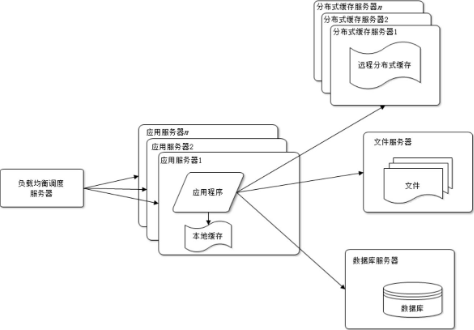

> 通过负载均衡调度服务器，将请求分发到应用服务器，如果有更多的请求，更多的用户，那么加入更多的应用服务器。
>
> 这由应用服务器其就不再称为整个网站的瓶颈

* 数据库读写分离

> 即使是使用了缓存，但是还有部分读请求会不命中缓存，或者缓存过期，请求到数据库，以及所有写操作都会访问到数据库，网站达到一定的用户规模后，数据库负载压力高
>
> 目前大部分主流数据库都支持**热备功能**，多台数据库配置主从关系，可以将一台数据库的数据同步到另外一台，实现**读写分离**

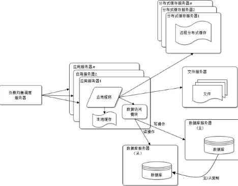

> 为了便于应用程序访问读写分离后的数据库，通常在应用服务器端使用专门的数据访问模块，使数据库读写分离对应用透明

* 使用反向代理和CDN加速网站响应

> 由于复杂的网络环境，不同地区的用户访问时候，速度也是差别很大，给部分地区用户访问慢

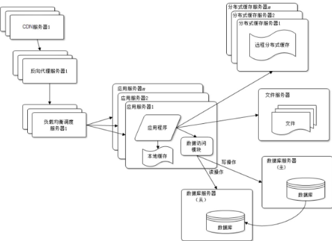

> **CDN 和 反向代理都是缓存，不同的是，CDN部署在网络提供商的机房，在用户请求网站的时候，可以选择距离自己较近的网络提供商机房提供数据。**
>
> 反向代理是部署在网站的中心机房，当用户请求到机房后，首先访问反向代理服务器，反向代理服务器中有缓存，那么先返回缓存内容，例如前端CSS，JS图片等。
>
> 二者均是尽早返回数据给用户。

* 使用搜索引擎

> 网站业务越来越复杂，对数据存储和检索的需求也越来越复杂，网站需要采用一些非关系数据库技术如NoSQL和非数据库查询技术如搜索引擎
>
> 下图中反向代理服务器和负载均衡调度服务器是可以是同一个服务器的

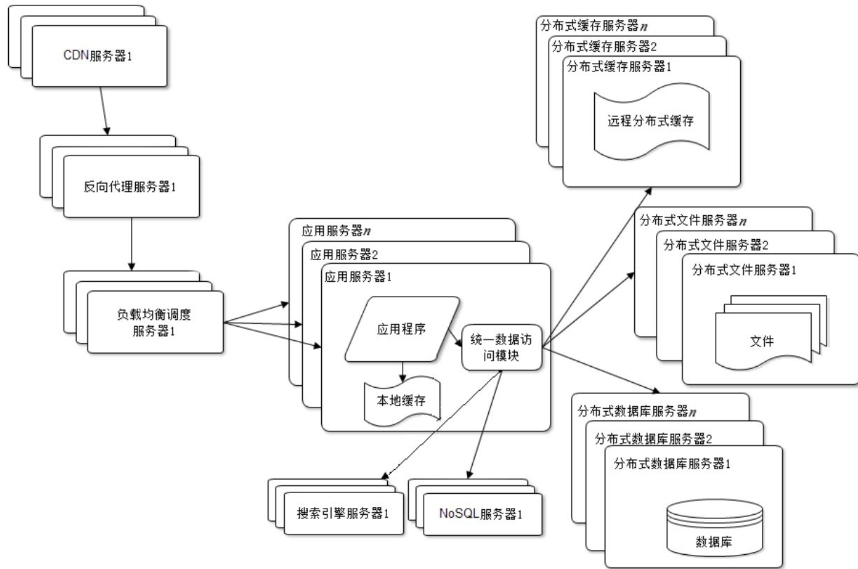

对可伸缩的分布式特性具有更好的支持

* 使用分布式文件系统和分布式数据库系统

> 任何强大的单一服务器都无法满足大型网站**持续增长的业务**

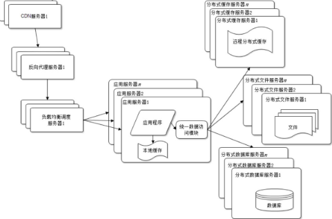

采用分布式数据库是网站数据库拆分的**最后手段**，只有在单表数据非常庞大的时候采用

* 业务拆分

> 采用分而治之的手段，将网站的不同产品线，如大小购物交易分为首页、商铺、订单等不同的产品线，分归不同的团队负责，独立部署维护

可以通过消息队列进行数据分发，当然最多的还是通过访问同一个数据存储系统来构成一个关联的完整系统

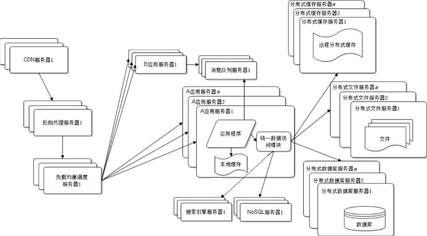

* 分布式服务

> 业务拆分越来越小，存储系统越来越庞大，应用系统的整体复杂度呈指数级增加，部署维护越来越困难.
>
> 将每个应用中相同的业务进行提取，如用户管理，商品管理等都提取出来，独立部署，形成可复用的业务链接数据库

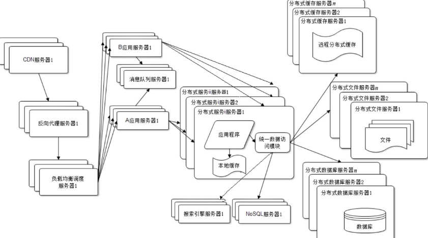

---

大型网站架构解决了海量数据的管理和高并发事务的处理，那么就可以把这些解决方案应用到网站自身以外的业务上去。我们看到目前许多**大型网站都开始建设云计算平台，将计算作为一种基础资源出售，中小网站不需要再关心技术架构问题，只需要按需付费，就可以使网站随着业务的增长逐渐获得更大的存储空间和更多的计算资源**。

##### 价值观

网站的价值在于它能为用户提供什么价值，在于网站能做什么，而不在于它是怎么做的。任何网站不是一开始就是大型的，有高并发、大数据，都是从小型发展来的。

所以在网站还很小的时候就去追求网站的架构是舍本逐末，得不偿失的。**小型网站最需要做的就是为用户提供好的服务来创造价值，得到用户的认可，活下去，野蛮生长**

是业务成就了技术，是事业成就了人，而不是相反。

有些传统企业投身互联网，在业务问题还没有理清楚的时候就从外面挖来许多技术高手，仿照成功的互联网公司打造技术平台，这无疑是南辕北辙，缘木求鱼

##### 网站设计误区

* 一味追随大公司的解决方案
* 为了技术而技术

> 网站技术是为业务而存在的，除此毫无意义。在技术选型和架构设计中，脱离网站业务发展的实际，一味追求时髦的新技术，可能会将网站技术发展引入崎岖小道

* 企图用技术解决所有问题

> 技术是用来解决业务问题的，而业务的问题，也可以通过业务的手段去解决

---

#### 架构模式

大型互联网公司在实践中提出了许多解决方案，以实现网站**高性能、高可用、易伸缩、可扩展、安全**等各种技术架构目标。这些解决方案又被更多网站重复使用，从而逐渐形成大型网站架构模式

##### 分层

> 横向维度上切分成几个部分，每个部分负责一部分相对比较单一的职责，然后通过上层对下层的依赖和调用组成一个完整的系统
>
> * 应用层
>
> > 负责具体业务和视图展示
>
> * 服务层
>
> > 为应用层提供业务服务支持
>
> * 数据层
>
> > 提供数据存储服务，如数据库，文件，缓存
>
> 通过分层，更好地将一个庞大的软件系统切分成不同的部分，便于分工合作开发和维护；各层之间具有一定的独立性，**只要维持调用接口不变**，各层可以根据具体问题独立演化发展而不需要其他层必须做出相应调整。
>
> 在开发过程中，严格遵循分层架构的约束，禁止跨层次的调用

##### 分割

> 分割就是在纵向方面对软件进行切分
>
> 将不同的功能和服务分割开来，包装成高内聚低耦合的模块单元，一方面有助于软件的开发和维护；另一方面，便于不同模块的分布式部署，提高网站的并发处理能力和功能扩展能力

##### 分布式

分层和分割的一个主要目的是为了切分后的模块便于分布式部署，部署在不同的服务器，通过远程调用完成统一的功能，分布式意味着可以使用更多的计算机完成同样的功能。

同时带来了新的问题：

* 服务调用必须通过网络，会对性能造成比较严重的影响
* 服务器越多，宕机的概率也就越大，一台服务器宕机造成的服务不可用可能会导致很多应用不可访问，使网站可用性降低
* 数据在分布式的环境中保持数据一致性也非常困难，分布式事务也难以保证
* 分布式还导致网站依赖错综复杂，开发管理维护困难

##### 服务器集群

##### 缓存

* CDN
* 反向代理
* 本地缓存
* 分布式缓存

##### 异步

> 系统解耦，系统之间不存在直接调用，只要保持数据解雇不变，彼此实现功能可以随意变化，而不互相影响，对网站的扩展功能便利。异步消息特性：
>
> * 提高系统可用性
>
> > 当消费者发生故障，数据库会在消息队列服务器中堆积，而生产者不受影响，对外整体表现无故障，消费者恢复后，读取堆积数据，进行消费
>
> * 加快响应速度
>
> > 生产者直接将数据扔给消息队列就可以了，不需要等待消费完，响应延迟减少。
>
> * 消除并发访问高峰
>
> > 网站的访问存在高峰和低谷，高峰时候会负载增加、拖慢网站，响应延迟，甚至服务器宕机。
> >
> > 使用消息队列，对于突然增加的请求数据放在消息队列中，而消费者服务器依次处理，就不会对服务器造成负载过大。
> >
> > 使用异步方式可能对用户体验、业务流程造成影响，需要在网站设计方式做出支持。

##### 服务器冗余备份

##### 自动化

##### 安全

好的设计绝对不是模仿，不是生搬硬套某个模式，而是对问题深刻理解之上的创造与创新，即使是“微创新”，也是让人耳目一新的似曾相识。

---

#### 架构要素

软件架构，维基百科是这样定义的：“有关软件整体结构与组件的抽象描述，用于指导大型软件系统各个方面的设计”。

软件设计，还需要考虑以下5个要素：

##### 性能

> 任何软件架构的设计方案，都必须考虑可能带来的性能问题，**其优化的手段非常多，从用户浏览器到数据库；**
>
> 浏览器端设置缓存、页面压缩、合理布局、减少Cookie传输等；
>
> CDN：网站静态资源分发到距离用户最近的网络服务商，网站机房部署反向代理服务器；
>
> 应用服务器端：服务器本地缓存或者分布式缓存
>
> 异步操作：将消息发送到消息队列，带后续任务处理，当前任务直接返回响应给用户；
>
> 代码层面：使用多线程、改善内存管理；
>
> 数据库：使用索引、缓存、SQL优化等

##### 可用性

> 几乎所有网站都承诺7×24可用，但事实上任何网站都不可能达到完全的7×24可用，总会有一些故障时间，扣除这些故障时间，就是网站的总可用时间，这个时间可以换算成网站的可用性指标，以此衡量网站的可用性，一些知名大型网站可以做到**4个9以上的可用性，也就是可用性超过99.99%**
>
> 高可用的主要手段是**冗余**，应用部署在多台服务器上同时提供访问，数据存储在多台服务器上互相备份，任何一台服务器宕机都不会影响应用的整体可用，也不会导致数据丢失。
>
> 任何一台服务器宕机，只需把请求切换到其他服务器就可实现应用的高可用。
>
> 对于存储服务器，由于其上存储着数据，需要对数据进行实时备份

##### 伸缩性

> 网站通过集群的方式将多台服务器组成一个整体共同提供服务。**伸缩性**是指通过不断向集群中加入服务器的手段来缓解不断上升的用户并发访问压力和不断增长的数据存储需求。以及减少服务器来应对当请求用户减少的时候出现的服务器空置。
>
> 对于应用服务器集群，只要服务器上不保存数据，所有服务器都是对等的，通过使用合适的负载均衡设备就可以向集群中不断加入服务器。
>
> 对于缓存服务器集群，加入新的服务器可能会导致缓存路由失效，需要改进缓存路由算法保证缓存数据的可访问性

##### 扩展性

> 主要关注非功能性需求，网站的扩展性架构直接关注网站的功能需求。网站快速发展，功能不断扩展，**如何设计网站的架构使其能够快速响应需求变化，是网站可扩展架构主要的目的**.
>
> 主要标准就是在网站增加新的业务产品时，是否可以实现对现有产品透明无影响.
>
> 网站可伸缩架构的主要手段是事件驱动架构和分布式服务

##### 安全性

---

### 架构

#### 高性能

网站的性能问题很多是在用户高并发访问时产生的，所以网站性能优化的主要工作是改善高并发用户访问情况下的网站响应速度

##### 并发数

> 系统能够同时处理请求的数目，这个数字也反映了系统的负载特性

##### 吞吐量

> 单位时间内系统处理的请求数量，体现系统的整体处理能力。对于网站，可以用“请求数/秒”或是“页面数/秒”来衡量
>
> TPS（每秒事务数）是吞吐量的一个常用量化指标，此外还有HPS（每秒HTTP请求数）、QPS（每秒查询数）等
>
> 在系统**并发数由小逐渐增大**的过程中（这个过程也伴随着服务器系统资源消耗逐渐增大），系统**吞吐量先是逐渐增加**，达到一个极限后，随着并发数的增加反而下降，达到**系统崩溃**点后，系统资源耗尽，吞吐量为零。
>
> 这个过程中，响应时间则是先保持小幅上升，到达吞吐量极限后，快速上升，到达系统崩溃点后，系统失去响应
>
> *系统吞吐量和系统并发数，以及响应时间的关系可以形象地理解为高速公路的通行状况：吞吐量是每天通过收费站的车辆数目（可以换算成收费站收取的高速费），并发数是高速公路上的正在行驶的车辆数目，响应时间是车速。车辆很少时，车速很快，但是收到的高速费也相应较少；随着高速公路上车辆数目的增多，车速略受影响，但是收到的高速费增加很快；随着车辆的继续增加，车速变得越来越慢，高速公路越来越堵，收费不增反降；如果车流量继续增加，超过某个极限后，任何偶然因素都会导致高速全部瘫痪，车走不动，费当然也收不着，而高速公路成了停车场*

##### 性能计数器

描述服务器或操作系统性能的一些数据指标：System Load(系统负载)、对象与线程数、内存使用: CPU使用、磁盘与网络I/O等指标；

* System Load(系统负载)

> 指当前正在被CPU执行和等待被CPU执行的进程数目总和，是反映系统忙闲程度的重要指标，
>
> 完美情况是所有CPU都在使用，没有进程在等待处理，所以Load的理想值是CPU的数目
>
> Linux系统中使用top命令查看，该值是三个浮点数，表示最近1分钟，10分钟，15分钟的运行队列平均进程数
>
> 

##### 性能测试方法

不断对系统增加访问压力，以获得系统性能指标、最大负载能力、最大压力承受能力的过程

* 性能测试

> 以系统设计初期规划的性能指标为预期目标，对系统不断施加压力，验证系统在资源可接受范围内，是否能达到性能预期
>
> 测试目标是评估系统性能**是否符合需求及设计目标**

* 负载测试

> 不断地增加并发请求以增加系统压力，直到系统的某项或多项性能指标达到安全临界值如某种资源已经呈饱和状态，这时继续对系统施加压力，系统的处理能力不但不能提高，反而会下降。
>
> 测试目标是评估当系统因为突发事件超出日常访问压力的情况下，保证系统**正常运行情况下能够承受的最大访问负载压力**

* 压力测试

> 超过安全负载的情况下，对系统继续施加压力，**直到系统崩溃或不能再处理任何请求**，以此获得系统最大压力承受能力
>
> 测试目标是评估可能导致**系统崩溃的最大访问负载压力**

* 稳定性测试

> 被测试系统在特定硬件、软件、网络环境条件下，给系统加载一定业务压力，使系统运行一段较长时间，以此检测系统是否稳定
>
> 性能测试曲线：横坐标表示消耗的系统资源，纵坐标表示系统处理能力（吞吐量）

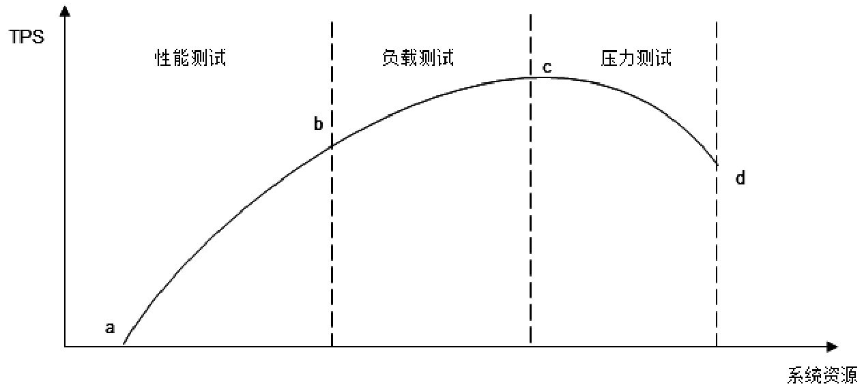

（a～b段），这一段是网站的日常运行区间，网站的绝大部分访问负载压力都集中在这一段区间，被称作**性能测试**;

（c点）随着压力的持续增加，系统处理能力增加变缓，直到达到一个最大值,这是系统的**最大负载点**，这一段被称作负载测试;

（d点）再增加压力，系统的处理能力反而下降，而资源消耗却更多，直到资源消耗达到极限，超过这个点继续加大并发请求数目，系统不能再处理任何请求

##### 性能分析

检查请求处理的各个环节的日志，**分析哪个环节响应时间不合理、超过预期**；然后检查监控数据，分析影响性能的主要因素是内存、磁盘、网络、还是CPU，是代码问题还是架构设计不合理，或者系统资源确实不足

##### 性能优化

###### Web前端性能优化

> * 减少http请求
>
> > HTTP协议是无状态的应用层协议，意味着每次HTTP请求都需要建立通信链路、进行数据传输，而在服务器端，每个HTTP都需要启动独立的线程去处理.
> >
> > 主要手段是合并CSS、合并JavaScript、合并图片
>
> * 使用浏览器缓存
>
> > CSS、JavaScript、Logo、图标这些静态资源文件更新的频率都比较低，而这些文件又几乎是每次HTTP请求都需要的，如果将这些文件缓存在浏览器中，可以极好地改善性能。通过设置HTTP头中Cache-Control和Expires的属性
>
> * 启用压缩
>
> > 在服务器端对文件进行压缩，在浏览器端对文件解压缩，可有效减少通信传输的数据量

* CDN加速

> CDN（Content Distribute Network，内容分发网络）的本质仍然是一个缓存，而且将数据缓存在离用户最近的地方，使用户以最快速度获取数据，即所谓网络访问第一跳。
>
> CDN能够缓存的一般是静态资源，如图片、文件、CSS、Script脚本、静态网页等

* 反向代理

> 而反向代理服务器位于网站机房一侧，代理网站Web服务器接收HTTP请求.
>
> 代理服务器也可以通过配置缓存功能加速Web请求。当用户第一次访问静态内容的时候，静态内容就被缓存在反向代理服务器上

###### 应用服务器性能优化

* 使用缓存

> 网站开发最复杂，变化最多的地方，优化手段主要有缓存、集群、异步;
>
> **优化第一定律：优先考虑使用缓存优化性能**
>
> 缓存主要用来存放那些读写比很高、很少变化的数据，如商品的类目信息，热门词的搜索列表信息，热门商品信息等。应用程序读取数据时，先到缓存中读取，如果读取不到或数据已失效，再访问数据库，并将数据写入缓存
>
> 网站数据访问通常遵循二八定律，即80%的访问落在20%的数据上，因此利用Hash表和内存的高速访问特性，将这20%的数据缓存起来，可很好地改善系统性能，提高数据读取速度，降低存储访问压力

> * 缓存使用不恰当的方式：

> 频繁修改的数据
>
> 一般说来，数据的读写比在2:1以上，即写入一次缓存，在数据更新前至少读取两次，缓存才有意义。实践中，这个读写比通常非常高，比如新浪微博的热门微博，缓存以后可能会被读取数百万次
>
> 没有热点的访问:
>
> 缓存使用内存作为存储，内存资源宝贵而有限，不可能将所有数据都缓存起来
>
> 数据不一致与脏读
>
> 一般会对缓存的数据设置失效时间，一旦超过失效时间，就要从数据库中重新加载。**因此应用要容忍一定时间的数据不一致，**如卖家已经编辑了商品属性，但是需要过一段时间才能被买家看到
>
> 缓存可用性
>
> 缓存数据丢失或者缓存不可用不会影响到应用程序的处理——它可以从数据库直接获取数据，所以当缓存服务崩溃时，数据库会因为完全不能承受如此大的压力而宕机，进而导致整个网站不可用。这种情况被称作**缓存雪崩**。发生这种故障，甚至不能简单地重启缓存服务器和数据库服务器来恢复网站访问，可以通过热备手段，缓存服务器存在备份。但是现在基本使用分布式缓存服务器集群，将缓存数据分布到集群多台服务器上可在一定程度上改善缓存的可用性
>
> 缓存预热
>
> 新启动的缓存系统如果没有任何数据，在重建缓存数据的过程中，系统的性能和数据库负载都不太好，那么最好在缓存系统启动时就把热点数据加载好，这个缓存预加载手段叫作**缓存预热**，对于一些元数据如城市地名列表、类目信息，可以在启动时加载数据库中全部数据到缓存进行预热
>
> 缓存穿透
>
> 如果因为不恰当的业务、或者恶意攻击持续高并发地请求某个不存在的数据，由于缓存没有保存该数据，所有的请求都会落到数据库上，会对数据库造成很大压力，甚至崩溃。*一个简单的对策是将不存在的数据也缓存起来（其value值为null）*

* 分布式缓存架构

> 其架构方式有两种，一种是以JBoss Cache为代表的需要**更新同步**的分布式缓存，一种是以Memcached为代表的**不互相通信**的分布式缓存;
>
> JBoss Cache的分布式缓存在集群中所有服务器中保存相同的缓存数据，当某台服务器有缓存数据更新的时候，会通知集群中其他机器更新缓存数据或清除缓存数据存储服务器性能优化，**但是JBoss Cache通常将应用程序和缓存部署在同一台服务器上，当缓存数据很大的时候其和应用抢内存**
>
> 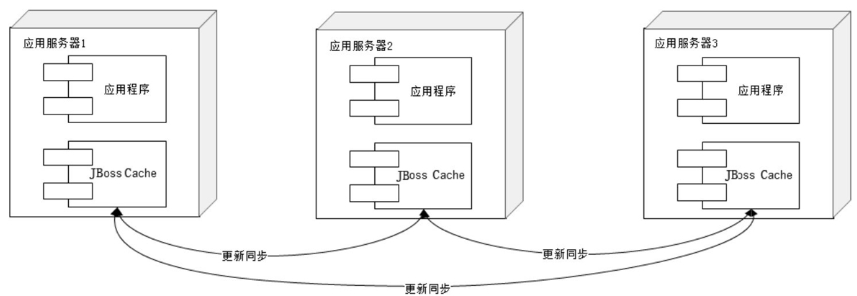
>
> Memcached
>
> 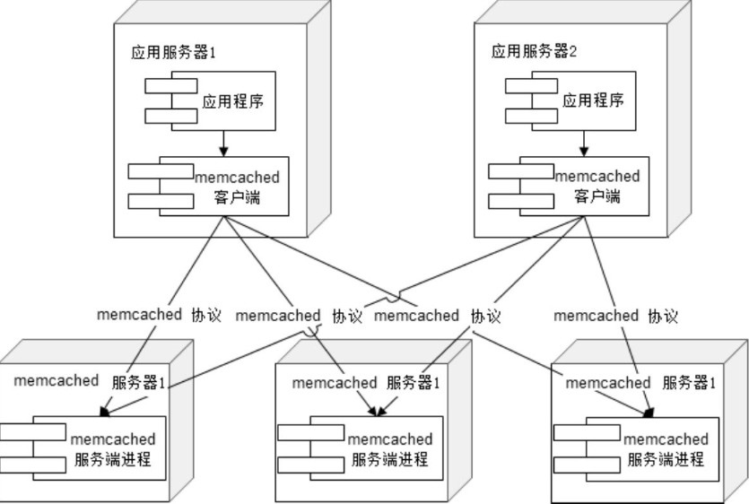

* 异步操作

> 使用消息队列将调用异步化，可改善网站的扩展性,还可改善网站系统的性能。
>
> 具有很好的削峰作用——即通过异步处理，将短时间高并发产生的事务消息存储在消息队列中，从而削平高峰期的并发事务由于数据写入消息队列后立即返回给用户，数据在后续的业务校验、写数据库等操作可能失败，**因此在使用消息队列进行业务异步处理后，需要适当修改业务流程进行配合**

###### 代码优化

* 多线程
* 资源复用

> 尽量减少那些开销很大的系统资源的创建和销毁，比如数据库连接、网络通信连接、线程、复杂对象等。
>
> 资源复用主要有两种模式：单例（Singleton）和对象池（Object Pool）

###### 存储性能优化

---

即使在技术层面，性能优化也需要全面考虑，综合权衡：性能提升一倍，但服务器数量也需要增加一倍；或者响应时间缩短，同时数据一致性也下降，这样的优化是否可以接受？这类问题的答案不是技术团队能回答的

#### 高可用

##### 高可用应用

可用性（Availability）描述网站可有效访问的特性，业界通常用多少个9来衡量网站的可用性，如QQ的可用性是4个9，即QQ服务99.99%可用，这意味着QQ服务要保证其在所有运行时间中，只有0.01%的时间不可用，也就是一年中大约最多53分钟不可用。

硬件故障是常态，网站的高可用架构设计的主要目的就是保证服务器硬件故障时服务依然可用、数据依然保存并能够被访问。

实现高可用架构的主要手段是数据和服务的冗余备份及失效转移，一旦某些服务器宕机，就将服务切换到其他可用的服务器上，如果磁盘损坏，则从备份的磁盘读取数据。

网站的分层架构及物理服务器的分布式部署使得位于不同层次的服务器具有不同的可用性特点

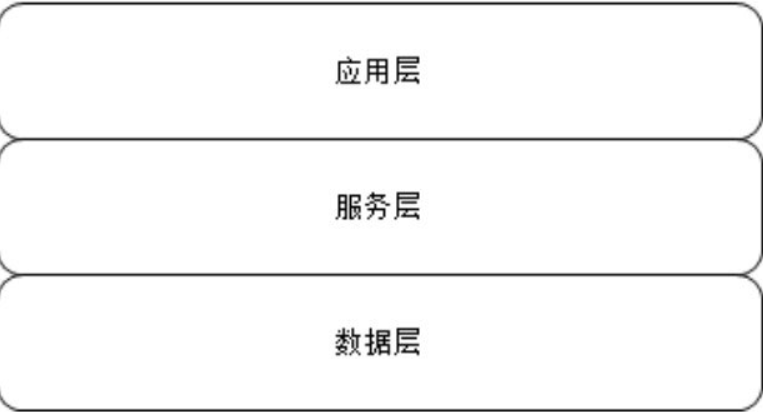

应用层主要负责具体业务逻辑处理；

服务层负责提供可复用的服务；

数据层负责数据的存储与访问

应用层的服务器通常为了应对高并发的访问请求，会通过负载均衡设备将一组服务器组成一个集群共同对外提供服务，当负载均衡设备通过心跳检测等手段监控到某台应用服务器不可用时，就将其从集群列表中剔除，并将请求分发到集群中其他可用的服务器上，使整个集群保持可用，从而实现应用高可用。

服务层的服务器情况和应用层的服务器类似，只是这些服务器被应用层通过分布式服务调用框架访问，分布式服务调用框架会在应用层客户端程序中实现软件负载均衡，并通过服务注册中心对提供服务的服务器进行心跳检测。

数据层的服务器情况比较特殊，数据服务器上存储着数据，为了保证服务器宕机时数据不丢失，数据访问服务不中断，需要在数据写入时进行数据同步复制，将数据写入多台服务器上，实现数据冗余备份。当数据服务器宕机时，应用程序将访问切换到有备份数据的服务器上。

应用服务器的高可用架构设计主要基于服务无状态这一特性，但是事实上，业务总是有状态的：

集群环境下，Session管理主要有以下几种手段

* Session 复制

> 应用服务器开启Web容器的Session复制功能，在集群中的几台服务器之间同步Session对象，使得每台服务器上都保存所有用户的Session信息。但只能使用在集群规模比较小的情况下。当集群规模较大时，集群服务器间需要大量的通信进行Session复制

* Session绑定

> 利用负载均衡的源地址Hash算法实现，负载均衡服务器总是将来源于同一IP的请求分发到同一台服务器上，这样在整个会话期间，用户所有的请求都在同一台服务器上处理，即Session绑定在某台特定服务器上，保证Session总能在这台服务器上获取，但是Session绑定的方案显然不符合我们对系统高可用的需求，因为一旦某台服务器宕机，那么该机器上的Session也就不复存在了，用户请求切换到其他机器后因为没有Session而无法完成业务处理，
>
> 但很少有网站利用这个算法进行Session管理

* Session服务器

> 独立部署的Session服务器（集群）统一管理Session，应用服务器每次读写Session时，都访问Session服务器，将应用服务器的状态分离，分为无状态的应用服务器和有状态的Session服务器

##### 高可用服务

可复用的服务模块为业务产品提供基础公共服务，大型网站中这些服务通常都独立分布式部署，被具体应用远程调用，其也是无状态的，可以使用类似负载均衡的策略实现高可用的服务。

应用对服务的调用通过**消息队列等异步方式完成**，避免一个服务失败导致整个应用请求失败的情况。

* 服务降级

> 访问高峰期，服务可能因为大量的并发调用而**性能下降**，严重时可能会导致服务宕机。为了**保证核心应用和功能的正常运行**，需要对服务进行降级。降级有两种手段：拒绝服务及关闭服务
>
> * 拒绝服务
>
> > 拒绝低优先级应用的调用，或者随机拒绝部分请求，节约资源
>
> * 关闭服务
>
> > 关闭不重要的服务

* 幂等性设计

> 服务重复调用是无法避免的，应用层也不需要关心服务是否真的失败，只要没有收到调用成功的响应，就可以认为调用失败，并重试服务调用。因此必须在**服务层保证服务重复调用和调用一次产生的结果相同，即服务具有幂等性**

##### 高可用的数据

保证数据存储高可用的手段主要是数据备份和失效转移机制。数据备份是保证数据有多个副本，任意副本的失效都不会导致数据的永久丢失，从而实现数据完全的持久化。而失效转移机制则保证当一个数据副本不可访问时，可以快速切换访问数据的其他副本，保证系统可用。

缓存服务失效可能会导致数据库负载过高而宕机，进而影响整个网站的可用性，**因此缓存服务需要实现和数据存储服务同样的高可用**。

另一种观点认为，缓存服务不是数据存储服务，缓存服务器宕机引起缓存数据丢失导致服务器负载压力过高应该通过其他手段解决，而不是提高缓存服务本身的高可用。

为了保证数据的高可用，网站通常会牺牲另一个也很重要的指标：数据一致性。

高可用的数据有如下几个层面的含义。

* 数据持久性

为了实现数据的持久性，不但在写入数据时需要写入持久性存储，还需要将数据备份一个或多个副本，存放在不同的物理存储设备上，在某个存储故障或灾害发生时，数据不会丢失。

* 数据可访问性

在数据存储设备损坏，切换到其他设备的过程中，会停止访问数据，这段时间数据是不可访问的。

* 数据一致性

数据有多份副本的情况下，如果网络、服务器或者软件出现故障，会导致部分副本写入成功，部分副本写入失败。这就会造成各个副本之间的数据不一致，数据内容冲突

**CAP原理认为，一个提供数据服务的存储系统无法同时满足以上三种情况**

数据一致性又可分为如下几点

* 数据强一致

> 物理存储中总是一致的；数据更新操作结果和操作响应总是一致的

* 数据用户一致

> 物理存储中的各个副本的数据可能是不一致的，但是终端用户访问时，通过纠错和校验机制，可以确定一个一致的且正确的数据返回给用户

* 数据最终一致

> 较弱的一种，即物理存储的数据可能是不一致的，终端用户访问到的数据可能也是不一致的，但系统经过一段时间（通常是一个比较短的时间段）的自我恢复和修正，数据最终会达到一致

##### 网站运行监控

不允许没有监控的系统上线，网站监控涵盖所有非直接业务行为的数据采集与管理，供数据分析师和产品设计师使用的网站用户行为日志、业务运行数据，以及供运维工程师和开发工程师使用的系统性能数据等。

#### 伸缩性

不需要改变网站的软硬件设计，仅仅通过改变部署的服务器数量就可以扩大或者缩小网站的服务处理能力。

*当一头牛拉不动车的时候，不要去寻找一头更强壮的牛，而是用两头牛来拉车*

##### 分布式缓存集群

不能使用简单的负载均衡手段来实现，缓存访问请求不可以在缓存服务器集群中的任意一台处理，必须先找到缓存有需要数据的服务器，然后才能访问。这个特点会严重制约分布式缓存集群的伸缩性设计，因为新上线的缓存服务器没有缓存任何数据，而已下线的缓存服务器还缓存着网站的许多热点数据。

Memcached分布式缓存集群的访问模型：

路由算法负责根据应用程序输入的缓存数据KEY计算得到应该将数据写入到Memcached的哪台服务器（写缓存）或者应该从哪台服务器读数据（读缓存）

* 一次分布式缓存的写操作

> 应用程序输入需要写缓存的数据＜'BEIJING',DATA>，API将KEY（'BEIJING'）输入路由算法模块，路由算法根据KEY和Memcached集群服务器列表计算得到一台服务编号（NODE1），进而得到该机器的IP地址和端口（10.0.0.0:91000）。API调用通信模块和编号为NODE1的服务器通信，将数据＜'BEIJING',DATA>写入该服务器

读和写的过程一样。

##### 分布式缓存集群的伸缩性挑战

HashCode具有随机性，因此使用余数Hash路由算法可保证缓存数据在整个Memcached服务器集群中比较均衡地分布，稍加改进，就可以实现和负载均衡算法中加权负载均衡一样的加权路由。事实上，如果不需要考虑缓存服务器集群伸缩性，余数Hash几乎可以满足绝大多数的缓存路由需求。

当需要扩容的时候，事情就变得棘手了

假设由于业务发展，网站需要将3台缓存服务器扩容至4台。更改服务器列表，仍旧使用余数Hash，计算出来的缓存所在服务器就会出错。

一种解决办法是在网站访问量最少的时候扩容缓存服务器集群，这时候对数据库的负载冲击最小。然后通过模拟请求的方法逐渐预热缓存，使缓存服务器中的数据重新分布。但是这种方案对业务场景有要求，还需要技术团队通宵加班（网站访问低谷通常是在半夜）。

通过改进路由算法，目前比较流行的算法是**一致性Hash算法**。

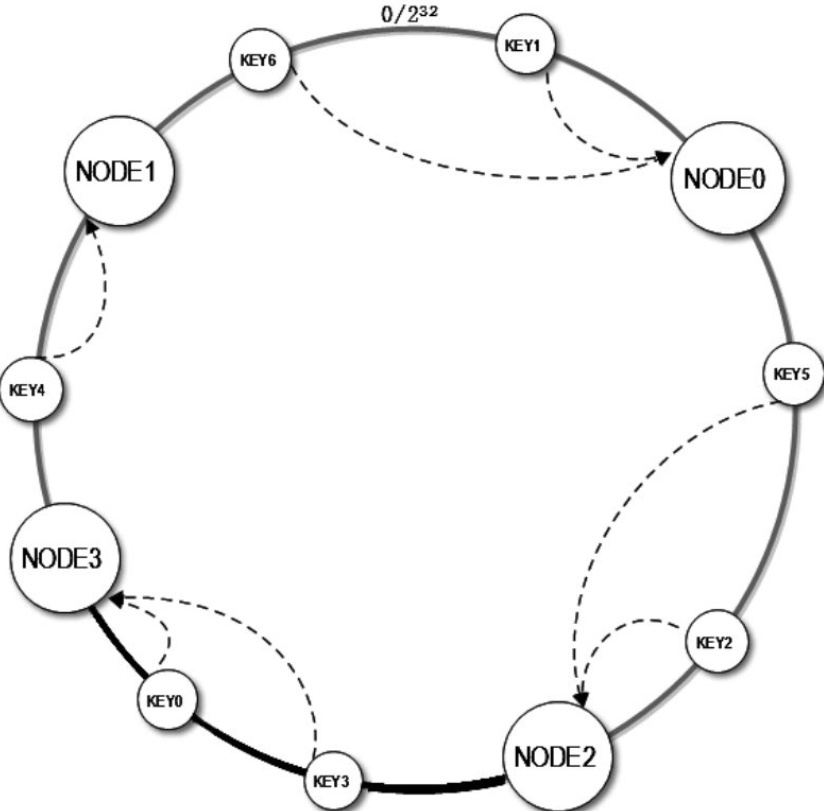

能保证大部分被缓存的数据还可以继续命中之前写入的服务器，少部分还会收到影响(例如加入节点2，那么只会影响节点3)。

可以通过在缓存服务器上加一层虚拟服务器来进一步缓解这个问题。一个虚拟服务器对应一组服务器，影响原因和上面一样，只不过这里影响的是虚拟服务器，而虚拟服务器对应一组服务器，这由就将原来值影响一台服务器，变为影响多台服务器(将影响分摊)。

##### 分布式存储的伸缩性设计

向比较缓存的伸缩性，数据存储的伸缩性有更高的要求。

缓存的目的是加速数据读取的速度并减轻数据存储服务器的负载压力，因此部分缓存数据的丢失不影响业务的正常处理，因为数据还可以从数据库等存储服务器上获取。

而数据存储服务器必须保证数据的可靠存储，任何情况下都必须保证数据的可用性和正确性。

市场上主要的关系数据都支持数据复制功能，使用这个功能可以对数据库进行简单伸缩。

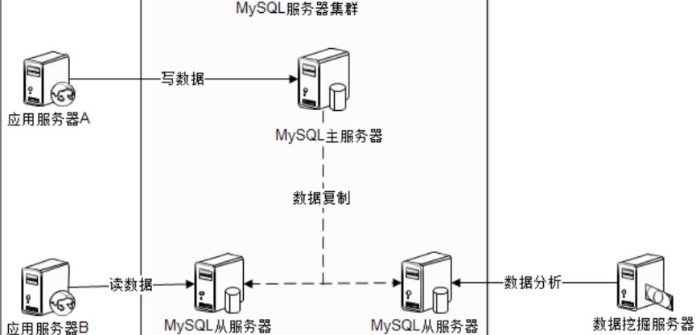

除了数据库主从读写分离，前面提到的业务分割模式也可以用在数据库，不同业务数据表部署在不同的数据库集群上，即俗称的**数据分库**。这种方式的制约条件是跨库的表不能进行Join操作。

大表还需要进行**分片**，将一张表拆开分别存储在多个数据库中

NoSQL数据库产品都放弃了关系数据库的两大重要基础：以关系代数为基础的结构化查询语言（SQL）和事务一致性保证（ACID）。而强化其他一些大型网站更关注的特性：**高可用性和可伸缩性**

也有许多专家将NoSQL解读为Not Only SQL，表示NoSQL只是关系数据库的补充，而不是替代方案。

#### 扩展性

扩展性（Extensibility）

> 是系统架构设计层面的开闭原则（对扩展开放，对修改关闭），架构设计考虑未来功能扩展，当系统增加新功能时，不需要对现有系统的结构和代码进行修改，系统功能可持续扩展或提升的能力

伸缩性（Scalability）

> 指系统能够通过增加（减少）自身资源规模的方式增强（减少）自己计算处理事务的能力。如果这种增减是成比例的，就被称作线性伸缩性。

低耦合的系统更容易扩展，低耦合的模块更容易复用，一个低耦合的系统设计也会让开发过程和维护变得更加轻松和容易管理。

**软件架构师最大的价值不在于掌握多少先进的技术，而在于具有将一个大系统切分成N个低耦合的子模块的能力，这些子模块包含横向的业务模块，也包含纵向的基础技术模块。**

设计网站可扩展架构的**核心思想是模块化**，并在此基础之上，降低模块间的耦合性，提高模块的复用性。

这些组件模块以消息传递及依赖调用的方式聚合成一个完整的系统.

大型网站中，这些模块通过分布式部署的方式，独立的模块部署在独立的服务器（集群）上，从物理上分离模块之间的耦合关系.

##### 利用分布式消息队列降低系统耦合性

事件驱动架构（Event Driven Architecture）：通过在低耦合的模块之间传输事件消息，以保持模块的松散耦合

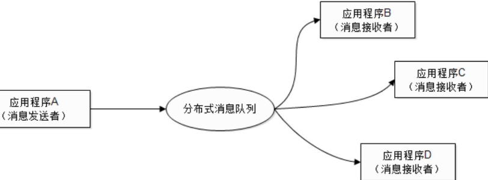

消息队列利用发布—订阅模式工作，消息发送者发布消息，一个或者多个消息接收者订阅消息。

队列是一种先进先出的数据结构，分布式消息队列可以看作将这种数据结构部署到独立的服务器上，应用程序可以通过远程访问接口使用分布式消息队列，进行消息存取操作，进而实现分布式的异步调用。

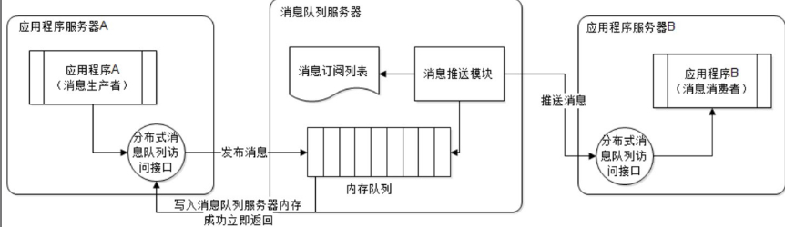

*分布式消息队列可以很复杂，也可以很简单，比如用MySQL也可以当作分布式消息队列：消息生产者程序将消息当作数据记录写入数据库，消息消费者程序查询数据库并按记录写入时间戳排序，就实现了一个事实上的分布式消息队列，而且这个消息队列使用成熟的MySQL运维手段，也可以达到较高的可用性和性能指标*

巨无霸应用问题：

* 编译、部署困难
* 代码分支管理困难
* 数据库连接耗尽
* 新增业务困难

解决方案就是拆分，可纵向拆分和横向拆分两种，将模块独立部署，降低系统耦合性。

纵向拆分：

> 通过梳理业务，将较少相关的业务剥离，使其成为独立的Web应用

横向拆分:

> 需要识别可复用的业务，设计服务接口，规范服务依赖关系，还需要一个完善的分布式服务管理框架

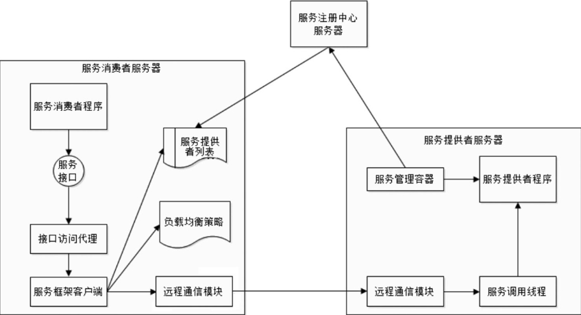

Dubbo的远程服务通信模块支持多种通信协议和数据序列化协议，使用NIO通信框架，具有较高的网络通信性能。

##### 可扩展的数据结构

传统的关系数据库设计数据库表结构的时候，就需要指定表的schema——字段名称，数据类型等。

这些规范带来的一个问题就是僵硬的数据结构难以面对需求变更带来的挑战，有些应用系统设计者通过**预先设计一些冗余字段来应对，不过显然这是一种糟糕的数据库设计**

许多NoSQL数据库使用的ColumnFamily（列族）设计就是一个解决方案：

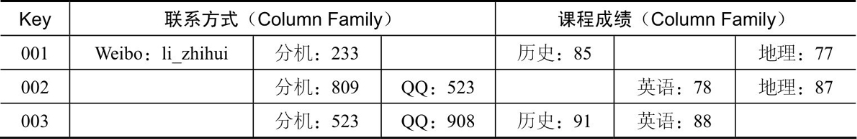

使用支持ColumnFamily结构的NoSQL数据库，创建表的时候，只需要指定ColumnFamily的名字，无需指定字段（Column），可以在数据写入时再指定，通过这种方式，数据表可以包含数百万的字段，使得应用程序的数据结构可以随意扩展。

---

### 案例

#### 淘宝

业务驱动着技术不得不往前走。而淘宝的业务也经历了由简单到复杂，由初级到高级的发展历程，通过淘宝首页的变迁，我们可以看出淘宝业务逐步发展的脉络

* 2003年

> 买来的C2C交易软件稍作汉化修改就成了最初的淘宝网，用PHP开发的，简约也简单。
>
> Linux+Apache+MySQL+PHP（LAMP）架构.
>
> 作为一个刚刚起步的小网站，使用开源、免费、简单的技术产品搭建网站是明智之举，可谓一举多得:
>
> * 低成本
> * 业务不明确，简单的技术方案快速响应需求变化
> * 简单的技术快速上手
>
> 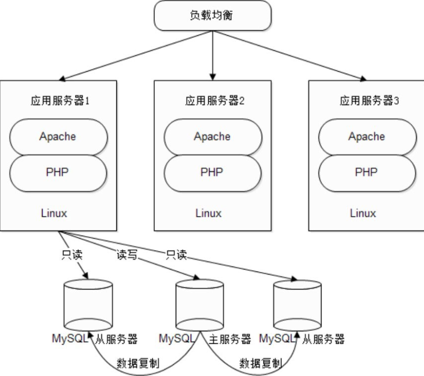

* 2004年

> 模仿eBay的拍卖交易，开始向一口价交易转型，淘宝的架构也经历了一次重大重构，PHP换成了Java，MySQL换成了Oracle，MVC框架和ORM框架
>
> 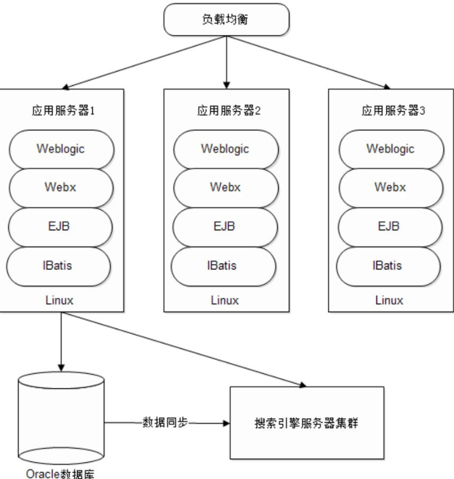
>
> 应用服务器使用Weblogic，数据库使用Oracle，这些产品都需要昂贵的授权使用费。而Oracle又需要部署在昂贵的IBM小型机和同样昂贵的EMC存储设备上。
>
> 淘宝在Oracle、EMC、IBM的护航下，高歌猛

* 2012年

> Spring、分布式集群

#### 维基百科

而wikipedia.org不过只有区区数百台服务器，并仅由十余名技术人员维护，不得不说是一个奇迹。Wikipedia对资源的利用，对性能的优化很具有典型性，有许多值得学习的地方

目前Wikipedia网站建立在LAMP（Linux+Apache+MySQL+PHP）之上，其他基础技术组件也全部采用免费的开源软件。因为Wikipedia是非盈利的，所以尽可能使用免费的软件和廉价的服务器，这种技术倾向使得技术团队不得不量体裁衣、看米下锅，榨尽系统所有资源的利用价值，用最少的资源成就最不可思议的奇迹。

相对其他网站，Wikipedia的业务比较简单，用户操作大部分是只读的，这些前提使Wikipedia的性能优化约束变得简单，可以让技术团队将每一种性能优化手段都发挥到极致。

**Wikipedia通过约束业务获得更大的技术方案选择余地，很多时候业务后退一小步，技术就可以前进一大步。**

Doris 跟主流的NoSQL系统HBase相：

> Doris具有相似的性能和线性伸缩能力，并具有更好的可用性及更友好的图形用户管理界面

* 高可用的服务：

  任何时候，包括宕机、硬盘损坏、系统升级、停机维护、集群扩容等各种情况，都可以对系统进行读写访问操作。

* 高可靠的数据：

  任何情况下，数据可靠存储，不丢失。

