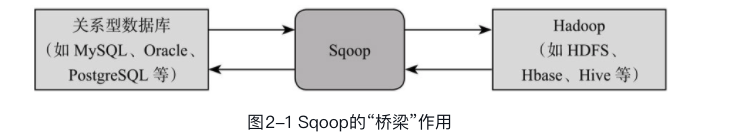
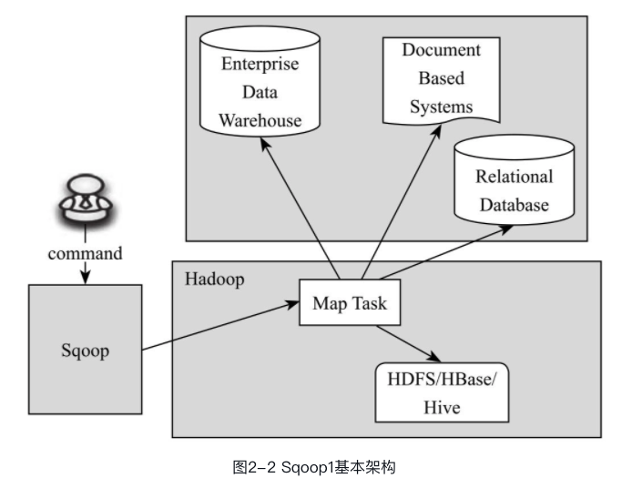
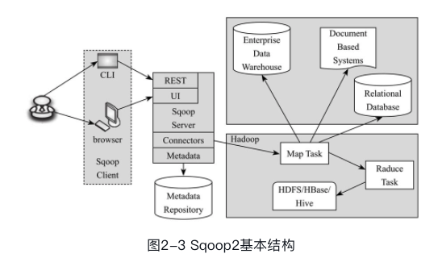
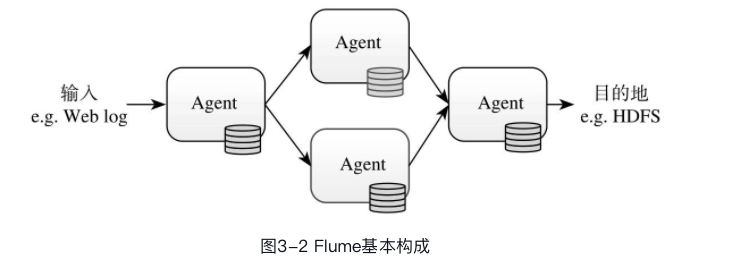
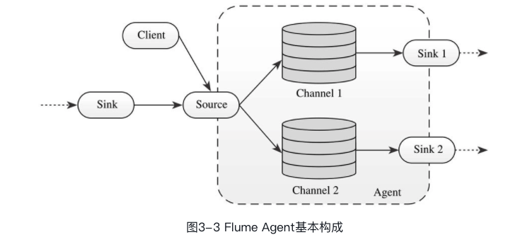
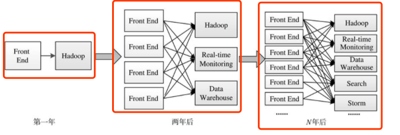
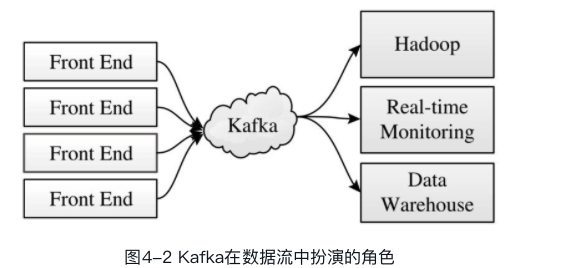
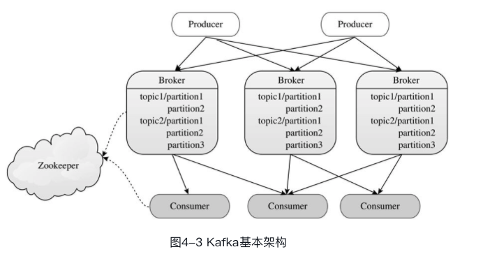
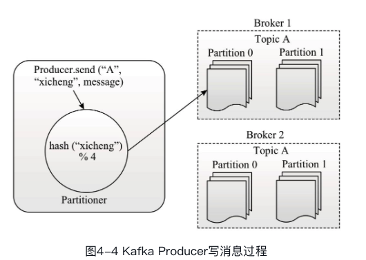
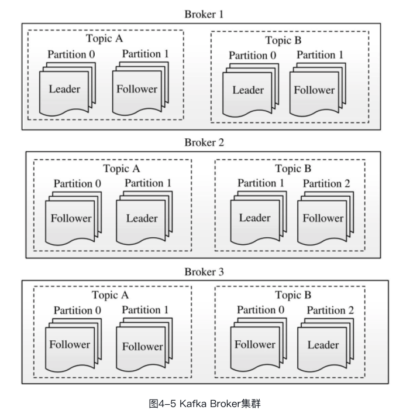

* Sqoop

  > **解决什么问题**： 从工程角度，解决了关系型数据库与Hadoop之间的数据传输问题，它构建了两者之间的“桥梁”，使得数据迁移工作变得异常简单。
  >
  > 
  >
  > 在实际项目中，如果遇到以下任务，可尝试使用Sqoop完成：
  >
  > 1. 数据迁移，公司内部商用关系型数据仓库中的数据以分析为主，综合考虑扩展性、容错性和成本开销等方面。若将数据迁移到Hadoop大数据平台上，可以方便地使用Hadoop提供的如Hive、SparkSQL分布式系统等工具进行数据分析。为了一次性将数据导入Hadoop存储系统，可使用Sqoop
  > 2. 可视化分析结果： Hadoop处理的输入数据规模可能是非常庞大的，比如PB级别，但最终产生的分析结果可能不会太大，比如报表数据等，而这类结果通常需要进行可视化，以便更直观地展示分析结果。目前绝大部分可视化工具与关系型数据库对接得比较好，因此，比较主流的做法是，将Hadoop产生的结果导入关系型数据库进行可视化展示。
  > 3. 数据增量导入： 考虑到Hadoop对事务的支持比较差，因此，凡是涉及事务的应用，比如支付平台等，后端的存储均会选择关系型数据库，而事务相关的数据，比如用户支付行为等，可能在Hadoop分析过程中用到（比如广告系统，推荐系统等）。为了减少Hadoop分析过程中影响这类系统的性能，我们通常不会直接让Hadoop访问这些关系型数据库，而是单独导入一份到Hadoop存储系统中。
  >
  > 
  >
  > Sqoop采用插拔式Connector架构，Connector是与特定数据源相关的组件，主要负责（从特定数据源中）抽取和加载数据。用户可选择Sqoop自带的Connector，或者数据库提供商发布的native Connector，甚至根据自己的需要定制Connector，从而把Sqoop打造成一个公司级别的数据迁移统一管理工具。
  >
  > Sqoop 特点：
  >
  > 1. 性能高：Sqoop采用MapReduce完成数据的导入导出，具备了MapReduce所具有的优点，包括并发度可控、容错性高、扩展性高等。
  > 2. 自动类型转换：Sqoop可读取数据源元信息，自动完成数据类型映射，用户也可根据需要自定义类型映射关系。
  > 3. 自动传播元信息：Sqoop在数据发送端和接收端之间传递数据的同时，也会将元信息传递过去，保证接收端和发送端有一致的元信息。
  >
  > Sqoop 的版本1和版本2是不相互兼容的

  * Sqoop 1

  > Sqoop 是一个客户端工具，不需要启动任何服务就可以使用，Sqoop1是一个只有MR 作业
  >
  > 
  >
  > 当用户通过shell命令提交迁移作业后，Sqoop会从关系型数据库中读取元信息，并根据并发度和数据表大小将数据划分成若干分片，每片交给一个Map Task处理，这样，多个Map Task同时读取数据库中的数据，并行将数据写入目标存储系统，比如HDFS、HBase和Hive等。
  >
  > Sqoop允许用户通过定制各种参数控制作业，包括任务并发度、数据源、超时时间等。
  >
  > 如果你的数据迁移作业很多，Sqoop1则会暴露很多缺点：
  >
  > 1. Connector定制麻烦：Sqoop1仅支持基于JDBC的Connector;Connector开发复杂。
  > 2. 客户端软件繁多：Sqoop1要求依赖的软件必须安装在客户端上，包括MySQL客户端、Hadoop/HBase/Hive客户端、JDBC驱动、数据库厂商提供的Connector等，这使得Sqoop客户端不容易部署和安装。
  > 3. 安全性差：Sqoop1需要用户明文提供数据库的用户名和密码，但未考虑如何利用Hadoop安全机制提供可靠且安全地数据迁移工作。

  * Sqoop2

  >为了解决Sqoop1客户端架构所带来的问题，Sqoop2对其进行了改进，引入了Sqoop Server，将所有管理工作放到Server端，包括Connector管理、MySQL/Hadoop相关的客户端、安全认证等，这使得Sqoop客户端变得非常轻，更易于使用。
  >
  >
  >
  >* Sqoop client
  >
  >  > 定义了用户使用Sqoop的方式，包括客户端命令行（CLI）和浏览器两种方式，其中浏览器方式允许用户直接通过HTTP方式完成Sqoop的管理和数据的导入导出。
  >
  >* Sqoop Server
  >
  >  > Sqoop1中Client端大部分功能在Sqoop2中转移到了Sqoop Server端，包括：
  >  >
  >  > 1. Connector: 进一步抽象化和模块化: 包括：Partitioner、Extractor和Loader
  >  >    * Partitioner：决定如何对源数据进行分片（SqoopSplit），以便启动Map Task并行处理
  >  >    * Extractor：将一个分片中的数据解析成一条条记录，并输出；
  >  >    * Loader：读取Extractor输出的数据，并以特定格式写入目标数据源中。
  >  >
  >  > 从前面介绍可容易看出，整个过程只需一个MapReduce作业即可完成：Partitioner和Extractor在Map阶段完成，Loader在Reduce阶段完成。
  >  >
  >  > 2. Metadata： Sqoop中的元信息，包括可用的Connector列表、用户创建的作业和Link（实例化的一个Connector，以便创建作业时使用）等。元信息被存储在数据仓库中，默认使用轻量级数据库Apache Derby，用户也可根据需要替换成MySQL等其他数据库。
  >  > 3. RESTful和HTTP Server： 与客户端对接，响应客户端发出的RESTful请求和HTTP请求。
  >
  >Sqoop2通过将访问入口服务化，将所有的复杂功能放到服务器端，大大简化了客户端实现，使其更轻量级，进而变得更加易用。

* Flume

  > 主要处理非关系型数据的收集问题。这类日志有如下问题：
  >
  > 1. 数据源种类繁多：格式不同，产生方式不同
  > 2. 数据源是物理分布的：天然产生的时候就是分布式的
  > 3. 流式的，不间断产生：实时或者接近实时的
  > 4. 对可靠性有一定要求：日志收集过程不丢数据
  >
  > 它是Cloudera公司开源的一个分布式高可靠系统，能够对不同数据源的海量日志数据进行高效收集、聚合、移动，最后存储到一个中心化的数据存储系统中。解决了上述问题。
  >
  > Flume采用了插拔式软件架构
  >
  > 特点：
  >
  > 1. 扩展性：Flume架构是完全分布式的，没有任何中心化组件，这使得它非常容易扩展。
  > 2. 高度定制化：各个组件（比如Source、Channel和Sink等）是可插拔的，用户很容易根据需求进行定制。
  > 3. 声明式动态化配置：Flume提供了一套声明式配置语言，用户可根据需要动态配置一个基于Flume的数据流拓扑结构。
  > 4. 语意路由：可根据用户的设置，将流式数据路由到不同的组件或存储系统中，这使得搭建一个支持异构的数据流变得非常容易。
  > 5. 良好的可靠性：Flume内置了事务支持，能够保证发送的每条数据能够被下一跳收到而不会丢失。
  >
  > Flume OG（Original Generation）主要是0.9.x之前的版本，现在已经弃用
  >
  > Flume NG: 在OG架构基础上做了调整，去掉了中心化的组件master以及服务协调组件ZooKeeper，使得架构更加简单和容易部署。Flume NG与OG是完全不兼容的。
  >
  > 
  >
  > F lume的数据流是通过一系列称为Agent的组件构成的，如图3-2所示，一个Agent可从客户端或前一个Agent接收数据，经过过滤（可选）、路由等操作后，传递给下一个或多个Agent（完全分布式），直到抵达指定的目标系统。
  >
  > 一个Agent 的内部
  >
  > 

  > Source: 接收Event(数据流水线中传递的数据称为events)的组件，写入一/多个channel
  >
  > channel：缓存区，它暂存Source写入的Event，直到被Sink发送出去
  >
  > Sink: Sink负责从Channel中读取数据，并发送给下一个Agent（的Source）
  >
  > Flume使用事务性的方式保证Event传递的可靠性。Sink必须在Event被存入Channel后，或者已经被成功传递给下一个Agent后，才能把Event从Channel中删除掉。这样数据流里的Event无论是在一个Agent里还是多个Agent之间流转，都能保证可靠。

* Flume NG 高级组件

  > 除了Source、Channel和Sink外，Flume Agent还允许用户设置其他组件更灵活地控制数据流，包括Interceptor, Channel Selector和Sink Processor等
  >
  > 
  >
  > Interceptor: 允许用户修改或丢弃传输过程中的Event，用户可以定义多个
  >
  > Channel Selector：允许Flume Source选择一个或多个目标Channel，并将当前Event写入这些Channel
  >
  > Sink Processor： 允许将多个Sink组装在一起形成一个逻辑实体（称为“Sink Group”），而Sink Processor则在Sink Group基础上提供负载均衡以及容错的功能（当一个Sink挂掉了，可由另一个Sink接替）

* Kafka

  > Sqoop 和 flume 分别解决关系型和非关系型数据库数据的收集到中央化存储中，一般在处理数据的时候，如网站产生的日志，需要传递到系统中农进行逻辑处理和挖掘，为了降低数据生产者和消费者之间的耦合性、平衡二者处理能力的不对等，消息队列产生了。
  >
  > 消息队列是位于生产者和消费者之间的“中间件”，它解除了生产者和消费者的直接依赖关系，使得软件架构更容易扩展和伸缩；它能够缓冲生产者产生的数据，防止消费者无法及时处理生产者产生的数据。
  >
  > * Kafka 的设计动机
  >
  > > 如果是如下的方式：前端收集到数据之后之间发送到后端，然后由后端进行存储
  > >
  > > 
  > >
  > > 那么刚开始还好处理，那么随着后面的发展，数据越来越多，那么存储的整个链路压力越来越大，慢慢发展如上所示。那么结果就是
  > >
  > > * 数据的生产者和消费者耦合过高
  > > * 生产者和消费者间数据处理速率不对等，生产的数据不能及时的消费掉
  > > * 大量并发对后端压力大。
  > >
  > > 降低数据生产者（比如Web Server）与消费者（比如Hadoop集群、实时监控系统等）之间的耦合性，使系统更易扩展，需引入一层“中间件”，这正是Kafka担任的角色
  > >
  > > 
  > >
  > > * 避免生产者和消费者直接互通产生的彼此高度依赖，使得两者中任何一个有变化，都不会影响另一方。
  > > * 缓存生产者产生的数据，使得消费者可以重复消费历史数据（比如数据处理后发现结果存在问题，需要重新读取数据进行处理）；平滑生产者产生数据速度和消费者处理数据速度的不对等。
  >
  > kafka 和 ZeroMQ 等不同的是，kafka不遵循AMQP（Advanced Message Queuing Protocol），而是专门为大数据场景下而设计。
  >
  > **发布订阅系统 **消费者可订阅某类主题的数据，当生产者产生对应主题的数据后，所有订阅者会快速获取到数据，即消费者可快速获取新增数据。另外，可随时增加新的消费者而无需进行任何系统层面的修改。
  >
  > **消息总线：**所有收集到的数据会流经Kafka，之后由Kafka分流后，进入各个消费者系统。
  >
  > **Flume与Kafka的区别：**
  >
  > Flume和Kafka在架构和应用定位上均有较大不同，Kafka中存储的数据是多副本的，能够做到数据不丢，而Flume提供的memory channel和file channel均做不到；Kafka可将数据暂存一段时间（默认是一周），供消费者重复读取，提供了类似于“发布订阅模式”的功能，而Flume Sink发送数据成功后会立刻将之删除；Kafka的生产者和消费者均需要用户使用API编写，仅提供了少量的与外部系统集成的组件，而Flume则提供了大量的Source和Sink实现，能够更容易地完成数据收集工作。由于两者各具长，我们通常会选择同时使用这两个系统。
  >
  > kafka 特点：
  >
  > * 高性能： 高吞吐量
  > * 良好的扩展性：分布式设计，数据可以分片到多个节点
  > * 数据持久性：数据消息均可以持久化到磁盘上。并通过多个副本防止数据丢失。
  >
  > 
  >
  > producer: 将数据写入 Broker
  >
  > Broker: 作为中间数据的缓冲区
  >
  > Consumer: 消费数据
  >
  > kafka采用了push-pull架构，即Producer将数据直接“push”给Broker，而Consumer从Broker端“pull”数据
  >
  > 这种设计带来的优势有：
  >
  > 1. Consumer可根据自己的实际负载和需求获取数据，避免采用“push”方式给Consumer带来较大压力。
  > 2. Consumer自己维护已读取消息的offset而不是由Broker端维护，这大大缓解了Broker的压力，使得它更加轻量级。
  >
  > * Producer
  >
  >   >Producer是由用户使用Kafka提供的SDK开发的，Producer将数据转化成“消息”，并通过网络发送给Broker。
  >   >
  >   >每条数据被称为“消息”，每条消息表示为一个三元组：<topic, key, message>
  >   >
  >   >topic： 表示该条消息所属的topic。topic是划分消息的逻辑概念，一个topic可以分布到多个不同的broker上。
  >   >
  >   >key： 消息的主键，Kafka会根据主键将同一个topic下的消息划分成不同的分区（partition），默认是基于哈希取模的算法，用户也可以根据自己需要设计分区算法。
  >   >
  >   >
  >   >
  >   >message: 表示该条消息的值。该数值的类型为字节数组，可以是普通字符串、JSON对象，或者经JSON, Avro, Thrift或Protobuf等序列化框架序列化后的对象。
  >
  > * Broker
  >
  >   > Broker一般有多个，它们组成一个分布式高容错的集群。Broker的主要职责是接受Producer和Consumer的请求，并把消息持久化到本地磁盘。
  >   >
  >   > 
  >   >
  >   > Kafka Broker能够保证同一topic下同一partition内部的消息是有序的，但无法保证partition之间的消息全局有序，这意味着一个Consumer读取某个topic下（多个分区中，如图4-6所示）的消息时，可能得到跟写入顺序不一致的消息序列。
  >   >
  >   > Broker中保存的数据是有有效期的，比如7天，一旦超过了有效期，对应的数据将被移除以释放磁盘空间。只要数据在有效期内，Consumer可以重复读取而不受限制。
  >
  > * Consumer
  >
  >   > Consumer主动从Kafka Broker拉取消息进行处理。每个Kafka Consumer自己维护最后一个已读取消息的offset，并在下次请求从这个offset开始的消息
  >
  > * Zookeeper（集群的集中管理，可以理解为master）
  >
  >   > 在一个Kafka集群中，ZooKeeper担任分布式服务协调的作用，Broker和Consumer直接依赖于ZooKeeper才能正常工作：
  >   >
  >   > Broker与ZooKeeper：所有Broker会向ZooKeeper注册，将自己的位置、健康状态、维护的topic、partition等信息写入ZooKeeper，以便于其他Consumer可以发现和获取这些数据，当一个Consumer宕掉后，其他Consumer会通过ZooKeeper发现这一故障，并自动分摊该Consumer的负载，进而触发相应的容错机制。
  >   >
  >   > Consumer与ZooKeeper:[插图]Consumer Group通过ZooKeeper保证内部各个Consumer的负载均衡，并在某个Consumer或Broker出现故障时，重新分摊负载；Consumer（仅限于high-level API，如果是low-level API，用户需自己保存和恢复offset）会将最近所获取消息的offset写入ZooKeeper，以便出现故障重启后，能够接着故障前的断点继续读取数据。
  >
  > * Kafka 的关键技术点: Kafka作为一个分布式消息队列，具有高性能、良好的扩展性、数据持久性等特点
  >
  >   > * 可控的可靠性级别
  >   >
  >   >   > Producer 2中方式向Broker发送消息同步方式与异步方式，其中异步方式通过批处理的方式，可大大提高数据写入效率。
  >   >   >
  >   >   > 当Producer向Broker发送一条消息时，可通过设置该消息的确认应答方式，控制写性能与可靠性级别。在实际系统中，写性能和可靠性级别是两个此消彼长的指标，当可靠性级别较高时（每条消息确保成功写入多个副本），写性能则会降低，用户可根据实际需要进行设置。目前Kafka支持三种消息应答方式，可通过参数request.required.acks控制：
  >   >   >
  >   >   > 0：无需对消息进行确认，性能最好，但不能保证消息被成功接收并写入磁盘。
  >   >   >
  >   >   > 1：当Producer向Broker发送消息后，需等到leader partition写成功后才会返回，但对应的follower partition不一定写成功。这种方式在性能和可靠性之间进行了折中，能够在比较高效的情况下，保证数据至少成功写入一个节点。
  >   >   >
  >   >   > -1: 当Producer向Broker发送消息后，需等到所有Partition均写成功后才会返回。写性能要低，尤其是当某个节点写入较慢时，会导致整个写操作延迟很高。
  >   >
  >   > * 数据多副本
  >   >
  >   >   > 应对大数据应用场景，Kafka Broker直接将消息持久化到磁盘上而不是内存中，这要求必须采用高效的数据写入和存储方式。Kafka Broker将收到的数据顺序写入磁盘，并结合基于offset的数据组织方式，能达到很高效的读速度和写速度。