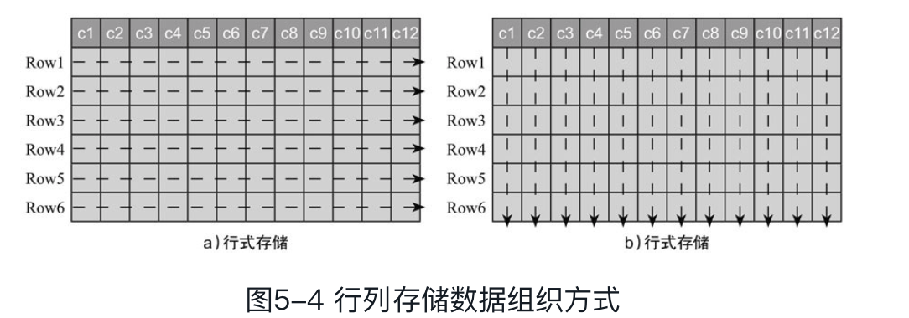
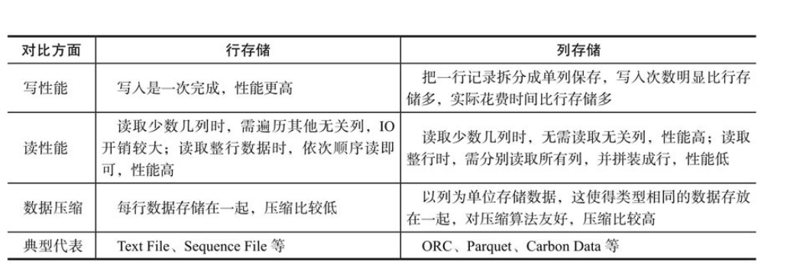
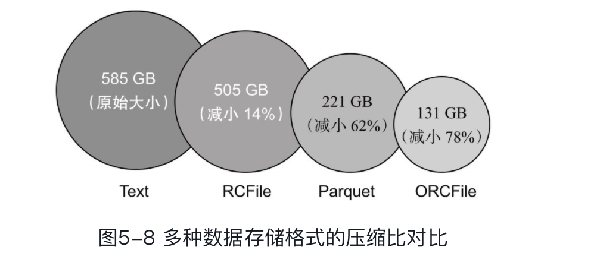

主要有三个问题：

* 数据序列化：是将内存对象转换为字节流的过程，之间决定了数据解析效率以及模式演化能力
* 文件存储格式：文件存储格式是数据在磁盘上的组织方式，之间决定了数据存储效率以及被上层分布式计算集成的容易程度
* 存储系统：针对不同类型的数据，可采用不同的存储系统，

---

* 序列化

  > 当需要将数据存入文件或者通过网络发送出去时，需将数据对象转化为字节流，即对数据序列化。考虑到性能、占用空间以及兼容性等因素，我们通常会经历以下几个阶段的技术演化:
  >
  > * 阶段1
  >
  >   > 不考虑任何复杂的序列化方案，直接将数据转化成字符串，以文本形式保存或传输，如果一条数据存在多个字段，则使用分隔符（比如“, ”）分割。该方案存储简单数据绰绰有余，但对于复杂数据，且数据模式经常变动时，将变得非常烦琐，
  >   >
  >   > * 难以表达嵌套数据
  >   > * 无法表达二进制数据：图片、视频等二进制数据无法表达
  >   > * 难以应对数据模式变化
  >
  > * 阶段2
  >
  >   > 采用编程语言内置的序列化机制，这种方式解决了阶段1面临的大部分问题，但随着使用逐步深入，我们发现这种方式将数据表示方式跟某种特定语言绑定在一起，很难做到跨语言数据的写入和读取。
  >
  > * 阶段3
  >
  >   > 为了解决阶段2面临的问题，我们决定使用应用范围广、跨语言的数据表示格式，比如JSON和ⅩML。但使用一段时间后，你会发现这种方式存在严重的性能问题：解析速度太慢，同时数据存储冗余较大，比如JSON会重复存储每个属性的名称等。
  >
  > * 阶段4
  >
  >   > 阶段4中提到的方式便是本章重点介绍的序列化框架，常用的有Thrift[插图], Protocol Buffers和Avro，它们被称为“Language Of Data”。它们通过引入schema，使得数据跨语言序列化变得非常高效，同时提供了代码生成工具，为用户自动生成各种语言的代码。总结起来，“LanguageOf Data”具备以下基本特征：
  >   >
  >   > * 提供IDL（Interface Description language）用以描述数据schema，能够很容易地描述任意结构化数据和非结构化数据。
  >   > * 支持跨语言读写，至少支持C++、Java和Python三种主流语言。
  >   > * 数据编码存储
  >   > * 支持schema演化

* 数据序列化方案

  > 目前存在很多开源序列化方案，其中比较著名的有Facebook Thrift, Google Protocol Buffers（简称“Protobuf”）以及Apache Avro，这些序列化方案大同小异，彼此之间不存在压倒性优势，在实际应用中，需结合具体应用场景做出选择。
  >
  > * Thrift
  >
  >   > 是FaceBook 开源的RPC框架，同时具有序列化功能，而且几乎支持所有的语言C++、Java、Python等。
  >   >
  >   > Thrift提供了一套IDL语法用以定义和描述数据类型和服务。IDL文件由专门的代码生成器生成对应的目标语言代码，以供用户在应用程序中使用。
  >
  > * Protobuf
  >
  >   >Protocol Buffers是Google公司开源的序列化框架，主要支持Java,C++和Python三种语言，语法和使用方式与Thrift非常类似，但不包含RPC实现。由于采用了更加紧凑的数据编码方式，大部分情况下，对于相同数据集，Protobuf比Thrift占用存储空间更小，且解析速度更快

* 文件存储格式

  > 常见的存储格式包括
  >
  > * 行式存储
  >
  >   > 行式存储以文本格式Text File、key/value二进制存储格式Sequence File为典型代表；
  >   >
  >   > 行存储以行为单位进行存储，读写过程是一致的，都是连续读取或写入同一行的所有列
  >
  > * 列式存储两种：
  >
  >   > 列式存储以ORC[插图]、Parquet[插图]和Carbon Data[插图]三种文件格式为代表。
  >   >
  >   > 列存储写数据时将数据拆分成列，并以列为单位存储（相同列存储在一起），读数据时，分别读取对应的列，并拼装成行
  >
  > 
  >
  > 二者的性能比较
  >
  > 
  >
  > * 行式存储格式
  >
  >   > * Text File
  >   >
  >   >   > 以文本字符串方式保存数据，具有简单、易查看等优点，是使用最广泛的行式存储格式
  >   >
  >   > * Sequence File
  >   >
  >   >   > Hadoop中提供的简单key/value二进制行式存储格式,可用于存储文本格式无法存储的数据，比如二进制对象、图片、视频等.
  >
  > * 列式存储格式: 
  >
  >   数据的列数往往非常多（几十列到上百列），而每次处理数据时只用到少数几列，此时采用列式存储是非常合适的
  >
  >   
  >
  >   > * ORC
  >   >
  >   >   > ORC是专为Hadoop设计的自描述的列式存储格式（Apache Hive 0.11版本引入），重点关注提高数据处理系统效率和降低数据存储空间，它支持复杂数据类型、ACID及内置索引支持，非常适合海量数据的存储。
  >   >
  >   > * parquet
  >   >
  >   >   > 它先按照行切分数据，形成一个Row Group，在每个Row Group内部，以列为单位存储数据。
  >   >   >
  >   >   > 
  >   >   >
  >   >   > * Row Group:  写数据的时候，内部是以列为单位存储这些行，当向parquet 文件写数据的时候，先将数据缓存 到内存中，当达到预定大小的时候 ，才会写到 磁盘中，每一个 row group 是一个独立单元，由一个独立任务处理
  >   >   > * Column Chunk：由若干个 Page 够成，读取数据的时候，可以选择性跳过不感兴趣的Page
  >   >   > * Data Page：数据压缩的 基本单元，数据读取的最小单元。
  >   >
  >   >   相比于ORC File, Parquet能更好地适配各种查询引擎（比如Hive、Impala等），计算框架（比如MapReduce、Spark等）和序列化框架（比如Thrift、Protobuf、Avro等）

  当前主流的开源序列化框架有Thrift、Protobuf和Avro三种，它们彼此不存在压倒性的优势，通常根据具体的应用场景决定哪种更加合适。

  文件存储格式分为行式存储和列式存储两种，列式存储以列为单位组织数据，辅以相应的数据编码，能提升数据存取效率、降低存储空间，当前主流的开源列式存储格式有ORC、Parquet和CarbonData三种，其中ORC源于Hive，支持所有Hive数据类型，Parquet源于GoogleDremel系统，能与各种计算框架、查询引擎和数据模型进行友好的集成，而CarbonData则是华为开源的支持索引的列式存储格式。

