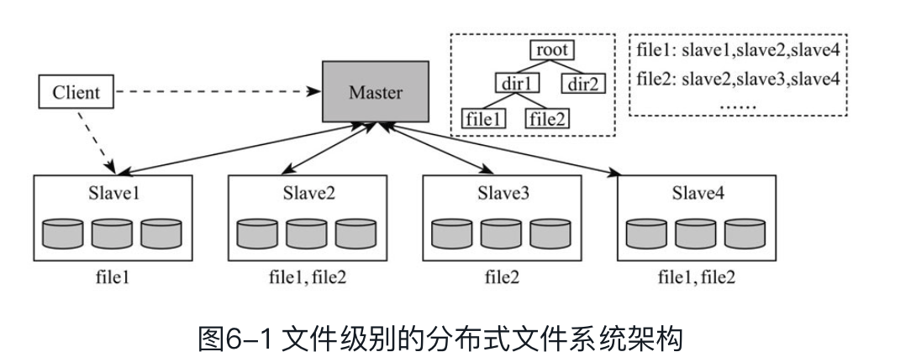
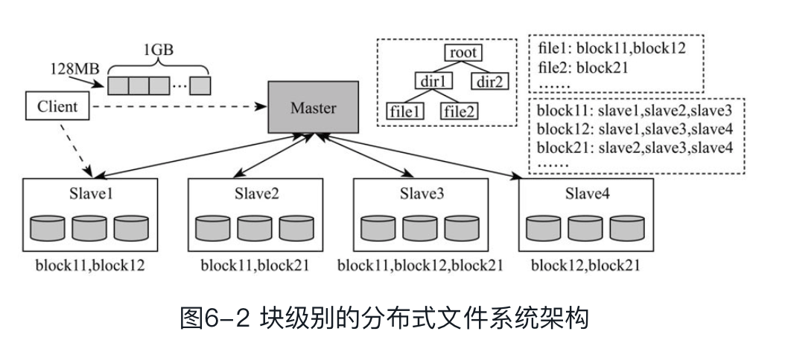
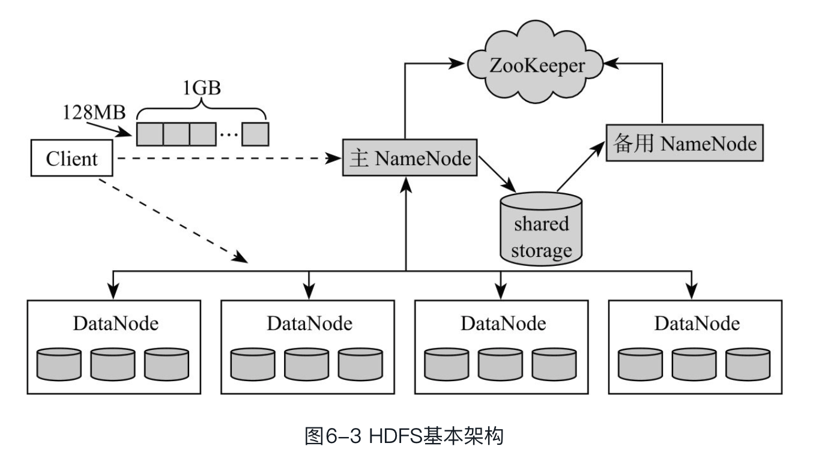
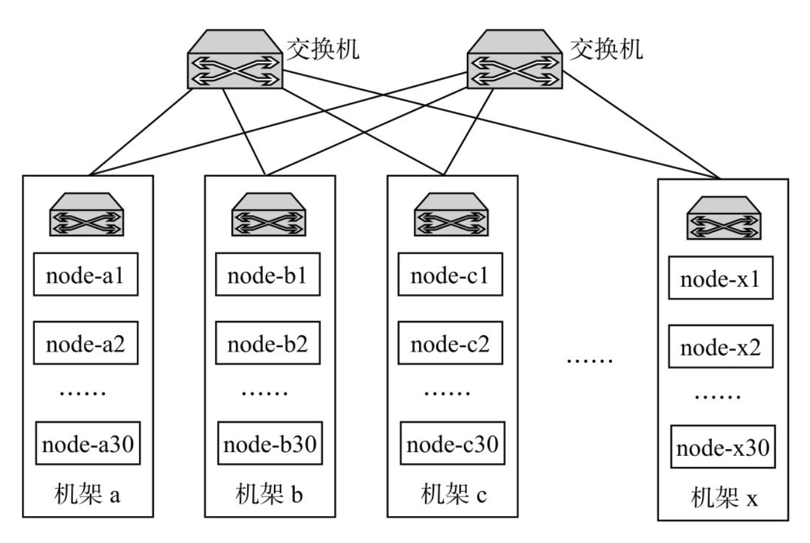
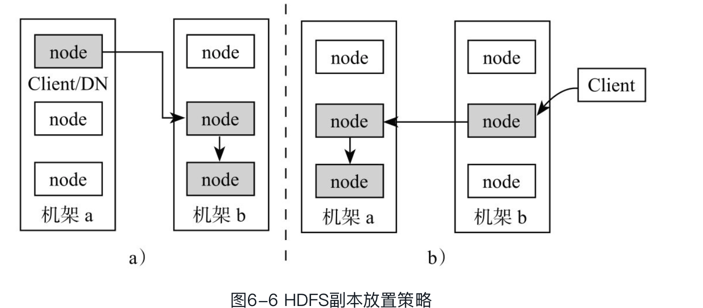
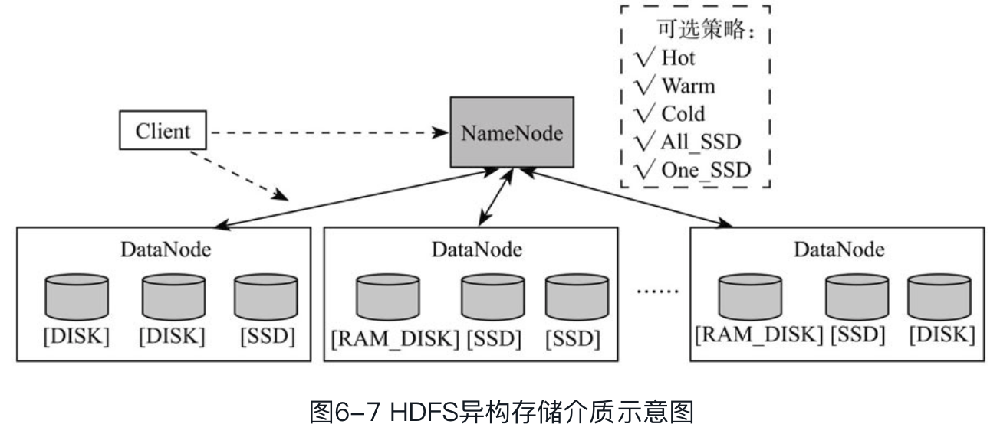

数据量日益增大，需要一个分布式文件系统去存储他们，这个文件系统需要具有良好的容错性、扩展性、和易用性的API。Hadoop 分布式文件系统HDFS

---

随着数据日益的增加，需要存储这些 数据，有两种存储解决方案，

* 纵向扩展：利用现有的存储系统，通过不断的增加存储容量来满足，但这种方式价格昂贵，且审计困难以及总存在物理瓶颈等问题。

* 横向扩展：以网络互连的节点为单位扩大存储容量，而横向扩展也带来一些难点

  * 因故障导致数据丢失，横向扩展集群采用的节点都是普通的商用服务器、因机器、网络、人为失误、软件bug等导致几区宕机是常见的现象，这就需要分布式文件系统能够很好的处理这些故障(**容错性 **)
  * 文件大：需要分布式系统在IO操作和块大小方面重新设计
  * 一次性写入多次读取：一部分文件是通过追加方式（append-only）产生的，且一旦产生之后不会再随机修改，只是读取（且为顺序读取），也就是说，这些文件是不可修改的。

  为了解决以上文件，Google 提出了GFS 分布式文件系统，HDFS 正是GFS的一个开源实现。

---

* 文件级别的分布式系统

> 一个分布式文件系统，首先想到的是master/slaves 主从架构，给定N个网络互连的节点，每个节点上装有Linux 操作系统，且配置有一定量的内存和硬盘，选出一个节点作为Master 记录所有的元信息，其他节点作为slave存储实际的文件，为了确保数据的可靠性，将文件保存到三个不同几点上(3个副本)
>
> 
>
> 当客户端（Client）需要写入一个文件时，首先与Master通信，获取文件存放节点列表，如果该文件是合法的（比如不存在重名文件等），则Master根据一定的负载均衡策略将三个节点位置信息发回给客户端，这时客户端可与这三个Slave节点建立网络连接，将文件写入对应的三个节点，读文件过程类似
>
> 但存储一些问题：
>
> * 难以负载均衡：以文件为单位存储数据，用户的数据带下往往不是同一的，难以保证每个节点上的存储负载是均衡的。
> * 难以并行处理：当很多个分布在不同节点上的任务并行读取一个文件的时候，会使得存储文件的几点出口网络宽带称为瓶颈，制约上层计算架构的并行处理效率
>
> 为了解决上面的问题，**块级别的分布式文件系统**出现，这些系统的核心在于将文件分成等大的数据块，并以数据块为单位存储到 不同的几点，进行解决文件级别的分布式系统存在的负载均衡和并行处理问题，
>
> 
>
> * Master: 负载存储和管理元信息，包括整个文件系统的目录树，文件块列表、以及每个块存放节点列表等。
> * Slave：存储实际的数据块，并和Master 保持心跳信息，汇报自身健康状态以及负载等情况
> * Client：用户通过客户端和Master 和 slaves 交互，完成文件系统的管理和文件的读写等。
>
> HDFS 就是一种块级别的 分布式文件系统。

* HDFS 基本架构

> 使用主从结构，主节点称为NameNode，只有一个，负责管理元信息和所有节点，从节点称为DataNode，通常会有多个，存储实际数据块，
>
> 
>
> **NameNode: **
>
> * 元信息管理，维护文件系统目录树，各个文件的块大小信息等
> * 管理DataNode：DataNode 周期性需要向NameNode 汇报心跳以表明自己还活着，一旦NameNode 发现那个DataNode 出现故障，就会在其他活着的DataNode 上重构失去的数据块。
>
> 一个HDFS集群中只存在一个对外服务的NameNode，称为Active NameNode，为了防止单个NameNode出现故障后导致整个集群不可用，用户可启动一个备用NameNode，称为StandbyNameNode，为了实现NameNode HA（High Availability，高可用），需解决好两者的切换和状态同步问题。
>
> * 准/备切换：手动方式切换(命令显示修改NameNode 角色，通常用于NameNode 滚动升级)
> * 状态同步：主/备NameNode并不是通过强一致协议保证状态一致的，而是通过第三方的共享存储系统。主NameNode将EditLog（修改日志，比如创建和修改文件）写入共享存储系统，备用NameNode则从共享存储系统中读取这些修改日志，并重新执行这些操作，以保证与主NameNode的内存信息一致
>
> **DataNode**
>
> DataNode存储实际的数据块，并周期性通过心跳向NameNode汇报自己的状态信息。
>
> **Client**
>
> 用户通过客户端与NameNode和DataNode交互，完成HDFS管理（比如服务启动与停止）和数据读写等操作。
>
> 当向HDFS写入文件时，客户端首先将文件切分成等大的数据块（默认一个数据块大小为128MB），之后从NameNode上领取三个DataNode地址，并在它们之间建立数据流水线，进而将数据块流式写入这些节点。

* HDFS 关键技术

> 主要包括如下技术：
>
> * 容错性设计
> * 副本方式策略
> * 异构存储介质
> * 中央化缓存管理
>
> **容错设计**
>
> > HDFS内置了良好的容错性设计策略，以降低各种故障情况下数据丢失的可能性
> >
> > * NameNode 故障：
> >
> >   NameNode 记录了文件系统的元信息，这些信息一旦 丢失，将 导致政哥哥文件数据的不可用， HDFS 允许为每个active NameNode 分配 一个个Standby NameNode，方式元数据的丢失。
> >
> > * DataNode 故障
> >
> >   > 每个DataNode 保存了实际的数据块，这些数据库在其他DataNode 中也存着相同的副本，当某个DataNode 宕机了，NameNode 就会在其他节点上重构该DataNode 上的数据块，保证每个文件的副本数在正常的水平线
> >
> > * 数据库损坏
> >
> >   > DataNode 在保存数据的时候，会生成一个校验码，当存取数据块的时候，如果发现校验码不一致了，则认为数据发生了NameNode 不知道的操作，认为损坏了，NameNode 会从其他节点上的正常副本重构受损的数据块。
>
> * 副本放置策略
>
> > 一个良好的副本放置策略能权衡写性能和可靠性两个因素，在保证写性能较优的情况下，尽可能提高数据的可靠性，副本放置策略与集群物理拓扑结构是直接相关的
> >
> > 
> >
> > 一个典型的物理集群由多个机架构成，机架内部的节点通过内部交换机通信，机架之间的节点是通过外部节点通信，由于机架间的节点通信需通过多层交换机，相比于机架内节点通信，读写延迟要高一些。相同机架内部的节点通常“绑定”在一起，多种资源可能是共享的，比如内部交换机，电源插座等，因此它们同时不可用的概率要比不同机架节点高很多。
> >
> > HDFS默认采用的三副本放置策略（HDFS中副本放置策略是插拔式的，用户可嵌入自己的实现）
> >
> > 
> >
> > 客户端与DataNode同节点：
> >
> > 上层计算框架处理HDFS数据时，每个任务实际上就是一个客户端，它们运行在与DataNode相同的计算节点上（HDFS和YARN同节点部署）。在这种情况下，三副本放置策略如下：第一个副本写到同节点的DataNode上，另外两个副本写到另一个相同机架的不同DataNode上；
> >
> > 客户端与DataNode不同节点：
>
> * 异构存储介质
>
> > 随着HDFS的不断完善，它已经从最初只支持单存储介质（磁盘）的单一文件系统逐步演化成支持异构存储介质的综合分布式文件系统，这使得它能够更好地利用新型存储介质，比如SSD
> >
> > 
> >
> > 异构存储介质的引入，使得HDFS变成了一个提供混合存储方式的文件系统，用户可以根据数据特点，选择合适的存储介质满足你应用需求。

> HDFS是一个分布式文件系统，具有良好的扩展性、容错性以及易用的API。它的核心思想是将文件切分成等大的数据块，以多副本的形式存储到多个节点上。HDFS采用了经典的主从软件架构，其中主服务被称为NameNode，管理文件系统的元信息，而从服务被称为DataNode，存储实际的数据块，DataNode与NameNode维护了周期性的心跳，为了防止NameNode出现单点故障，HDFS允许一个集群中存在主备NameNode，并通过ZooKeeper完成Active NameNode的选举工作。HDFS提供了丰富的访问方式，用户可以通过HDFS shell, HDFS API，数据收集组件以及计算框架等存取HDFS上的文件。

