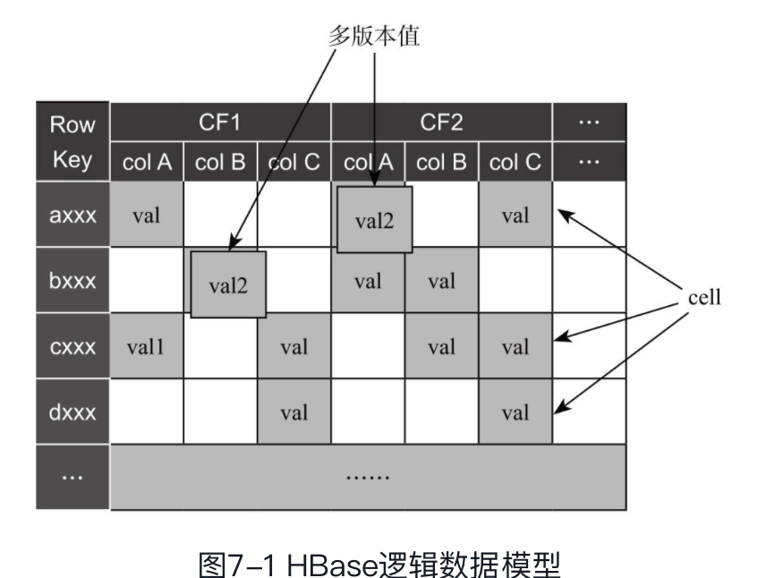
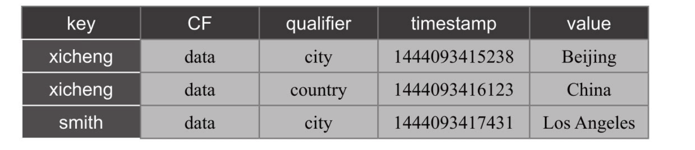
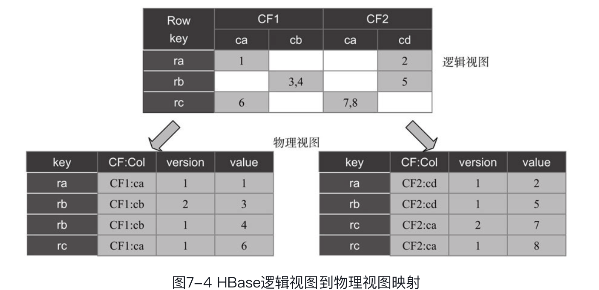
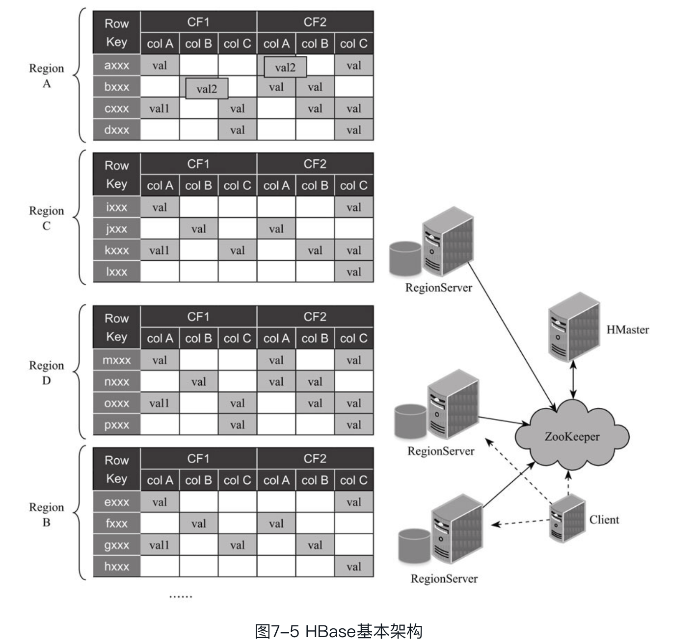
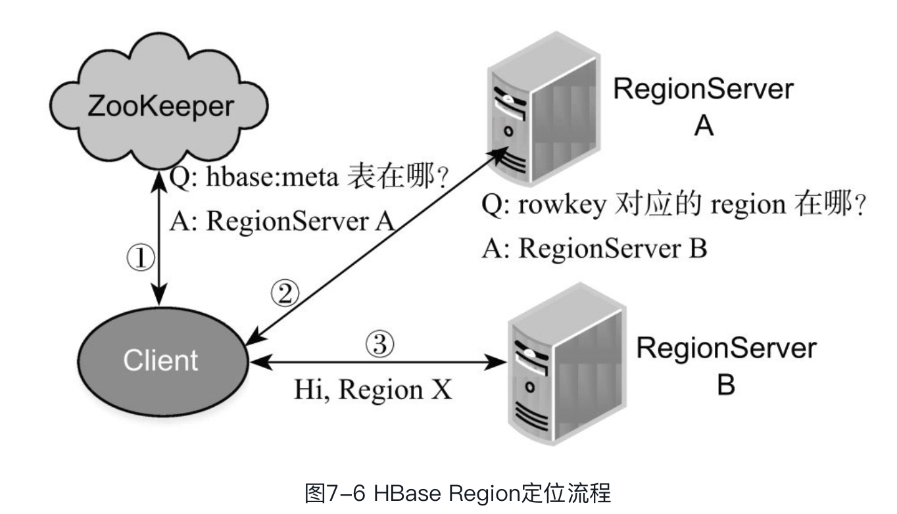
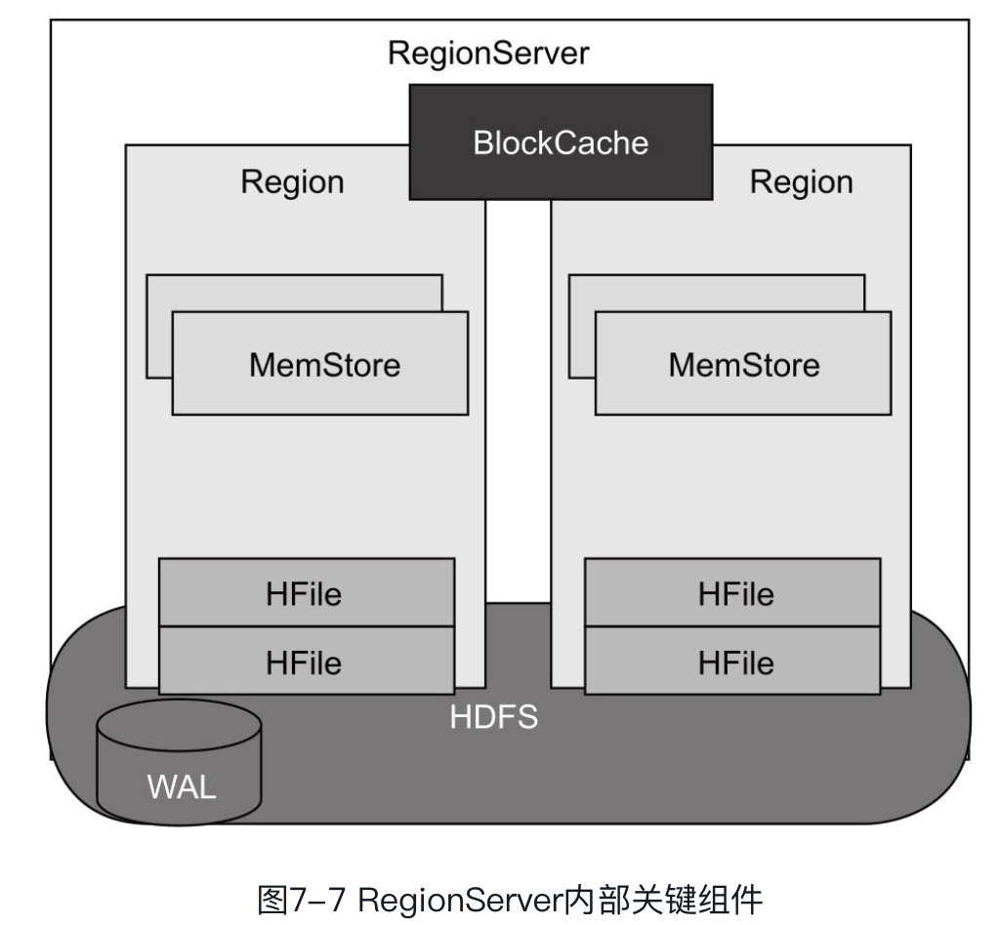
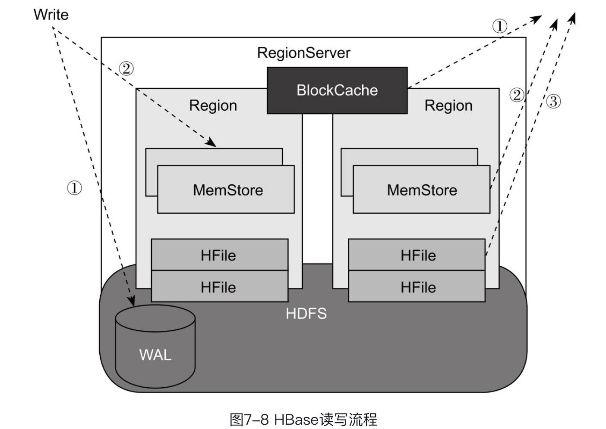

在大数据场景中，除了直接以文件形式保存的数据外，还有大量结构化和半结构化的数据，**这类数据通常需要支持更新操作，比如随机插入和删除，这使得分布式文件系统HDFS很难满足要求。为了方便用户存取海量结构化和半结构化数据，HBase应运而生。**

HBase应运而生。它是一个分布式列存储系统，具有良好的扩展性、容错性以及易用的API。HBase是构建在分布式文件系统HDFS之上的、支持随机插入和删除的列簇式存储系统，它可被简单理解为一个具有持久化能力的分布式多维有序映射表。

**尽管HBase随机读写性能较高，但数据扫描速度较慢，难以适用于OLAP场景，为此，Cloudera提出了Kudu项目，它能很好地兼顾吞吐率和延迟。**

HBase： 为支撑结构化/半结构化数据的的插入/更新操作而生

Kudu: 

---

* 传统关系型数据库的优势：

> 易懂的关系模型、高效的查询引擎和易用的查询语言而被广泛应用于大量数据存储和处理场景中，但在一些互联网应用场景中，数据量膨胀速度过快，基于关系型数据库的方案很难满足系统扩展性需求
>
> 为了更好地应对海量数据的扩容问题，需要引入扩展性极好的分布式存储系统，相比于关系型数据库，这类系统具有以下几个特点：
>
> * 极好的扩展性： 水平扩展
> * 弱化ACID 需求
> * 良好的容错性
>
> HBase 满足上述几个特点而设计的分布式结构化存储系统，它是Google BigTable 的开源实现，有良好的容错性和扩展性，适合存储海量结构化或者半结构化数据。

* HBase

> 数据模型
>
> * 逻辑数据模型
>
>   > 用户从数据库所看到的模型，之间和HBase 数据建模相关
>
> * 物理数据模型
>
>   > 面向计算机物理表示模型，描述了HBase 数据在存储介质上的组织结构
>
> **逻辑数据结构**
>
> 类似于数据库中的database 和 table， HBase 中有对应的namespace 和 table感念。
>
> HBase 有2个 namespace
>
> * hbase： 系统内建表
> * default：用户建表时未指定namespace的表都将在在此。
>
> HBase 表由一系列行构成，每行数据有一个rowkey，以及若干行的 column famlily， 每个 column  family 可以包含无线个列
>
> 
>
> Rowkey: 相当于是关系型数据库中的主键，每行数据有一个 rowkey， 且同一个表内的 rowkey 是有序的，以 byte[] 保存。
>
> column family：数据按照column family 组织的，但每个column family可包含无数个动态列。同一columnfamily中的数据在物理上会存储在一个文件中。
>
> column qualifier：column family 的内部标识，Hbase每列数据可通过family:qualifier（比如CF1:col1）唯一标识，qualifier不属于schema的一部分，可以动态指定，且每行数据可以有不同的qualifier。跟rowkey一样，column qualifier也是没有数据类型的，以字节数组（byte[]）形式存储。
>
> cell: 通过rowkey, column family和columnqualifier可唯一定位一个cell，它内部保存了多个版本的数值，默认情况下，每个数值的版本号是写入时间戳。**cell内的数值也是没有数据类型的，** 以数组形式保存。
>
> timestamp：cell内部数据是多版本的，默认将写入时间戳作为版本号，用户可根据自己的业务需求设置版本号（数据类型为long）。每个column family保留最大版本数可单独配置，默认是3，如果读数据时未指定版本号，HBase只会返回最新版本的数值；如果一个cell内数据数目超过最大版本数，则旧的版本将自动被剔除。
>
> HBase 也可以看做是一个key/value 存储系统 ，其中rowkey 是key，其他部分是value， 也可以将【rowkey, column family，column，n qualifier， timestamp】看做是key，Cell 中的值对应的value。

* 物理数据存储

> HBase 是列组式存储引擎，它以column family 为单位存储数据，每个column family 内部数据是以 key value 格式保存的，
>
> rowkey, column family, column, n qualifier, timestamp, value】
>
> 数据在存储介质中按照图的形式保存。
>
> 
>
> 从保存格式上可以看出，**每行数据中不同版本的cell value会重复保存rowkey, column family和column qualifier，**因此，为了节省存储空间，这几个字段值在保证业务易理解的前提下，应尽可能短。
>
> HBase 中同一个表中的数据是按照 rowkey 升序排列的，同一行中的不同列 是按照column qualifier 升序排列的同一cell中的数值是按照版本号（时间戳）降序排列的，
>
> 

HBase是列式存储引擎吗？列式存储格式是指以列为单位存储数据的数据存储格式，相比于传统的行式存储格式，它具有压缩比高、读IO少（此处指可避免无意义的读IO）等优点，目前被广泛应用于各种存储引擎中。对于HBase而言，

它并不是一个列式存储引擎，而是列簇式存储引擎，即同一列簇中的数据会单独存储，但列簇内数据是行式存储的。**为了将HBase改造成列式存储引擎，进一步提高读写性能，Cloudera公司开源了分布式数据库Kudu**

* HBase 基本架构

>**HBase按照rowkey将数据划分成多个固定大小的有序分区，每个分区被称为一个“region”，这些region会被均衡地存放在不同节点上**。HBase是构建在HDFS之上的，所有的region均会以文件的形式保存到HDFS上，以保证这些数据的高可靠存储。
>
>HBase 使用经典的 master/slave 架构，和 HDFS 不同的是他的 master 和 slave 不直接连接，而是通过引入 Zookeeper 让两类服务解耦，使得 HBase  master 变得完全无状态，进而避免了master 宕机导致整个集群不可用。
>
>
>
>**HMaster**
>
>HMaster可以存在多个，主HMaster由ZooKeeper动态选举产生，当主HMaster出现故障后，系统可由ZooKeeper动态选举出的新HMaster接管。HMaster本身是无状态的（所有状态信息均保存在ZooKeeper中），主HMaster挂掉后，不会影响正常的读写服务，主要职责有
>
>* 协调RegionServer: 为RegionServer 分配region，均衡各RegionServer 负载，发现失效的RegionServer并重新分配其上的region。
>* 元信息管理： 用户提供的table 增删改查
>
>Client读写操作过程是不需要与HMaster进行交互的，而是直接与RegionServer通信来完成。
>
>**RegionServer**
>
>RegionServer负责单个Region的存储和管理（比如Region切分），并与Client交互，处理读写请求。
>
>**Zookeeper**
>
>ZooKeeper内部存储着有关HBase的重要元信息和状态信息，担任着Master与RegionServer之间的服务协调角色
>
>* 保证任何时候，集群中只有一个 master
>* 存储所有Region 的寻址入口
>* 实时监控 Region Server 的上线和下线信息，并实时通知给Master
>* 存储HBase 的 schema 和 table 元数据
>
>**Client**
>
>Client提供HBase访问接口，与RegionServer交互读写数据，并维护cache加快对HBase的访问速度。
>
>**HBase 内部原理**
>
>HBase 是构建在HDFS 之上，利用HDFS 存储数据，其内部则包含Region 定位，读写流程式管理和文件管理等实现
>
>* Region 定位
>
>>HBase支持put, get, delete和scan等基础操作，所有这些操作的基础是region定位：给定一个rowkey或rowkey区间
>
>
>
>客户端与ZooKeeper交互，
>
>1. 查找hbase:meta系统表所在的RegionServer, hbase:meta表维护了每个用户表中rowkey区间与Region存放位置的映射关系
>2. 客户端与hbase:meta系统表所在RegionServer交互，获取rowkey所在的RegionServer。
>3. 客户端与rowkey所在的RegionServer交互，执行该rowkey相关操作。
>
>客户端首次执行读写操作时才需要定位hbase:meta表的位置，之后会将其缓存到本地，除非因region移动导致缓存失效，客户端才会重新读取hbase:meta表位置，并更新缓存。
>
>**RegionServer 内部关键组件**
>
>
>
>❑ BlockCache：读缓存，负责缓存频繁读取的数据，采用了LRU置换策略。
>
>❑ MemStore：写缓存，负责暂时缓存未写入磁盘的数据，并在写入磁盘前对数据排序。每个region内的每个column family拥有一个MemStore。
>
>❑ HFile：一种支持多级索引的数据存储格式，用于保存HBase表中实际的数据。所有HFile均保存在HDFS中。
>
>❑ WAL：即Write Ahead Log，保存在HDFS上的日志文件，用于保存那些未持久化到HDFS中的HBase数据，以便RegionServer宕机后恢复这些数据。
>
>**RegionServer]()读写操作**
>
>HBase 中最重要的两个操作是写操作和读操作
>
>
>
>**写流程**
>
>* RegionServer 收到写请求后，将写入的数据以追加的方式写入到HDFS 上的日志文件，该日志被称为是 ```Write Ahread log```  WAL 主要作用是当RegionServer 宕机的时候重新恢复丢失的数据。
>* RegionServer 将数据写入内存数据结构MemStore 中，之后通知客户端数据写入成功
>
>当MemStore 所占内存达到一定阈值之后，RegionServer 会将数据顺序刷到HDFS 中，保存成HFile(一种带多级索引的文件格式)
>
>**读流程**
>
>用于写数据的时候可能将数据写到位于内存中或者磁盘上，所以读取数据的时候，需要重多个 数据存放位置中寻找数据，包括读缓存的BlockCache、写缓存MemStore以及磁盘上的HFile
>
>1. 扫描器查找读缓存BlockCache， 它内部缓存了最近读取过的数据
>2. 扫描器炒作写缓存的MemCache， 它内部缓存了最近写入的数据
>3. 如果在上述两个步骤中获取不到目标数据，然后HFile 中获取
>
>MemStore 和 HFile 组织
>
>MemStore 负责将最近写入的数据缓存到内存中，是一个 key/value 内存存储格式。当数量达到一定滞后，被刷入到HDFS中保存为HFile 格式

>****

存储层主要由HDFS和HBase两个系统把持着，一直没有太大突破。在追求高吞吐的批处理场景下，我们选用HDFS；在追求低延迟，有随机读写需求的场景下，我们选用HBase。那么是否存在一种系统，能结合两个系统的优点，同时支持高吞吐率和低延迟呢？Kudu的出现正是为了解决这一难题。


HBase是一个基于HDFS构建的分布式数据库系统，具有良好的扩展性、容错性以及易用的API。它的核心思想是将表中数据按照rowkey排序后，切分成若干region，并存储到多个节点上。HBase采用了经典的主从软件架构，其中主服务被称为HMaster，负责管理从节点、数据负载均衡及容错等，它是无状态的，所有元信息保存在ZooKeeper中，从服务被称为RegionServer，负责Region的读写，HMaster和RegionServer之间通过ZooKeeper进行服务协调。HBase提供了丰富的访问方式，用户可以通过HBase shell、HBase API、数据收集组件、计算引擎以及Apache Phoenix等存取HBase上的文件。

为了解决HBase扫描速度慢的问题，兼顾高吞吐率和低访问延迟两个特性，Apache引入了分布式列式存储数据库Kudu，它能够对快速变化的数据进行快速的分析，填补了以往Hadoop存储层的空缺。