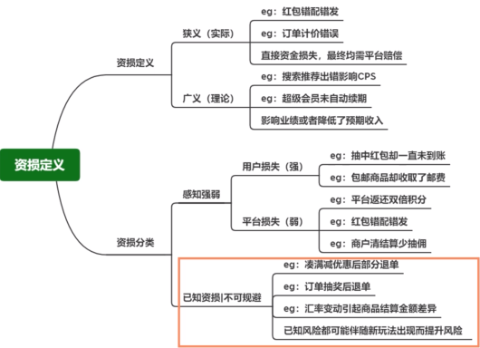
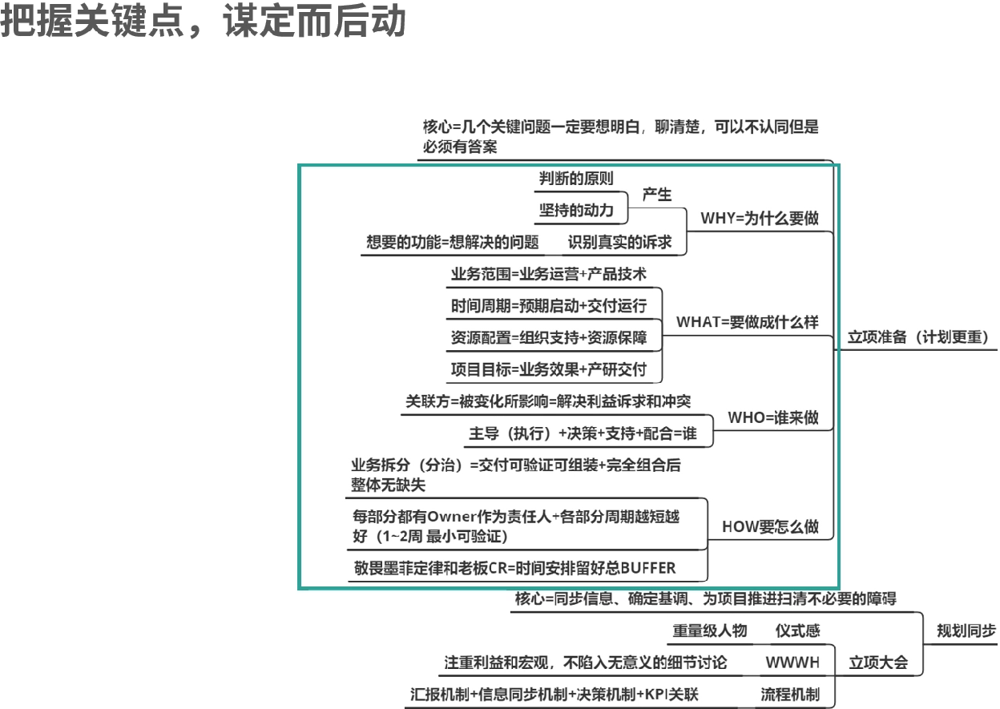
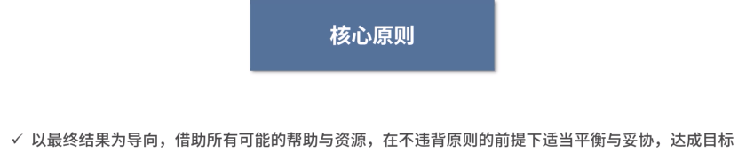
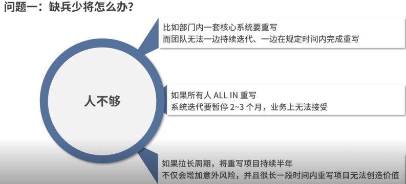
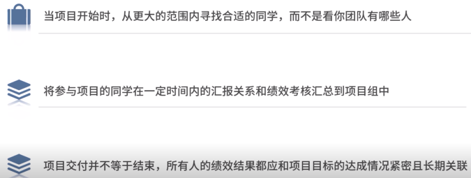
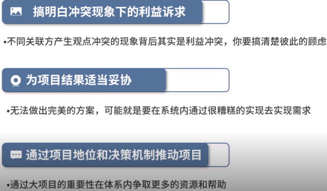
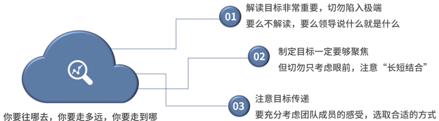

#### 管理：管人和理事

> 先把人管理起来，把人凝聚起来，让团队成员有提高，有成长，形成战斗力。然后把事情理清楚，做明白；最后得到结果

不断的解决问题，完善机制，打造团队，一起拿到更好的结果，发展才是硬道理，管理就是以解决问题为根本，追求事务的可持续发展。

不同的管理人会有不同的关注点

1. 有得人会关注流程设计是否细致完善
2. 有得关注任务的分配和执行是否严格
3. 有得更关注动作的实操和迭代

主要来说有2点目标

1. 管理动作是否完善，足够持续和连贯，形成一套管理闭环
2. 管理动作是否足够简单到可以复制，并结合自己的情况进行定制

会面临以下几个问题：

1. 责任和问题繁多，不知道哪里是重点

   问题是解决不完的，优先解决那些问题，在繁杂的问题中，凭借有限的时间和资源，怎样抓住重点找到核心

2. 管理值靠感觉，找不到开箱即用的框架，重心要做什么，团队要怎么带，那么多管理的方法和框架，那种才适合我。

   越复杂的管理理念，越高大上的管理理念，落地成本越高，不具备普适性，简单接地气才是王道

3. 结果没有预想的好，频繁陷入管理陷阱中，屁股决定脑袋，地盘意识，山头主义，面对具体问题或者场景，主观情绪作祟，忽视管理动作的规律，无法真正解决问题

   管理本身是由实践驱动，不仅要学习理论和方法，更要知道怎么把理论和方法运用到具体的案例中

作为技术管理，应该是先技术，然后管理，哪些是技术Leader 必须做好的本质工作，做好这些本职工作，然后才是管理。

如何使用一套简单实用的方法框架，迅速建立起自己的管理认知和体系。

* 核心关注的技术：稳定性、债务、架构
* 管理三板斧：拿结果、建团队、招聘和解聘
* 如何应对管理中的冲突和矛盾

对于技术人员：更加关注逻辑，习惯直接面对问题

管理人员：人性和事务之间的博弈

---

### 系统稳定性

#### 系统稳定性-事故的应急和复盘

82原则

> 20% 人员能力和机制流程欠缺
>
> 80% 人员的稳定性意识不足，并且故障应对方法不当

如何衡量系统的稳定性：

统计系统不可用的时长或者次数：比如4个9的可用性(1年内99.99%的时间系统是可用的，不可用时长为52.6分钟)

事故按照影响程度的不同划分不同等级

1. 事故的类型

   可用性事故：

   > 技术原因导致系统部分或者全部功能不可用，业务没办法完成对应流程或者提供对应服务，如网络问题，接口bug等。
   >
   > 其大部分原因都在于技术本身，链路架构、DB设计、接口实现、上下游的依赖、中间件的实现等。
   >
   > 发现容易、杜绝难，业务影响明显，对应急处理速度要求高

   资损类事故

   > 系统功能都可以使用，但是由于逻辑、计算等原因让业务在某一方产生了资产损失.
   >
   > 其产生原因在于隐秘的业务逻辑，架构设计缺陷，隐蔽难发现，往往持续时间长，防控成本高，大部分开发同事意识薄弱

2. 事故前预防

   主动治理减少系统的风险隐患，重点在变更管控，可a用性设计，应急预案和演练

3. 事故中应急

   止血和恢复是原则

   > 在故障发生的时候，核心职责是**控场**，有条不稳的安排同学进行排障，确定信息沟通的秩序，结合信息做好线上同步，以及参与决策。**让业务最快的恢复**，避免影响进一步扩大。

   故障发现

   > 1. 主动的监控告警，QPS降低，系统指标增加了，抛出了异常
   > 2. 投产后业务验证的时候发现问题

   排查故障

   > 直接锁定 + 锁定问题，最近做了那些修改，这些修改是否和问题有影响
   >
   > 先排查自己系统，然后排查上下游系统
   >
   > 一定要果断，可以结合情况启用标准应急手段：服务重启、发布会滚、非关键链路降级

   故障决策

   > caseBycase,  要有明确的决策人，主导者和有效的沟通方式，让信息可以通畅的交流出来，快速恢复业务
   >
   > **所有的信息一定数据化**，不同的数据量级会导致决策不同

   业务决策后的技术预案

   > 最好是就准备了预案，不涉及业务的技术预案可以执行操作
   >
   > 如服务重启、发布会滚、非关键链路降级。
   >
   > 如果是其他需要改代码的情况，需要发补丁等，导致造数据等需要恢复手段

4. 事故后复盘

   目的不是追责，而是查根因，完善应急，总结经验。全盘的思考和总结看看系统设计、流程机制、应急处理、人员安排等各方面有哪些不足、哪些可以提升、哪些问题是共性的。

   有哪些改进措施。这些改进措施是否能阻止相同的问题再次发生

* 系统稳定性是研发的一条生死线
* 对于故障的应急响应，业务的止损和恢复是最重要的
* 事故的复盘不是为了追责过去，而是为了在未来避免类似的情况发生

没有质量的交付，再多，再快也是没有意义的。

---

#### 系统稳定性-事故的预防

业务的发展会带动系统演进，围绕系统的风险隐患，建立**防火墙**

研发的流程：

> 设计
>
> 编码
>
> 测试
>
> 上线

变更管控

> 变更是事故高微动作，随着系统的发展，系统变的越来越复杂，带来的不确定性也越多，要做好发布三板斧：可监控、可回滚、可灰度
>
> 可监控：比人工反馈更快、一个监控要有这样三类信息
>
> 1. 是否有问题发生
> 2. 哪里发生了问题
> 3. 发生了什么问题
>
> 可灰度：在生产环境进行小范围测试这样的认识是错误的，它本身是为了对抗**未来的不确定性**，在编码完发布到功能环境的时候，我们做的是在功能环境找问题。灰度确保当问题到了生产环境后是可控的。
>
> 可回滚：变更的后悔药，

Design For Failure 的架构设计理念

> Design for Failure and nothing will fail
>
> 面向失败进行设计，考虑系统所有可能发生的故障或不可用的情形，并假设这些可能都会发生，倒逼自己设计足够强状的设计。

* 非关键系统都要可以降级
* 核心系统一定要有熔断、限流、超时这些保护措施
* 架构上要避免单点

>  那么如何落地这种理念，如何在系统设计的时候就考虑
>
> 在架构设计阶段要关注：方案梳理、系统架构、DB和API的实现、业务对焦。
>
> 从历史中学习，产出风险点的checklist，总结并分析过去发生故障的地方，如DB性能、是否会锁表、编码问题。
>
> 演练准备好的故障修复方案。
>
> 当做团队机制和文化去建设。和绩效绑定，新入职同学学习历史上出的故障以及写一篇总结。
>
> 管理上红黑榜当，统计事故数，计算达标率。
>
> 
>
> 如何确定系统真的可以 Failover

#### 稳定性-资损事故防控

> 感知难、修复慢、影响大

1. 平台感知能力弱，技术指标不敏感，大部分是舆论爆发后的人工反馈
2. 因为感知困难，往往持续时间长，最终资金损失大
3. 问题难以第一时间立刻恢复，并且止损后容易引起舆论关注和公关事件

如何理解资损事故、复合预防、以及如何应对

**由于感知难、修复慢、影响大，所以把精力放在预防上**

防、控、监

* 事前梳理出风险点做好预防：配置问题、技术bug、产品逻辑设计
* 事发可以及时感知并响应
* 事中可以快速止损恢复

---

### 技术债

技术和业务发展的产物，

大部分情况是认为的妥协，因为短期要实现业务功能，没有遵循最佳实践，选择最容易的方式，而不是最好的方式，虽然做到了快速交付，但是制约了系统未来的可扩展性，以及埋下了系统稳定性的隐患，这些都是最后要还债务的。

债务是会积累的，导致：

1. 每次迭代的成本逐步增加
2. 新Feature 在测试和上线的时候Bug 率都居高不下
3. 几乎没人清洗第说明白系统现在的实现逻辑
4. 系统的负担越来越大
5. 糟糕的设计和实现导致系统变更时候处理的代码和考虑的问题越来越多，影响最大的是系统扩展和需求交付
6. 业务缺少抽象、模块耦合严重，服务职能不清晰，当新的需求来时这些问题的成本就很高了，导致系统迭代困难
7. 时间长了，历史包袱太重，技术人员流失(开发最喜欢推到重来)

债务的Owner是技术Leader：

对内：加强团队战斗力，减少债务产生的机会

外：深刻理解业务，并做好和协作方的沟通。

债务的CheckList

重要-紧急 四象限排序债务的解决次序。

关键链路  ->  历史事务有限 -> 影响可扩展性的问题 -> 权责清晰优先

预防大于修复，功能不仅仅没有bug，还要易维护、易扩展

有债务是正常的，只要定期偿还就可以了。而不偿还，时间长了那就代价大了。

---

### 大项目

把握关键点，谋定而后动

特殊的项目：一号工程(老板项目)、技改项目(核心系统重写)、倒排期的重大业务。

这些项目时间投入大、人员规模大、系统更大，和日常迭代项目中的管理自然也是不一样的。

对于常规的项目，需要将执行做到位，更加关注过程把控，确保系统交付。

大项目关注效果大于关注交付，越是重大的项目，在计划、设计、准备上投入更多的精力，谋定而后动。

Why: 项目为什么做，不搞清楚这个，在当要解决困难的时候，就会缺少核心逻辑依据。并且很难识别真正的需求。

考虑项目的Owner，找将，这方面不能妥协。 

### 架构设计和系统演进

#### 理解业务

架构要结合具体的业务场景来设计。

对于大部分开发而言，关注点更多的是在于**如何在规定的时间完成这个需求**，至于这个需求本后的业务诉求不怎么关心。

技术处于价值创造流程的末端，一个真实的客户需求，在到达技术，要经理业务、运营、产品等几方面。

在技术团队参加产品需求会议的时候，如果仅仅是获取**自己团队应该做什么，而没有自己探求业务的仔细诉求是什么**， 那技术团队等同于工具人没什么区别。

Leader 缺乏独立思考，最后导致技术团队被运营、业务按在地上摩擦。

包括DDD领域驱动设计的前提也是理解业务。

深度理解业务要做到：

* 业务的现状
* 推测业务的发展
* 思考业务上对交易的诉求

#### 架构核心关注点

三高 -> DevOps

系统功能模块设计 -> 微服务业务建模、领域设计

功能实现、性能优化、稳定性等其他开发同事都可以补位，但是作为架构师核心是解决**系统复杂性的治理**。

足够健壮、清晰，可以支撑业务发展的系统才可以谈架构演进。

软件设计的2中风格：

* 软件设计的很复杂，使得缺陷不那么明显
* 软件设计的很简单，没有明显的缺陷

业务复杂，做出简单的系统那才是本事。

在整个系统搭建的过程中，可以通过足够好的**抽象和分层**将系统做简单了。

日常工作中一般没有机会直接接一个新的系统，经常是接来项目。

很多问题源于在系统的结构性设计上就没有做好

* 服务的拆分、数据库的冗余、调用链路的接口或者接口范式

随着业务的发展和人员的变化，系统腐化是无法绕开的，是因为日常迭代是以满足业务需求为主，其他经理都用来解决类似的高性能、高可用这类明显的系统**生存**的问题。

对高扩展很少投入，该问题很隐蔽。

系统架构，让系统实现**可持续的快速交付**

> 系统的结构清晰，即使整体繁杂但是每个局部都相对简单，链路干脆直接，没有不必要的冗余

但是系统的复杂度只能感觉，而无法数据指标去衡量，主要通过一下几点去感受

1. 理解成本高

   需要很长时间才能理解模块的组成和运作，例如在做交接的时候，老同时无法讲清楚、新同事又容易理解。

   变更牵连多，一个小的需求都需要改造系统的多个部分，甚至多个系统

   一张图装不下，在一个白板上无法清晰低画出系统主要功能场景和架构图

   家人无法解决问题，更无法提供系统的交付速度和产出质量

2. 复杂度治理的思路

   不要把简单清晰理解为干净完美，做好高内聚，低耦合

   对系统做好分治和去冗余

   

   

   把握好系统拆分的读，切记过渡的拆分导致系统无法高内聚、低耦合，会增加系统稳定性风险和治理于迭代的代价，并且造成大量的协作成本。

   拆分后可能只会降低了子系统的复杂度，对于系统整体而言甚至是因为拆分带入了子系统直接复杂的交互而增加了整体系统的复杂度。

3. 重视设计大于coding

   在写代码之前先用纸把编程思路写下来，捋清楚了在干

4. 可以考虑多做多套方案，然后多个方案之间权衡

   不要满足实现最容易的方案，更不要要求**能work** 就好

5. MVP视角考虑

   `Minimum Viable Product，意思是指最小化可行产品 `，先做减法，在做加法，有些设计去掉之后，系统也可以很好的实现

6. 站得高，看的源

   关注上下游的系统之间相互作用

7. 日拱一卒

   尽可能在每次迭代中修复之前的问题，逐渐完善系统的实现

总之架构层面的复杂度治理是为了让系统更简单、更轻便可以更灵活的跟上业务的变化。

先满足业务，然后从技术的视角去前瞻业务，通过架构的演进让技术走在业务前面，为业务赋能。

 

> 在系统设计时候，尽量从人的变化和系统复杂度方面介入

#### 定目标

当上技术leader之后，从解决自己的问题，管理好自己转变为解决团队的问题，以及团队中每个人的问题(由单点问题 -> 多点)

那么在作为团队Leader 之后如何定目标呢 ？

自上而下确定目标:

> 顺势而为，没有走偏，正确理解上面给到的目标；
>
> 自主思考指定目标，使得该目标和领导交代的事情契合，没有走偏，围绕目标指定做事动作

自下而上完成目标

> 然后将目标传递到团队内部，团队内部去完成
>
> 定任务、拆任务、细到人

