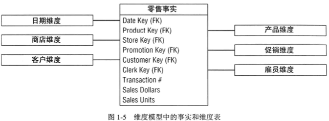
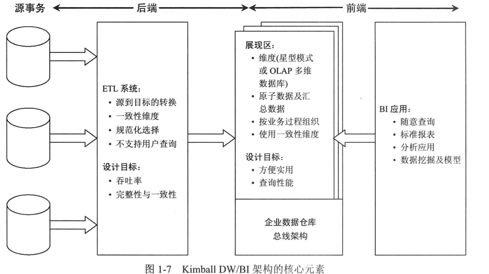
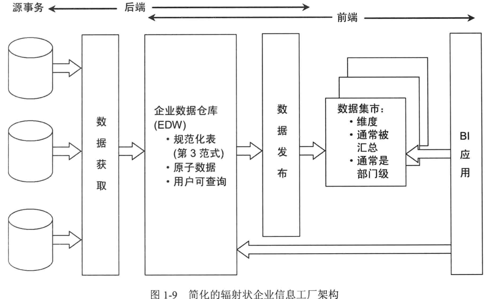
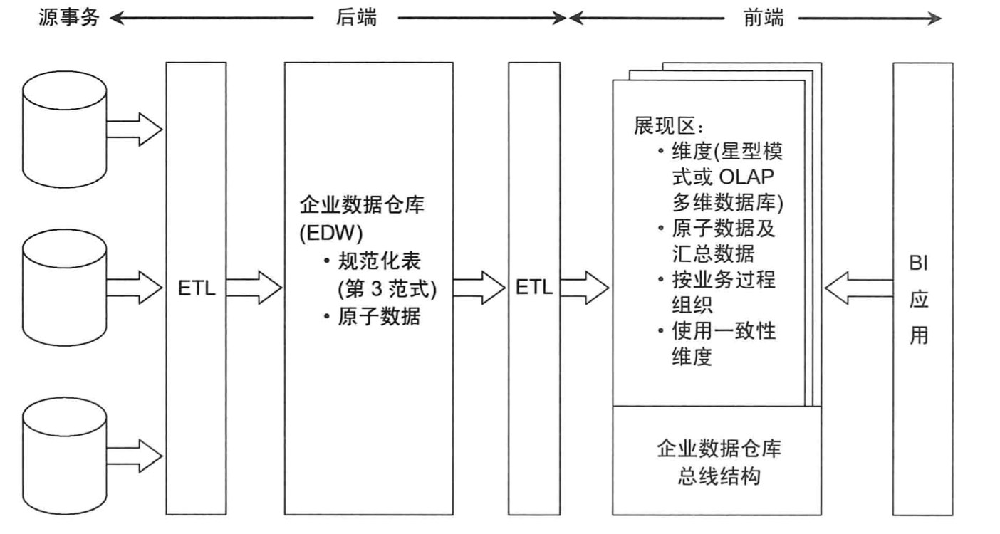

### 主要有以下内容

* `DW/BI` 的业务驱动目标
* 发布`DW/BI` 系统的隐喻
* 维度建模核心概念以及涉及的主要词汇、包括事实表和维度表
* `Kimball DW/BI` 的架构组件和原则
* 不同 `DW/BI` 架构的比较研究，维度建模在不同架构中所扮演的角色
* 有关维度建模的误解

---

#### 数据获取和数据分析的区别

##### 信息的2个目的

1. 操作型记录的保存

   > 操作型系统的用户确保组织能够正常运转，获取用户订单，监控操作活动的状态，记录问题等。操作型系统进行优化的目的是使得其能够**更快的处理事务**，可预测地执行业务过程。

2. 分析性决策的指定

   > 研究分析企业的运转，对其性能进行评估，如统计新订单的数量，理解客户在抱怨什么，不会一次只处理一个事务，对其优化的目的是高性能地完成用户的查询，**而回答用户的查询通过需要搜索成千上万条数据，并将其查询结果放入到一个查询集合中，为了应对复杂的问题，通常会保存历史环境。**
   >
   > 另外一方面`dw/bi`  是用于分析研究企业的运转，并对其进行评估，

#### 维度建模

维度建模是展现分析数据的首选技术，主要基于以下两个需要同时满足的需求：

* 以商业**用户可理解**的方式发布数据
* 提供**高效的查询**性能

##### 用于度量的事实表

> 事实表存储组织机构**业务过程事件**的性能度量结果，每一行对应一个度量事件，每行中的数据是一个特定级别的细节数据，称为是粒度，如销售事务中一行代表每个卖出的产品。
>
> 实时数据长以连续值描述，这样有助于区分到底是事实数据还是维度属性的问题。
>
> 理论上，以文本方式表示度量事实是可行的，但是很少使用，多数情况下文本度量是对某些事情的描述，设计者经最大可能将文本数据放入到维度中。不要在事实数据中存储冗余的文本信息。
>
> 从行的角度来看，事实表趋于变长，从列的数量来看，事实表趋于变短。
>
> 本书的设计和实例的分析，事实表的粒度可划分为三类
>
> * 事务: 
>
>   >  最常见，一般会有2个或者多个外键和维度表的主键关联，事实表的主键称为是组合键
>
> * 周期性快照
>
> * 累积快照
>
> 通常几个维度一起唯一表示每个事实表行。

##### 用于描述环境的维度表

> 维度表包含业务过程度量事件有关的文本环境，用于描述 ”谁、什么、哪里、何时、如何、为什么“ 
>
> 和事实表比较，维度表趋向于包含较少的行，较多的列。
>
> 每个维度表由单一主键定义，用于和事实表连接操作
>
> 多数情况下，数仓的好坏直接取决于维度属性的设置，`DW/BI` 的分析能力直接取决于维度属性的质量和深度，为维度表提供详细的业务术语耗费的越多，效果越好。
>
> 强大的维度属性带来的回报是健壮的分片-分块的分析能力。
>
> 在分析操作型源数据时候，有时候分不清一个元素是事实属性还是维度属性，可以通过分析该列是否是一中包含多个值并作为计算的参与者的度量(使用这个列的时候是否是在计算的时候)，这种情况下往往可能是事实数据
>
> 或者该列是对具体指的描述，是一个常量，某一个约束和行标识的参与者，此时往往是一个维度属性。

##### 星型模型中维度和事实的连接

> 可以体会事实表和维度表互为补充的方式似乎可以考察他们转化为表报，如下
>
> ```sql
> SELECT
> 	store.district_name,
> 	product.brand,
> 	sum(salre_facts.sales_dollars) as "sales_dollars"
> 
> FROM
> 	store, product, date, sales_facts
> WHERE
> 	date.month_name="January" AND
> 	date.year=2013 ADN
> 	store.store_key = sales_facts.store_key AND
> 	product.product_key=sales_facts.product_key AND
> 	date.date_key = sales_facts.date_key
> 
> GROUP BY
> 	store.district_name
> 	product.brand
> ```



这片代码可以看出，紧接着 `SELECT` 语句后面的两行来源于报表需要的维度属性，其后是来自于事实表的聚集矩阵，`FROM` 子句说明查询涉及的所有表，`WHERE` 子句的前两行定义了报表的过滤器，然后描绘了维度表和事实表之间需要的连接操作。

#### `Kimball` 的`DW/BI` 架构



**源系统**是出于数据仓库之外的，因为几乎不可能控制这些操作型系统中数据的格式和内容。

**后端的ETL区域** 是用户不可以直接查询的，从环境中获取、转换、加载，合并来自不同数据源的数据，复制数据等增加数据的利用价值，另外这些工作还可以建立诊断元数据。

**展现区** 是用于组织、存储数据、支持用户、报表制作者以及其他分析型商业智能应用的查询，该区允许用户之间查询，是用户关系的区域，这里应该是采用维度模型来展现，要么是星型模型，要么是OLAP 多为数据库。

另外展现区建立必须包含详细的原子数据，满足用户无法预期的，随意的查询，也就是在这里有聚合后的数据和得到聚合结果的原粒度数据，

**BI** 是为用户提供利用展现区指定分析决策的能力。

#### 辐射状企业信息工长(Corporate Information Factory: CIF) Inmon 架构



在`CIF`环境下，数据从操作型数据源中获取，在`ETL` 系统中进行处理，有时将这个过程称之为数据获取， 方法的企业通常允许业务用户根据数据细节程度和数据可用性要求访问`EDW` 仓库。

产生的`ETL` 数据的发布过程包含下游的报表和分析环境以支持业务用户，虽然也使用维度结构，但结果分析数据库通过和 `Kimball` 架构的展现区存在差别，分析数据库通常以部门作为中心，而不是业务过程，而且包含聚集数据，而不是原子级细节数据，

#### 混合辐射状架构和 `Kimball` 架构



#### 维度建模的误解

##### 维度模型仅包含汇总数据

> 通常会理解在展示区给用户展示的仅仅是汇总后的数据，但这是不对的，除了汇总数据还会有细粒度的数据，因为汇总数据并不是能回答用户提出的所有问题，所以还需要向业务用户提供对细节数据的查询访问。

##### 维度建模是部门级别而不是企业级别

> 维度模型应该是围绕业务过程组织，如订单、发货、服务调用等。而不是按照组织中部门的职责划分，多个部门往往需要分析来自同一个业务过程的相同的度量，应该避免多次获得同一个数据源的数据。

##### 维度模型是不可扩展的

> 维度模型非常易扩展

##### 维度模型用于预测

> 维度模型设计应该是适应变化的，**关键是将注意力放到组织的度量数据上**，而不仅仅关注预定义的报表或者分析，和不断变化的分析比较，业务过程是更加稳定的。
>
> ”细节就是上帝“，构建维度模型时候增加最细粒度的数据可以带来最大的灵活性和可扩展性。


