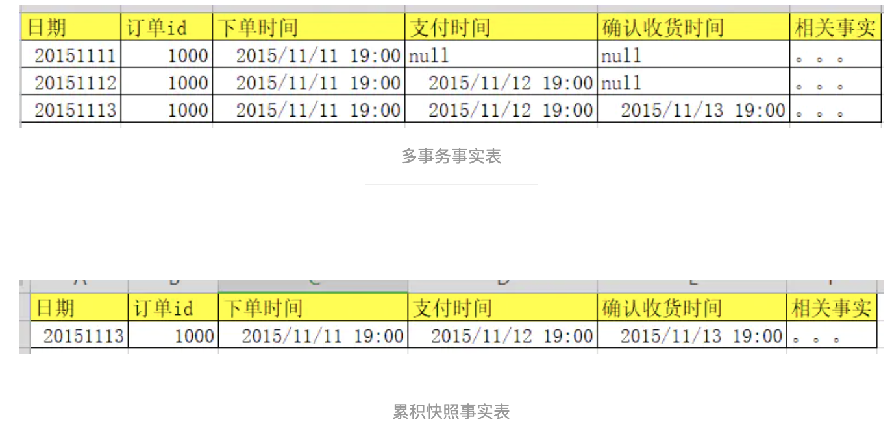
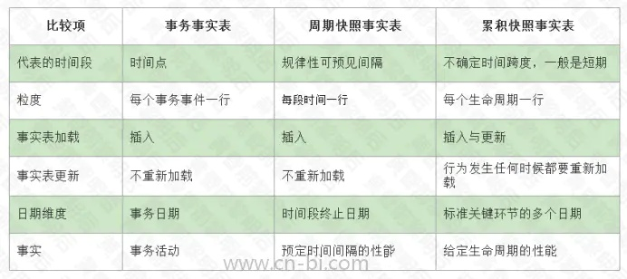

#### 基本概念

##### 收集业务需求和数据实现

> 理解业务需求，以及作为基础的源数据的实际情况，理解他们基于关键性指标，竞争性商业问题、决策制定过程，支持分析需求的目标。
>
> 数据的时间情况可以通过与源系统专家交流。
>
> 维度模型不应该由那些不懂业务数据以及业务需求的人来涉及，协作是成功的关键。

##### 维度涉及的过程

1. 选择业务过程

2. 声明粒度

3. 确认维度

4. 确认事实

---

* **选择业务过程**

> 业务过程是**组织完成的操作性活动**，如获得订单、处理保险索赔，或者每个月账单的快照。业务过程事件建立或获取性能度量，并转换为事实表中的事实，过程的选择是非常重要的，因为过程定义了特定的设计目标以及粒度、维度、事实的定义。

* **粒度**

> 粒度用户确定某一事实表中的行表示什么，候选的维度或事实必须与定义的粒度保持一致。

* **描述环境的维度**

> 维度提供围绕某一业务过程事实所涉及的”谁、什么、何处、何时、为什么“ 等背景，维度表包含`BI` 应用所需要的用于过滤以及分类事实的描述性属性，掌握事实表的粒度，能够将所有可能存在的维度区分开，维度表包含确保`DW/BI` 系统能够被用作业务分析的入口和描述性标识，主要的工作都放在数据管理和维度表的开发方面，因为它是用户`BI` 经验的驱动者。

* **用于度量的事实**

> 事实涉及来自业务过程时间的度量，基本上均是以数量值表示，一个事实表行与按照事实表粒度描述的度量事件之间存在一一对应的关系，因此事实表对应一个物理可观测的事件，在事实表内，所有事实只允许和声明的粒度保持一致，

#### 事实表技术基础

##### 事实表结构

> 发生在现实世界中的操作型事件，其所产生的**可度量数值**，存储在事实表中，事实表的涉及完全依赖于物理活动，不受可能产生的最终报表的影响，除了数字度量之外，事实表总是**包含外键**，用于关联与之相关联的维度。
>
> **其中度量值可以存在控制，但是外键确实不能存在空值得。**

##### 一致性事实

> 某些维度出现在不同的事实表中，需要注意其定义需要是相同的，如果定义相同那么一致性事实应该具有相同的命名，如果不兼容，那么需要有不同的命名用于告诫业务用户和 `BI` 应用

##### 事务事实表

> 事务事实表的一行对应空间或者时间上某点的度量事件

##### 周期快照事实表

> 每一行汇总了 发生在某一个标准周期，如某一天的多个度量事件，粒度是周期性的，而不是个体的事务，通常会包含许多事实。

##### 累积快照事实表

> 每行数据汇总发生在过程开始到结束直接可预测步骤内的度量事件，如一个订单，累积快照事实表中只会有一个记录：
>
> 1. 一个订单来了，记录订单`id`来的时间
> 2. 订单付钱了，然后再更新这个订单状态，将定时间更新
> 3. 订单收货了，那么在将订单收货时间也更新在这个订单上。
>
> 如果是事务事实表，那么会记录三条数据，如果是累积快照事实表，那么只会记录一条数据。
>
> 

##### 无事实的事实表

> 尽管很多的度量事件获取的结果是数字化的，但是也存在某些事件仅仅记录一系列某一时刻发生的多维实体，如学生的参加课程的事件，可能没有课记录的数字化事实，但该实体待有一个包含一个日历天、学生、教师、地点等信息。

---

#### 维度表技术基础

##### 维度表结构

> 每个维度表都包含一个单一的主键列，维度表的主键可以作为与之管理的任何事实表的外键，维度表通常比较快，是扁平非规范表，包含大量的低力度的文本属性

##### 维度表代理键

> 维度表中包含一个列，表示唯一主键，该主键不是操作性系统的自然键，由于需要跟踪变换，所以若采用自然键，将需要多个维度行表示，**`DW/BI` 系统需要申明对所有维度的主键控制**

##### 自然键、持久键和超自然键

> 自然键就是说操作性业务系统建立的自然键，不受 `DW/BI` 的控制，比如说一个雇员离职了然后再回来，那么自然键中对该职员就会有2个键，数据仓库希望为该雇员创建单一键，就需要建立新的**持久建**以确保在这种情况下，雇员编号保持持久性不会发生变化，该键有时候倍成为是**持久性超自然键**。

##### 维度退化

> 维度表除了维度之外，没有其他的内容了，这种维度退化因被放入到事实表中

##### 维度表中的空值处理

> 当维度表中的行没有被完全填充，存在空值，那么应该采用描述性字符替换空值，如`未知/Unknown` 等。应该避免维度属性中使用空值，应为不同的数据系统在处理分许和约束的时候，针对空值得处理方法是不一致的。

##### 雪花维度

> 当维度表中的层次关系是规范的，低粒度属性作为辅助表通过属性键链接到基本维度表，当这一过程包含多冲维度表层次时，建立的多级层次结构被称为**雪花模式**, 对于用户而言，理解其以及在查询中是非常困难的，雪花模式还会影响查询性能，扁平化的、非规范的维度表，完全 能够获得和雪花模式相同的信息。

#### 处理缓慢变化维度属性

##### 类型0，原样保留

> 维度属性不会发生变化，适合属性标记为 ”原型“ 的情况，如客户的原始信用积分等。

##### 类型1： 重写

> 维度行中原来的属性值被覆盖，总是反应最近的工作，所以它破坏了历史情况，使用时候需要小心。

##### 类型2：增加新行

> 增加新行，新行中采用修改后的属性值，实现该方式不能仅仅采用自然键或者持久键，因为使用该方式会出现多行描述同样成员的情况，在为维度成员建立新行的时候，发生的时候最少需要在维度行中增加三个额外列
>
> * 行有效的日期/时间戳列
> * 行截止日期/时间戳列
> * 当前行标识

##### 类型3， 增加属性

> 新来的值，不替换旧值，而是新建新属性

##### 类型4：增加微型维度

> 当维度中一组属性快速变化，并划分为微型维度，这个微型维度成为是快速变化魔鬼维度，微型维度需要有自己的唯一主键。

##### 类型5 增加微型维度以及1 支架

---

#### 高级事实表技术

##### 事实表代理键

##### 蜈蚣事实表

在数据仓库领域有一个概念叫 `Centipede fact table`，中文一般翻译为“蜈蚣事实表”。蜈蚣事实表是指那些一张事实表中有`太多维度的事实表`。连接在事实表两边的维度表过多，看起来就像蜈蚣一样，所以称为“蜈蚣事实表”。

通常来说，蜈蚣事实表的出现是由于建模师对事实表和维度表逆规范化过了头。例如，不单将产品主键放入事实表中，对于产品层级结构中的每一层的主键都放入事实表中，这样事实表中与产品相关的就会有产品ID、商标ID、子类ID、类别ID等多个外键。同样，也有建模师将日期相关的日期ID、月ID、年ID都放入事实表中。这些都将产生蜈蚣事实表，使自己落入维度过多的陷阱。

蜈蚣事实表虽然使查询效率有所提高，但是伴之而来的是存储空间的大量增长。在维度建模的数据仓库中，维度表的字段个数可以尽可能的增加，但是事实表的字段要尽量减少，因为相比而言，事实表的记录数要远远大于维度表的记录数。

一般来说，事实表相关的维度在15个以下为正常，如果维度个数超过25个，就出现了维度过多的蜈蚣事实表。这时，需要做的事情是自己核查，**将相关的维度进行合并，减少维度的个数。**

---

#### 高级维度技术

