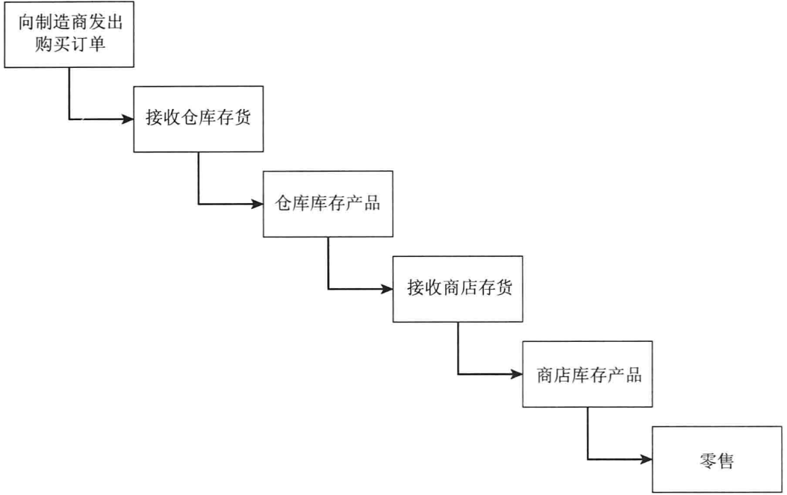
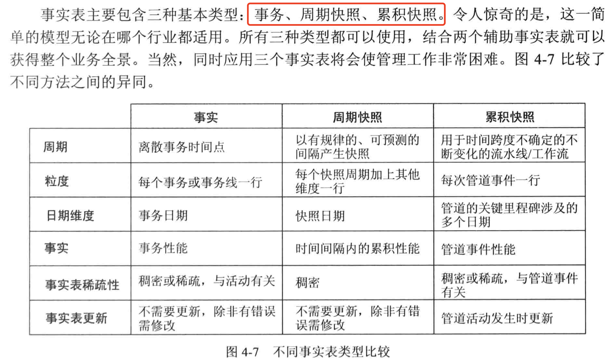
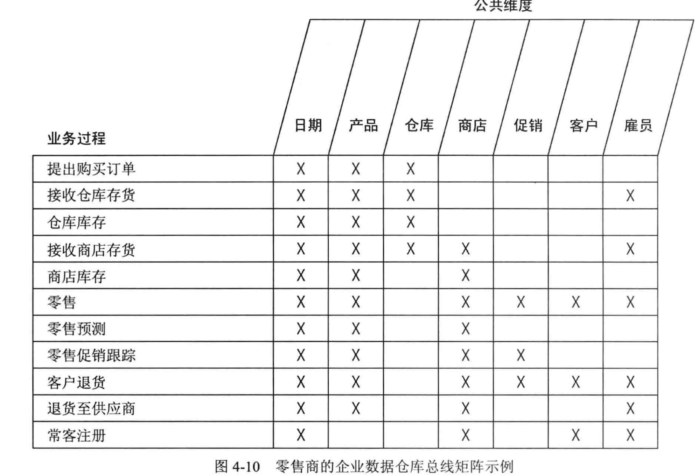

##### 主要讨论一下内容

* 通过一系列维度模型表示组织的价值链
* 半可加事实
* 三种事实表类型：周期快照、事务和累计快照
* 企业数据仓库总线架构和总线矩阵
* 机会/利益相关方矩阵
* 一致性维度和事实，以及对敏捷方法的影响
* 数据治理的重要性

#### 价值链

价值链表明了组织主要活动的自然的、逻辑的流程，如：

1. 零售商想产品制造商发出购买订单
2. 产品被发送到零售商的仓库，成为库存
3. 然后发送到不同的商店，
4. 产品再次成为库存知道消费者购买了该商品

操作型源系统在价值链的每个步骤建立事务或者快照，每个步骤包含一个或者多个事实表，价值链为企业`DW/BI` 环境的整个数据结构提供高层知识。

库存产品以固定的时间间隔度量，并方式事实表中，周期快照随着时间的推移将构成维度模型中一系列数据块，类似于泥沙长期累积形成的地理层。

#### 库存周期快照

---

#### 事务事实表

> 发生在某个时间点上的一个事件

#### 周期快照事实表

> 对某个固定的、可预测的事件间隔内的累积性能

#### 累积快照事实表

> 不大长使用，表示具有确定的开始和结束以及在此期间所有中间过程步骤的过程，最适合处理业务用户开展对工作流或者流水线的缝隙，始终包含多个日期的外键，表示逾期的主要事件或者过程里程碑。
>
> 并不适合不经常发生的复杂场景。

#### 企业数据仓库总线架构

##### 总线的概念

> 一种常见的链接一切的公共结构，所有事情从总线获取能量。
>
> 企业数据仓库总线矩阵来文档化总线架构并与此通讯，**组织的业务过程被表示为矩阵行**，重要的是**记住通过矩阵识别的是业务过程，而不是组织的业务部门。**
>
> 列表示整个企业的公共维度，有助于创建核心维度列表。
>
> 矩阵有了之后，填充矩阵用于评价给定的维度是够和某个业务过程由关联，**x** 表示哪些列和哪些行有关系。
>
> 
>
> 企业数据仓库总线矩阵的构建是最终要的交付物之一，通过它可用于多种综合资源，如结构规划，数据库涉及，数据治理，项目评估，以及组织交互等。
>
> 矩阵列解决了主数据管理和数据集成的需求，当核心维度参与到多个维度模型中并由数据管理责任人定义。
>
> 矩阵中的每一个业务过程可以由不同的开发团队完成，对于管理人员也可以快速确定每个维度模型的维度，实现跨区域的沟通交互。

#### 总线矩阵的错误

* 基于部门的或者包含太多的行
* 报表为中心或定义太多于狭窄的行：不能类似于针对需求的列表，单个业务过程支持多种分析活动，矩阵行应该关注引用业务过程，而不是派生报表或者分析。
* 过度宽泛的列：
* 层次中的每个级别都放入到列

---

#### 一致性维度

> 一致性维度也被称为是**公共维度、主维度、引用维度和共享维度**。一致性维度首先在`ETL` 系统建立，然后逻辑上或者物理上复制到`BI\DW`环境中。
>
> **一致性维度具有一致性的维度建、属性列名，属性定义和属性值**

一致性维度能够将来自不同业务过程的性能度量合并到单个报表中。这也是**跨钻**

