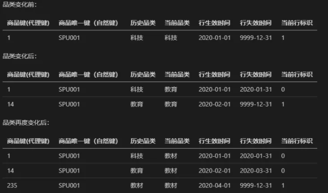

主要内容

* 深入处理维度表属性值变化的技术
* 以及列表的重构

---

#### 采购

> 以最经济的方式获得适当的材料或者产品的影响。涉及到广泛的活动。谈判合同、发起购买清单、购买订单、跟踪票据基于授权付款。

常见的分析需求有：

* 最常的材料和产品是什么？ 有多少供应商提供该产品，价格是多少
* 供应商的执行情况如何，供应商供应比例是多少，能够按时交付么？ 延迟交货情况如何。收到的拒绝率多少。

---

累积快照是是指用定义良好的里程碑建模的过程，如果过程不断持续，始终不会结束，那么采用累积快照不是一个好的选择。

---

维度表是比较稳定的，会相当的缓慢变化，需要采用适当的策略应对发生的变化。

#### 类型0：保留原始值

> 指哪些绝对不会发生变化的维度表

#### 类型1： 重写

> 当前值替换旧值，属性反应的是最近的情况。
>
> 是缓慢变化维度最简单的处理方法，存在问题是失去属性变化的所有历史记录，如果不需要保留过去的描述，那么这种方式还是适用的。

#### 类型2：增加新行

> 添加一个新行，然后新建一个有效列如`is_valid`, 那么设置之前的那行`is_valid=0`,表示无效的行，新行的值`is_valid=1` 表示新行有效的。
>
> 以及设置一个有效时间(创建时间)和失效时间(更新时间)

还会出现类型2和类型1 的组合情况

针对此类场景，数据管理员需要参与定义ETL 业务规则。业务规则应该是有业务管理员指定最终的决定。而不是有`DW/BI`  决定。

#### 类型3： 增加新属性

> 类型2能够区分历史情况，但是无法确保能够将新属性值和过去的历史事实关联。

类型3被认为是同时正确的当前和过去属性值。

一般在这样的情况下会使用，如上部门的变化，假设需要在2月1好前后看部门变化前后的上卷统计信息的变化。类型3很好会被使用到。

类型3缓慢变化维度技术能够确保要么通过新的，要么通过旧的属性值来考察新的和历史事实表，优势也被成为交换的现实。

对于不可预测的属性变化，类型3无能为力的，适合用于当前某个变化影响维度表中大量行的情况，如产品列表或销售队伍重组，业务用户通常希望能够比较当前和先前层次下组织一段时期的性能度量。

#### 类型4：微型维度(???)

> 以上的三种类型，均是考虑维度表的缓慢变化，当变化较快的时候，尤其是针对包含百万行的维度表，这种情况下，对跟踪变化历史的类型2是不合适的，会导致表变的越来越大(行越来越多)。而且浏览性能也存在问题。查询缓慢。
>
> 采用不同的维度消除频繁分析或者变化的属性
>
> 将大的维度表中几个变化较快的属性抽离出来组成新的维度表，并结合业务以区间段形式表现.
>
> 也就是将连续值离散化，

#### 类型5： 微型类型和类型1的支架表

> 类型4是将微型维度的主键作为主维度的一个属性，该微型维度主键引用的是类型1属性，重写每个概要的变化，不需要想类型2那个跟踪变化，避免导致数据爆炸增长，是采用类型4的根本原因之一。
>
> 该方式是方式1和方式4的结合，即建立微型维度后，**微型维度的主键不仅作为事实表的外键，也作为主维度的外键。**
>
> 在主维度中，此微型维度属性以方式1处理，即当该属性发生变化时，直接覆盖，不保留历史信息。
>
> 这种情况下的微型维度被称之为支架。

#### 类型6：方式1属性添加到方式2维度

> 是方式1(覆盖)、2(加行)、3(加列) 的结合，同时增加维度行和维度列，并以方式1处理新加的维度列
>
> 

#### 类型7 双重外键并且方式1和方式2结合

