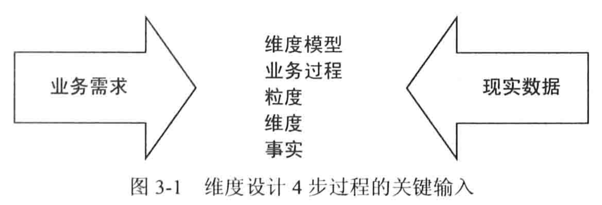
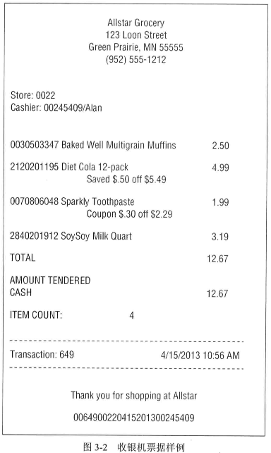
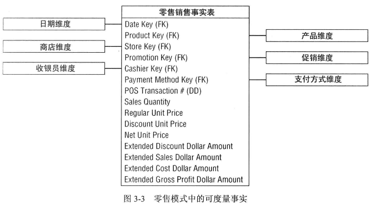
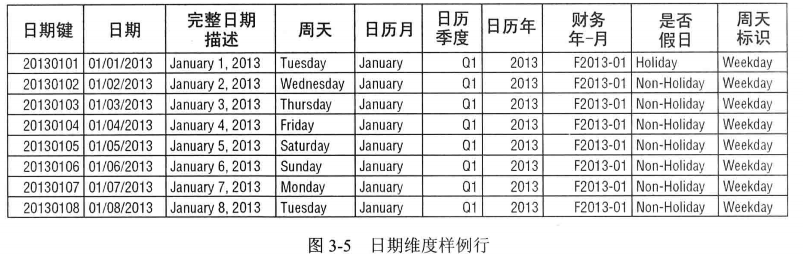
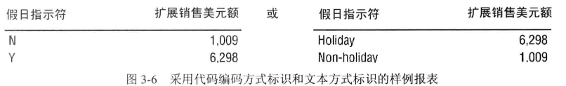
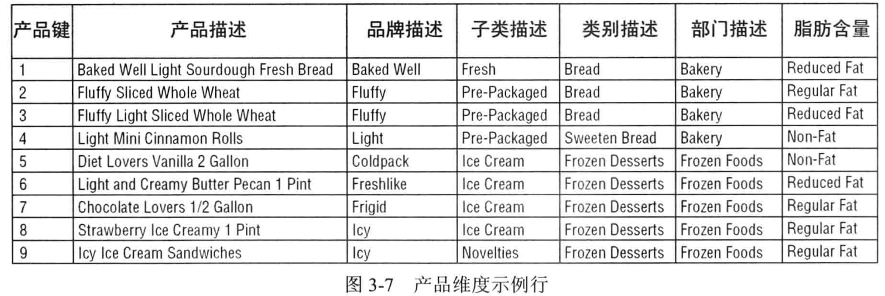
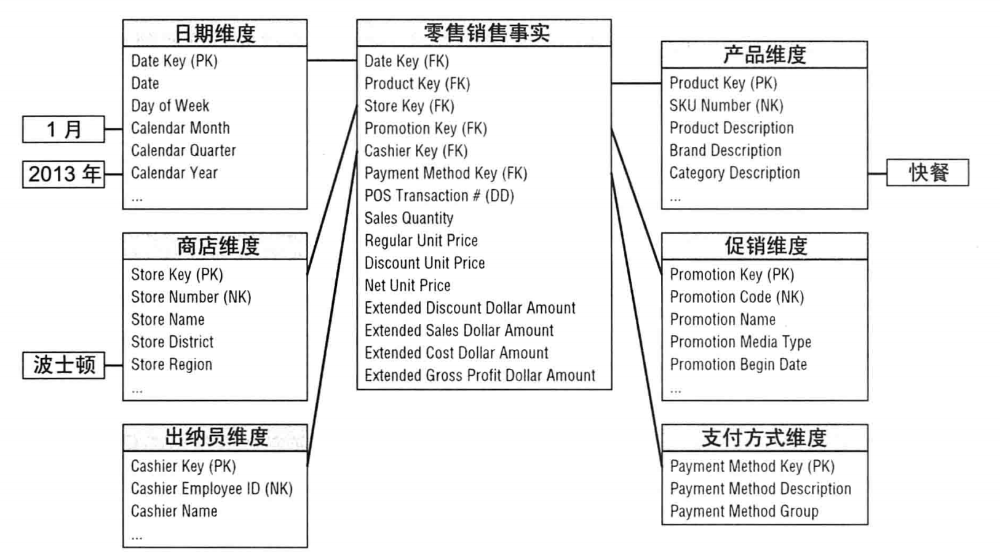
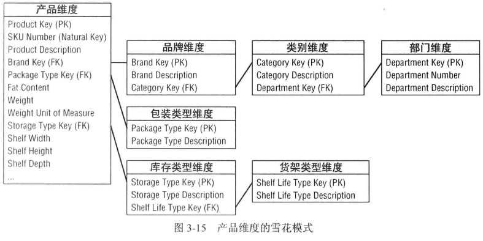
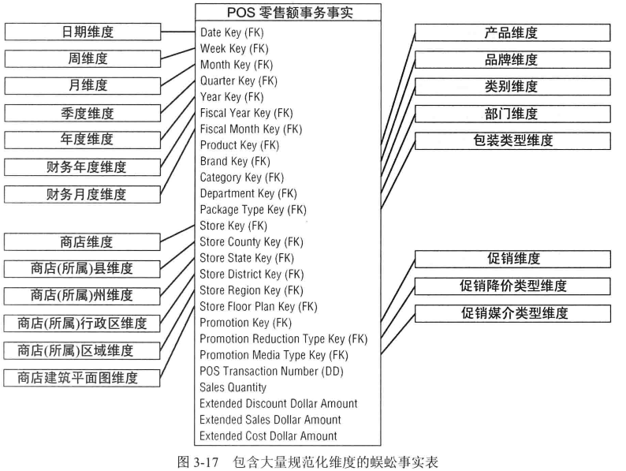

本章的主要内容

* 维度见面涉及的4个步骤
* 事实表粒度
* 事务类型事实表
* 可加、不可加以及抽取的事实
* 维度属性、包括指标、数字化描述以及多层次
* 日历日期维度、加上当天时间(`time-of-day`)维度
* 因果维度、如促销维度
* 退化维度，如交易收据号码
* 维度模型的可扩展性
* 无事实的事实表
* 代理键、自然键和持久性
* 基于雪花模式的维度属性
* 包含 ”太多维度“ 的蜈蚣事实表

---

#### 维度见面涉及的4个步骤

##### 选择业务过程

> 业务过程由组织完成的微观活动，如获得订单。开具发票等，业务过程包括一下公共特点：
>
> 1. 业务过程通常使用**行为动词表示**，因为它们通常表示业务执行的活动，与之相关联的维度描述与每个过程事件关联的**描述环境。**
> 2. 业务过程通常由某个**操作性系统**支撑，如账单或者购买系统
> 3. 业务过程建立或获取关键能度量，有时这些度量是业务员过程的直接结果，度量从其他时间获取，分析人员总是想通过过滤和约束的不同组合，来审查和评估这些度量。
> 4. 业务过程通常由输入激活，产生输出度量。
>
> 注意业务过程并不是业务部门或者企业功能职责，应该是以业务过程为边界建立维度模型。

##### 申明粒度

> 粒度回答了 **如何描述事实表中的每一行的内容(粒度能够唯一定位到一行数据)**， 粒度事实表中的每一行表述申明，粒度由获取业务员过程事件的操作型系统的屋里实现确定。
>
> 典型的粒度声明
>
> * 客户销售事务上的每个产品扫描到一行中等
>
> 粒度声明以业务术语表示。
>
> 声明粒度是最不容忽视的关键步骤

##### 确定维度

> 回答的问题是 **业务人员如何描述来自业务过程度量事件的数据**，使用健壮的维度集合来**装饰事实表**，维度易于区分，其表示的分别是 **谁、什么、何处、何时、为何、如何**等关联的事件，常见的维度实例包括日期、产品、客户、设备等。

##### 确定事实

> 回答 **过程的度量是什么**，这个问题用来确定事实，业务用户非常愿意分析这些性能度量，典型的事实是可加性数值，如，订货数量等。
>
> 强烈建议抵制仅仅只考虑数据来源来建模数据，将注意力放在数据上可能不会像于商业用户交流那么复杂，但是数据不能替代业务用户的输入，**遗憾的是，很多组织仍然采用这种看似省力的数据驱动的方法**。
>
> 

---

#### 场景

如上图是零售业务中的一个订单数据。对所有的销售数据建立数仓。

##### 选择业务过程

基于**业务需求**和**可使用数据源**的综合考虑，决定对哪种业务员过程开展建模。在该案例中，管理层希望更好的理解通过`POS` 系统获得的客户的购买情况，所以建模的业务过程是 **`POS` 零售交易**，该数据保证商业用户能够分析被销售的产品、它们是在哪几天、那个商店、何种促销下被消费的。

##### 声明粒度

有许多理由要求以最低的原子粒度处理数据，**原子粒度数据具有最强大的多维性，**事实度量越详细，就越能获得更加确定的事实，原子粒度能够给实现最佳的分析灵活性，原子粒度可以被约束并以某种可能的方式上卷。

当然也可以定义汇总粒度来表示对原子数据的聚集，但是一旦选择了级别较高的粒度，就限制了建立更细节的维度的可能性，粒度较高的模型无法实现用户下钻细节的需求。

在本案例中，最细粒度的数据是`POS` 交易的单个产品。

`DW/BI` 系统中几乎总是要求数据尽可能最细粒度来表示，不是因为需要查询单独的某行，而是因为查询需要以非常精确的方式对细节进行切分。

##### 确定维度

> 事实表的粒度选择完毕之后，维度的选择就比较直接了，产品和事务立即呈现，**可以考虑其他维度是否可以被属性化为`POS 度量`**，如销售日期、销售商店、那种销售的产品被促销，处理销售的收款员，可能的支付方式等。

##### 确定事实

> 设计的最后一步是确定应该将哪些事实放到事实表中，粒度声明有助于稳定相关的考虑，**事实必须和粒度吻合**，在考虑可能存在的事实事实，可能会发现仍然需要调整早起的粒度声明或维度选择。
>
> `POS系统`收集的事实包括销售数量，单价、折扣等，净支付价格，以及扩展美元销售额等。
>
> 
>
> 4类事实，涉及所有维度的**销售数量**，**销售可扩展额**，**销售**，**成本额**等，均是完全可加的。**可以对事实表按照维度属性不受限制的开展切片或者切块操作。**
>
> 1. 计算获得的事实
>
>    如收入/利润，从扩展销售总额中减去扩展成本总额的方式获得总利润额。虽然是计算所得，但是其仍是可全加的，
>
> 2. 不可加事实
>
>    利润率是非可加的，不能从任何维度被汇总。
>
>    还有单价也是一种不可加的
>
> 3. 事务事实表
>
>    事务型业务过程是最常见的业务过程，表示该过程的事实表居于哦一下特征
>
>    1. 原子事务事实表的粒度可在事务环境下最简单的描述，每个事务一行或者每个食物语线一行
>    2. 记录的是一个事务事件，所以它们通常是比较稀疏的
>    3. 数据量是非常庞大的
>    4. 事务事实表趋向成为多维化
>    5. 事务事件返回的度量通常是可加的
>
>    在涉及的初期，估摸一下最大的表的情况，也就是估计事实表的行是非常必要的，可以通过和远系统专家讨论，最为一种选择，可以估计每年新增到事实表中的行数量，如通过去年收入除以去年每项商品的平均价格得到估计。最为一个设计者，**应该始终通过多角度测量来确定计算是否合理。**

#### 维度表的涉及细节

##### 日期维度

> 日期维度是数据库分区模式下首选需要考虑的维度。
>
> 和其他维度不同，可以提前建立日期维度表，可以在表中安行表示10年或者20年的不同日期，所以可以涵盖存储逇历史，甚至是未来的几年，即使是最近20年的数据，那也是非常小的一个数据量
>
> 
>
> 上面的列是否为假日，并没有采用`Y/N或者0/1` 的方式，而是采用`Holiday/Non-Hoilday` **是因为维度表属性用于报表和下拉式子过滤列表中的值，所以该标识应该使用有意义的值**。
>
> 所以标识应该采用越有意义的领域值，就越能够转换有有意义的，能够自我解析的报表。
>
> 

##### 产品维度

> 产品维度描述仓库中存储的每个`SKU(产品唯一编码)`
>
> * 扁平化多对一层次
>
> 产品维度 `SKU` 的大多数描述性属性，产品层次是属性的主要分组之一，单个的`SKU` 上卷到品牌、品牌上卷到类别，类别上卷到部门，每一个不同层次都存在多对1关系。
>
> 
>
> 对于每个`SKU` 商品层次的所有级别都被定义好，一些属性，如`SKU` 描述具有唯一性，从另外一个极端来看，部门属性列中仅包含50中不同的值，这些比较少(几千几万)的不同的值，这种重复是可以接受的，不需要将这些重复的值分解到另外一个规范化的表中节省空间。
>
> 将低粒度重复的值保存在主维度表中是一种基本的维度建模技术。
>
> 作为属性或事实的数字值，如果数字值用于变化分析，或者是用于计算目的，那么它应该放到事实表中，但是如果是预先定义的，并且稳定的数字值，用于过滤和分组，那么应当分组到维度属性。
>
> 有时既用于分组，也用于过滤/分组功能，那么应当在事实表中和维度表中同时存在该值。
>
> **涉及计算的数据应该放入到事实表中，涉及到约束、分组和标记的数据应该放入到维度表中**
>
> * 空外键、空属性和空事实
>
> > 在事实表中的一个属性是作为维度表的一个外键，那么这个属性不应该出现空值，如果是空，那么应该将这个值唯一赋值为0/-1，用于表示空值，包含空值得键是给用户带来困惑的主要原因，因为它们无法实现和空值得链接操作。
>
> 不要再事实表中使用空值键，正确的设计应该在对应维度表中包括一行以表明该维度不可用于度量。所以这个时候维度表的主键也是0/-1，一来表示这行数据是不可度量的，二来用于和事实表中的缺失值关联。
>
> 这个时候维度表中的其他属性值也是空的，建议使用描述性字符串替换哪些空值`Unknow/未知`
>
> 等。
>
> 有时候在事实表中遇到空值，让事实表非空的方法可以通过聚集处理，如`SUM/MIN/MAX` 汇聚操作。

#### 一个实际的销售模式

> 如客户需要理解**2013年1月期间波士顿区通过促销快餐分类的周销售总量感兴趣**
>
> 可以按日期维度中的月和年、商店维度中的区、产品维度中的分类加以约束。

这里说说无事实的事实表，如在`POS` 机的事实记录表中，都是哪些发生销售行为的数据，也就有哪些度量值，如价格，利润等，而哪些没有发生购买行为的促销产品是没有在这个销售行为数据中的。

而可以将有一个促销行为事实表，它记录了某个商店，某个产品的促销，也就是假如说商店`A` 的商品`a`  需要促销，那么会给促销行为事实表中增加这么一条记录，这条记录是没有度量值得，也就是成为无事实的事实表。

---

#### 维度与事实键

维度表的唯一主键应该是代理键，而不是来自于操作系统的表示符，也就是所谓的自然键。代理键简单的按照顺序序列生成整数表示，**实际的代理键是没有业务上的意义，作用仅仅是链接维度表与事实表**， 应该避免使用包含业务含义的只能多维键

*数据仓库中维度表和事实表的每个链接应该基于无实际含义的整数代理键，应该避免使用自然键作为维度表的主键*

在维度模型的自然键实现起来可能比较便捷，但是长远来看代理键效果会更好

* 为数据仓库缓存操作型系统的变化

  代理键确保数仓小组维持对`DW/BI` 的控制，不会受制于生产代码的建立、更新、删除等，代理键为数据提供一种机制，**用于区分同一个操作型账号的两个不同的实例，如果仅仅依赖操作型代码，那么同一个账号会产生2个自然键**

* 集成多个源系统

  就算数据是来源于多个系统，缺乏一致性的源键，通过后端的整理，建立交叉引用，映射表可将多个自然键连城一个公共的代理键

* 改进性能

* 处理空值或者未知情况

  对于哪些匿名客户等，可以分配一个固定的代理键区分这些缺乏操作型代码的情况

---

#### 抵制规范化

在建立数仓的过程中主要关注的是易用性和性能的价值，而不是关注事务处理的效率。

如在上面的产品维度表，300000个产品上卷得到50个不同的部门，这样存储的部门信息是非常冗余的，而在规范化的建模方式中，是需要将部门的维度，重新建立一个部门的维度信息，这样在产品中就只有部门的code，大大减少磁盘存储，这样包括在更新一个部门信息的时候，只需要更新一行数据就可以了，而如果是放置在产品信息中，那么就需要平均更新6000行的数据。

规范化的维度被称为是雪花模型，冗余属性从扁平的维度中移除，放置于不同规范化的维度表中。

雪花模型明显复杂度就高了，获取一个产品数据，那么需要去进行多层级的`join`

雪花模式是维度建模的合法分支，**抵制雪花建模的冲动主要是出于设计的动机**

* 众多的雪花模式表构成一个复杂的结果，业务用户不可避免的需要和复杂性抗争，**简单化是维度见面的主要目标之一**
* 多数数据看优化器也要考虑需要模型的复杂性，大量表的链接操作是导致缓慢的查询性能
* 为省磁盘内容而规范化维度表的努力通常认为是浪费时间。
* 雪花模型对用户浏览维度的能力是有负面影响的。

----

#### 蜈蚣事实表

