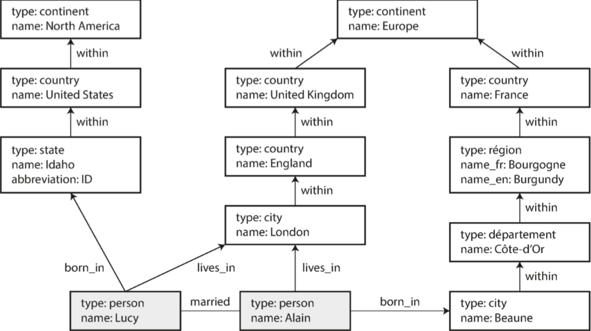

### 序

偏理论的术，分布式入门的书，不深但全

### 部分一

介绍数据系统底层基础概念，用于理解单台机器单点数据系统还是分布式数据系统。

#### 可靠性、可扩展性、可维护下

计算密集型应用瓶颈来自于CPU。

数据密集型应用的瓶颈来自数据量、数据复杂性，以及数据的变更速度；

数据密集型应用通常由标准组件构建，标准组件提供很多通用的功能：

* 存储数据(数据库)，以便自己或者其他应用程序之后能再次找到数据
* 记录开销昂贵的操作，加快读取速度(缓存)
* 允许用户安装关键字搜索，或者各种方式对数据进行过滤(索引)
* 向其他进程发送消息，进行异步处理(流处理)
* 定期处理累计的大批量数据(批处理)

这些功能在使用的时候基本被完美的抽象画，我们并没有直接去使用/写这些功能，但是每个功能有各种各样的实现方式，例如缓存，消息，我们在使用的时候需要弄清楚这些实现工具的各个方法，需要理解这些工具直接的共性和特性。

数据系统一般有会有数据库、消息队列、缓存等差异显著的类型，有着不同的访问模式，以及性能特征，但是近年来出现的工具使得这些类型直接的界限越来越模糊，例如 数据存储可以当成是消息队列使用(Redis)，消息队列可以类似于数据库的持久特性(kafka)。

在设计一个数据系统/服务的时候会遇到很多棘手的问题

1. 当系统出问题时，如何确保数据的正确性和完整性
2. 当部分系统退化降级，如何为客户提供始终如一的良好性能
3. 负载增加时，复合扩容
4. 什么样的API才是好的API

这里主要讨论三个问题

* 可靠性(Reliability)

  系统在硬件/软件/认为故障中仍然可以正常工作(正确完成功能，并达到期望性能水平)

* 可扩展性(scalability)

  合理的办法对应系统的增长(数据量、流量、复杂性)

* 可维护性(Maintainability)

  在不同的生命周期，都能够高效的在系统上工作

##### 可靠性

对于可靠软件的期望：

1. 应用程序能够表现出用户期望的功能
2. 允许用户犯错，允许用户以出乎意料的方式使用软件
3. 在预期的负载和数据量下，性能满足要求
4. 系统能防止未经授权的访问和滥用

可以简单理解为**即使出现了故障(fault)，也可以继续正确工作**，称之为**容错(resilient)**，但是并不是所有的错误都要容错。

> 这里需要区分下故障(fault) 和 失效(failure)，fault 是说系统的一部分状态偏离其标准，failure 则是说系统作为一个整体停止向用户提供服务。
>
> 所以是fault 会导致 failure。
>
> 所以容错就是说防止因为 fault 导致 failure

关注设计软件时候容易出现的人为错误，以下方式可以让系统变的可靠

* 最小化犯错机会的方式设计系统，如精心设计的抽象、API和管理后台
* 最容易犯错的地方和可能导致失效的地方解耦


##### 可扩展性

描述系统应对负载增长能力的术语，大规模的系统架构通常是应用特定的—— 没有一招鲜吃遍天的通用可扩展架构 

##### 可维护性

包括修复漏洞、保持系统正常运行、调查失效、适配新的平台、为新的场景进行修改、偿还技术债、添加新的功能等 。

降低复杂度能极大地提高软件的可维护性，因此简单性应该是构建系统的一个关键目标 。

简单些并不是说减少功能，意味着消除额外的复杂度，最好的工具就是抽象，一个好的抽象可以将大量实现细节隐藏在一个干净，简单易懂的外观下面，**找到好的抽象是比较困难的**


#### 数据模型与查询语言

数据模型是一层一层的叠加，当前层的数据模型是使用低一层的数据模式表示的。

高层次的数据模型，隐藏低层次的数据模型细节。

一个数据库的数据模型对上层应用有着至深的影响。

##### 关系模型和文档模型

SQL 数据模型，数据被组织为关系(表)是元祖(行)的无序集合。

> 关系模型可以做1对多，多对多，多对1关系，在存储表的时候需要构建外键，进行关系表直接的关联。


NoSQL重新解释为**不仅是SQL（Not Only SQL）** 

- 需要比关系数据库更好的可扩展性，包括非常大的数据集或非常高的写入吞吐量
- 相比商业数据库产品，免费和开源软件更受偏爱。
- 关系模型不能很好地支持一些特殊的查询操作
- 受挫于关系模型的限制性，渴望一种更具多动态性与表现力的数据模型


关系文档：任意嵌套的树结构

关系模型是需要提前预先在数据库中写入`Schema`，在插入数据的时候是可以局部更新某个值，且在插入的时候不符合`schema` 是无法插入的，这是类似于编程语言的`静态特性`。 

而关系文档是没有`schema` 的，只有把数据读出来，才知道数据长什么样子，类似于编程语言中的`动态特性`。

关系文档的更擅长存储1对多关系的数据，无需想关系型数据库那些需要做表关联，一次性就可以将所有数据获取到。而对于多对1，多对多久不适合

现在的发展趋势 **关系模型和文档模型的混合是未来数据库一条很好的路线 **

如，mysql 现在值支持`JSON` 和 `XML` 的存储的。


图数据模型

多对多关系是不同数据模型之间具有区别性的重要特征。如果你的应用程序大多数的关系是一对多关系（树状结构化数据），或者大多数记录之间不存在关系，那么使用文档模型是合适的。

虽然关系模型可以处理多对多的关系数据，但是随着数据直接的连接边的复杂，使用图模型更加自然

一个图由两种对象组成：**顶点（vertices）**，和**边（edges）**。多种数据可以被建模为一个图形。典型的例子包括： 

1. 社交网络: 顶点是人，边指示哪些人彼此认识 
2. 网络图谱: 顶点是网页，边缘表示指向其他页面的HTML链接 
3. 公/铁路: 顶点是交叉路口，边线代表它们之间的道路或铁路线 

更复杂的是，图提供了一种一致的方式，用来在单个数据存储中存储完全不同类型的对象，如下表示社交网络两个人，来自爱达荷州的Lucy和来自法国Beaune的Alain。他们已婚，住在伦敦 

 

属性图模型和三元组存储（triple-store）模型 ：

在属性图模型中，每个**顶点（vertex）**包括：

- 唯一的标识符
- 一组 **出边（outgoing edges）**
- 一组 **入边（ingoing edges）**
- 一组属性（键值对）

每条 **边（edge）** 包括：

- 唯一标识符
- **边的起点/尾部顶点（tail vertex）**
- **边的终点/头部顶点（head vertex）**
- 描述两个顶点之间关系类型的标签
- 一组属性（键值对）

图存储看作由两个关系表组成：一个存储顶点，另一个存储边 ，在关系数据库中表示图数据 使用 PostgreSQL json数据类型来存储每个顶点或每条边的属性

```mysql
// 点
CREATE TABLE vertices (
  vertex_id  INTEGER PRIMARY KEY,
  properties JSON
);

//边
CREATE TABLE edges (
  edge_id     INTEGER PRIMARY KEY,
  tail_vertex INTEGER REFERENCES vertices (vertex_id),
  head_vertex INTEGER REFERENCES vertices (vertex_id),
  label       TEXT,
  properties  JSON
);
CREATE INDEX edges_tails ON edges (tail_vertex);
CREATE INDEX edges_heads ON edges (head_vertex);
```

 

#### 存储与检索

一个数据库需要完成两件事情：

1. 当你把数据交给数据库时，它应当把数据存储起来；
2. 当你向数据库要数据时，它应当把数据返回给你 

那么数据库是如何存储我们提供的数据，以及如何在我们需要时重新找到数据。


驱动数据库的数据结构

**索引** 

可以添加与删除索引，这不会影响数据的内容，它只影响查询的性能，维护额外的结构会产生开销，特别是在写入时。写入性能很难超过简单地追加写入文件，因为追加写入是最简单的写入操作。任何类型的索引通常都会减慢写入速度，因为每次写入数据时都需要更新索引。

这是存储系统中一个重要的权衡：精心选择的索引加快了读查询的速度，但是每个索引都会拖慢写入速度， 所以数据库并不会默认新建索引，而是需要开发者手动去建索引

哈希索引、B树


**键值数据** 

#### 编码与演化


### 部分二

分布式相关

##### 复制

##### 分区

##### 事务

##### 分布式系统的麻烦

##### 一致性和共识


