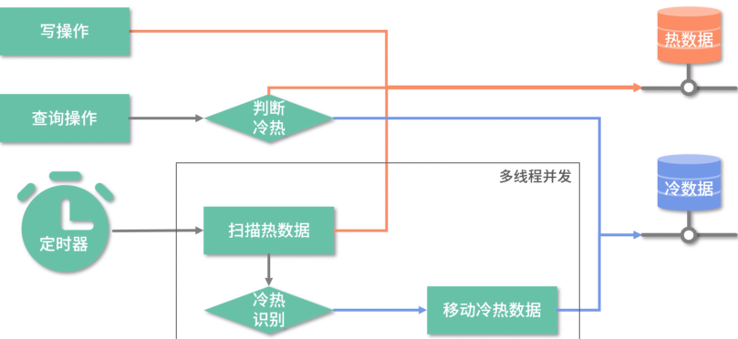
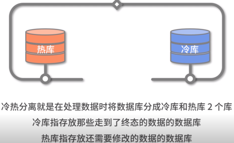
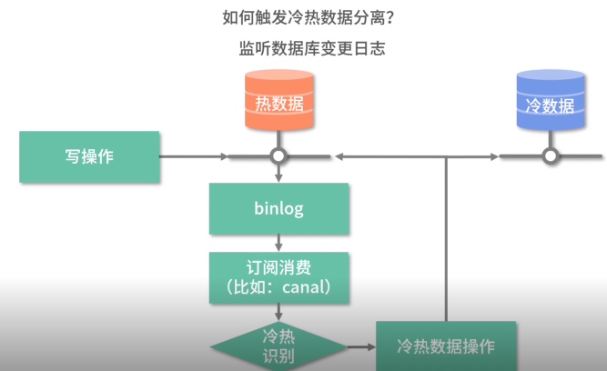
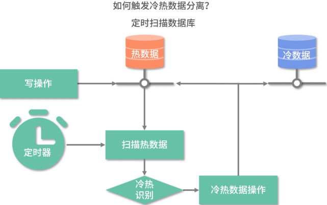
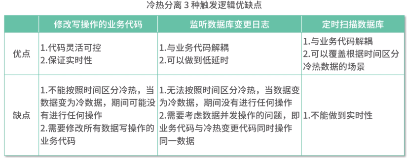
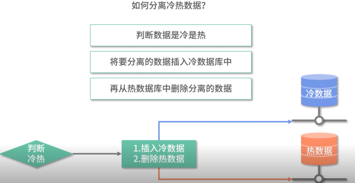
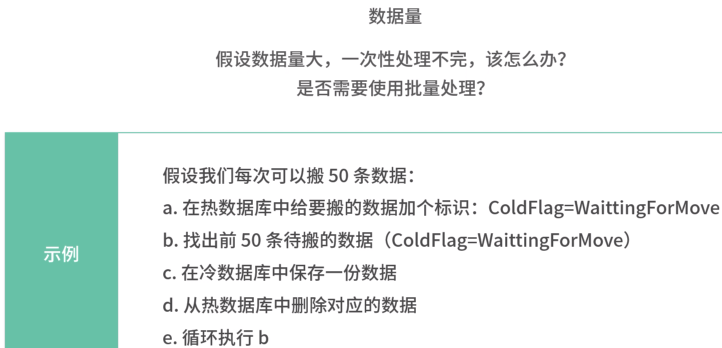
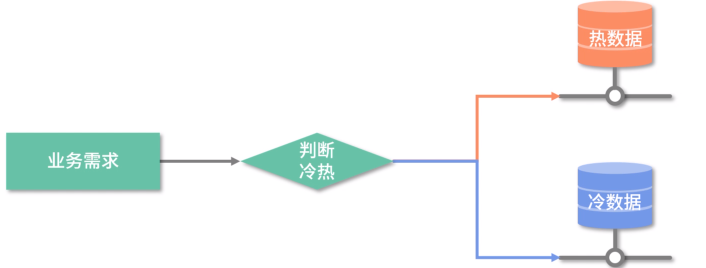

### 冷热分离

> 表数据量大读写缓慢缓慢

#### 痛点

几千万的订单表 + 要关联的数据表，导致一次查询要操作的数据达到上亿，一次返回要巨大延迟

> 优化表结构，索引，查询语句等都不能解决该问题

#### 方案

业务员查询的基本是常用的数据，那么直接将常用的数据放到热库，其他正常数据放到冷库

#### 出现这些场景的时候使用

数据走到终态后，只有读没有写的需求，比如订单完结。

用户能接受新旧数据分开查询，比如默认只让查询3个月的数据，如果要查询3个月前的订单，需要访问单独的页面。

#### 冷热分离实现思路

##### 如何区分冷热数据

根据表中的属性的值来判断，例如

1. 时间的字段，如果一条数据是30天之前的数据，那是冷数据
2. 状态字段，专门有字段标识该条数据是否是一个以及完结的数据
3. 组合字段，下单时间为3个月前，且状态字段为完结

有一个前提：

1. 如果一个数据被标识为冷数据，那么业务不会在对它进行写操作
2. 不会同时存在读冷/热数据的需求

##### 如何触发冷热数据分离

直接修改业务代码

监听数据库变更日志binlog

定时扫描数据库

三种优缺点：

当代码逻辑不是很复杂的时候可以选择第一种。

##### 如何实现冷热数据分离

实际操作的时候考虑三点：

1. 同时修改多个数据库，如何保证数据一致性

   

2. 数据量大-定时扫描需要考虑

   

3. 并发性-当单线程批量完成不了的情况下，启动多线程并发

   

##### 如何使用冷热数据

#### 历史数据迁移

迁移数据的时候给待迁移的数据都加上`coldFlag=waitForMove` 的标签，有这个值的数据后续都会迁移。也就是给历史数据也加上这个标签，就会去迁移

#### 不足

需要业务妥协，如用户查询冷数据的时候还是会很慢，对于这少部分的查询冷数据的业务还是很难以接受。

条件苛刻，这个方案的前提是业务无法在修改冷数据了，

### 查询分离

> 如何优化表数据量大查询缓慢

这里查询分离和读写分离还是有区别的