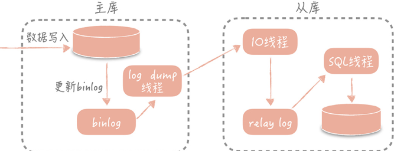
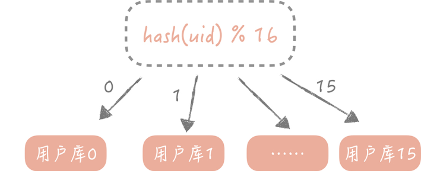
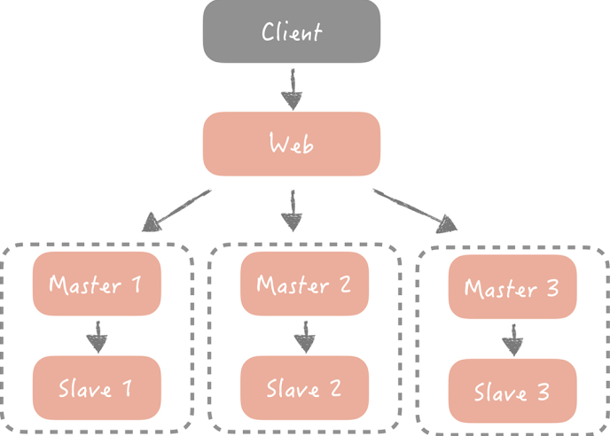
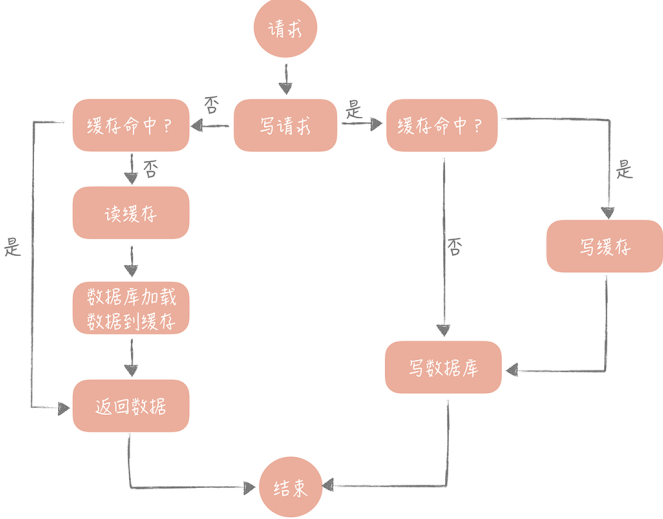

### 开篇

遇到的棘手问题：

1. 微博中，明星的粉丝动辄千万上亿，明星发一条内容，如何保证所有粉丝实时看到呢 ？
2. 双十一，大促的时候，宝座衣服不超卖
3. 春运，如何保证12306页面不崩溃，如何保证千万人同时在抢票
4. 高并发长，缓存的命中率如何保证、如何避免缓存击穿，如何避免雪崩，如何避免缓存数据一致性问题

虽然问题很多，但是很多核心思想都是相同的

消息队列可以建设突发流量对于系统的冲击

系统要做到高内聚、低耦合

缓存技术，时间换空间的思想

**高并发设计是有套路的**

理解基本的设计思想，对知识能够触类旁通，举一反三

---

### 基础篇

高并发架构的设计理念

#### 三大策略

* 横向扩展scale-out：分而治之，将大流量分发到后端分布式多个实例中，每个实例都承担一部分并发和流量

  > `scale-up`: 机器数量不变，提升单台机器的性能
  >
  > `scale-out`: 单台机器性能不变，提高机器的数量，如一主多从、分库分表、存储分片

* 缓存：高并发下，一般都是数据库存在瓶颈，使用缓存让读操作先从缓存中获取，不直接到达数据库

* 异步：采用消息中间件，处理高并发写操作，不过中只能做到最终一致性。需要业务对强一致性做兼容

#### 架构分层

将体系分为N个层次，每个层次有独立的职责，共同配合完成整体的功能，最常见的分层分为表现层、逻辑层、数据访问层，实现对下层的抽象、对上层屏蔽细节，分层之后可以做到功能复用、专一职责，以及可以横向扩展。

在系统设计分层的时候，要定义好每个层次的干什么的，理清楚每层的职责，边界；一般在后端还会将逻辑层在业务复杂的情况下进行细化，例如分出来`manager service` 负责一些通用的功能。

当然这样分层之后也会带来编码的复杂度，往往一个简单的功能，又要写`controller`还要写`service`以及`dao` 层。

任何架构分层都是有优劣的，在做决策的时候要做好`trade off`

#### 系统设计目标

互联网系统设计的**三高**目标，也就是**高并发、高性能、高可用**，

### 演进篇

系统支持高并发的方法

#### 池化技术

一般的链接池中会有这么两个配置`最大连接数据、最小连接数`，含义是专业的

> 当当前连接数小于最小连接数，则创建新的连接；
>
> 如果连接池中有空闲的连接，则复用空闲的连接；
>
> 如果空闲池中没有连接，并且当前连接数小于最大连接数，那么创建新的连接；
>
> 如果当前连接已经到达最大连接数，则按照配置中的设定的时间等待旧的连接可用；
>
> 如果等待超过这个时间，则抛出异常。

还有数据库的配置`wait_timeout` 当一个连接空闲时间超过它，就会将链接关闭。

可以在代码中启动一个线程来检测连接池中的连接是否可用，发送`select 1` 的命令给数据库看是否会抛出异常，如果抛出，那么就将这个连接从连接池中移除，并尝试关闭，目前`c3p0` 就是采用这种方式。

还可以在获取连接后，先校验连接是否可用，可用在去执行`sql` 语句，如在`DBCP` 中的`testOnBorrow` 的配置。

在程序中也有线程池的技术可以优化高并发；`ThreadPoolExecutor` 的线程池有两个重要的参数`coreThreadCount` 和 `maxThreadCount` 控制住线程池的执行过程，当池中的线程少于`coreThreadCount` 处理新的任务的时候就会粗昂见新的线程，当线程大于它的时候会把任务丢到任务队列中，由空闲的线程去执行，让任务队列满了的时候会继续创建线程，知道达到 `maxThreadCount`，当线程达到上限，任务队列也满了后，就会丢弃任务。

> 使用线程池一定记住不要使用无界队列(不设置固定大小的队列)，因为任务一直往里面方任务，就会频繁的`Full GC`，甚至宕机。
>
> 无界队列中，maxCoreThread 就没有意义了

池化技术，核心是空间换时间，使用预先创建好的对象，减少频繁的创建对象和开销；

#### 数据库优化

##### 主从分离

当查询请求增加的时候，做主从分离策略；

大部分的系统的访问都是读多写少，优先考虑数据库如何抗住更高的查询请求，首先将数据库的读写请求流量分开，读写分离主要做好一下：

1. 数据的拷贝，也就是主从复制
2. 如何屏蔽主从分离带来的访问数据库方式变化，这个是从代码层面实现的，使用数据库中间件

`mysql`上面所有的操作都异步的二进制格式存储在`binlog` 中，可以将`binlog` 从主库复制到从库，从库执行`binlog` 将其复制到到`relaylog`, 然后再从库执行`relaylog`就可以完成主从复制

也并不是说从库越多，访问的并发就会越多，因为主库在进行`log dump` 的时候也是会有IO的消耗，太多从库，太多的`log dump` 是会拖慢主库的，一般挂3-5个从库就OK。

当然在主往从库同步的时候，如果有错误发送，或者有延误，也是会影响主从数据库的一致性，读的业务逻辑。

这由的架构就到来的，在代码中维护原来一个数据库`IP` 就编程了维护一个写`IP` 和多个读`IP`，不过现在有很多的数据库中间件去解决这个问题，主要分为两类

1. 嵌入代码库中的，TDDL
2. 单独部署 MyCat

#### 分库分表

在写入数据量增加时候策略，数据库中存储的数据越来越多，即使是使用了索引，就连索引占的空间也越来越大，这由查询的性能就又来了。此时对数据库进行分片，将数据尽量平均分配到多个数据库节点，分摊数据库的读写压力

在使用分库分表的时候会有如下的坑：

1. 什么场景下使用，以及使用方法，在查询的时候不使用分区键
2. 分库分表引入了其他问题，例如查询时候大量连表查询

分库分表在解决了数据库存储的瓶颈同时也提升了数据库查询的性能，同时写数据库也变成了多写，也提升数据库的写并发

##### 垂直拆分

专库专用，将业务耦合度比较高的表拆分到单独的库中。如把一个表的1-10列存储到db1,10-20列数据存储到db2。

在拆分的过程中主要关注业务相关性。

##### 水平拆分

和垂直拆分不同的是，水平拆分主要关注如何将数据均匀的分到多个表中，关注点在数据，例如按照日期分片，一天一个表，一天的数据单独存储一个表，或者按照某一列值的哈希值作为键

虽然解决了数据库扩展的问题，单同时带来了其他问题：

1. 表的 join 就变的棘手；
2. 查询的时候必须带着分区键，

如果没有瓶颈问题，那么不做分库分表，但是如果要做最好一次性到位，防止后续更加麻烦的数据迁移，

还有一些`NoSQL` 是自动支持数据库分片的，如`HBase/ES/MongoDB`

最终通过使用`主从分离、分库分表` 之后，数据库的架构就变成了这样：

主键的选择一般有，手机号、email、身份证号等，但是在很多情况下不好找到这样的主键，需要去生成ID，如数据库的自增。还有一种是搭建专门的生成id 的服务器。

`主从分离、分库分表` 始终是基于传统的结构化数据库的改进，但是例如在微博用户关系的数据量高达千亿，甚至每天都在高速增长，这种场景下分库分表再怎么分都不能满足这样的场景。

这时就需要使用`NoSQL`，因为它有天生的分布式能力，优秀的读写性能。

#### NoSQL

它是对不同于传统关系型数据库的一种统称，不使用SQL作为查询语句，有优秀的横向扩展能力和读写性能。主要有：

* KV存储型，如Redis
* 列存储型，Hbase
* 文档型， MongoDB
* 搜索型，ES

它的出现是弥补关系型数据库的，而不是替代。

#### 缓存

在经过`主从分离、分库分表` 之后，当越大的读并发到来的时候，当数据库的IO变成瓶颈的时候，此时就需要使用缓存解决。

缓存就是这种解决速度相差比较大的两种硬件之间，用于协调二者数据传输毒素差异的结构。以一种空间换时间的策略。

在使用的时候主要分为三类

##### 静态缓存

静态数据，例如前端页面html、JS等

##### 分布式缓存

热点数据，单独部署`Redis`

##### 本地缓存

极端热点数据，和代码是在一起的，如`Guava Cache/Ehcache`，要设计过期时间

缓存主要解决的是访问速度，数据的反问从服务器就返回了，不需要到达数据库，从而抗住更高的并发。

缓存适用于读多写少的场景，20%的内容占有80%的流量具有热点属性的数据才适合缓存。

缓存会给系统带来复杂度，且有数据不一致的风险，如数据库更新了，但是缓存还是旧数据，这由从缓存中命中的就是脏数据，对于这种情况，考虑在缓存中设置较短的过期时间。

##### 使用

读写策略：主要防止被写入脏数据、缓存命中率下降

场景：

> 更新id=1的用户的商品个数实现 +1 的逻辑

例如使用这样的策略：更新数据库 -> 更新缓存

早高并发情况下会将缓存和数据库数据不一致情况，因为这不是一个原子的操作，在没有做并发控制的情况下出现该问题。

可以这样使用，更新数据库 -> 删除缓存，然后再读的时候更新缓存，这就是`Cache Aside` 策略，称为旁路缓存策略。

其中读的策略：缓存中读 -> 命中则返回 -> 命不中，数据库查数据 -> 查到数据，写缓存，返回数据

如果在写入比较频繁时候，缓存频繁的被删除，可以考虑这样：

更新数据库 + 写缓存，不过这样的场景需要有分布式锁；

更新数据库 + 写缓存+很快的过期时间，就算脏数据，也是很短暂的时间。

上面的跑路缓存策略，是直接在业务代码中维护数据库数据和缓存数据，还有一种`Read/Write through`（读/写穿），也就是业务代码至于缓存数据打交道，缓存和数据库去交互，做数据的更新。

这种方式一般在本地缓存的时候使用如使用`Guava`，它本身是支持的。但是在分布式缓存中没有这种功能，直接使用第一种策略。

缓存穿透：

### 实战篇

实际案例