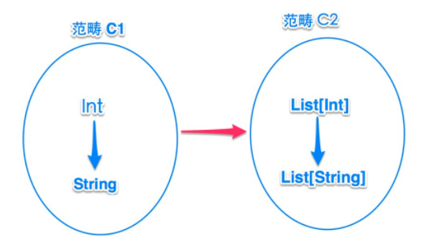
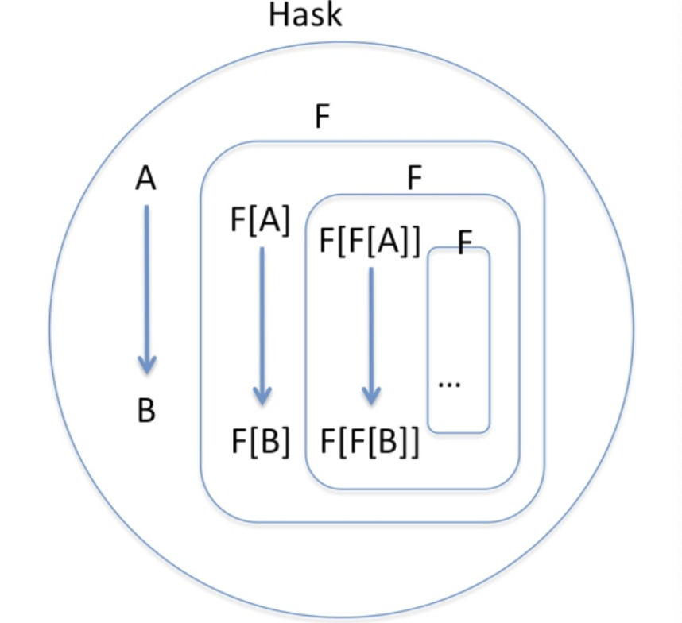

`scala`里最显著困难是它的类型系统，当类型的抽象度变高之后(犹如从二维世界到三维世界)，它的含义和使用场景也会复杂很多。而`monad`正是基于高阶类型做的抽象。所以在了解`monad`前一定先要了解`scala`中高阶类型的概念，这块可以参考我`blog`中的`scala`类型系统系列。

通常`monad`也是一个标识，判断程序员对函数式世界的了解程度，它背后隐藏着很多的概念，并且很多来自数论(范畴领域)，对于非科班出身的我来说，总是心存敬畏而避而远之，但我们如果去掉这些理论描述，仅从程序的实现来看，还是比较容易的，只要把这些概念一点点分解开的话。

> *Haskell由于使用了Monad这种较费解的概念来控制副作用而遭到了一些批评意见。Wadler试图平息这些质疑，他解释说：“一个单子（Monad）说白了不过就是自函子范畴上的一个幺半群而已，这有什么难以理解的？”*

##### 半群(semigroup)与幺半群(monoid)

google到数学里定义的群(group): G为非空集合，如果在G上定义的二元运算 *，满足

```
（1）封闭性（Closure）：对于任意a，b∈G，有a*b∈G
（2）结合律（Associativity）：对于任意a，b，c∈G，有（a*b）*c=a*（b*c）
（3）幺元 （Identity）：存在幺元e，使得对于任意a∈G，e*a=a*e=a
（4）逆元：对于任意a∈G，存在逆元a^-1，使得a^-1*a=a*a^-1=e
```

则称`（G，*）`是群，简称`G`是群。

如果仅满足**封闭性和结合律**，则称G是一个半群`（Semigroup）`；如果仅满足封闭性、结合律并且有幺元，则称G是一个含幺半群`（Monoid）`。

相比公式还是用代码表达更容易理解，下面表示一个半群`(semigroup)`:

```scala
trait SemiGroup[T] {
    def append(a: T, b: T): T
}
```

特质`SemiGroup`，定义了一个二元操作的方法`append`，可以对半群内的任意2个元素结合，且返回值仍属于该半群。

我们看具体的实现，一个`Int`类型的半群实例：

```scala
object IntSemiGroup extends SemiGroup[Int] {
    def append(a: Int, b: Int) = a + b
}

// 对2个元素结合
val r = IntSemiGroup.append(1, 2)
```

现在在半群的基础上，再增加一个幺元(Identity，也翻译为单位元)，吐槽一下，**幺元**这个中文不知道最早谁起的，Identity能表达的意义(同一、恒等)翻译到中文后完全消失了。

```scala
trait Monoid[T] extends SemiGroup[T] {
    // 定义单位元
    def zero: T
}
```

上面定义了一个幺半群，继承自半群，增加了一个单位元方法，为了容易理解，我们用zero表示，半群里的任何元素a与zero结合，结果仍是a本身。

构造一个`Int`类型的幺半群实例：

```scala
object IntMonoid extends Monoid[Int] {
    // 二元操作
    def append(a: Int, b: Int) = a + b
    // 单位元
    def zero = 0
}

// 构造一个String类型的幺半群实例：

object StringMonoid extends Monoid[String] {
    def append(a: String, b: String) = a + b
    def zero = ""
}

// 再构造一个复杂点的 List[T] 的幺半群工厂方法
def listMonoid[T] = {
    new Monoid[List[T]] { 
        def zero = Nil
        def append(a: List[T], b: List[T]) = a ++ b 
    }
}
```

通过上面的列子，看到`Monoid` 是在一阶类型(**特定类型(proper type)**)，属于一个集合(范畴)中的运算。

OK,现在我们已经了解了幺半群是什么样了，但它有什么用？

#### fold与monoid

```scala
def foldLeft[B](z: B)(op: (B, A) => B): B
```

现在我们对一个`List`进行累加操作：

```scala
scala> List("A","B","C").foldLeft("")(_+_)
res5: String = ABC
```

上面`foldLeft`传入的两个参数空字符串，以及二元操作函数 `_+_` 不正好符合字符串monoid的定义吗？

```scala
object StringMonoid extends Monoid[String] {
    def append(a: String, b: String) = a + b
    def zero = ""
}

scala> List("A","B","C").foldLeft(StringMonoid.zero)(StringMonoid.append)
res7: String = ABC
```

现在我们对`List`定义一个累加其元素的方法：

```scala
scala> def acc[T](list: List[T], m: Monoid[T]) = {
    list.foldLeft(m.zero)(m.append)
}
```

#### 半群(semigroup)与并行运算

因为半群里的“结合律”特性，使得我们可以对一些任务拆分采用并行处理，只要这些任务的结果类型符合“结合律”(即没有先后依赖)。

##### 函子(functor)是什么

> ***一个单子（Monad）说白了不过就是自函子范畴上的一个幺半群而已***

**自函子(Endofunctor)**

* 什么是函子(Functor)？

> 乍一看名字，以为函子`(functor)`对函数`(function)`是一种封装，实际没有关系，尽管他们都是表示映射，但两者针对的目标不一样。
>
> 函数表达的映射关系在类型上体现在**特定类型(proper type)**之间的映射，举例来说
>
> ```scala
> // Int => String
> scala> def foo(i:Int): String = i.toString
> 
> // List[Int] => List[String]
> scala> def bar(l:List[Int]): List[String] = l.map(_.toString)
> 
> // List[T] => Set[T]
> scala> def baz[T](l:List[T]): Set[T] = l.toSet
> ```
>
> 而函子，则是体现在**高阶类型(higher-kind-list: 确切的说是范畴，可把范畴简单的看成高阶类型)**之间的映射(关于高阶类型参考: scala类型系统：24) 理解 higher-kinded-type，听上去还是不够直观，函子这个术语是来自群论(范畴论)里的概念，表示的是范畴之间的映射，那范畴又与类型之间是什么关系？
>
> #### 把范畴看做一组类型的集合
>
> > 这个集合是按照阶次的，如`Int`，`String`都是一阶类型，属于一个集合(范畴)中
> >
> > 而`List[Int]`, `List[String]` 是一个二阶的类型，属于另外一个集合(范畴) 
>
> 假设这里有两个范畴：范畴`C1` 里面有类型`String` 和类型 `Int`；范畴`C2` 里面有 `List[String]` 和 `List[Int]`
>
> > `higher-kinded-type` 就是这里 `List` 的泛型
>
>  
>
> 换句话说，如果一个范畴内部的所有元素可以映射为另一个范畴的元素，且元素间的关系也可以映射为另一个范畴元素间关系，则认为这两个范畴之间存在映射。所谓函子就是表示两个范畴的映射。
>
> #### 怎么用代码来描述函子
>
> 从上图的例子，我们已经清楚了`functor`的含义，即它包含两个层面的映射：
>
> ```
> 1) 将C1中的类型 T 映射为 C2 中的 List[T] :  T => List[T]
> 2) 将C1中的函数 f 映射为 C2 中的 函数fm :  (A => B) => (List[A] => List[B])
> ```
>
> 要满足这两点，我们需要一个类型构造器
>
> ```scala
> trait Functor[F[_]] {
> 
>     def typeMap[A]: F[A]
> 
>     def funcMap[A,B](f: A=>B): F[A]=>F[B] 
> }
> ```
>
> 我们现在可以把这个定义再简化一些，类型的映射方法可以不用，并把它作为一个`type class`：
>
> ```scala
> trait Functor[F[_]] {
>     def map[A,B](fa: F[A], f: A=>B): F[B]
> }
> ```
>
> 现在我们自定义一个`My[_]`的类型构造器，测试一下这个`type class`:
>
> ```scala
> scala> case class My[T](e:T)
> 
> scala> def testMap[A,B, M <: My[A]](m:M, f: A=>B)(implicit functor:Functor[My]) = {
>  |          functor.map(m,f)
>  |      }
> 
> scala> implicit object MyFunctor extends Functor[My] {
>  |          def map[A,B](fa: My[A], f:A=>B) = My(f(fa.e))
>  |      }
> 
> //对 My[Int], 应用函数 Int=>String 得到 My[String]
> scala> testMap(My(200), (x:Int)=>x+"ok")
> res9: My[String] = My(200ok)
> ```
>
> 不过大多数库中对functor的支持，都不是通过`type class`模式来做的，而是直接在类型(这里暂时认为是带着一阶类型作为泛型的二阶类型)构造器的定义中实现了`map`方法：
>
> ```
> scala> case class My[A](e:A) {
>      |     def map[B](f: A=>B): My[B] = My(f(e))
>      | }
> 
> scala> My(200).map(_.toString)
> res10: My[String] = My(200)
> ```

这样相当于显式的让`My`同时具备了对类型和函数的映射(`A->My[A]`，`A=>B -> My[A]=>My[B]`；在haskell里把这两个行为也叫提升(lift)，相当于把类型和函数放到容器里)，所以我们也可以说一个带有`map`方法的类型构造器，就是一个函子。

> `My(200)` 完成了要求中的第一条(将C1中的类型 T 映射为 C2 中的 List[T] :  T => List[T])， 将类型Int 映射到了My 范畴
>
> `.map(_.toString)` 完成了要求中的第二条，将C1中的函数 f 映射为 C2 中的 函数fm :  (A => B) => (List[A] => List[B])

#### 范畴与高阶类型

我们再来思考一下，如果忽略范畴中的关系(函数)，范畴其实就是对特定类型的抽象，即高阶类型(first-order-type或higher-kinded-type，也就是类型构造器)，那么对于上面例子中的”范畴C2″，它的所有类型都是`List[T]`的特定类型，这个范畴就可以抽象为`List`高阶类型。那对于”范畴C1″呢？它又怎么抽象？其实，”范畴C1″的抽象类型可以看做是一个Identity类型构造器，它与任何参数类型作用构造出的类型就是参数类型

---

* [**自函子(Endofunctor)**](https://hongjiang.info/understand-monad-5-what-is-endofunctor/)

> *自函子就是一个将范畴映射到自身的函子 (A functor that maps a category to itself)*

这句话看起来简单，但有个问题，如何区分自函子与`Identity`函子？让我们先从简单的“自函数”来看。

#### 自函数(Endofunction)

自函数是把一个类型映射到自身类型，比如`Int=>Int`, `String=>String` 等

注意自函数与`Identity`函数的差异，`Identity`函数是什么也不做，传入什么参数返回什么参数，它属于自函数的一种特例；自函数是入参和出参的类型一致，比如 `(x:Int) => x * 2` 或 `(x:Int) => x * 3` 都属于自函数：

#### 自函子(Endofunctor)

自函子映射的结果是自身，下图是一个简单的情况:

> 是否就可以认为自函子就是一个函数，因为自函子经过映射之后其还是属于原来的范畴(在同一阶类型上的映射)，也就是说是在同一个范畴中进行的映射，也就可以理解为函数了，当然得明白这里的范畴是高阶的范畴
>
> 假设这个自函子为`F`，则对于 `F[Int]` 作用的结果仍是`Int`，对于函数`f: Int=>String` 映射的结果 `F[f]` 也仍是函数`f`，所以这个自函子实际是一个`Identity`函子(自函子的一种特例)，即对范畴中的元素和关系不做任何改变。
>
> 那怎么描述出一个非`Identity`的自函子(注意这里的自并不是说2经过一个运算之后还是2，而是List<T>经过运算之后还是List<T>/List<List<T>> 等，这里已经进入二阶范畴)呢？在介绍范畴在程序上的用法的资料里通常都用haskell来举例，把haskell里的所有类型和函数都放到一个范畴里，取名叫**Hask**，那么对于这个Hask的范畴，它看上去像是这样的：
>
> 
>
> 先来解释一下（画这个图的时候做了简化），`A`,`B`代表普通类型如`String`,`Int`,`Boolean`等，这些(有限的)普通类型是一组类型集合，还有一组类型集合是衍生类型(即由类型构造器与类型参数组成的)，这是一个无限集合(可以无限衍生下去)。这样`范畴Hask`就涵盖了haskell中所有的类型。
>
> 对于范畴Hask来说，如果有一个函子F，对里面的元素映射后，其结果仍属于Hask，比如我们用`List`这个函子：
>
> ```
> List[A], List[List[A]], List[List[List[A]]]...
> ```
>
> 发现这些映射的结果也是属于Hask范畴(子集)，所以这是一个自函子，实际上在Hask范畴上的所有函子都是自函子。
>
> 我们仔细观察这个`Hask`范畴的结构，发现它实际是一个**fractal**结构，所谓fractal(分形)，是个很神奇的结构，在自然界也大量存在：
>
> 
>
> 发现这些映射的结果也是属于Hask范畴(子集)，所以这是一个自函子，实际上在Hask范畴上的所有函子都是自函子。
>
> 我们仔细观察这个`Hask`范畴的结构，发现它实际是一个**fractal**结构，所谓fractal(分形)，是个很神奇的结构，在自然界也大量存在：

----

#####  [从组合子(combinator)说起](https://hongjiang.info/understand-monad-6-combinator/)

可以把combinator先当成一种“胶水”，更具体一些，把`scala`的集合库里提供的一些函数看成`combinator:`

```scala
map
foreach
filter
fold/reduce
zip/partition
flatten/flatMap
```

而`monad`正是一个通用的`combinator`，也是一种设计模式，但它有很多面，就我后续的举例来说，先把`monad`看成一个“行为”的组合子。体现在代码上：

```scala
class M[A](value: A) {  

    // 1) 把普通类型B构造为M[B]
    // 因为M定义为class并提供了构造方法，可以通过new关键字来构造，该工厂方法可以省略
    def unit[B] (value : B) = new M(value)  

    // 2) 不是必须的
    def map[B](f: A => B) : M[B] = flatMap {x => unit(f(x))}  

    // 3) 必须，核心方法
    def flatMap[B](f: A => M[B]) : M[B] = ...  
} 
```

一个monad内部除了一个工厂方法`unit`(注意，与Unit类型没有关系，unit这里表示“装箱”，源自haskell里的叫法)，还包含了两个combinator方法，`map`和`flatMap`，这两个组合子中`flatMap`是不可少的，`map`可以通过`flatMap`来实现。

`unit`方法不一定会定义在monad类内部，很多情况下会在伴生对象中通过工厂方法来实现。

---

##### 把monad看做行为的组合子

先从最简单的情况开始，我们用monad封装一段执行逻辑，然后提供一个`map`组合子，可以组合后续行为：

```scala
/ 一个不完善的monad
class M[A](inner: => A) {

    // 执行逻辑
    def apply() = inner

    // 组合当前行为与后续行为，返回一个新的monad
    def map[B](next: A=>B): M[B] = new M(next(inner))
}
```

---

[另外一篇博客](https://my.oschina.net/guanxun/blog/475527)

```scala
trait Monad[+T] {  
    def flatMap[U]( f : (T) => Monad[U] ) : Monad[U]  
    def unit(value : B) : Monad[B]
}
```

Monads 就是一个values的容器，并且这个“容器”必须有一个flatMap和一个unit(v)操作. 

**flatMap** 将monad中的一个值转换为仍在相同monad类型中的另外一个值。

**unit(v)**, 用来包装一个values。比如Some(v)，Success(r)， List(v) 

所有monads都可以直接实现`flatMap`, 但是每个具体的monad必须自己实现`unit(v)`. 在scala里，一般通过构造函数或伴生对象的apply方法来实现。

至于常用的**map**方法，其实只是flatMap的一个特殊形式，所以map方法不是monad所必须的：

```scala
def map[U](f : (T) => U) : Monad[U] = flatMap(v => unit(f(v)))
```

**数学概念和Monad实现的对应关系**

> trait Monad[+T] 就等于一个含幺半群G

> def flatMap[U]( f : (T) => Monad[U] ) : Monad[U] 就等于是其中的二元运算 *，满足封闭性和结合律

> def unit(value : B) : Monad[B] 就等于是幺元（Identity)，对于任意a∈G，满足e*a=a*e=a

所以对于一个Monad，他满足半群应满足的规则

结合律/封闭性

> ```
> monad.flatMap(f).flatMap(g) == monad.flatMap(v => f(v).flatMap(g)) // associativity
> ```

左幺元

```
unit(x).flatMap(f) == f(x)
```

右幺元

```
monad.flatMap(unit) == monad
```

---

[这里有很多的图片解释Monad](http://www.ruanyifeng.com/blog/2015/07/monad.html)

---

[这篇文章中Monad 的一些解释](https://blog.redelastic.com/a-guide-to-scala-collections-exploring-monads-in-scala-collections-ef810ef3aec3)

Monads are containers. That means they contain some sort of elements. Instead of allowing us to operate on these elements directly, the container itself has certain properties. **We can then work with the container and the container works with the element within. This will help us to create more concise code; **

When we create a monad around a value, we say that we *lift* the value into the container.

**Benefits**

Let’s take a step back and look at what the point of this is. Often we have complex tasks that have many steps, and this can result in very complex code. We might have callbacks, multiple functions that pass results back and forth,

We often want to take a complex problem and break it down into manageable tasks, and then put those tasks back together to solve the problem. To do this, we need some kind of structure that will put this process “on rails” so that we’re reducing complexity by breaking down the problem, rather than increasing it by adding more and more independently moving parts. We need a kind of assembly line, where each part of the process can take care of its own business, and then pass the work to the next part. We want to break down our problem into a number of small functions, and then compose those functions together into one master function that represents the entire task.

**Composing functions is the reason why we want to use monads and should care about monads.** 

如使用`flatMap` 和 `unit` 可以组成各种各样的函数