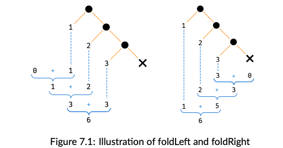

#### Monad

> 就是带着 `flatMap` 方法的 `type class`， 所有的`Functors` 都是 `Monad`，因为可以使用 `flatMap` 实现 `Map` 映射，同时`Monad 也是Functor`，因为`Map` 也可以用来实现`FlatMap`
>
> 其满足交互率和，幺元的运算
>
> *A monad is a mechanism for sequencing computatons*
>
> **map 只是在范畴内完成映射A=>B， 而flatMap 可以完成范畴间之间的映射 A => F[A]**
>
> ```scala
> trait Monad[F[_]] {
>   	def pure[A](value: A):F[A]
>   	def flatMap[A,B](value: F[A])(f: A => F[B]):F[B]
>   	//def map[A,B](value: F[A])(f: A => B): F[B] = flatMap(value)(a => pure(f(a)))
> }
> ```
>
> *flatMap provides the sequencing step we have already discussed,  extract the value from a context and **generating the next context** in the sequence*

#### Monad in Cats

> `Monad` 是来自于2个`type class`，`FlatMap` 提供了`flatMap` 方法，还有`Applicative` 提供了`pure` 方法，`Applicative` 继承自 `Functor`

```scala
import cats.Monad
import cats.instances.option._
import cats.instances.list._

object MonadExample extends App {

  private val option: Option[Int] = Monad[Option].pure(2)

  println(Monad[Option].flatMap(option)(a => Some(a + 2))) // Some(4)
  println(Monad[Option].map(option)(a => a + 2)) // Some(4)
}
```

`Monad` 还提供了很多其他的函数，这些函数都是基于 `pure` 和 `flatMap` 实现的。

`Cats` 提供了几乎表中库中的全部的 `instances`， 而且还提供了`Future` 的 class

```scala
  // 注意上面 flatMap 中微山使用 map， 而不是继续使用flatMap
  def sumSquare[F[_] : Monad](a: F[Int], b: F[Int]): F[Int] =
    a.flatMap(aa => b.map(bb => bb * bb + aa * aa))


  def sumSquare2[F[_] : Monad](a: F[Int], b: F[Int]): F[Int] =
    for {
      x <- a
      y <- b
    } yield x*x + y*y


  println(sumSquare(Option(3), Option(4)))
  println(sumSquare2(Option(3), Option(4)))
  println(sumSquare(List(1, 2, 3), List(3, 4)))
  println(sumSquare2(List(1, 2, 3), List(3, 4)))

  // 但是不能直接使用一阶泛型
  // println(sumSquare(3,4))
  // 如果可以将一阶泛型和高阶泛型都可以使用， 使用Monoid 的Id Syntax
  import cats.Id
  println(sumSquare(3:Id[Int],4:Id[Int]))
```

Id is actually a type alias that turns an atomic type into a single-parameter type constructor.

```scala
private val value2: Id[String] = "Dave" : Id[String]
println(value2)
// res3: cats.Id[String] = Dave
private val value3: Id[Int] = 123 : Id[Int]
println(value3)

// res4: cats.Id[Int] = 123
private val value4: Id[List[Int]] = List(1, 2, 3) : Id[List[Int]]
// res5: cats.Id[List[Int]] = List(1, 2, 3)
println(value4)

// 实现Id 的 pure、map、flatMap 方法
def pure[A](value: A): Id[A] = value
def map[A,B](initial: Id[A])(f: A=>B):Id[B] = f(initial)
def flatMap[A, B](initial:Id[A])(f: A=> Id[B]): Id[B] = f(initial)


import cats.syntax.either._
private val value: Either[String, Int] = 3.asRight[String]
private val right: Either[Nothing, List[Int]] = List(12).asRight
// Either[A, B] 有2个类型参数，第一个参数是Left 的类型，第二个是Right 的类型
// asRight 实现在 implicit class final class EitherIdOps[A](private val obj: A) 中，所以
// 都具备了这个函数能力
private val value1: Either[String, Int] = 4.asRight[String]


  def countPositive(nums: List[Int]): Either[String, Int] =
    nums.foldRight(0.asRight[String])((e, z) => z.map(z => z + 1) )
//def countPositive(nums: List[Int]) = nums.foldRight(Right(0))((e, z) => z.map(z => z + 1) )
// 这里编译失败， 是因为 Right(0) 返回的是 Right， 而不是 Either， 而编译器认 Either
// 0.asRight[String] 返回的是 Either

```


---

#### Syntax

> 以下的 `import` 中提供了相对应的方法
>
> ```scala
> import cats.syntax.flatMap  // 提供 flatMap
> import cats.syntax.functor  // 提供了 map
> import cats.syntax.applicative // 提供了 pure
> ```

---

#### Eager, Lazy, Memoized

> `lazy`  计算是在访问的时候才会计算
>
> `eager` 计算是立即的
>
> `Memoized`: 只会计算一次，后续在计算的时候，从第一次结算的结果中获取
>
> `val` 定义的计算是`eager`和`Memoized`的， 立马计算的，且会被缓存的，也就是第二次在调用，那么得到的还是地第一次的结果
>
> ```scala
> val x = {
>  println("Computation X")
>  math.random
> }
> println(x)
> println(x)
> // 2次结果一样
> #Computation X
> #0.21553437551101395
> #0.21553437551101395
> 
> ```
>
> 注意这里，只有第一访问的时候，有打印 Computation X， 但是第二次访问就没有在打印而只返回结果，因为第一次之后结果被缓存，后面再访问，直接返回第一次的结果
>
> 使用 `def` 定义的的 `lazy` 的但是不会被缓存
>
> ```scala
> def y = {
>  println("Computation y")
>  math.random
> }
> // 2次结果不一样
> 
> println(y)
> println(y)
> Computation y
> 0.2876070472340887
> Computation y
> 0.6994829835550574
> 结果不一样，且都会打印 Computation y，说明每次都会重新计算
> ```
>
> `lazy` + val 那么就是赖计算，且被缓存的, 从输出来看，和单 `val` 一样
>
> ```scala
> lazy val zz = {
>  println("Computation zz")
>  math.random
> }
> println(zz)
> println(zz)
> 
> Computation zz
> 0.5320918336447616
> 0.5320918336447616
> ```

#### Cats Eval 的方法

> 有3个`subTypes`， `Now、Later、Always`
>
> 分别代表的意思是:
>
> ```scala
> private val now: Eval[Double] = Eval.now(math.random() + 100) 
> // 立刻计算，相当于是 val — eager and memoized:
> private val later: Eval[Double] = Eval.later(math.random() + 100) 
> // lazy, memoized  similar to a lazy val
> private val always: Eval[Double] = Eval.always(math.random() + 100) 
> // a lazy computation, similar to a def:
> println("now: " + now.value)
> println("now: " + now.value)
> println("later: " + later.value)
> println("later: " + later.value)
> println("always: " + always.value)
> println("always: " + always.value)
> ```
>
> 输出
>
> now: 100.62155792119222
> now: 100.62155792119222
> later: 100.1377975793702
> later: 100.1377975793702
> always: 100.362500700709
> always: 100.01110193662632
>
> ```scala
> val zzzd = Eval.later{
> 	println("Computing Zzz")
> 	math.random()
> }
> println("Eval.later " + zzzd.value)
> println("Eval.later " + zzzd.value)
> 
> Computing Zzz
> Eval.later 0.05853777843283969
> Eval.later 0.05853777843283969
> 
> 
> val zzzdnow = Eval.now{
> println("Computing Zzz")
> math.random()
> }
> println("Eval.now " + zzzdnow.value)
> println("Eval.noe " + zzzdnow.value)
> Computing Zzz
> Eval.now 0.6640030698768912
> Eval.noe 0.6640030698768912
> 
> 
> val zzzdalways = Eval.always{
> println("Computing Zzz")
> math.random()
> }
> println("Eval.always " + zzzdalways.value)
> println("Eval.always " + zzzdalways.value)
> 
> Computing Zzz
> Eval.always 0.5937719360356264
> Computing Zzz
> Eval.always 0.5246678703851702
> ```
>
> 当将 `Eval`  写为`Monad`, 可以有 `flatMap map` 方法，可以将这些方法显示的缓存，并串成一个functions of list， 多个function 的行为就会变为上面的3种类型
>
> ```scala
> val greeting = Eval.always {
> println("Step 1")
> "Hello "
> }.map(str => {println("step 2"); s"$str world "})
> 
> println(greeting.value)
> Step 1
> step 2
> Hello  world
> // Eval.always 方法一直返回的都是 Eval 所以可以连接多个 map 或 flatMap 方法
> // 这样 map 中的函数的调用就变成了 lazy的了
> // 只有在调用 greeting.value 的时候，才会去执行
> ```
>
> **memorize**
>
> 实现中间结果的显示缓存
>
> ```scala
> val saying = Eval
> .always {println("Step 1"); "The cat"}
> .map {str => println("Step 2"); s"$str sat on"}
> .memoize
> .map {str => println("Step 3"); s"$str the mat"}
> 
> println(saying.value)
> println(saying.value)
> 
> Step 1
> Step 2
> Step 3
> The cat sat on the mat
> Step 3
> The cat sat on the mat
> ```
>
> 在第二次输出的时候，因为使用到中间的缓存值，`memoize`之前的内容都会缓存，所以值打印出来了  Step 3

---

#### 这里跳过了 reader 和 writer 的Monod内容

---

####Monad Transformers

##### monad composing

---

#### Semigroupal 和 Applicative

> 之前一直在`Functor` 以及 `monad` 他们很强大，抽象，但是也有他们不能概括的情况。因为这两个都是序列计算前后有依赖关系的，如`flatmap.map.flapMap` 等，如这种情况，当有一个出错了就会终止计算，但是也有会场景，想要返回所有的异常信息。
>
> 所以需要一个比较弱的不能保证序列计算的一个抽象
>
> *cats.Semigroupal is a type class that allows us to combine contexts*
>
> 这里可以回忆下 `semigroup` 和 `semigroupal` 的区别
>
> `semigroup`: 满足封闭率 `T => combine(T, T)`， 将2个值 join 在一起
>
> `semigroupal`: 将2个`context` join 在一起
>
> *emigroup allows us to join values, Semigroupal allows us to join con- texts*
>
> ```scala
> trait Semigroupal[F[_]] {
> 	// 包含2个 context
>   def product[A,B](fa: F[_], fb: F[B]):F[(A,B)]
> }
> ```
>
> 这里要求 `fa` 和 `fb`是独立的，
>
> `cats` 的 `Semigroupal`有 `tuple 2` 到 `tuple22`的构造

```scala
private val maybeTuple: Option[(Int, String)] =
Semigroupal[Option].product(Some(123), Some("abc"))
println(maybeTuple) // Some((123,abc))

private val maybeTuple1: Option[(Int, String)] =
Semigroupal[Option].product(Some(123), None)
println(maybeTuple1)
// None
// 如果其中有一个是None， 那么结果就是 None

import cats.instances.option._

private val maybeTuple2: Option[(Int, Int, Int)] = Semigroupal.tuple3(Option(1), Option(1), Option(1))
println(maybeTuple2) // Some((1,1,1))

private val maybeTuple21: Option[(Int, Int, Int)] = Semigroupal.tuple3(Option(1), Option(1), Option.empty)
println(maybeTuple21) // None

private val maybeInt: Option[Int] = Semigroupal.map2(Option(1), Option(1))(_+_)
println(maybeInt) // Some(2)

private val maybeInt1: Option[Int] = Semigroupal.map3(Option(1), Option(1), Option(1))(_+_+_)
println(maybeInt1) // Some(3)
```

##### Apply Syntax

```java
import cats.instances.option._
import cats.syntax.apply._
private val tupled: Option[(Int, String)] = (Option(123), Option("123")).tupled
println(tupled) // Some((123,123))
```

##### Foldable Traverse

* **Foldable**

> `Foldable type class captures the foldLeft and foldRight methods we’re used to in sequences like Lists, Vectors, and Streams.`
>
> Using Fold- able, we can write generic folds that work with a variety of sequence types

```scala
List(1, 2, 3).foldLeft(0)(_ + _)
// res2: Int = 6
List(1, 2, 3).foldRight(0)(_ + _)
// res3: Int = 6
```



```scala
import cats.Foldable
import cats.instances.list._ 
// for Foldable

val ints = List(1, 2, 3)
Foldable[List].foldLeft(ints, 0)(_ + _)
// res1: Int = 6
```

Option, which is treated like a sequence of zero or one ele- ments

```scala
import cats.instances.option._ 
// for Foldable

val maybeInt = Option(123)
Foldable[Option].foldLeft(maybeInt, 10)(_ * _)
// res3: Int = 1230
```

##### **Folding with Monoids**

#### **Traverse**

> foldLeft and foldRight are flexible itera􏰀on methods but they require us to do a lot of work to define accumulators and combinator functons.
>
> The Traverse type class is a higher level tool that leverages **Applicatives** to provide a more convenient, more lawful, pa􏰃ern for itera􏰀on.