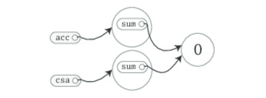
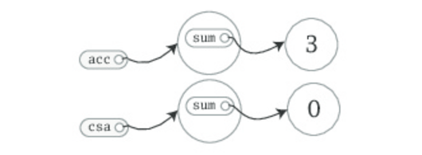

#### fpscala- Class and Objects

---

**class fields methods**

> Class 是 object 蓝图，一代定义了一个class，然后就可以使用这个 class 创建任意个的 object(使用new 关键字)，
>
> 在 class 中定义的 var 或者 val 的 fields 是引用打牌object上的，也就是说你在class 中定义的firlds 在这个 class 的每个 object 上都可以进入。如，我定义一个 sum fields，
>
> ```scala
> class ChecksumAccumulator {
>     var sum = 0
>   }
> // 然后我new 两个 obejcy
> val acc = new ChecksumAccumulator
> val csa = new ChecksumAccumulator
> ```



> 我们定义的 sum 是 var 的，所以，是可以重新复制的。注意这里的变化
>
> 每一个object 的实例对象/变量都是相互步影响的。



> 创建一个 私有的变量
>
> ```scala
> class ChecksumAccumulator {
>     private var sum = 0
> }
> ```

> 在scala 中配置 public 的变量是不需要有 publick 这个显示的配置的，scala 默认就是这个显示等级。

> scala 中任何 method 的参数都是 val 的，所以是不能重新赋值的
>
> ```scala
> def add(b: Byte): Unit = {
>     b = 1     // This won't compile, because b is a val
>     sum += b
>   }
> ```
>
> b 是 val 的，所以不能重新赋值。

> scala 编程中，尽量避免使用return 等语句返回多个结果，尽量将一个大的method 拆为多个
>
> 小的method，而且尽量避免使用{}，尤其是当 函数体只有一句的时候，这样的好处是程序的可读性高

```scala
class ChecksumAccumulator {
    private var sum = 0
    def add(b: Byte) = sum += b
    def checksum() = ~(sum & 0xFF) + 1
  }
```

> 上面的代码对编译器而言是没有问题的，但是对人来说却还有一点点小瑕疵，那就是返回值需要读代码的人去infer，才能读懂返回的类型。虽然这样对编译器是没有问题的，编译器也会infer
>
>  返回类型。但是还是建议函数体显示的定义返回类型，这仅仅是为了阅读代码的人的方面

```scala
class ChecksumAccumulator {
      private var sum = 0
      def add(b: Byte): Unit = { sum += b }
      def checksum(): Int = ~(sum & 0xFF) + 1
    }
```

> 一句代码结束符号冒号**;** 在scala 代码中是可选的，如上面的代码中并没有使用 ; 但是在一种情况下; 是必须的，就是在一行中写多句代码，这个时候就需要使用； 隔开

```scala
val s = "hello"; println(s)
```

---

**Object**

> scala 比 Java 更加面向对象的一个体现方面是，scala 的class 中是不可以使用 static 定义成员(方法/变量)的。
>
> scala 右单一对象(single object)，单一对象的名称和class 的名称如果一只，那么成 单一对象 为class 的**伴生对象**，class 也称为 单一对象 的**伴生类**。
>
> 类和其伴生对象之间是可以互相访问彼此的 私有成员的。
>
> 作为Java 程序员，可以这样理解 Object 将class 中的静态成员全部都移到 Object 中了，也就是一个 静态成员的 holder，。
>
> 伴生对象的功能肯定是远远不止是 静态成员的 holder

```scala
class ChecksumAccumulator {
  private var sum = 0
  def add(b: Byte): Unit = { sum += b }
  def checksum(): Int = ~(sum & 0xFF) + 1
  // 直接使用 object 中的成员
  ChecksumAccumulator.calculate("Every value is an object.")
}


object ChecksumAccumulator {

  private val cache = mutable.Map.empty[String, Int]

  def calculate(s: String): Int =
    if (cache.contains(s))
      cache(s)
    else {
      val acc = new ChecksumAccumulator
      print(acc.sum) // can access
      for (c <- s)
        acc.add(c.toByte)
      val cs = acc.checksum()
      cache += (s -> cs)
      cs
    }
}
```

 **standalone object**

> 也就是和 class 不共享名称的 Obejct，在这些Obejct 中可以定义一些公公使用的utilts
>
> 如当你要运行一个 程序的时候，需要在 objetct 中提供一个 main 方法。

```scala
import ChecksumAccumulator.calculate
  
object Summer {
  def main(args: Array[String]) = {
    for (arg <- args)
    println(arg + ": " + calculate(arg))
  }
}
```

**Class 的命名**

> Scala 的script 是可以一任何命名的，可以不和script 中的 class 命名一致，但是还是建议将script 的名称和class 的名称保持一致，这样易于程序员去查找类。

**scala.APP**

> 上面提到在scala 中需要在 obejct 中写 main 方法来跑程序，但是scala 提供了更加建议的方法那就是 **App** 的train，当你的 Object extend 这个 train 之后，就可以执行 Object 了

```scala
import ChecksumAccumulator.calculate
  
object FallWinterSpringSummer extends App {

  for (season <- List("fall", "winter", "spring"))
  println(season + ": " + calculate(season))
}
```


