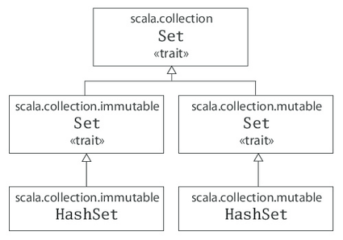
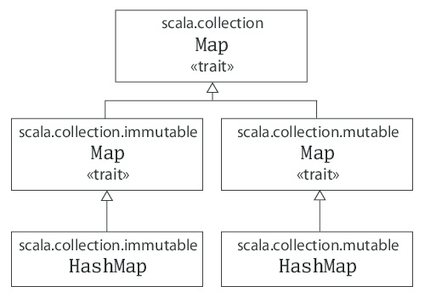

 

**可扩展语言**

> scala 名称来源于 『scalable language』意味着这个语言可以根据用户的需要扩展
>
> scala 语言是运行在标准的Java平台之上，所以它可以和Java 无缝结合
>
> scala 是面向对象和函数式编程的两种编程风格的结合，函数式编程 可以使得编程更加的简洁，而面向对象的编程可以使得组织起来大小的系统。

> ```scala
> def max(x: Int, y: Int): Int = {
>            if (x > y) x
>            else y
>          }
> 
> def max(x: Int, y: Int) = {
>            if (x > y) x
>            else y
>          }
> ```
>
> 在编写函数的时候，参数的类型一定要指定，因为scala 并不会去推断参数的类型。
>
> 如果只是一个普通的函数，那么可以省去定义函数的返回类型，scala 回去推断，但是如果是递归函数，那么必须显示的定义函数的返回类型。上面的函数，可以使用更加直观的方式书写
>
> scala 中没有三目运算符，不过 ```f (x > y) x else y``` 等同于三目运算。和 Java 一样当if 或者 while block 中的代码超过一行的时候，需要使用 {}，但是如果只有一行，那么可以省略 
>
> ```
> def max(x: Int, y: Int) = if (x > y) x else y
> ```

> 在scala 中没有 ++i， i++ 等自增或者自减法，只能  i = i + 1.

> ```
> for (arg <- args)
>     println(arg)
> ```
>
> 上面的这段函数，arg 只有在for 循环体重有效，并不需要提前定义它，这里注意的是，看着似乎是arg 每一次循环都会被福一个值，是var 类型的，但实际上这个是 val 类型的，而且 arg 在 for 的循环体中也是不可以被改变的。
>
> ```scala
> args.foreach(arg => println(arg))
> 或者
> args.foreach((arg: String) => println(arg))
> 或者，只包含一个参数的时候的使用
> args.foreach(println)
> ```

> scala 使用 new 创建对象
>
> scala 的数组 Arrays的进入使用 () 而不是 []，index 也是从0开始的
>
> ```scala
> val greetStrings: Array[String] = new Array[String](3)
> greetStrings(0) = "Hello"
> greetStrings(1) = ","
> greetStrings(2) = "world"
> for (i <- 0 to 2)
>     print(greetStrings(i))
> ```
>
> greetStrings 是 val 的，所以 greetStrings 不能重新赋值，但是 Array[String] 中的元素还是可以改变。
>
> 第二个语法就是 循环体中的 ```i <- 0 to 2``` 其实这里 to 是一个方法，常规的写法是 ```0.to(2)``` 那么语法就是 当scala 中的某一个对象的方法只含有一个参数的时候，那么就可以省略掉 . 和 () 符号，假如说 对象 a 有一个方法 method(a: String) 接受一个 参数，那么使用这个方法的时候就可以这么使用 ```a method b```, 如 加法运算的时候  1 + 2， 就是这样的语法，

**general rule.**

> Scala 中进入 Array 是使用() 而不是 []，在scala 中当你使用参数的时候，如 
>
> greetStrings(0)，实际上执行的是 greetStrings.apply(0)
>
> 还有如赋值语句
>
> greetStrings(1) = "," ，实际上执行的是 greetStrings.update(0, "Hello")

> **The Scala compiler uses Javaarrays, primitive types, and native arithmetic where possible in thecompiled code.**

**Array**

> mutable 的。更加简洁的初始化方法：
>
> ```val numNames = Array("zero", "one", "two")```
>
> 上面讲到，Array 还是可以在编辑的，也就是它是 mutable 的。
>
> 但是List 是不可变得，每次都会生成一个新的 list， 是 immutable 的。
>
> **:::** 将两个 list 结合
>
> ```scala
> val oneTwo = List(1, 2)
> val threeFour = List(3, 4)
> val oneTwoThreeFour = oneTwo ::: threeFour
> ```
>
> 但是 **::** 使用的最多了，将一个元素和一个 list 结合，这个元素放在list 首
>
> ```scala
> val twoThree = List(2, 3)
> val oneTwoThree = 1 :: twoThree
> ```
>
> 这里涉及到的语法就是 右操作符，和 1 + 2 一样，1.+(2), 这里也是 twoThree::(1)
>
> **Nil** 是空list(或者 List())，你可以这样建立一个 list
>
> ```scala
> val oneTwoThree = 1 :: 2 :: 3 :: Nil
> ```
>
> list 中添加元素的时候，一般使用的就是给头部添加，很少会使用尾尾部添加的操作符 **:+**,这里涉及到list 的设计，给尾部添加会有性能问题，如果是要给尾部添加，哪应该是西安讲 list reverse ，然后再添加到头部，最后在reverse。或者使用 **ListBuffer** 这是一个 mutable 的list，可以给首位添加元素

List 的方法

> ```scala
> List() or Nil   	空list
> List("Cool", "tools", "rule")   	新建list
> val thrill = "Will" :: "fill" :: "until" :: Nil  新建list
> List("a", "b") ::: List("c", "d")  俩个 list 合并
> thrill(2)                          获取 list 的index=2 的元素，
> thrill.count(s => s.length == 4)   thrill 中元素长度是4 的元素个数
> thrill.drop(2)    			drop 前俩个元素
> thrill.dropRight(2) 		右边开始的元素丢弃2个
> thrill.exists(s => s == "until") 			元素until 是否存在在 thrill list 中
> thrill.filter(s => s.length == 4)  		过滤
> thrill.forall(s => s.endsWith("l")) 	元素一 "1" 为结尾的返回true，反之 false
> thrill.foreach(s => print(s)) == thrill.foreach(print)
> thrill.head 		返回第一个元素
> thrill.last 		返回最后一个元素
> thrill.init 		返回除最后一个元素之外的所有元素组成的list
> thrill.tail 		返回除第一个元素之外的所有元素组成的list
> thrill.map(s => s + "y") 
> thrill.mkString(", ") 				将元素以, 符号拼接
> thrill.reverse 
> thrill.sort((s, t) => s.charAt(0).toLower < t.charAt(0).toLower)
> ```

**Tuple**

> tuple 也是 immutable 的，但是和list不同的是，tuple 可以 存放不同类型的值，但是 list 只能存放同种类型的值，tuple 也是 immutable 的。
>
> ```scala
> val pair = (99, "Luftballons")
> println(pair._1)
> println(pair._2)
> ```

**Set**

> ```scala
> var jetSet = Set("Boeing", "Airbus")
> jetSet += "Lear"
> println(jetSet.contains("Cessna"))
> ```
>
> 上面创建的Set 是 immutable 的，如果要创建 mutable 的那么需要显示的import mutable 的 Set。
>
> ```scala
> import scala.collection.mutable
>   
> val movieSet = mutable.Set("Hitch", "Poltergeist")
> movieSet += "Shrek"
> println(movieSet) 
> ```



**Map**



> ```scala
> import scala.collection.mutable
>   
> // initialize it with an empty
> val treasureMap = mutable.Map[Int, String]()
> treasureMap += (1 -> "Go to island.")
> treasureMap += (2 -> "Find big X on ground.")
> treasureMap += (3 -> "Dig.")
> println(treasureMap(2))
> ```
>
> 


