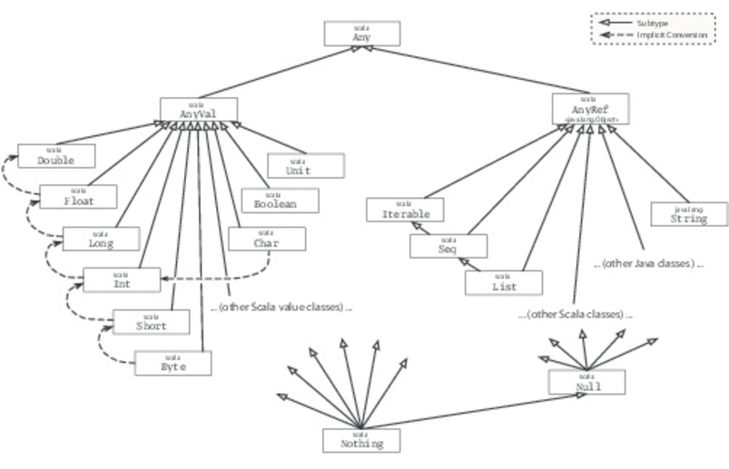

#### scala 的继承关系

---

> Scala 的祖先类是 Any， 就好比 Java 的Obejct 类，在Any 中有以下的方法
>
> ```scala
> final def ==(that: Any): Boolean
> final def !=(that: Any): Boolean
> def equals(that: Any): Boolean
> def ##: Int
> def hashCode: Int
> def toString: String
> ```
>
> 其中 == 和 !=， 是final 的，是不能重写的。 

**继承图**



> 在祖先类下面分了两种 AnyVal 和 AnyRef，AnyVal 是任何值类的祖先，类似于java 中的 primary 类型。
>
> AnyRef 是任何引用类的祖先类，
>
> Null 时任何AnyRef 的子类
>
> Nothing 时所有类型的子类，经常会用于异常的情况。


